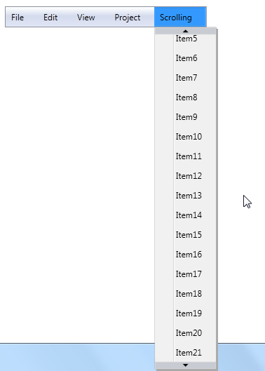

::: {style="DISPLAY: none"}
{#d2h_url_template}{#d2h_package_url style="WIDTH: 0px; DISPLAY: none; HEIGHT: 0px"}
:::

::: {.d2h_secondary_topic style="PADDING-BOTTOM: 10pt; MARGIN: 0pt; PADDING-LEFT: 0pt; PADDING-RIGHT: 0pt; PADDING-TOP: 0pt"}
#### Scroll Support {#scroll-support style="tab-stops: 0pt"}

MenuAdv allows users to scroll through the submenu items so that all the items of the submenu are visible even if the submenu crosses the vertical boundary. The Scroll support can be enabled by setting the IsScrollEnabled property to true. If the IsScrollEnabled property is set to false, users will not be able to scroll through the submenu items and the items that cross the vertical boundary will not be visible.

[]{style="FONT-FAMILY: 'Trebuchet MS','sans-serif'; COLOR: #15428b; FONT-SIZE: 9pt"} 

{border="0"}

Figure 731: Scroll Support

 

Use Case Scenarios

MenuAdv will be very useful in the case of adding more number of items to the single MenuItemAdv and the size of the submenu crosses the vertical boundary.

**[]{style="FONT-FAMILY: 'Trebuchet MS','sans-serif'; COLOR: #15428b; FONT-SIZE: 9pt"}** 

Using the Scroll Support in an Application

If the value of the IsScrollEnabled property is set to true, users can scroll through the submenu items by using the TopScrollButton, BottomScrollButton, and  mouse wheel. If the value of the IsScrollEnabled property is set to false, users will not be able to scroll through the submenu items.

 

 

[]{style="FONT-FAMILY: 'Trebuchet MS','sans-serif'; COLOR: #15428b; FONT-SIZE: 9pt"} 

**[]{style="FONT-FAMILY: 'Trebuchet MS','sans-serif'; COLOR: #15428b; FONT-SIZE: 9pt"}** 

Properties

The property for the Scroll support is described in the following tabulation:

[]{style="FONT-FAMILY: 'Trebuchet MS','sans-serif'; COLOR: #15428b; FONT-SIZE: 9pt"} 

Table 69: Property Table

  ----------------- ------------------------------------------ -------------------- ------------ -----------------
  Property          Description                                Type                 Data Type    Reference links
  IsScrollEnabled   Gets or sets IsScrollEnabled of MenuAdv.   DependencyProperty   bool(true)   
  ----------------- ------------------------------------------ -------------------- ------------ -----------------

**[]{style="FONT-FAMILY: 'Trebuchet MS','sans-serif'; COLOR: #15428b; FONT-SIZE: 9pt"}** 

Sample Link

WPF Sample Browser-\> Tools -\> MenuAdv -\> MenuAdv Demo

 

 

[]{#related-topics}
:::
