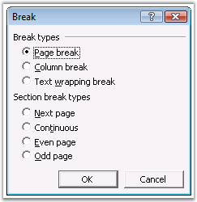
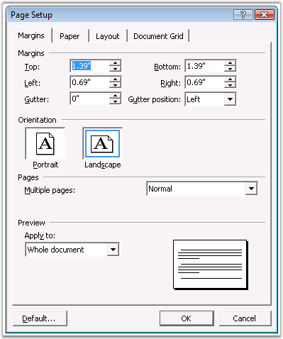

::: {style="DISPLAY: none"}
{#d2h_url_template}{#d2h_package_url style="WIDTH: 0px; DISPLAY: none; HEIGHT: 0px"}
:::

::::: {#nsbanner .d2h_main_nsbanner style="BORDER-BOTTOM: #999999 1px solid; POSITION: relative; PADDING-BOTTOM: 0px; BACKGROUND-COLOR: transparent; PADDING-LEFT: 0px; PADDING-RIGHT: 0px; DISPLAY: none; BORDER-TOP: #999999 1px solid; PADDING-TOP: 0px; LEFT: 0px"}
:::: {#TitleRow .d2h_main_titlerow style="PADDING-BOTTOM: 4px; BACKGROUND-COLOR: transparent; PADDING-LEFT: 22px; WIDTH: 100%; PADDING-RIGHT: 10px; DISPLAY: none; PADDING-TOP: 4px"}
::: {#ienav .d2h_main_ienav style="DISPLAY: none"}
{#D2HPrevious .D2HPreviousEnabled}  {#D2HNext .D2HNextEnabled}
:::
::::
:::::

:::::::: {#nstext .d2h_main_nstext style="PADDING-BOTTOM: 10px; BACKGROUND-COLOR: transparent; PADDING-LEFT: 22px; PADDING-RIGHT: 10px; HEIGHT: 100%; OVERFLOW: auto; PADDING-TOP: 5px" hasuserbackground="true" valign="bottom"}
::: {#d2h_breadcrumbs .d2h_breadcrumbs}
[Essential Studio User Guide Documentation](ms-xhelp:///?Id=12457748-09e3-4d74-a240-8e049cedf030){.d2h_breadcrumbsNormal}[ \> ]{.d2h_breadcrumbsLinkSeparator}[Reporting Edition](ms-xhelp:///?Id=027aa5b6-6676-4f93-ad23-c20e8c45792e){.d2h_breadcrumbsNormal}[ \> ]{.d2h_breadcrumbsLinkSeparator}[Essential DocIO](ms-xhelp:///?Id=b88d77b3-4c51-460f-a761-d2ef6d5b0ca6){.d2h_breadcrumbsNormal}[ \> ]{.d2h_breadcrumbsLinkSeparator}[Concepts and Features](ms-xhelp:///?Id=c1881696-52ce-4414-9f3d-97433d8e9775){.d2h_breadcrumbsNormal}
:::

## Section {#section style="tab-stops: 0pt"}

 

**WSection** class represents a single section in a document. Every section is a region with its own ***PageSetup Options, HeadersFooters*** and ***Paragraphs Collection***.

 

A valid section must contain at least one empty paragraph. Each section can have its own page setup. Page setup of DocIO section is accessible through the **PageSetup** property. This property enables user to set page size, orientation, margins, and so on.

 

DocIO section holds four different collections.

 

[·      ]{style="FONT-FAMILY: Symbol"}**Paragraphs**: collection of section paragraphs

[·      ]{style="FONT-FAMILY: Symbol"}**Tables**: collection of section tables

[·      ]{style="FONT-FAMILY: Symbol"}**ChildEntities**: collection of child entities (general collection which includes paragraphs and tables)

[·      ]{style="FONT-FAMILY: Symbol"}**Columns**: collection of columns, which logically divides a page on many printing / publishing areas

 

Each section has its own header and footer which is set by using the **HeadersFooters** property. For more details, see [[Headers and Footers.]{.UGHyperlink}](ms-xhelp:///?Id=0af06ef0-75be-4557-b802-343853542859)

 

Document sections are divided by section breaks that define where the sections start. This is specified by using the **BreakCode** property.

 

[·      ]{style="FONT-FAMILY: Symbol"}**NewColumn**: section starts from a new column

[·      ]{style="FONT-FAMILY: Symbol"}**NewPage**: section starts from a new page

[·      ]{style="FONT-FAMILY: Symbol"}**EvenPage**: section starts on a new even page

[·      ]{style="FONT-FAMILY: Symbol"}**OddPage**: section starts on a new odd page

 

The following screen shot illustrates the breaks accessible through the **Insert** menu in the MS Word Break dialog box.

 

{border="0"}

Figure 33: Break Dialog Box

 

The following screen shot illustrates the various page setup options accessible through the **File** menu in MS Word.

 

{border="0"}

Figure 34: Page Setup Dialog Box

[]{#p35} 

PageSetup properties are listed in the following table.

 

::: {align="center"}
+-----------------------------------+--------------------------------------------------------------------------------------------------+
| Name                              | Description                                                                                      |
+-----------------------------------+--------------------------------------------------------------------------------------------------+
| Bidi                              | Gets or sets whether section contains right-to-left text.                                        |
+-----------------------------------+--------------------------------------------------------------------------------------------------+
| Borders                           | Gets page borders collection.                                                                    |
+-----------------------------------+--------------------------------------------------------------------------------------------------+
| ClientWidth                       | Gets width of client area.                                                                       |
+-----------------------------------+--------------------------------------------------------------------------------------------------+
| DefaultTabWidth                   | Gets or sets the length of the auto tab.                                                         |
+-----------------------------------+--------------------------------------------------------------------------------------------------+
| DifferentFirstPage                | Setting to specify that the current section has a different header / footer for first page.      |
+-----------------------------------+--------------------------------------------------------------------------------------------------+
|                                   | True if the document has different headers and footers for odd-numbered and even-numbered pages. |
|                                   |                                                                                                  |
| DifferentOddAndEvenPages          |                                                                                                  |
+-----------------------------------+--------------------------------------------------------------------------------------------------+
| FooterDistance                    | Gets or sets footer height in points.                                                            |
+-----------------------------------+--------------------------------------------------------------------------------------------------+
| HeaderDistance                    | Gets or sets height of header in points.                                                         |
+-----------------------------------+--------------------------------------------------------------------------------------------------+
| IsFrontPageBorder                 | Gets or sets a value indicating whether this instance is front page border.                      |
+-----------------------------------+--------------------------------------------------------------------------------------------------+
| LineNumberingDistanceFromText     | Gets or sets distance from text in lines numbering.                                              |
+-----------------------------------+--------------------------------------------------------------------------------------------------+
| LineNumberingMode                 | Gets or sets line numbering mode.                                                                |
+-----------------------------------+--------------------------------------------------------------------------------------------------+
| LineNumberingStartValue           | Gets or sets line numbering start value.                                                         |
+-----------------------------------+--------------------------------------------------------------------------------------------------+
| LineNumberingStep                 | Gets or sets line numbering step.                                                                |
+-----------------------------------+--------------------------------------------------------------------------------------------------+
| Margins                           | Gets or sets page margins in points.                                                             |
+-----------------------------------+--------------------------------------------------------------------------------------------------+
| Orientation                       | Gets or sets orientation of a page.                                                              |
+-----------------------------------+--------------------------------------------------------------------------------------------------+
| PageBorderApply                   | Gets or sets the value that determine on which pages border is applied.                          |
+-----------------------------------+--------------------------------------------------------------------------------------------------+
| PageBorderOffsetFrom              | Gets or sets the position of page border.                                                        |
+-----------------------------------+--------------------------------------------------------------------------------------------------+
| PageBordersApplyType              | Gets or sets the value that determine on which pages border is applied.                          |
+-----------------------------------+--------------------------------------------------------------------------------------------------+
| PageSize                          | Gets or sets page size in points.                                                                |
+-----------------------------------+--------------------------------------------------------------------------------------------------+
| VerticalAlignment                 | Gets or sets vertical alignment.                                                                 |
+-----------------------------------+--------------------------------------------------------------------------------------------------+
:::

 

Public Constructors

 

::: {align="center"}
  ----------------------------------- -----------------------------------------------------
  Name                                Description
  WSection.WSection (IWordDocument)   Initializes a new instance of the WSection class.  
  ----------------------------------- -----------------------------------------------------
:::

 

Public Properties

 

::: {align="center"}
  ---------------- --------------------------------------------------------------------------------------------
  Name             Description
  Body             Gets the section body.  
  BreakCode        Gets / sets break code.  
  ChildEntitiesx   Gets the child entities.  
  Columns          Gets collection of columns, which logically divide page on many printing/publishing areas.
  EntityType       Gets the type of the entity.  
  HeadersFooters   Gets headers/footers of current section.  
  PageSetup        Gets page Setup of current section.  
  Paragraphs       Gets the paragraphs.   
  Tables           Gets the tables.
  ---------------- --------------------------------------------------------------------------------------------
:::

 

Public Methods

 

::: {align="center"}
  ------------------ --------------------------------------------------------------
  Name               Description
  AddColumn          Adds new column to the section.  
  AddParagraph       Adds the paragraph.  
  AddTable           Adds the table.  
  Clone              Clones itself.  
  MakeColumnsEqual   Makes all columns in current section to be of equal width.  
  ------------------ --------------------------------------------------------------
:::

 

The following example illustrates how to create a simple Word document, and add sections and breaks to it.

 

+-----------------------------------------------------------------------------------------------------------------------------------------------------------+
| **[\[C#\]]{style="FONT-FAMILY: 'Courier New'; COLOR: black"}**                                                                                            |
|                                                                                                                                                           |
|                                                                                                                                                           |
|                                                                                                                                                           |
| [//Create a new Word document]{style="FONT-FAMILY: 'Courier New'; COLOR: green"}                                                                          |
|                                                                                                                                                           |
| [IWordDocument doc = [new]{style="COLOR: blue"} WordDocument();]{style="FONT-FAMILY: 'Courier New'"}                                                      |
|                                                                                                                                                           |
| []{style="FONT-FAMILY: 'Courier New'"}                                                                                                                    |
|                                                                                                                                                           |
| [IWSection section = doc.AddSection();]{style="FONT-FAMILY: 'Courier New'"}                                                                               |
|                                                                                                                                                           |
| [IWParagraph paragraph = section.AddParagraph();]{style="FONT-FAMILY: 'Courier New'"}                                                                     |
|                                                                                                                                                           |
| [paragraph.AppendText([\"Text Body_Text\"]{style="COLOR: maroon"});]{style="FONT-FAMILY: 'Courier New'"}                                                  |
|                                                                                                                                                           |
| []{style="FONT-FAMILY: 'Courier New'"}                                                                                                                    |
|                                                                                                                                                           |
| [//Set Page break]{style="FONT-FAMILY: 'Courier New'; COLOR: green"}                                                                                      |
|                                                                                                                                                           |
| [paragraph.ParagraphFormat.PageBreakAfter = [true]{style="COLOR: blue"};]{style="FONT-FAMILY: 'Courier New'"}                                             |
|                                                                                                                                                           |
| []{style="FONT-FAMILY: 'Courier New'"}                                                                                                                    |
|                                                                                                                                                           |
| [paragraph = section.AddParagraph();]{style="FONT-FAMILY: 'Courier New'"}                                                                                 |
|                                                                                                                                                           |
| [paragraph.AppendText([\"\[ After PAGE BREAK \] \\rText Body_Text\"]{style="COLOR: maroon"});]{style="FONT-FAMILY: 'Courier New'"}                        |
|                                                                                                                                                           |
| []{style="FONT-FAMILY: 'Courier New'"}                                                                                                                    |
|                                                                                                                                                           |
| [section = doc.AddSection();]{style="FONT-FAMILY: 'Courier New'"}                                                                                         |
|                                                                                                                                                           |
| []{style="FONT-FAMILY: 'Courier New'"}                                                                                                                    |
|                                                                                                                                                           |
| [//Set Section break]{style="FONT-FAMILY: 'Courier New'; COLOR: green"}                                                                                   |
|                                                                                                                                                           |
| [section.BreakCode = SectionBreakCode.NewPage;]{style="FONT-FAMILY: 'Courier New'"}                                                                       |
|                                                                                                                                                           |
| [paragraph = section.AddParagraph();]{style="FONT-FAMILY: 'Courier New'"}                                                                                 |
|                                                                                                                                                           |
| [paragraph.AppendText([\"\[ After SECTION BREAK ( New page ) \] \\rText Body_Text\"]{style="COLOR: maroon"});]{style="FONT-FAMILY: 'Courier New'"}        |
|                                                                                                                                                           |
| []{style="FONT-FAMILY: 'Courier New'"}                                                                                                                    |
|                                                                                                                                                           |
| [section = doc.AddSection();]{style="FONT-FAMILY: 'Courier New'"}                                                                                         |
|                                                                                                                                                           |
| []{style="FONT-FAMILY: 'Courier New'"}                                                                                                                    |
|                                                                                                                                                           |
| [//Set page setup Options]{style="FONT-FAMILY: 'Courier New'; COLOR: green"}                                                                              |
|                                                                                                                                                           |
| [section.PageSetup.Borders.BorderType = [BorderStyle]{style="COLOR: teal"}.DashLargeGap;]{style="FONT-FAMILY: 'Courier New'"}                             |
|                                                                                                                                                           |
| [section.PageSetup.Borders.Color = Color.DeepPink;]{style="FONT-FAMILY: 'Courier New'"}                                                                   |
|                                                                                                                                                           |
| [section.PageSetup.PageBorderOffsetFrom = PageBorderOffsetFrom.PageEdge;]{style="FONT-FAMILY: 'Courier New'"}                                             |
|                                                                                                                                                           |
| [section.PageSetup.Borders.LineWidth = 2;]{style="FONT-FAMILY: 'Courier New'"}                                                                            |
|                                                                                                                                                           |
| [section.BreakCode = SectionBreakCode.NoBreak;]{style="FONT-FAMILY: 'Courier New'"}                                                                       |
|                                                                                                                                                           |
| [paragraph = section.AddParagraph();]{style="FONT-FAMILY: 'Courier New'"}                                                                                 |
|                                                                                                                                                           |
| [paragraph.AppendText([\"\[ After SECTION BREAK ( continuous page ) \] \\rText Body_Text\"]{style="COLOR: maroon"});]{style="FONT-FAMILY: 'Courier New'"} |
+-----------------------------------------------------------------------------------------------------------------------------------------------------------+

 

+--------------------------------------------------------------------------------------------------------------------------------------------------------------------+
| **[\[VB.NET\]]{style="FONT-FAMILY: 'Courier New'; COLOR: black"}**                                                                                                 |
|                                                                                                                                                                    |
| []{style="COLOR: black"}                                                                                                                                           |
|                                                                                                                                                                    |
| [\'Create a new Word document]{style="FONT-FAMILY: 'Courier New'; COLOR: green"}                                                                                   |
|                                                                                                                                                                    |
| [Dim doc As IWordDocument = New WordDocument()]{style="FONT-FAMILY: 'Courier New'; COLOR: black"}                                                                  |
|                                                                                                                                                                    |
| []{style="FONT-FAMILY: 'Courier New'; COLOR: black"}                                                                                                               |
|                                                                                                                                                                    |
| [Dim section As IWSection = doc.AddSection()]{style="FONT-FAMILY: 'Courier New'; COLOR: black"}                                                                    |
|                                                                                                                                                                    |
| [Dim paragraph As IWParagraph = section.AddParagraph()]{style="FONT-FAMILY: 'Courier New'; COLOR: black"}                                                          |
|                                                                                                                                                                    |
| [paragraph.AppendText(\"Text Body_Text\")]{style="FONT-FAMILY: 'Courier New'; COLOR: black"}                                                                       |
|                                                                                                                                                                    |
| []{style="FONT-FAMILY: 'Courier New'; COLOR: black"}                                                                                                               |
|                                                                                                                                                                    |
| [\'Set Page break]{style="FONT-FAMILY: 'Courier New'; COLOR: green"}                                                                                               |
|                                                                                                                                                                    |
| [paragraph.ParagraphFormat.PageBreakAfter = True]{style="FONT-FAMILY: 'Courier New'; COLOR: black"}                                                                |
|                                                                                                                                                                    |
| []{style="FONT-FAMILY: 'Courier New'; COLOR: black"}                                                                                                               |
|                                                                                                                                                                    |
| [paragraph = section.AddParagraph()]{style="FONT-FAMILY: 'Courier New'; COLOR: black"}                                                                             |
|                                                                                                                                                                    |
| [paragraph.AppendText(\"\[ After PAGE BREAK \] \" & Constants.vbCr & \"Text Body_Text\")]{style="FONT-FAMILY: 'Courier New'; COLOR: black"}                        |
|                                                                                                                                                                    |
| []{style="FONT-FAMILY: 'Courier New'; COLOR: black"}                                                                                                               |
|                                                                                                                                                                    |
| [section = doc.AddSection()]{style="FONT-FAMILY: 'Courier New'; COLOR: black"}                                                                                     |
|                                                                                                                                                                    |
| []{style="FONT-FAMILY: 'Courier New'; COLOR: black"}                                                                                                               |
|                                                                                                                                                                    |
| [\'Set Section break]{style="FONT-FAMILY: 'Courier New'; COLOR: green"}                                                                                            |
|                                                                                                                                                                    |
| [section.BreakCode = SectionBreakCode.NewPage]{style="FONT-FAMILY: 'Courier New'; COLOR: black"}                                                                   |
|                                                                                                                                                                    |
| [paragraph = section.AddParagraph()]{style="FONT-FAMILY: 'Courier New'; COLOR: black"}                                                                             |
|                                                                                                                                                                    |
| [paragraph.AppendText(\"\[ After SECTION BREAK ( New page ) \] \" & Constants.vbCr & \"Text Body_Text\")]{style="FONT-FAMILY: 'Courier New'; COLOR: black"}        |
|                                                                                                                                                                    |
| []{style="FONT-FAMILY: 'Courier New'; COLOR: black"}                                                                                                               |
|                                                                                                                                                                    |
| [section = doc.AddSection()]{style="FONT-FAMILY: 'Courier New'; COLOR: black"}                                                                                     |
|                                                                                                                                                                    |
| []{style="FONT-FAMILY: 'Courier New'; COLOR: black"}                                                                                                               |
|                                                                                                                                                                    |
| [\'Set page setup Options]{style="FONT-FAMILY: 'Courier New'; COLOR: green"}                                                                                       |
|                                                                                                                                                                    |
| [section.PageSetup.Borders.BorderType = BorderStyle.DashLargeGap]{style="FONT-FAMILY: 'Courier New'; COLOR: black"}                                                |
|                                                                                                                                                                    |
| [section.PageSetup.Borders.Color = Color.DeepPink]{style="FONT-FAMILY: 'Courier New'; COLOR: black"}                                                               |
|                                                                                                                                                                    |
| [section.PageSetup.PageBorderOffsetFrom = PageBorderOffsetFrom.PageEdge]{style="FONT-FAMILY: 'Courier New'; COLOR: black"}                                         |
|                                                                                                                                                                    |
| [section.PageSetup.Borders.LineWidth = 2]{style="FONT-FAMILY: 'Courier New'; COLOR: black"}                                                                        |
|                                                                                                                                                                    |
| [section.BreakCode = SectionBreakCode.NoBreak]{style="FONT-FAMILY: 'Courier New'; COLOR: black"}                                                                   |
|                                                                                                                                                                    |
| [paragraph = section.AddParagraph()]{style="FONT-FAMILY: 'Courier New'; COLOR: black"}                                                                             |
|                                                                                                                                                                    |
| [paragraph.AppendText(\"\[ After SECTION BREAK ( continuous page ) \] \" & Constants.vbCr & \"Text Body_Text\")]{style="FONT-FAMILY: 'Courier New'; COLOR: black"} |
+--------------------------------------------------------------------------------------------------------------------------------------------------------------------+

 

For More Information Refer:

 

[[Cloning and Merging,]{.UGHyperlink}](ms-xhelp:///?Id=0af06ef0-75be-4557-b802-343853542859) [[Headers and Footers]{.UGHyperlink}](ms-xhelp:///?Id=0af06ef0-75be-4557-b802-343853542859), [[Table]{.UGHyperlink}](ms-xhelp:///?Id=49873c40-5115-4969-9508-ad9f10d4d1a2)

More:

[ ]{#related-topics}

[{border="0" align="absMiddle"}Cloning and Merging](ms-xhelp:///?Id=0af06ef0-75be-4557-b802-343853542859){style="TEXT-DECORATION: none"}

[{border="0" align="absMiddle"}Headers and Footers](ms-xhelp:///?Id=2864f107-70a9-4ef2-ad41-2aab9746eb9b){style="TEXT-DECORATION: none"}

[{border="0" align="absMiddle"}Table](ms-xhelp:///?Id=49873c40-5115-4969-9508-ad9f10d4d1a2){style="TEXT-DECORATION: none"}

[{border="0" align="absMiddle"}Content Control](ms-xhelp:///?Id=31de4997-ffe3-48b7-a51a-ef923ad44000){style="TEXT-DECORATION: none"}
::::::::
