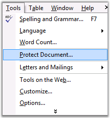
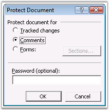

::: {style="DISPLAY: none"}
{#d2h_url_template}{#d2h_package_url style="WIDTH: 0px; DISPLAY: none; HEIGHT: 0px"}
:::

::::: {#nsbanner .d2h_main_nsbanner style="BORDER-BOTTOM: #999999 1px solid; POSITION: relative; PADDING-BOTTOM: 0px; BACKGROUND-COLOR: transparent; PADDING-LEFT: 0px; PADDING-RIGHT: 0px; DISPLAY: none; BORDER-TOP: #999999 1px solid; PADDING-TOP: 0px; LEFT: 0px"}
:::: {#TitleRow .d2h_main_titlerow style="PADDING-BOTTOM: 4px; BACKGROUND-COLOR: transparent; PADDING-LEFT: 22px; WIDTH: 100%; PADDING-RIGHT: 10px; DISPLAY: none; PADDING-TOP: 4px"}
::: {#ienav .d2h_main_ienav style="DISPLAY: none"}
{#D2HPrevious .D2HPreviousEnabled}  {#D2HNext .D2HNextEnabled}
:::
::::
:::::

:::: {#nstext .d2h_main_nstext style="PADDING-BOTTOM: 10px; BACKGROUND-COLOR: transparent; PADDING-LEFT: 22px; PADDING-RIGHT: 10px; HEIGHT: 100%; OVERFLOW: auto; PADDING-TOP: 5px" hasuserbackground="true" valign="bottom"}
::: {#d2h_breadcrumbs .d2h_breadcrumbs}
[Essential Studio User Guide Documentation](ms-xhelp:///?Id=12457748-09e3-4d74-a240-8e049cedf030){.d2h_breadcrumbsNormal}[ \> ]{.d2h_breadcrumbsLinkSeparator}[Reporting Edition](ms-xhelp:///?Id=027aa5b6-6676-4f93-ad23-c20e8c45792e){.d2h_breadcrumbsNormal}[ \> ]{.d2h_breadcrumbsLinkSeparator}[Essential DocIO](ms-xhelp:///?Id=b88d77b3-4c51-460f-a761-d2ef6d5b0ca6){.d2h_breadcrumbsNormal}[ \> ]{.d2h_breadcrumbsLinkSeparator}[Concepts and Features](ms-xhelp:///?Id=c1881696-52ce-4414-9f3d-97433d8e9775){.d2h_breadcrumbsNormal}
:::

## Security {#security style="tab-stops: 0pt"}

 

DocIO provides support to protect a Word document. Here protection restricts the access to the elements present within the document. In MS Word, a document is protected through the **Protect Document** option in the **Tools** menu.

 

{border="0"}

Figure 80: Protect Document option in the Tools Menu

*[]{style="COLOR: #15428b; FONT-SIZE: 9pt"}* 

[]{#p85}{border="0"}

Figure 81: Protect Document Dialog Box

 

DocIO supports such protection while reading and writing Word documents for both **.doc** and **.docx** formats, and this can be provided through the following APIs.

*[]{style="COLOR: red"}* 

[·      ]{style="FONT-FAMILY: Symbol"}**AllowOnlyComments---**only comments are allowed.

[·      ]{style="FONT-FAMILY: Symbol"}**AllowOnlyFormFields---**modification of form field value is allowed.

[·      ]{style="FONT-FAMILY: Symbol"}**AllowOnlyRevisions---**only revisions are allowed.

[·      ]{style="FONT-FAMILY: Symbol"}**AllowOnlyReading**---only reading is allowed.

[·      ]{style="FONT-FAMILY: Symbol"}**NoProtection---**document has no protection.

 

You can also provide a password to restrict the user from editing documents. You can enable or disable document protection by using the **WordDocument.ProtectionType** property, when the document is opened with DocIO.

 

The following example illustrates the use of ProtectionType property.

 

+------------------------------------------------------------------------------------------------------------------------------------------------------------------------------------------------------------------------+
| **[\[C#\]]{style="FONT-FAMILY: 'Courier New'; COLOR: black"}**                                                                                                                                                         |
|                                                                                                                                                                                                                        |
| []{style="COLOR: black"}                                                                                                                                                                                               |
|                                                                                                                                                                                                                        |
| [IWordDocument]{style="FONT-FAMILY: 'Courier New'; COLOR: teal"}[ doc = [new]{style="COLOR: blue"} [WordDocument]{style="COLOR: teal"}( [\"sample.doc\"]{style="COLOR: maroon"});]{style="FONT-FAMILY: 'Courier New'"} |
|                                                                                                                                                                                                                        |
| [doc.Protect([ProtectionType]{style="COLOR: teal"}.[AllowOnlyComments]{style="COLOR: black"},[\"password\"]{style="COLOR: maroon"});]{style="FONT-FAMILY: 'Courier New'"}                                              |
|                                                                                                                                                                                                                        |
| []{style="FONT-FAMILY: 'Courier New'"}                                                                                                                                                                                 |
|                                                                                                                                                                                                                        |
| [doc.Save( [\"Protection.doc\"]{style="COLOR: maroon"} );]{style="FONT-FAMILY: 'Courier New'"}                                                                                                                         |
+------------------------------------------------------------------------------------------------------------------------------------------------------------------------------------------------------------------------+

 

+-----------------------------------------------------------------------------------------------------------------------------------------------------------------------------------------------------------------------------+
| **[\[VB.NET\]]{style="FONT-FAMILY: 'Courier New'; COLOR: black"}**                                                                                                                                                          |
|                                                                                                                                                                                                                             |
| []{style="COLOR: black"}                                                                                                                                                                                                    |
|                                                                                                                                                                                                                             |
| [Dim]{style="FONT-FAMILY: 'Courier New'; COLOR: blue"}[ doc [As]{style="COLOR: blue"} IWordDocument = [New]{style="COLOR: blue"} WordDocument([\"sample.doc\"]{style="COLOR: maroon"})]{style="FONT-FAMILY: 'Courier New'"} |
|                                                                                                                                                                                                                             |
| [doc.Protect([ProtectionType]{style="COLOR: black"}.[AllowOnlyComments]{style="COLOR: black"},[\"password\"]{style="COLOR: maroon"})]{style="FONT-FAMILY: 'Courier New'"}                                                   |
|                                                                                                                                                                                                                             |
| []{style="FONT-FAMILY: 'Courier New'"}                                                                                                                                                                                      |
|                                                                                                                                                                                                                             |
| [doc.Save([\"Protection.doc\"]{style="COLOR: maroon"})]{style="FONT-FAMILY: 'Courier New'"}                                                                                                                                 |
+-----------------------------------------------------------------------------------------------------------------------------------------------------------------------------------------------------------------------------+

 

For More Information Refer:

[[[[Encryption and Decryption]{style="COLOR: blue"}]{.underline}]()]{.UGHyperlink}

[]{#_Encryption_and_Decryption} 

More:

[ ]{#related-topics}

[{border="0" align="absMiddle"}Encryption and Decryption](ms-xhelp:///?Id=830bfab2-bf77-4845-bc33-4b15be1e5184){style="TEXT-DECORATION: none"}
::::
