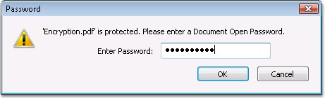
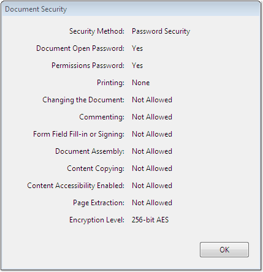
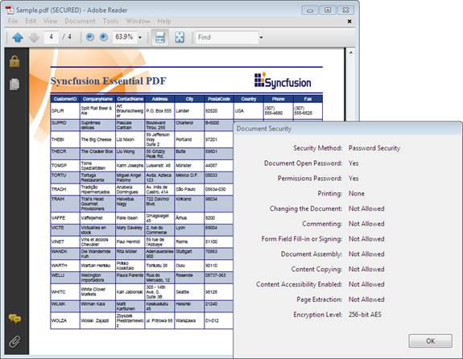
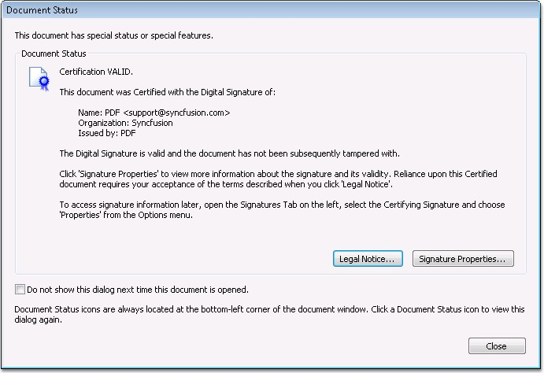
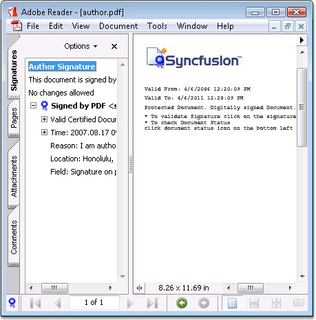
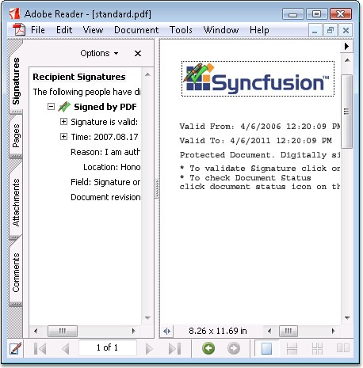
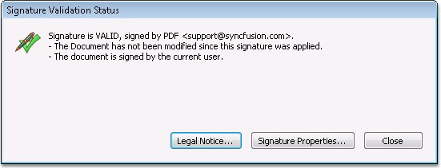
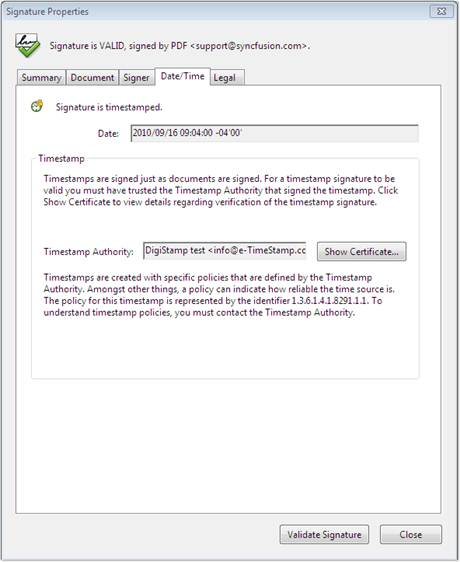
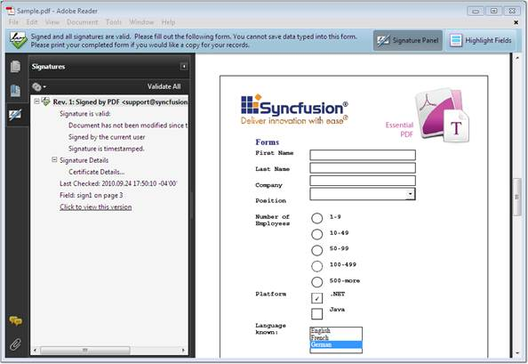

::: {style="DISPLAY: none"}
{#d2h_url_template}{#d2h_package_url style="WIDTH: 0px; DISPLAY: none; HEIGHT: 0px"}
:::

:::::: {.d2h_secondary_topic style="PADDING-BOTTOM: 10pt; MARGIN: 0pt; PADDING-LEFT: 0pt; PADDING-RIGHT: 0pt; PADDING-TOP: 0pt"}
#### Security Settings {#security-settings style="tab-stops: 0pt"}

 

Adobe provides options for securing a PDF document from unauthorized access, and for restricting the access for some user. This section demonstrates various options provided by Essential PDF to secure a PDF document.

 

The following techniques are used to protect a PDF document:

 

[·      ]{style="FONT-FAMILY: Symbol"}Encryption and

[·      ]{style="FONT-FAMILY: Symbol"}Digital Signature

 

Encryption

 

A PDF document is encrypted to protect its contents from unauthorized access. Encryption applies to all strings and streams in the document. Essential PDF provides support for 40, 128 and 256-bit encryption. Essential PDF also provides support for restricted document operations like:

[]{style="FONT-FAMILY: 'Trebuchet MS','sans-serif'; COLOR: #15428b; FONT-SIZE: 9pt"} 

[·      ]{style="FONT-FAMILY: Symbol"}Allow EditContent

[·      ]{style="FONT-FAMILY: Symbol"}Allow Copy Content

[·      ]{style="FONT-FAMILY: Symbol"}Allow Edit Annotations

[·      ]{style="FONT-FAMILY: Symbol"}Allow AccessibilityCopyContent

[·      ]{style="FONT-FAMILY: Symbol"}Allow AssembleDocument

[·      ]{style="FONT-FAMILY: Symbol"}Allow Print

[·      ]{style="FONT-FAMILY: Symbol"}Allow FullQualityPrint

 

You can also protect a document with user and owner password.

 

::: {style="BORDER-BOTTOM: windowtext 1pt solid; BORDER-LEFT: medium none; PADDING-BOTTOM: 1pt; MARGIN-TOP: 9pt; PADDING-LEFT: 0pt; PADDING-RIGHT: 0pt; MARGIN-BOTTOM: 9pt; BORDER-TOP: windowtext 1pt solid; BORDER-RIGHT: medium none; PADDING-TOP: 1pt"}
{border="0"}Note: You must add the Syncfusion.Pdf.Security namespace to work with security settings.
:::

 

Encryption Algorithms

 

Adobe supports Advanced Encryption Standard (AES) in Adobe version 7.0 and later. Essential PDF also supports strong encryption using 128 and 256-bit AES algorithm. In order to achieve this, specify the type of encryption algorithm in the **Algorithm** property of the Security class.

[]{style="FONT-FAMILY: 'Trebuchet MS','sans-serif'; COLOR: #15428b; FONT-SIZE: 9pt"} 

The following code snippet illustrates this.

[]{style="COLOR: black"} 

+------------------------------------------------------------------------------------------------------------------------------------------------------------+
| **[\[C#\]]{style="FONT-FAMILY: 'Courier New'; COLOR: black"}**                                                                                             |
|                                                                                                                                                            |
| []{style="FONT-FAMILY: 'Courier New'; COLOR: black"}                                                                                                       |
|                                                                                                                                                            |
| [// Set 128 bit AES encryption mode.]{style="FONT-FAMILY: 'Courier New'; COLOR: green"}                                                                    |
|                                                                                                                                                            |
| [doc.Security.KeySize = [PdfEncryptionKeySize]{style="COLOR: teal"}.Key128Bit;]{style="FONT-FAMILY: 'Courier New'"}                                        |
|                                                                                                                                                            |
| [doc.Security.Algorithm = [PdfEncryptionAlgorithm]{style="COLOR: #2b91af"}.AES;]{style="FONT-FAMILY: 'Courier New'"}[]{style="FONT-FAMILY: 'Courier New'"} |
|                                                                                                                                                            |
| []{style="FONT-FAMILY: 'Courier New'"}                                                                                                                     |
+------------------------------------------------------------------------------------------------------------------------------------------------------------+

[]{style="FONT-FAMILY: 'Trebuchet MS','sans-serif'; COLOR: #15428b; FONT-SIZE: 9pt"} 

***[]{style="FONT-FAMILY: 'Trebuchet MS','sans-serif'; COLOR: #15428b; FONT-SIZE: 9pt"}*** 

::: {style="BORDER-BOTTOM: windowtext 1pt solid; BORDER-LEFT: medium none; PADDING-BOTTOM: 1pt; MARGIN-TOP: 9pt; PADDING-LEFT: 0pt; PADDING-RIGHT: 0pt; MARGIN-BOTTOM: 9pt; BORDER-TOP: windowtext 1pt solid; BORDER-RIGHT: medium none; PADDING-TOP: 1pt"}
[{border="0"}]{style="COLOR: black"}Note: 40-bit encryption will use RC4 algorithm by default and 256-bit encryption uses AES algorithm.
:::

[]{style="FONT-FAMILY: 'Trebuchet MS','sans-serif'; COLOR: #15428b; FONT-SIZE: 9pt"} 

The following code example illustrates the protection of documents with user and owner password.

[]{style="FONT-FAMILY: 'Trebuchet MS','sans-serif'; COLOR: #15428b"} 

+------------------------------------------------------------------------------------------------------------------------------------------------------------------------------------+
| **[\[C#\]]{style="FONT-FAMILY: 'Courier New'; COLOR: black"}**                                                                                                                     |
|                                                                                                                                                                                    |
| []{style="FONT-FAMILY: 'Courier New'; COLOR: black"}                                                                                                                               |
|                                                                                                                                                                                    |
| [// Set encryption key.]{style="FONT-FAMILY: 'Courier New'; COLOR: green"}                                                                                                         |
|                                                                                                                                                                                    |
| [doc.Security.KeySize = [PdfEncryptionKeySize]{style="COLOR: teal"}.Key128Bit;]{style="FONT-FAMILY: 'Courier New'"}                                                                |
|                                                                                                                                                                                    |
| [doc.Security.Algorithm = [PdfEncryptionAlgorithm]{style="COLOR: #2b91af"}.AES;]{style="FONT-FAMILY: 'Courier New'"}[]{style="FONT-FAMILY: 'Courier New'"}                         |
|                                                                                                                                                                                    |
| []{style="FONT-FAMILY: 'Courier New'"}                                                                                                                                             |
|                                                                                                                                                                                    |
| [// Setting username and password to protect the document.]{style="FONT-FAMILY: 'Courier New'; COLOR: green"}                                                                      |
|                                                                                                                                                                                    |
| [doc.Security.OwnerPassword = [\"syncfusion\"]{style="COLOR: maroon"};]{style="FONT-FAMILY: 'Courier New'"}                                                                        |
|                                                                                                                                                                                    |
| [doc.Security.UserPassword = [\"password\"]{style="COLOR: maroon"};]{style="FONT-FAMILY: 'Courier New'"}                                                                           |
|                                                                                                                                                                                    |
| []{style="FONT-FAMILY: 'Courier New'"}                                                                                                                                             |
|                                                                                                                                                                                    |
| [// Allow print with full quality.]{style="FONT-FAMILY: 'Courier New'; COLOR: green"}                                                                                              |
|                                                                                                                                                                                    |
| [doc.Security.Permissions = [PdfPermissionsFlags]{style="COLOR: teal"}.Print \| [PdfPermissionsFlags]{style="COLOR: teal"}.FullQualityPrint; ]{style="FONT-FAMILY: 'Courier New'"} |
+------------------------------------------------------------------------------------------------------------------------------------------------------------------------------------+

[]{style="FONT-FAMILY: 'Trebuchet MS','sans-serif'; COLOR: #15428b; FONT-SIZE: 9pt"} 

+------------------------------------------------------------------------------------------------------------------------------------------------------------------------------------------------------------------+
| **[\[]{style="FONT-FAMILY: 'Courier New'; COLOR: black"}[VB.NET[\]]{style="COLOR: black"}]{style="FONT-FAMILY: 'Courier New'"}**                                                                                 |
|                                                                                                                                                                                                                  |
| []{style="FONT-FAMILY: 'Courier New'; COLOR: black"}                                                                                                                                                             |
|                                                                                                                                                                                                                  |
| [\' Set encryption key.]{style="FONT-FAMILY: 'Courier New'; COLOR: green"}                                                                                                                                       |
|                                                                                                                                                                                                                  |
| [doc.Security.KeySize = PdfEncryptionKeySize.Key128Bit]{style="FONT-FAMILY: 'Courier New'"}                                                                                                                      |
|                                                                                                                                                                                                                  |
| [doc.Security.Algorithm = PdfEncryptionAlgorithm.AES]{style="FONT-FAMILY: 'Courier New'"}                                                                                                                        |
|                                                                                                                                                                                                                  |
| []{style="FONT-FAMILY: 'Courier New'"}                                                                                                                                                                           |
|                                                                                                                                                                                                                  |
| []{style="FONT-FAMILY: 'Courier New'"}                                                                                                                                                                           |
|                                                                                                                                                                                                                  |
| [\' Setting username and  password to protect the document.]{style="FONT-FAMILY: 'Courier New'; COLOR: green"}                                                                                                   |
|                                                                                                                                                                                                                  |
| [doc.Security.OwnerPassword = [\"syncfusion\"]{style="COLOR: maroon"}]{style="FONT-FAMILY: 'Courier New'"}                                                                                                       |
|                                                                                                                                                                                                                  |
| [doc.Security.UserPassword = [\"password\"]{style="COLOR: maroon"}]{style="FONT-FAMILY: 'Courier New'"}                                                                                                          |
|                                                                                                                                                                                                                  |
| []{style="FONT-FAMILY: 'Courier New'; COLOR: maroon"}                                                                                                                                                            |
|                                                                                                                                                                                                                  |
| [\' Allow print with full quality.]{style="FONT-FAMILY: 'Courier New'; COLOR: green"}                                                                                                                            |
|                                                                                                                                                                                                                  |
| [ doc.Security.Permissions = PdfPermissionsFlags.Print [Or]{style="COLOR: blue"} PdfPermissionsFlags.FullQualityPrint]{style="FONT-FAMILY: 'Courier New'"}[]{style="FONT-FAMILY: 'Courier New'; FONT-SIZE: 9pt"} |
+------------------------------------------------------------------------------------------------------------------------------------------------------------------------------------------------------------------+

[]{style="FONT-FAMILY: 'Trebuchet MS','sans-serif'; COLOR: #15428b; FONT-SIZE: 9pt"} 

The following screen shot shows how to open an encrypted document.

[]{style="FONT-FAMILY: 'Trebuchet MS','sans-serif'; COLOR: #15428b; FONT-SIZE: 9pt"} 

[{border="0"}]{style="FONT-FAMILY: 'Trebuchet MS','sans-serif'; COLOR: #15428b; FONT-SIZE: 9pt"}

Figure 45: Opening an Encrypted document

[]{style="COLOR: black"} 

The following screen shot shows a security dialog of encrypted documents with restrictions.

[]{style="FONT-FAMILY: 'Trebuchet MS','sans-serif'; COLOR: #15428b; FONT-SIZE: 9pt"} 

[{border="0"}]{style="FONT-FAMILY: 'Trebuchet MS','sans-serif'; COLOR: #15428b; FONT-SIZE: 9pt"}

Figure 46: Document Security Dialog box

[]{style="COLOR: black"} 

The following screen shot shows a sample encrypted document.

[]{style="FONT-FAMILY: 'Trebuchet MS','sans-serif'; COLOR: #15428b; FONT-SIZE: 9pt"} 

[{border="0"}]{style="FONT-FAMILY: 'Trebuchet MS','sans-serif'; COLOR: #15428b; FONT-SIZE: 9pt"}

Figure 47: A Simple encrypted document

***[]{style="FONT-FAMILY: 'Trebuchet MS','sans-serif'; COLOR: #15428b; FONT-SIZE: 9pt"}*** 

 

Digital Signature

 

In general, digital signatures are used to authenticate the identity of a user and the document\'s content. It stores information about the signer and the state of the document, i.e. when it was signed.

 

When enterprises distribute documents electronically, it is often important that recipients can verify:

 

[·      ]{style="FONT-FAMILY: Symbol"}Whether the content has not been altered. (integrity)

[·      ]{style="FONT-FAMILY: Symbol"}Whether the document is coming from the actual person who sent it. (authenticity)

[·      ]{style="FONT-FAMILY: Symbol"}Whether an individual who has signed the document cannot deny the signature. (non-repudiation)

 

Digital signatures address these security requirements by providing greater assurances of document integrity, authenticity and non-repudiation.

           

A PDF document may contain the following standard types of signatures:

 

One or more document (or ordinary) signatures. These signatures are sometimes referred to as **recipient signatures**. If a signed document is modified and saved by incremental update, the data corresponding to the byte range of the original signature is preserved. If the signature is valid, it is possible to recreate the state of the document as it existed at the time of signing.

 

 At most one Modification Detection and Prevention (MDP) signature. This signature is also referred to as an **author** or **certifying** signature.

 

The following screenshot shows an author signature prompt.

 

{border="0"}

Figure 48: Author Signature Prompt

 

The following screenshot shows an author signature.

 

{border="0"}

Figure 49: Author Signature

 

The following screen shot shows a standard signature.

 

{border="0"}

Figure 50: Standard Signature

 

The following screen shot shows the dialog that appears during verification.

 

{border="0"}

Figure 51: Signature Validation Status

 

The following code example illustrates the signing of a document with the author's signature.

 

+-----------------------------------------------------------------------------------------------------------------------------------------------------------------------------------------------------------------------------------------------------------------------------------+
| **[\[C#\]]{style="FONT-FAMILY: 'Courier New'; COLOR: black"}**                                                                                                                                                                                                                    |
|                                                                                                                                                                                                                                                                                   |
| []{style="FONT-FAMILY: 'Courier New'; COLOR: black"}                                                                                                                                                                                                                              |
|                                                                                                                                                                                                                                                                                   |
| [//Map the path of the certificate store.]{style="FONT-FAMILY: 'Courier New'; COLOR: green"}                                                                                                                                                                                      |
|                                                                                                                                                                                                                                                                                   |
| []{style="FONT-FAMILY: 'Courier New'; COLOR: green"}                                                                                                                                                                                                                              |
|                                                                                                                                                                                                                                                                                   |
| [//Get certificate. ]{style="FONT-FAMILY: 'Courier New'; COLOR: green"}                                                                                                                                                                                                           |
|                                                                                                                                                                                                                                                                                   |
| [PdfCertificate]{style="FONT-FAMILY: 'Courier New'; COLOR: teal"}[ pdfCert = [new]{style="COLOR: blue"} [PdfCertificate]{style="COLOR: teal"}([@\"..\\..\\Data\\PDF.pfx\"]{style="COLOR: maroon"}, [\"syncfusion\"]{style="COLOR: maroon"});]{style="FONT-FAMILY: 'Courier New'"} |
|                                                                                                                                                                                                                                                                                   |
| []{style="FONT-FAMILY: 'Courier New'; COLOR: green"}                                                                                                                                                                                                                              |
|                                                                                                                                                                                                                                                                                   |
| [//Sign the document in the image.      ]{style="FONT-FAMILY: 'Courier New'; COLOR: green"}                                                                                                                                                                                       |
|                                                                                                                                                                                                                                                                                   |
| [signature = [new]{style="COLOR: blue"} [PdfSignature]{style="COLOR: teal"}(page, pdfCert, [\"Signature\"]{style="COLOR: maroon"});]{style="FONT-FAMILY: 'Courier New'"}                                                                                                          |
|                                                                                                                                                                                                                                                                                   |
| [bmp = [new]{style="COLOR: blue"} [PdfBitmap]{style="COLOR: teal"}([@\"..\\..\\Data\\syncfusion_logo.gif\"]{style="COLOR: maroon"});]{style="FONT-FAMILY: 'Courier New'"}                                                                                                         |
|                                                                                                                                                                                                                                                                                   |
| [signature.Bounds = [new]{style="COLOR: blue"} [RectangleF]{style="COLOR: teal"}([new]{style="COLOR: blue"} [PointF]{style="COLOR: teal"}(5, 5), bmp.PhysicalDimension);]{style="FONT-FAMILY: 'Courier New'"}                                                                     |
|                                                                                                                                                                                                                                                                                   |
| []{style="FONT-FAMILY: 'Courier New'"}                                                                                                                                                                                                                                            |
|                                                                                                                                                                                                                                                                                   |
| [//Set the Author signature.]{style="FONT-FAMILY: 'Courier New'; COLOR: green"}                                                                                                                                                                                                   |
|                                                                                                                                                                                                                                                                                   |
| [signature.Certificated = [true]{style="COLOR: blue"};]{style="FONT-FAMILY: 'Courier New'"}                                                                                                                                                                                       |
|                                                                                                                                                                                                                                                                                   |
| []{style="FONT-FAMILY: 'Courier New'; COLOR: green"}                                                                                                                                                                                                                              |
|                                                                                                                                                                                                                                                                                   |
| [//Set signature display properties.]{style="FONT-FAMILY: 'Courier New'; COLOR: green"}                                                                                                                                                                                           |
|                                                                                                                                                                                                                                                                                   |
| []{style="FONT-FAMILY: 'Courier New'; COLOR: green"}                                                                                                                                                                                                                              |
|                                                                                                                                                                                                                                                                                   |
| [// Set signature Info.]{style="FONT-FAMILY: 'Courier New'; COLOR: green"}                                                                                                                                                                                                        |
|                                                                                                                                                                                                                                                                                   |
| [signature.ContactInfo = [\"johndoe@owned.us\"]{style="COLOR: maroon"};]{style="FONT-FAMILY: 'Courier New'"}                                                                                                                                                                      |
|                                                                                                                                                                                                                                                                                   |
| [signature.LocationInfo = [\"Honolulu, Hawaii\"]{style="COLOR: maroon"};]{style="FONT-FAMILY: 'Courier New'"}                                                                                                                                                                     |
|                                                                                                                                                                                                                                                                                   |
| [signature.Reason = [\"I am author of this document.\"]{style="COLOR: maroon"};   ]{style="FONT-FAMILY: 'Courier New'"}                                                                                                                                                           |
+-----------------------------------------------------------------------------------------------------------------------------------------------------------------------------------------------------------------------------------------------------------------------------------+

[]{style="FONT-FAMILY: 'Trebuchet MS','sans-serif'; COLOR: #15428b; FONT-SIZE: 9pt"} 

+----------------------------------------------------------------------------------------------------------------------------------------------------------------------------------------------------------------------------------------------------------------------------------------+
| **[\[VB\]]{style="FONT-FAMILY: 'Courier New'; COLOR: black"}**                                                                                                                                                                                                                         |
|                                                                                                                                                                                                                                                                                        |
| []{style="FONT-FAMILY: 'Courier New'; COLOR: black"}                                                                                                                                                                                                                                   |
|                                                                                                                                                                                                                                                                                        |
| [\'Map the path of the certificate store. ]{style="FONT-FAMILY: 'Courier New'; COLOR: green"}                                                                                                                                                                                          |
|                                                                                                                                                                                                                                                                                        |
| []{style="FONT-FAMILY: 'Courier New'; COLOR: green"}                                                                                                                                                                                                                                   |
|                                                                                                                                                                                                                                                                                        |
| [\'Get certificate.]{style="FONT-FAMILY: 'Courier New'; COLOR: green"}                                                                                                                                                                                                                 |
|                                                                                                                                                                                                                                                                                        |
| [Dim]{style="FONT-FAMILY: 'Courier New'; COLOR: blue"}[ pdfCert [As]{style="COLOR: blue"} PdfCertificate = [New]{style="COLOR: blue"} PdfCertificate([\"..\\..\\Data\\PDF.pfx\"]{style="COLOR: maroon"}, [\"syncfusion\"]{style="COLOR: maroon"})]{style="FONT-FAMILY: 'Courier New'"} |
|                                                                                                                                                                                                                                                                                        |
| []{style="FONT-FAMILY: 'Courier New'"}                                                                                                                                                                                                                                                 |
|                                                                                                                                                                                                                                                                                        |
| [\'Sign the document in the image.      ]{style="FONT-FAMILY: 'Courier New'; COLOR: green"}                                                                                                                                                                                            |
|                                                                                                                                                                                                                                                                                        |
| [signature = [New]{style="COLOR: blue"} PdfSignature(page, pdfCert, [\"Signature\"]{style="COLOR: maroon"})]{style="FONT-FAMILY: 'Courier New'"}                                                                                                                                       |
|                                                                                                                                                                                                                                                                                        |
| [bmp = [New]{style="COLOR: blue"} PdfBitmap([\"..\\..\\Data\\syncfusion_logo.gif\"]{style="COLOR: maroon"})]{style="FONT-FAMILY: 'Courier New'"}                                                                                                                                       |
|                                                                                                                                                                                                                                                                                        |
| [signature.Bounds = [New]{style="COLOR: blue"} RectangleF([New]{style="COLOR: blue"} PointF(5, 5), bmp.PhysicalDimension)]{style="FONT-FAMILY: 'Courier New'"}                                                                                                                         |
|                                                                                                                                                                                                                                                                                        |
| []{style="FONT-FAMILY: 'Courier New'"}                                                                                                                                                                                                                                                 |
|                                                                                                                                                                                                                                                                                        |
| [\'Set the Author signature.]{style="FONT-FAMILY: 'Courier New'; COLOR: green"}                                                                                                                                                                                                        |
|                                                                                                                                                                                                                                                                                        |
| [Private]{style="FONT-FAMILY: 'Courier New'; COLOR: blue"}[ signature.Certificated = [True]{style="COLOR: blue"}]{style="FONT-FAMILY: 'Courier New'"}                                                                                                                                  |
|                                                                                                                                                                                                                                                                                        |
| []{style="FONT-FAMILY: 'Courier New'; COLOR: blue"}                                                                                                                                                                                                                                    |
|                                                                                                                                                                                                                                                                                        |
| [\' Set signature display properties.]{style="FONT-FAMILY: 'Courier New'; COLOR: green"}                                                                                                                                                                                               |
|                                                                                                                                                                                                                                                                                        |
| []{style="FONT-FAMILY: 'Courier New'; COLOR: green"}                                                                                                                                                                                                                                   |
|                                                                                                                                                                                                                                                                                        |
| [\'Set signature Info.]{style="FONT-FAMILY: 'Courier New'; COLOR: green"}                                                                                                                                                                                                              |
|                                                                                                                                                                                                                                                                                        |
| [signature.ContactInfo = [\"johndoe@owned.us\"]{style="COLOR: maroon"}]{style="FONT-FAMILY: 'Courier New'"}                                                                                                                                                                            |
|                                                                                                                                                                                                                                                                                        |
| [signature.LocationInfo = [\"Honolulu, Hawaii\"]{style="COLOR: maroon"}]{style="FONT-FAMILY: 'Courier New'"}                                                                                                                                                                           |
|                                                                                                                                                                                                                                                                                        |
| [signature.Reason = [\"I am author of this document.\"]{style="COLOR: maroon"}]{style="FONT-FAMILY: 'Courier New'"}[]{style="FONT-FAMILY: 'Courier New'; COLOR: maroon; FONT-SIZE: 9pt"}                                                                                               |
+----------------------------------------------------------------------------------------------------------------------------------------------------------------------------------------------------------------------------------------------------------------------------------------+

[]{style="FONT-FAMILY: 'Trebuchet MS','sans-serif'; COLOR: #15428b; FONT-SIZE: 9pt"} 

::: {style="BORDER-BOTTOM: windowtext 1pt solid; BORDER-LEFT: medium none; PADDING-BOTTOM: 1pt; MARGIN-TOP: 9pt; PADDING-LEFT: 0pt; PADDING-RIGHT: 0pt; MARGIN-BOTTOM: 9pt; BORDER-TOP: windowtext 1pt solid; BORDER-RIGHT: medium none; PADDING-TOP: 1pt"}
{border="0"}Note: Currently only self-created and third-party .pfx certificates are supported.
:::

[]{style="FONT-FAMILY: 'Trebuchet MS','sans-serif'; COLOR: #15428b; FONT-SIZE: 9pt"} 

Timestamp in digital signature

**[]{style="FONT-FAMILY: 'Trebuchet MS','sans-serif'; COLOR: #15428b; FONT-SIZE: 9pt"}** 

Essential PDF supports addition of timestamp in digital signatures. The date and time at which the document is signed can be added as a part of the signature. Timestamps are easier to verify when they are associated with a timestamp authority's trusted certificate. Including a timestamp, helps to establish exactly when the document is signed and reduces the chances of an invalid signature. The timestamp can be obtained from a third-party timestamp authority or from the certificate authority that issued the digital ID.

Timestamps appear in the signature field and in the Signature Properties dialog box. If the timestamp is included, the certificate will appear in the **Date/Time** tab of the **Signature Properties** dialog box. If no timestamp is added, the signature field displays the local time of the computer at the moment of signing.

The following figure shows the timestamp properties of the digital signature.

 

{border="0"}

Figure 52: Timestamp properties of the digital signature

 

To apply timestamp using Essential PDF, the **TimeStampServer** property of the **PdfSignature** class has to be used. The parameters for the TimeStampMethod are the URI of digital server, username and password. ****

The following code illustrates the method for adding timestamp in the digital signature.

 

+--------------------------------------------------------------------------------------------------------------------------------------------------------------------------------------------------------------------------------------------------------------------------------------+
| **[\[C#\]]{style="FONT-FAMILY: 'Courier New'; COLOR: black"}**                                                                                                                                                                                                                       |
|                                                                                                                                                                                                                                                                                      |
| [//Get certificate.]{style="FONT-FAMILY: 'Courier New'; COLOR: green"}                                                                                                                                                                                                               |
|                                                                                                                                                                                                                                                                                      |
| [PdfCertificate]{style="FONT-FAMILY: 'Courier New'; COLOR: teal"}[ pdfCert = [new]{style="COLOR: blue"} [PdfCertificate]{style="COLOR: teal"}([@\"..\\..\\Data\\PDF.pfx\"]{style="COLOR: maroon"}, [\"syncfusion\"]{style="COLOR: maroon"});]{style="FONT-FAMILY: 'Courier New'"}    |
|                                                                                                                                                                                                                                                                                      |
| []{style="FONT-FAMILY: 'Courier New'; COLOR: green"}                                                                                                                                                                                                                                 |
|                                                                                                                                                                                                                                                                                      |
| [//Sign the document with timestamp.      ]{style="FONT-FAMILY: 'Courier New'; COLOR: green"}                                                                                                                                                                                        |
|                                                                                                                                                                                                                                                                                      |
| [PdfSignature]{style="FONT-FAMILY: 'Courier New'; COLOR: teal"}[ signature = [new]{style="COLOR: blue"} [PdfSignature]{style="COLOR: teal"}(page, pdfCert, [\"Signature\"]{style="COLOR: maroon"});]{style="FONT-FAMILY: 'Courier New'"}                                             |
|                                                                                                                                                                                                                                                                                      |
| []{style="FONT-FAMILY: 'Courier New'; COLOR: green"}                                                                                                                                                                                                                                 |
|                                                                                                                                                                                                                                                                                      |
| [//Add time stamp using the server URI and credentials.]{style="FONT-FAMILY: 'Courier New'; COLOR: green"}                                                                                                                                                                           |
|                                                                                                                                                                                                                                                                                      |
| [signature.TimeStampServer = [new]{style="COLOR: blue"} [TimeStampServer]{style="COLOR: #2b91af"}(]{style="FONT-FAMILY: 'Courier New'"}                                                                                                                                              |
|                                                                                                                                                                                                                                                                                      |
| [                [new]{style="COLOR: blue"} [Uri]{style="COLOR: #2b91af"}([\"http://digistamp.syncfusion.com\"]{style="COLOR: #a31515"}),[\"user\"]{style="COLOR: #a31515"}, [\"123456\"]{style="COLOR: #a31515"});]{style="FONT-FAMILY: 'Courier New'"}                             |
|                                                                                                                                                                                                                                                                                      |
| []{style="FONT-FAMILY: 'Courier New'"}                                                                                                                                                                                                                                               |
|                                                                                                                                                                                                                                                                                      |
| []{style="FONT-FAMILY: 'Courier New'"}                                                                                                                                                                                                                                               |
|                                                                                                                                                                                                                                                                                      |
| **[\[VB\]]{style="FONT-FAMILY: 'Courier New'"}[]{style="FONT-FAMILY: 'Courier New'; COLOR: green"}**                                                                                                                                                                                 |
|                                                                                                                                                                                                                                                                                      |
| **[]{style="FONT-FAMILY: 'Courier New'; COLOR: green"}[]{style="FONT-FAMILY: 'Courier New'"}**                                                                                                                                                                                       |
|                                                                                                                                                                                                                                                                                      |
| [\'Get certificate.]{style="FONT-FAMILY: 'Courier New'; COLOR: green"}[]{style="FONT-FAMILY: 'Courier New'"}                                                                                                                                                                         |
|                                                                                                                                                                                                                                                                                      |
| [Dim]{style="FONT-FAMILY: 'Courier New'; COLOR: blue"}[ pdfCert [As]{style="COLOR: blue"} [New]{style="COLOR: blue"} PdfCertificate([\"..\\..\\Data\\PDF.pfx\"]{style="COLOR: darkred"}, [\"syncfusion\"]{style="COLOR: darkred"})]{style="FONT-FAMILY: 'Courier New'"}              |
|                                                                                                                                                                                                                                                                                      |
| []{style="FONT-FAMILY: 'Courier New'"}                                                                                                                                                                                                                                               |
|                                                                                                                                                                                                                                                                                      |
| [\'Sign the document with timestamp.     ]{style="FONT-FAMILY: 'Courier New'; COLOR: green"}[]{style="FONT-FAMILY: 'Courier New'"}                                                                                                                                                   |
|                                                                                                                                                                                                                                                                                      |
| [Dim]{style="FONT-FAMILY: 'Courier New'; COLOR: blue"}[ signature [As]{style="COLOR: blue"} [New]{style="COLOR: blue"} PdfSignature(page, pdfCert, [\"Signature\"]{style="COLOR: darkred"})]{style="FONT-FAMILY: 'Courier New'"}                                                     |
|                                                                                                                                                                                                                                                                                      |
| []{style="FONT-FAMILY: 'Courier New'"}                                                                                                                                                                                                                                               |
|                                                                                                                                                                                                                                                                                      |
| [\'Add time stamp using the server URI and credentials.]{style="FONT-FAMILY: 'Courier New'; COLOR: green"}[]{style="FONT-FAMILY: 'Courier New'"}                                                                                                                                     |
|                                                                                                                                                                                                                                                                                      |
| [signature.TimeStampServer = [New]{style="COLOR: blue"} TimeStampServer([New]{style="COLOR: blue"} Uri([\"http://digistamp.syncfusion.com\"]{style="COLOR: darkred"}),[\"user\"]{style="COLOR: darkred"}, [\"123456\"]{style="COLOR: darkred"})]{style="FONT-FAMILY: 'Courier New'"} |
|                                                                                                                                                                                                                                                                                      |
| []{style="FONT-FAMILY: 'Courier New'"}                                                                                                                                                                                                                                               |
+--------------------------------------------------------------------------------------------------------------------------------------------------------------------------------------------------------------------------------------------------------------------------------------+

 

The following shows a document signed with the timestamp.

 

{border="0"}

Figure 53: Document signed with timestamp

[]{style="FONT-FAMILY: 'Trebuchet MS','sans-serif'; COLOR: #1f497d; FONT-SIZE: 9pt"} 

[]{#related-topics}
::::::
