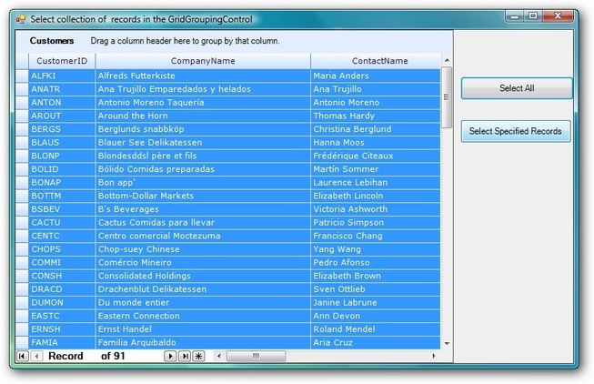
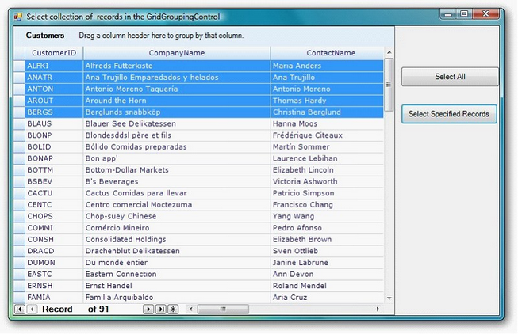

::: {style="DISPLAY: none"}
{#d2h_url_template}{#d2h_package_url style="WIDTH: 0px; DISPLAY: none; HEIGHT: 0px"}
:::

:::: {.d2h_secondary_topic style="PADDING-BOTTOM: 10pt; MARGIN: 0pt; PADDING-LEFT: 0pt; PADDING-RIGHT: 0pt; PADDING-TOP: 0pt"}
#### Select Collection of Records In the GridGroupingControl {#select-collection-of-records-in-the-gridgroupingcontrol style="tab-stops: 0pt"}

[]{style="FONT-FAMILY: 'Trebuchet MS','sans-serif'; COLOR: #15428b; FONT-SIZE: 9pt"} 

Essential **GridGroupingControl** now supports two methods for selecting records in grid table.

[]{style="FONT-FAMILY: 'Trebuchet MS','sans-serif'; COLOR: #15428b; FONT-SIZE: 9pt"} 

[·      ]{style="FONT-FAMILY: Symbol"}SelectAll

[·      ]{style="FONT-FAMILY: Symbol"}Select Specified Record

**[]{style="FONT-FAMILY: 'Trebuchet MS','sans-serif'; COLOR: #15428b; FONT-SIZE: 9pt"}** 

Selecting All

 

The following code illustrates how to select all record in grid table.

[]{style="FONT-FAMILY: 'Courier New'; COLOR: #15428b"} 

+----------------------------------------------------------------------------------------------+
| [//This will select all the records from the grid table]{style="FONT-FAMILY: 'Courier New'"} |
|                                                                                              |
| [this.gridGroupingControl1.Table.Records.SelectAll();]{style="FONT-FAMILY: 'Courier New'"}   |
+----------------------------------------------------------------------------------------------+

[]{style="FONT-FAMILY: 'Trebuchet MS','sans-serif'; COLOR: #15428b; FONT-SIZE: 9pt"} 

When the code runs, selecting all record is bound to **Select All** button.

[]{style="FONT-FAMILY: 'Times New Roman','serif'; FONT-SIZE: 12pt"} 

{border="0"}

 

*[Figure ]{style="FONT-SIZE: 9pt"}[417]{style="FONT-SIZE: 9pt"}[: SelectAll]{style="FONT-SIZE: 9pt"}*

***[]{style="FONT-FAMILY: 'Trebuchet MS','sans-serif'; COLOR: #15428b; FONT-SIZE: 9pt"}*** 

Selecting Specified Records

 

The following code illustrates how to select specified records.

[]{style="FONT-FAMILY: 'Trebuchet MS','sans-serif'; COLOR: #15428b; FONT-SIZE: 9pt"} 

::: {style="BORDER-BOTTOM: windowtext 1pt solid; BORDER-LEFT: medium none; PADDING-BOTTOM: 1pt; MARGIN-TOP: 9pt; PADDING-LEFT: 0pt; PADDING-RIGHT: 0pt; MARGIN-BOTTOM: 9pt; BORDER-TOP: windowtext 1pt solid; BORDER-RIGHT: medium none; PADDING-TOP: 1pt"}
{border="0"}Note: Method Name:  AddRange

         Parameter: Specify the Record collection to be selected
:::

[]{style="FONT-FAMILY: 'Trebuchet MS','sans-serif'; COLOR: #15428b; FONT-SIZE: 9pt"} 

+------------------------------------------------------------------------------------------------------+
| [//this will select the specified records in the grid table]{style="FONT-FAMILY: 'Courier New'"}     |
|                                                                                                      |
| [this.gridGroupingControl1.Table.SelectedRecords.AddRange(rec);]{style="FONT-FAMILY: 'Courier New'"} |
+------------------------------------------------------------------------------------------------------+

[]{style="FONT-FAMILY: 'Trebuchet MS','sans-serif'; COLOR: #15428b; FONT-SIZE: 9pt"} 

When the code runs, selecting specified is bound to **Select Specified Records** button.

[]{style="FONT-FAMILY: 'Times New Roman','serif'; FONT-SIZE: 12pt"} 

{border="0"}

 

*[Figure ]{style="FONT-SIZE: 9pt"}[418]{style="FONT-SIZE: 9pt"}[: Illustrating AddRange]{style="FONT-SIZE: 9pt"}*

[]{style="FONT-FAMILY: 'Times New Roman','serif'; FONT-SIZE: 12pt"} 

[]{style="FONT-FAMILY: 'Times New Roman','serif'; FONT-SIZE: 12pt"} 

[]{style="FONT-FAMILY: 'Times New Roman','serif'; FONT-SIZE: 12pt"} 

 

[]{#related-topics}
::::
