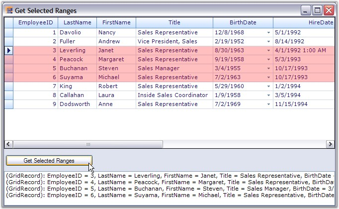

::: {style="DISPLAY: none"}
{#d2h_url_template}{#d2h_package_url style="WIDTH: 0px; DISPLAY: none; HEIGHT: 0px"}
:::

::: {.d2h_secondary_topic style="PADDING-BOTTOM: 10pt; MARGIN: 0pt; PADDING-LEFT: 0pt; PADDING-RIGHT: 0pt; PADDING-TOP: 0pt"}
##### Selected Ranges Collection {#selected-ranges-collection style="tab-stops: 0pt"}

[]{style="FONT-FAMILY: 'Trebuchet MS','sans-serif'; COLOR: #15428b; FONT-SIZE: 9pt"} 

The selections that are made by the user are saved into a collection named **TableModel.SelectedRanges**. If the Selection option is turned on, then the grid will always listen to the selections that are being made and records all those selections into the SelectedRanges collection. You can loop through every selection range of this collection to get the information about the records that have been selected. The **SelectedRanges.ActiveRange** property gives the current selection range (i.e. last range in the collection).

 

**Example**

[]{style="FONT-FAMILY: 'Verdana','sans-serif'; FONT-SIZE: 8pt"} 

This example shows how to loop through the **SelectedRanges** collection to retrieve the information about the records that are being selected.

[]{style="FONT-FAMILY: 'Trebuchet MS','sans-serif'; COLOR: #15428b; FONT-SIZE: 9pt"} 

1.   Turn on any type of selection. Here the record-based selection is active. It is enabled by setting the **ListBoxSelectionMode** property to a value other than None. You could set the selection colors as well.

[]{style="FONT-FAMILY: 'Trebuchet MS','sans-serif'; COLOR: #15428b; FONT-SIZE: 9pt"} 

+-------------------------------------------------------------------------------------------------------------------------------------------------------------------------------------------------------------------------------------------+
| **[\[C#\]]{style="FONT-FAMILY: 'Courier New'; COLOR: black"}**                                                                                                                                                                            |
|                                                                                                                                                                                                                                           |
| []{style="FONT-FAMILY: 'Courier New'; COLOR: black"}                                                                                                                                                                                      |
|                                                                                                                                                                                                                                           |
| [this]{style="FONT-FAMILY: 'Courier New'; COLOR: blue"}[.gridGroupingControl1.TableOptions.ListBoxSelectionMode = [SelectionMode]{style="COLOR: #2b91af"}.MultiExtended;]{style="FONT-FAMILY: 'Courier New'"}                             |
|                                                                                                                                                                                                                                           |
| [this]{style="FONT-FAMILY: 'Courier New'; COLOR: blue"}[.gridGroupingControl1.TableOptions.ListBoxSelectionColorOptions = [GridListBoxSelectionColorOptions]{style="COLOR: #2b91af"}.DrawAlphablend;]{style="FONT-FAMILY: 'Courier New'"} |
|                                                                                                                                                                                                                                           |
| [this]{style="FONT-FAMILY: 'Courier New'; COLOR: blue"}[.gridGroupingControl1.TableModel.Options.AlphaBlendSelectionColor = [Color]{style="COLOR: #2b91af"}.Red;]{style="FONT-FAMILY: 'Courier New'"}                                     |
+-------------------------------------------------------------------------------------------------------------------------------------------------------------------------------------------------------------------------------------------+

[]{style="FONT-FAMILY: 'Trebuchet MS','sans-serif'; COLOR: #15428b; FONT-SIZE: 9pt"} 

+--------------------------------------------------------------------------------------------------------------------------------------------------------------------------------------------------------------+
| **[\[VB.NET\]]{style="FONT-FAMILY: 'Courier New'; COLOR: black"}**                                                                                                                                           |
|                                                                                                                                                                                                              |
| []{style="FONT-FAMILY: 'Courier New'; COLOR: black"}                                                                                                                                                         |
|                                                                                                                                                                                                              |
| [Me]{style="FONT-FAMILY: 'Courier New'; COLOR: blue"}[.gridGroupingControl1.TableOptions.ListBoxSelectionMode = SelectionMode.MultiExtended]{style="FONT-FAMILY: 'Courier New'"}                             |
|                                                                                                                                                                                                              |
| [Me]{style="FONT-FAMILY: 'Courier New'; COLOR: blue"}[.gridGroupingControl1.TableOptions.ListBoxSelectionColorOptions = GridListBoxSelectionColorOptions.DrawAlphablend]{style="FONT-FAMILY: 'Courier New'"} |
|                                                                                                                                                                                                              |
| [Me]{style="FONT-FAMILY: 'Courier New'; COLOR: blue"}[.gridGroupingControl1.TableModel.Options.AlphaBlendSelectionColor = Color.Red]{style="FONT-FAMILY: 'Courier New'"}                                     |
+--------------------------------------------------------------------------------------------------------------------------------------------------------------------------------------------------------------+

[]{style="FONT-FAMILY: 'Trebuchet MS','sans-serif'; COLOR: #15428b; FONT-SIZE: 9pt"} 

2.   The below code loops through the ranges of all the selections and write the record values that have been selected to a listbox control.

[]{style="FONT-SIZE: 8pt"} 

+---------------------------------------------------------------------------------------------------------------------------------------------------------------------------------------------------------------------------+
| **[\[C#\]]{style="FONT-FAMILY: 'Courier New'; COLOR: black"}**                                                                                                                                                            |
|                                                                                                                                                                                                                           |
| []{style="FONT-FAMILY: 'Courier New'; COLOR: black"}                                                                                                                                                                      |
|                                                                                                                                                                                                                           |
| [foreach]{style="FONT-FAMILY: 'Courier New'; COLOR: blue"}[ ([GridRangeInfo]{style="COLOR: #2b91af"} range [in]{style="COLOR: blue"} gridGroupingControl1.TableModel.SelectedRanges)]{style="FONT-FAMILY: 'Courier New'"} |
|                                                                                                                                                                                                                           |
| [{]{style="FONT-FAMILY: 'Courier New'"}                                                                                                                                                                                   |
|                                                                                                                                                                                                                           |
| [    [if]{style="COLOR: blue"} (range.IsRows)]{style="FONT-FAMILY: 'Courier New'"}                                                                                                                                        |
|                                                                                                                                                                                                                           |
| [    {]{style="FONT-FAMILY: 'Courier New'"}                                                                                                                                                                               |
|                                                                                                                                                                                                                           |
| [        [for]{style="COLOR: blue"} ([int]{style="COLOR: blue"} i = range.Top; i \<= range.Bottom; i++)]{style="FONT-FAMILY: 'Courier New'"}                                                                              |
|                                                                                                                                                                                                                           |
| [        {]{style="FONT-FAMILY: 'Courier New'"}                                                                                                                                                                           |
|                                                                                                                                                                                                                           |
| [            [Record]{style="COLOR: #2b91af"} rec = gridGroupingControl1.Table.DisplayElements\[i\].GetRecord();]{style="FONT-FAMILY: 'Courier New'"}                                                                     |
|                                                                                                                                                                                                                           |
| [            listBox1.Items.Add(rec.ToString());]{style="FONT-FAMILY: 'Courier New'"}                                                                                                                                     |
|                                                                                                                                                                                                                           |
| [        }]{style="FONT-FAMILY: 'Courier New'"}                                                                                                                                                                           |
|                                                                                                                                                                                                                           |
| [    }]{style="FONT-FAMILY: 'Courier New'"}                                                                                                                                                                               |
|                                                                                                                                                                                                                           |
| [}]{style="FONT-FAMILY: 'Courier New'"}                                                                                                                                                                                   |
+---------------------------------------------------------------------------------------------------------------------------------------------------------------------------------------------------------------------------+

[]{style="FONT-FAMILY: 'Trebuchet MS','sans-serif'; COLOR: #15428b; FONT-SIZE: 9pt"} 

+--------------------------------------------------------------------------------------------------------------------------------------------------------------------------------------------------------------------------+
| **[\[VB.NET\]]{style="FONT-FAMILY: 'Courier New'; COLOR: black"}**                                                                                                                                                       |
|                                                                                                                                                                                                                          |
| []{style="FONT-FAMILY: 'Courier New'; COLOR: black"}                                                                                                                                                                     |
|                                                                                                                                                                                                                          |
| [For Each]{style="FONT-FAMILY: 'Courier New'; COLOR: blue"}[ range [As]{style="COLOR: blue"} GridRangeInfo [In]{style="COLOR: blue"} gridGroupingControl1.TableModel.SelectedRanges]{style="FONT-FAMILY: 'Courier New'"} |
|                                                                                                                                                                                                                          |
| [If]{style="FONT-FAMILY: 'Courier New'; COLOR: blue"}[ range.IsRows [Then]{style="COLOR: blue"}]{style="FONT-FAMILY: 'Courier New'"}                                                                                     |
|                                                                                                                                                                                                                          |
| [Dim]{style="FONT-FAMILY: 'Courier New'; COLOR: blue"}[ i[ As Integer]{style="COLOR: blue"} = range.Top]{style="FONT-FAMILY: 'Courier New'"}                                                                             |
|                                                                                                                                                                                                                          |
| [Do While]{style="FONT-FAMILY: 'Courier New'; COLOR: blue"}[ i \<= range.Bottom]{style="FONT-FAMILY: 'Courier New'"}                                                                                                     |
|                                                                                                                                                                                                                          |
| [Dim]{style="FONT-FAMILY: 'Courier New'; COLOR: blue"}[ rec [As]{style="COLOR: blue"} Record = gridGroupingControl1.Table.DisplayElements(i).GetRecord()]{style="FONT-FAMILY: 'Courier New'"}                            |
|                                                                                                                                                                                                                          |
| [listBox1.Items.Add(rec.ToString())]{style="FONT-FAMILY: 'Courier New'"}                                                                                                                                                 |
|                                                                                                                                                                                                                          |
| [i += 1]{style="FONT-FAMILY: 'Courier New'"}                                                                                                                                                                             |
|                                                                                                                                                                                                                          |
| [Loop]{style="FONT-FAMILY: 'Courier New'; COLOR: blue"}                                                                                                                                                                  |
|                                                                                                                                                                                                                          |
| [End If]{style="FONT-FAMILY: 'Courier New'; COLOR: blue"}                                                                                                                                                                |
|                                                                                                                                                                                                                          |
| [Next]{style="FONT-FAMILY: 'Courier New'; COLOR: blue"}[ range]{style="FONT-FAMILY: 'Courier New'"}                                                                                                                      |
+--------------------------------------------------------------------------------------------------------------------------------------------------------------------------------------------------------------------------+

[]{style="FONT-FAMILY: 'Trebuchet MS','sans-serif'; COLOR: #15428b; FONT-SIZE: 9pt"} 

3.   Here is a sample screenshot.

[]{style="FONT-SIZE: 8pt"} 

{border="0"}

[]{style="FONT-FAMILY: 'Trebuchet MS','sans-serif'; COLOR: #15428b; FONT-SIZE: 9pt"} 

*[Figure ]{style="FONT-SIZE: 9pt"}[370]{style="FONT-SIZE: 9pt"}[: Retrieving Information about Selected Records by using the SelectedRanges Collection]{style="FONT-SIZE: 9pt"}*

 

[]{#p467} 

 

[]{#related-topics}
:::
