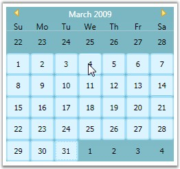

::: {style="DISPLAY: none"}
{#d2h_url_template}{#d2h_package_url style="WIDTH: 0px; DISPLAY: none; HEIGHT: 0px"}
:::

::: {.d2h_secondary_topic style="PADDING-BOTTOM: 10pt; MARGIN: 0pt; PADDING-LEFT: 0pt; PADDING-RIGHT: 0pt; PADDING-TOP: 0pt"}
#### Selecting Multiple Dates {#selecting-multiple-dates style="tab-stops: 0pt"}

CalendarEdit control allows the user to select multiple dates, by setting the **AllowMultiplySelection** property to ***true***. The following code snippet illustrates this.

 

+------------------------------------------------------------------------------------------------------------------------------------------------------------------------------------------------------------------------------------------------------------------------------------------------------------------------------------------------------------------------------------------------------------------------------------------------------------------------------------------------------------------------------------+
| **[\[XAML\]]{style="FONT-FAMILY: 'Courier New'; COLOR: black"}**                                                                                                                                                                                                                                                                                                                                                                                                                                                                   |
|                                                                                                                                                                                                                                                                                                                                                                                                                                                                                                                                    |
| []{style="FONT-FAMILY: 'Courier New'; COLOR: blue"}                                                                                                                                                                                                                                                                                                                                                                                                                                                                                |
|                                                                                                                                                                                                                                                                                                                                                                                                                                                                                                                                    |
| [\<!\--]{style="FONT-FAMILY: 'Courier New'; COLOR: blue"}[ Adding CalendarEdit with multiple selection feature]{style="FONT-FAMILY: 'Courier New'; COLOR: green"}[\--\>]{style="FONT-FAMILY: 'Courier New'; COLOR: blue"}                                                                                                                                                                                                                                                                                                          |
|                                                                                                                                                                                                                                                                                                                                                                                                                                                                                                                                    |
| [\<]{style="FONT-FAMILY: 'Courier New'; COLOR: blue"}[syncfusion:CalendarEdit]{style="FONT-FAMILY: 'Courier New'; COLOR: #a31515"}[ ]{style="FONT-FAMILY: 'Courier New'; COLOR: blue"}[Name]{style="FONT-FAMILY: 'Courier New'; COLOR: red"}[=]{style="FONT-FAMILY: 'Courier New'; COLOR: blue"}[\"[calendarEdit]{style="COLOR: blue"}\"[ ]{style="COLOR: blue"}[AllowMultiplySelection]{style="COLOR: red"}[=]{style="COLOR: blue"}\"[True]{style="COLOR: blue"}\"[/\>]{style="COLOR: blue"}]{style="FONT-FAMILY: 'Courier New'"} |
+------------------------------------------------------------------------------------------------------------------------------------------------------------------------------------------------------------------------------------------------------------------------------------------------------------------------------------------------------------------------------------------------------------------------------------------------------------------------------------------------------------------------------------+

**[]{style="FONT-FAMILY: 'Trebuchet MS','sans-serif'; COLOR: #15428b; FONT-SIZE: 9pt"}** 

+-----------------------------------------------------------------------------------------------------------------------+
| **[\[C#\]]{style="FONT-FAMILY: 'Courier New'; COLOR: black"}**                                                        |
|                                                                                                                       |
| **[]{style="FONT-FAMILY: 'Courier New'; COLOR: black"}**                                                              |
|                                                                                                                       |
| [//Creating an instance of CalendarEdit control]{style="FONT-FAMILY: 'Courier New'; COLOR: green"}                    |
|                                                                                                                       |
| [CalendarEdit calendarEdit = [new]{style="COLOR: blue"} CalendarEdit();]{style="FONT-FAMILY: 'Courier New'"}          |
|                                                                                                                       |
| []{style="FONT-FAMILY: 'Courier New'"}                                                                                |
|                                                                                                                       |
| [//Allow multiple selection of date]{style="FONT-FAMILY: 'Courier New'; COLOR: green"}                                |
|                                                                                                                       |
| [calendarEdit.AllowMultiplySelection = [true]{style="COLOR: blue"}; ]{style="FONT-FAMILY: 'Courier New'"}             |
|                                                                                                                       |
| []{style="FONT-FAMILY: 'Courier New'"}                                                                                |
|                                                                                                                       |
| [//Adding CalendarEdit as window content]{style="FONT-FAMILY: 'Courier New'; COLOR: green"}                           |
|                                                                                                                       |
| [this]{style="FONT-FAMILY: 'Courier New'; COLOR: blue"}[.Content = calendarEdit;]{style="FONT-FAMILY: 'Courier New'"} |
+-----------------------------------------------------------------------------------------------------------------------+

[]{style="FONT-FAMILY: 'Trebuchet MS','sans-serif'; COLOR: #15428b; FONT-SIZE: 9pt"} 

{border="0"}

Figure 65: AllowMultiplySelection = \"True\"

**[]{style="FONT-FAMILY: 'Trebuchet MS','sans-serif'; COLOR: #15428b; FONT-SIZE: 9pt"}** 

See Also

[[Selecting the Date and Year at Run Time]{.UGHyperlink}](ms-xhelp:///?Id=91cfe9e8-9d3a-41b4-bcea-59ec1af14a11)[, ]{style="FONT-FAMILY: 'Trebuchet MS','sans-serif'; COLOR: #15428b; FONT-SIZE: 9pt"}[[Scrolling to the Selected Date]{.UGHyperlink}](ms-xhelp:///?Id=25c3be8f-2601-46c3-a58c-72def88a2811)[]{style="FONT-FAMILY: 'Trebuchet MS','sans-serif'; COLOR: black; FONT-SIZE: 9pt"}

 

[]{#related-topics}
:::
