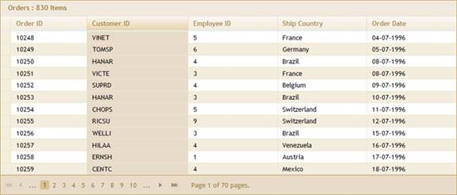
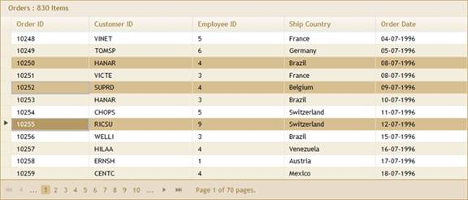
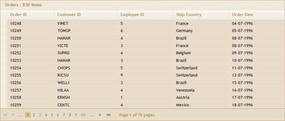
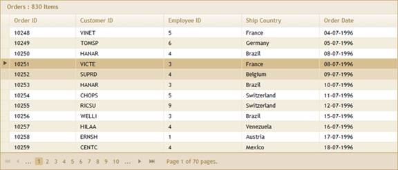
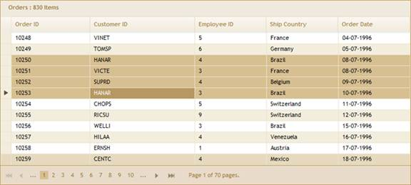

::: {style="DISPLAY: none"}
{#d2h_url_template}{#d2h_package_url style="WIDTH: 0px; DISPLAY: none; HEIGHT: 0px"}
:::

::::: {#nsbanner .d2h_main_nsbanner style="BORDER-BOTTOM: #999999 1px solid; POSITION: relative; PADDING-BOTTOM: 0px; BACKGROUND-COLOR: transparent; PADDING-LEFT: 0px; PADDING-RIGHT: 0px; DISPLAY: none; BORDER-TOP: #999999 1px solid; PADDING-TOP: 0px; LEFT: 0px"}
:::: {#TitleRow .d2h_main_titlerow style="PADDING-BOTTOM: 4px; BACKGROUND-COLOR: transparent; PADDING-LEFT: 22px; WIDTH: 100%; PADDING-RIGHT: 10px; DISPLAY: none; PADDING-TOP: 4px"}
::: {#ienav .d2h_main_ienav style="DISPLAY: none"}
{#D2HPrevious .D2HPreviousEnabled}  {#D2HNext .D2HNextEnabled}
:::
::::
:::::

:::::: {#nstext .d2h_main_nstext style="PADDING-BOTTOM: 10px; BACKGROUND-COLOR: transparent; PADDING-LEFT: 22px; PADDING-RIGHT: 10px; HEIGHT: 100%; OVERFLOW: auto; PADDING-TOP: 5px" hasuserbackground="true" valign="bottom"}
::: {#d2h_breadcrumbs .d2h_breadcrumbs}
[Essential Studio User Guide Documentation](ms-xhelp:///?Id=12457748-09e3-4d74-a240-8e049cedf030){.d2h_breadcrumbsNormal}[ \> ]{.d2h_breadcrumbsLinkSeparator}[User Interface Edition](ms-xhelp:///?Id=c29296b7-531c-413b-a0ec-488ca1f7f669){.d2h_breadcrumbsNormal}[ \> ]{.d2h_breadcrumbsLinkSeparator}[Essential ASP.NET MVC](ms-xhelp:///?Id=4b14e7d1-65c4-4f67-b1aa-2c37709905a5){.d2h_breadcrumbsNormal}[ \> ]{.d2h_breadcrumbsLinkSeparator}[Essential Grid]{.d2h_breadcrumbsContentsOnly}[ \> ]{.d2h_breadcrumbsLinkSeparator}[Getting Started](ms-xhelp:///?Id=c7ed3902-b25b-4170-be58-1d3d0b57748a){.d2h_breadcrumbsNormal}[ \> ]{.d2h_breadcrumbsLinkSeparator}[Feature Summary](ms-xhelp:///?Id=1923e679-441a-44e0-9bca-e0e50988a857){.d2h_breadcrumbsNormal}[ \> ]{.d2h_breadcrumbsLinkSeparator}[Concepts and Features](ms-xhelp:///?Id=4a1657fa-4756-42b9-9153-aebf5dcfc503){.d2h_breadcrumbsNormal}
:::

## Selection {#selection style="tab-stops: 0pt"}

 

You can select one or more rows/records of the Grid using some keyboard keys. Before selecting, you need to enable this feature by setting the **Selection** property to **True**.

Properties

 

 

::: {align="center"}
+----------------------+-------------------------------------------------+------------------+----------------------------+--------------------------------------------------+
| Property             | Description                                     | Type of property | Value it accepts           | Any other dependencies/sub-properties associated |
+----------------------+-------------------------------------------------+------------------+----------------------------+--------------------------------------------------+
| AllowSelection       | Enables/disables the selection feature in grid. | bool             | True/false                 | NA                                               |
+----------------------+-------------------------------------------------+------------------+----------------------------+--------------------------------------------------+
| AllowColumnSelection | Enables/Disables the column selection I grid.   | bool             | True/false                 | NA                                               |
+----------------------+-------------------------------------------------+------------------+----------------------------+--------------------------------------------------+
| RowsSelectionMode    | Gets or Sets the row selection mode for grid.   | Enum             | RowsSelectionMode .Toggle, | NA                                               |
|                      |                                                 |                  |                            |                                                  |
|                      |                                                 |                  | RowsSelectionMode .Normal  |                                                  |
+----------------------+-------------------------------------------------+------------------+----------------------------+--------------------------------------------------+
:::

 

Methods

 

 

::: {align="center"}
  ------------------------------------ ----------------------------- ------------------- ----------------------------------------------
  Method                               Parameters                    Return type         Description
  AllowSelection(bool)                 bool                          IGridBuilder\<T\>   Used to Enable/disable the selection mode.
  AllowColumnSelection(bool)           bool                          IGridBuilder\<T\>   Used to enable/disable the column selection.
  RowSelectionMode(RowSelectionMode)   RowSelectionMode enum value   IGridBuilder\<T\>   Used to set the RowSelectionMode in grid.
  ------------------------------------ ----------------------------- ------------------- ----------------------------------------------
:::

 

After enabling the **AllowSelection** property, select any one row at run time. Now, by holding CTRL, you will be able to select other rows also using the left mouse button as in the image below.

[]{style="FONT-FAMILY: 'Calibri','sans-serif'"} 

The following are possible.

[·      ]{style="FONT-FAMILY: Symbol"}Columns can be selected by clicking the upper 1/4 of their headers.

[·      ]{style="FONT-FAMILY: Symbol"}Rows can be selected either by clicking the row header or any cell of the row.

[·      ]{style="FONT-FAMILY: Symbol"}The whole grid can be selected by clicking the cell at the upper-left corner of the grid.

[·      ]{style="FONT-FAMILY: Symbol"}The ESC key is used to clear the selection.

[·      ]{style="FONT-FAMILY: Symbol"}For multiple selections, use SHIFT+arrow keys for continuous selection of consecutive rows.

[·      ]{style="FONT-FAMILY: Symbol"}Press CTRL and left-click to select random rows for multiple selections.

Selection is enabled by default.

 

Various selection styles

1.   Column selection.

 

{border="0"}

Figure 229: Column Selection

 

 

 

2.   CTRL+mouse-click selection.[]{style="FONT-SIZE: 12pt"}

[]{style="FONT-SIZE: 12pt"} 

{border="0"}

Figure 230: CTRL+Mouse Selection

3.   Grid selection.

 

{border="0"}

Figure 231: Grid Selection

[]{style="FONT-FAMILY: 'Times New Roman','serif'; FONT-SIZE: 12pt"} 

4.   Row selection.

[]{style="FONT-FAMILY: 'Times New Roman','serif'; FONT-SIZE: 12pt"} 

{border="0"}

Figure 232: Row Selection

5.   SHIFT+arrow keys selection.

 

{border="0"}

Figure 233: Shift+Arrow Keys Selection

More:

[ ]{#related-topics}

[{border="0" align="absMiddle"}Toggle Selection](ms-xhelp:///?Id=21687ebf-9ee0-4092-94d0-ce105c735384){style="TEXT-DECORATION: none"}
::::::
