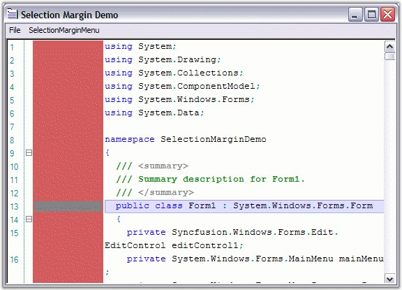
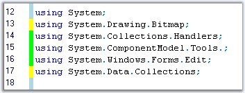

::: {style="DISPLAY: none"}
{#d2h_url_template}{#d2h_package_url style="WIDTH: 0px; DISPLAY: none; HEIGHT: 0px"}
:::

:::: {.d2h_secondary_topic style="PADDING-BOTTOM: 10pt; MARGIN: 0pt; PADDING-LEFT: 0pt; PADDING-RIGHT: 0pt; PADDING-TOP: 0pt"}
#### Selection Margin {#selection-margin style="tab-stops: 0pt"}

 

Selection Margin is a thin vertical strip along the left side of the Edit Control that enables you to select the contents of the entire line on the Edit Control, by simply clicking on the corresponding selection margin area of the line.

 

The **ShowSelectionMargin** property allows you to show / hide this selection margin. The following are the properties used to  customize the margin.

 

::: {align="center"}
  -------------------------------- -------------------------------------------------------
  Edit Control Property            Description
  SelectionMarginForegroundColor   Gets / sets foreground color of the selection margin.
  SelectionMarginBackgroundColor   Gets / sets background color of the selection margin.
  SelectionMarginWidth             Sets the width of the selection margin.
  -------------------------------- -------------------------------------------------------
:::

[]{style="FONT-FAMILY: 'Trebuchet MS','sans-serif'; COLOR: #15428b; FONT-SIZE: 9pt"} 

+-------------------------------------------------------------------------------------------------------------------------------------------------------------------------------------+
| **[\[C#\]]{style="FONT-FAMILY: 'Courier New'; COLOR: black"}**                                                                                                                      |
|                                                                                                                                                                                     |
| []{style="FONT-FAMILY: 'Courier New'; COLOR: black"}                                                                                                                                |
|                                                                                                                                                                                     |
| [this]{style="FONT-FAMILY: 'Courier New'; COLOR: blue"}[.editControl1.SelectionMarginForegroundColor = [Color]{style="COLOR: teal"}.Gray;]{style="FONT-FAMILY: 'Courier New'"}      |
|                                                                                                                                                                                     |
| [this]{style="FONT-FAMILY: 'Courier New'; COLOR: blue"}[.editControl1.SelectionMarginBackgroundColor = [Color]{style="COLOR: teal"}.IndianRed;]{style="FONT-FAMILY: 'Courier New'"} |
|                                                                                                                                                                                     |
| [this]{style="FONT-FAMILY: 'Courier New'; COLOR: blue"}[.editControl1.SelectionMarginWidth = 100;]{style="FONT-FAMILY: 'Courier New'"}                                              |
+-------------------------------------------------------------------------------------------------------------------------------------------------------------------------------------+

[]{style="FONT-FAMILY: 'Trebuchet MS','sans-serif'; COLOR: #15428b; FONT-SIZE: 9pt"} 

+-----------------------------------------------------------------------------------------------------------------------------------------------------------+
| **[\[VB.NET\]]{style="FONT-FAMILY: 'Courier New'; COLOR: black"}**                                                                                        |
|                                                                                                                                                           |
| []{style="FONT-FAMILY: 'Courier New'; COLOR: green"}                                                                                                      |
|                                                                                                                                                           |
| [Me]{style="FONT-FAMILY: 'Courier New'; COLOR: blue"}[.editControl1.SelectionMarginForegroundColor = Color.Gray]{style="FONT-FAMILY: 'Courier New'"}      |
|                                                                                                                                                           |
| [Me]{style="FONT-FAMILY: 'Courier New'; COLOR: blue"}[.editControl1.SelectionMarginBackgroundColor = Color.IndianRed]{style="FONT-FAMILY: 'Courier New'"} |
|                                                                                                                                                           |
| [Me]{style="FONT-FAMILY: 'Courier New'; COLOR: blue"}[.editControl1.SelectionMarginWidth = 100]{style="FONT-FAMILY: 'Courier New'"}                       |
+-----------------------------------------------------------------------------------------------------------------------------------------------------------+

[]{style="FONT-FAMILY: 'Trebuchet MS','sans-serif'; COLOR: #15428b; FONT-SIZE: 9pt"} 

{border="0"}

Figure 65: Selection Margin Set

[]{style="FONT-FAMILY: 'Trebuchet MS','sans-serif'; COLOR: #15428b; FONT-SIZE: 9pt"} 

Differentiating the Lines based on Actions

 

Edit Control supports marking the changed lines and the saved lines with different colors.

 

Lines that are modified after the file load or after the last file save operations are the changed lines. They are marked in yellow color, by default. Once they are saved, they will be changed to green, by default.

 

The changed lines marking feature can be enabled by setting the **MarkChangedLines** property to **True**. For this property to be visible in the Edit Control, the **SelectionMargin** property should also be enabled.

 

+------------------------------------------------------------------------------------------------------------------------------------------------------------+
| **[\[C#\]]{style="FONT-FAMILY: 'Courier New'; COLOR: black"}**                                                                                             |
|                                                                                                                                                            |
| []{style="FONT-FAMILY: 'Courier New'; COLOR: black"}                                                                                                       |
|                                                                                                                                                            |
| [this]{style="FONT-FAMILY: 'Courier New'; COLOR: blue"}[.editControl1.MarkChangedLines = [true]{style="COLOR: blue"};]{style="FONT-FAMILY: 'Courier New'"} |
+------------------------------------------------------------------------------------------------------------------------------------------------------------+

[]{style="FONT-FAMILY: 'Trebuchet MS','sans-serif'; COLOR: #15428b; FONT-SIZE: 9pt"} 

+---------------------------------------------------------------------------------------------------------------------------------------------------------+
| **[\[VB.NET\]]{style="FONT-FAMILY: 'Courier New'; COLOR: black"}**                                                                                      |
|                                                                                                                                                         |
| []{style="FONT-FAMILY: 'Courier New'; COLOR: black"}                                                                                                    |
|                                                                                                                                                         |
| [Me]{style="FONT-FAMILY: 'Courier New'; COLOR: blue"}[.editControl1.MarkChangedLines = [True]{style="COLOR: blue"}]{style="FONT-FAMILY: 'Courier New'"} |
+---------------------------------------------------------------------------------------------------------------------------------------------------------+

[]{style="FONT-FAMILY: 'Trebuchet MS','sans-serif'; COLOR: #15428b; FONT-SIZE: 9pt"} 

{border="0"}

Figure 66: Saved Changes in Green and Unsaved Changes in Yellow

 

Refer to the Selection Margin Demo sample in the following sample installation location, for more information in this regard.

 

***..\\My Documents\\Syncfusion\\EssentialStudio\\Version Number\\Windows\\Edit.Windows\\Samples\\2.0\\Advanced Editor Functions\\SelectionMarginDemo***

 

[]{#related-topics}
::::
