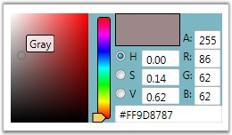
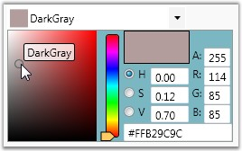
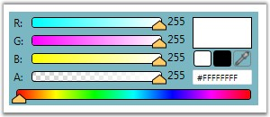
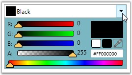

::: {style="DISPLAY: none"}
{#d2h_url_template}{#d2h_package_url style="WIDTH: 0px; DISPLAY: none; HEIGHT: 0px"}
:::

::: {.d2h_secondary_topic style="PADDING-BOTTOM: 10pt; MARGIN: 0pt; PADDING-LEFT: 0pt; PADDING-RIGHT: 0pt; PADDING-TOP: 0pt"}
#### Selection Mode {#selection-mode style="tab-stops: 0pt"}

ColorPicker and ColorEdit controls can be displayed in two different modes. They are HSV and RGB modes. The **VisualizationStyle** property is used to switch between these modes.

 

To set the ColorSelection Mode as \"HSV\" for ColorEdit control, use the below code.

 

+-----------------------------------------------------------------------------------------------------------------------------------------------------------------------------------------------------------------------------------------------------------------------------------------------------------------------------------------------------------------------------------------------------------------------------------------------------------------------------------------------------------------------------------------------------------------------------------------------------------------------------------------------------------------------------------------------------------------------------------+
| **[\[XAML\]]{style="FONT-FAMILY: 'Courier New'; COLOR: black; FONT-SIZE: 9pt"}**                                                                                                                                                                                                                                                                                                                                                                                                                                                                                                                                                                                                                                                  |
|                                                                                                                                                                                                                                                                                                                                                                                                                                                                                                                                                                                                                                                                                                                                   |
| []{style="FONT-FAMILY: 'Courier New'; COLOR: blue; FONT-SIZE: 9pt"}                                                                                                                                                                                                                                                                                                                                                                                                                                                                                                                                                                                                                                                               |
|                                                                                                                                                                                                                                                                                                                                                                                                                                                                                                                                                                                                                                                                                                                                   |
| [\<!\--]{style="FONT-FAMILY: 'Courier New'; COLOR: blue; FONT-SIZE: 9pt"}[ Adding ColorEdit ]{style="FONT-FAMILY: 'Courier New'; COLOR: green; FONT-SIZE: 9pt"}[\--\>]{style="FONT-FAMILY: 'Courier New'; COLOR: blue; FONT-SIZE: 9pt"}                                                                                                                                                                                                                                                                                                                                                                                                                                                                                           |
|                                                                                                                                                                                                                                                                                                                                                                                                                                                                                                                                                                                                                                                                                                                                   |
| [\<]{style="FONT-FAMILY: 'Courier New'; COLOR: blue; FONT-SIZE: 9pt"}[syncfusion:ColorEdit]{style="FONT-FAMILY: 'Courier New'; COLOR: #a31515; FONT-SIZE: 9pt"}[  ]{style="FONT-FAMILY: 'Courier New'; COLOR: blue; FONT-SIZE: 9pt"}[Margin]{style="FONT-FAMILY: 'Courier New'; COLOR: red; FONT-SIZE: 9pt"}[=]{style="FONT-FAMILY: 'Courier New'; COLOR: blue; FONT-SIZE: 9pt"}[\"[20]{style="COLOR: blue"}\"[ ]{style="COLOR: blue"}[VisualizationStyle]{style="COLOR: red"}[=]{style="COLOR: blue"}\"[HSV]{style="COLOR: blue"}\"[ ]{style="COLOR: blue"}[Name]{style="COLOR: red"}[=]{style="COLOR: blue"}\"[colorEdit]{style="COLOR: blue"}\"[/\>]{style="COLOR: blue"}]{style="FONT-FAMILY: 'Courier New'; FONT-SIZE: 9pt"} |
+-----------------------------------------------------------------------------------------------------------------------------------------------------------------------------------------------------------------------------------------------------------------------------------------------------------------------------------------------------------------------------------------------------------------------------------------------------------------------------------------------------------------------------------------------------------------------------------------------------------------------------------------------------------------------------------------------------------------------------------+

**[]{style="FONT-FAMILY: 'Trebuchet MS','sans-serif'; COLOR: #15428b; FONT-SIZE: 9pt"}** 

+----------------------------------------------------------------------------------------------------------------------------------------------------+
| **[\[C#\]]{style="FONT-FAMILY: 'Courier New'; COLOR: black; FONT-SIZE: 9pt"}**                                                                     |
|                                                                                                                                                    |
| []{style="FONT-FAMILY: 'Courier New'; COLOR: black; FONT-SIZE: 9pt"}                                                                               |
|                                                                                                                                                    |
| [//Creating an instance of color edit]{style="FONT-FAMILY: 'Courier New'; COLOR: green; FONT-SIZE: 9pt"}                                           |
|                                                                                                                                                    |
| [ColorEdit colorEdit = [new]{style="COLOR: blue"} ColorEdit();]{style="FONT-FAMILY: 'Courier New'; FONT-SIZE: 9pt"}                                |
|                                                                                                                                                    |
| []{style="FONT-FAMILY: 'Courier New'; COLOR: green; FONT-SIZE: 9pt"}                                                                               |
|                                                                                                                                                    |
| [//Setting selection mode as HSV]{style="FONT-FAMILY: 'Courier New'; COLOR: green; FONT-SIZE: 9pt"}                                                |
|                                                                                                                                                    |
| [colorEdit.VisualizationStyle = ColorSelectionMode.HSV;    ]{style="FONT-FAMILY: 'Courier New'; FONT-SIZE: 9pt"}                                   |
|                                                                                                                                                    |
| []{style="FONT-FAMILY: 'Courier New'; COLOR: green; FONT-SIZE: 9pt"}                                                                               |
|                                                                                                                                                    |
| [//Adding control to the window]{style="FONT-FAMILY: 'Courier New'; COLOR: green; FONT-SIZE: 9pt"}                                                 |
|                                                                                                                                                    |
| [this]{style="FONT-FAMILY: 'Courier New'; COLOR: blue; FONT-SIZE: 9pt"}[.Content = colorEdit;]{style="FONT-FAMILY: 'Courier New'; FONT-SIZE: 9pt"} |
+----------------------------------------------------------------------------------------------------------------------------------------------------+

[]{style="FONT-FAMILY: 'Trebuchet MS','sans-serif'; COLOR: #15428b; FONT-SIZE: 9pt"} 

{border="0"}

Figure 152: ColorEdit with Color Selection Mode set to \"HSV\"

**[]{style="FONT-FAMILY: 'Trebuchet MS','sans-serif'; COLOR: #15428b; FONT-SIZE: 9pt"}** 

To set the ColorSelection Mode as \"HSV\" for ColorPicker control, use the below code.

[]{style="FONT-FAMILY: 'Trebuchet MS','sans-serif'; COLOR: #15428b; FONT-SIZE: 9pt"} 

+------------------------------------------------------------------------------------------------------------------------------------------------------+
| **[\[C#\]]{style="FONT-FAMILY: 'Courier New'; COLOR: black; FONT-SIZE: 9pt"}**                                                                       |
|                                                                                                                                                      |
| []{style="FONT-FAMILY: 'Courier New'; COLOR: black; FONT-SIZE: 9pt"}                                                                                 |
|                                                                                                                                                      |
| [//Creating an instance of color picker]{style="FONT-FAMILY: 'Courier New'; COLOR: green; FONT-SIZE: 9pt"}                                           |
|                                                                                                                                                      |
| [ColorPicker colorPicker = [new]{style="COLOR: blue"} ColorPicker();]{style="FONT-FAMILY: 'Courier New'; FONT-SIZE: 9pt"}                            |
|                                                                                                                                                      |
| []{style="FONT-FAMILY: 'Courier New'; COLOR: green; FONT-SIZE: 9pt"}                                                                                 |
|                                                                                                                                                      |
| [//Setting selection mode as HSV]{style="FONT-FAMILY: 'Courier New'; COLOR: green; FONT-SIZE: 9pt"}                                                  |
|                                                                                                                                                      |
| [colorPicker.VisualizationStyle = ColorSelectionMode.HSV;    ]{style="FONT-FAMILY: 'Courier New'; FONT-SIZE: 9pt"}                                   |
|                                                                                                                                                      |
| []{style="FONT-FAMILY: 'Courier New'; COLOR: green; FONT-SIZE: 9pt"}                                                                                 |
|                                                                                                                                                      |
| [//Adding control to the window]{style="FONT-FAMILY: 'Courier New'; COLOR: green; FONT-SIZE: 9pt"}                                                   |
|                                                                                                                                                      |
| [this]{style="FONT-FAMILY: 'Courier New'; COLOR: blue; FONT-SIZE: 9pt"}[.Content = colorPicker;]{style="FONT-FAMILY: 'Courier New'; FONT-SIZE: 9pt"} |
+------------------------------------------------------------------------------------------------------------------------------------------------------+

[]{style="FONT-FAMILY: 'Trebuchet MS','sans-serif'; COLOR: #15428b; FONT-SIZE: 9pt"} 

{border="0"}

Figure 153: ColorPicker with Color Selection Mode set to \"HSV\"

 

To set the ColorSelection Mode as \"RGB\" for ColorEdit control, use the below code.

 

+----------------------------------------------------------------------------------------------------------------------------------------------------+
| **[\[C#\]]{style="FONT-FAMILY: 'Courier New'; COLOR: black; FONT-SIZE: 9pt"}**                                                                     |
|                                                                                                                                                    |
| []{style="FONT-FAMILY: 'Courier New'; COLOR: black; FONT-SIZE: 9pt"}                                                                               |
|                                                                                                                                                    |
| [//Creating an instance of color edit]{style="FONT-FAMILY: 'Courier New'; COLOR: green; FONT-SIZE: 9pt"}                                           |
|                                                                                                                                                    |
| [ColorEdit colorEdit = [new]{style="COLOR: blue"} ColorEdit();]{style="FONT-FAMILY: 'Courier New'; FONT-SIZE: 9pt"}                                |
|                                                                                                                                                    |
| []{style="FONT-FAMILY: 'Courier New'; FONT-SIZE: 9pt"}                                                                                             |
|                                                                                                                                                    |
| [//Setting selection mode as RGB]{style="FONT-FAMILY: 'Courier New'; COLOR: green; FONT-SIZE: 9pt"}                                                |
|                                                                                                                                                    |
| [colorEdit.VisualizationStyle = ColorSelectionMode.RGB; ]{style="FONT-FAMILY: 'Courier New'; FONT-SIZE: 9pt"}                                      |
|                                                                                                                                                    |
| [   ]{style="FONT-FAMILY: 'Courier New'; FONT-SIZE: 9pt"}                                                                                          |
|                                                                                                                                                    |
| [//Adding control to the window]{style="FONT-FAMILY: 'Courier New'; COLOR: green; FONT-SIZE: 9pt"}                                                 |
|                                                                                                                                                    |
| [this]{style="FONT-FAMILY: 'Courier New'; COLOR: blue; FONT-SIZE: 9pt"}[.Content = colorEdit;]{style="FONT-FAMILY: 'Courier New'; FONT-SIZE: 9pt"} |
+----------------------------------------------------------------------------------------------------------------------------------------------------+

[]{style="FONT-FAMILY: 'Trebuchet MS','sans-serif'; COLOR: #15428b; FONT-SIZE: 9pt"} 

{border="0"}

Figure 154: ColorEdit with Color Selection Mode set to \"RGB\"

**[]{style="FONT-FAMILY: 'Trebuchet MS','sans-serif'; COLOR: #15428b; FONT-SIZE: 9pt"}** 

To set the ColorSelection Mode as \"RGB\" for ColorPicker control, use the below code.

+------------------------------------------------------------------------------------------------------------------------------------------------------+
| **[\[C#\]]{style="FONT-FAMILY: 'Courier New'; COLOR: black; FONT-SIZE: 9pt"}**                                                                       |
|                                                                                                                                                      |
| []{style="FONT-FAMILY: 'Courier New'; COLOR: black; FONT-SIZE: 9pt"}                                                                                 |
|                                                                                                                                                      |
| [//Creating an instance of color picker]{style="FONT-FAMILY: 'Courier New'; COLOR: green; FONT-SIZE: 9pt"}                                           |
|                                                                                                                                                      |
| [ColorPicker colorPicker = [new]{style="COLOR: blue"} ColorPicker();]{style="FONT-FAMILY: 'Courier New'; FONT-SIZE: 9pt"}                            |
|                                                                                                                                                      |
| []{style="FONT-FAMILY: 'Courier New'; FONT-SIZE: 9pt"}                                                                                               |
|                                                                                                                                                      |
| [//Setting selection mode as RGB]{style="FONT-FAMILY: 'Courier New'; COLOR: green; FONT-SIZE: 9pt"}                                                  |
|                                                                                                                                                      |
| [colorPicker.VisualizationStyle = ColorSelectionMode.RGB;]{style="FONT-FAMILY: 'Courier New'; FONT-SIZE: 9pt"}                                       |
|                                                                                                                                                      |
| [    ]{style="FONT-FAMILY: 'Courier New'; FONT-SIZE: 9pt"}                                                                                           |
|                                                                                                                                                      |
| [//Adding control to the window]{style="FONT-FAMILY: 'Courier New'; COLOR: green; FONT-SIZE: 9pt"}                                                   |
|                                                                                                                                                      |
| [this]{style="FONT-FAMILY: 'Courier New'; COLOR: blue; FONT-SIZE: 9pt"}[.Content = colorPicker;]{style="FONT-FAMILY: 'Courier New'; FONT-SIZE: 9pt"} |
+------------------------------------------------------------------------------------------------------------------------------------------------------+

[]{style="FONT-FAMILY: 'Trebuchet MS','sans-serif'; COLOR: #15428b; FONT-SIZE: 9pt"} 

{border="0"}

Figure 155: ColorPicker with Color Selection Mode set to \"RGB\"

[]{#p83} 

[]{#related-topics}
:::
