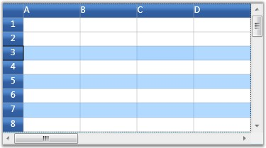
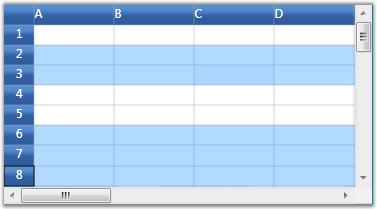

::: {style="DISPLAY: none"}
{#d2h_url_template}{#d2h_package_url style="WIDTH: 0px; DISPLAY: none; HEIGHT: 0px"}
:::

:::::::: {.d2h_secondary_topic style="PADDING-BOTTOM: 10pt; MARGIN: 0pt; PADDING-LEFT: 0pt; PADDING-RIGHT: 0pt; PADDING-TOP: 0pt"}
#### Selection Modes {#selection-modes style="tab-stops: 0pt"}

[]{style="FONT-FAMILY: 'Trebuchet MS','sans-serif'; COLOR: #15428b; FONT-SIZE: 9pt"} 

There are two modes of selection available in the Grid. They are,

[]{style="FONT-FAMILY: 'Trebuchet MS','sans-serif'; COLOR: #15428b; FONT-SIZE: 9pt"} 

[·      ]{style="FONT-FAMILY: Symbol"}Model-Based Selection

**[]{style="FONT-FAMILY: 'Trebuchet MS','sans-serif'; COLOR: #15428b; FONT-SIZE: 9pt"}** 

1.   In Model-based selection, you will be able to select cell ranges; but the selections will have no knowledge of nested tables, grouping or sorting and hence the functionality is limited like a data bound grid (Grid Data control).

2.   To use the model selection capability, set AllowSelections to any flag except none.

3.   Selection can be made through keyboard and mouse.

[]{style="FONT-FAMILY: 'Trebuchet MS','sans-serif'; COLOR: #15428b; FONT-SIZE: 9pt"} 

[·      ]{style="FONT-FAMILY: Symbol"}Record-Based Selection

**[]{style="FONT-FAMILY: 'Trebuchet MS','sans-serif'; COLOR: #15428b; FONT-SIZE: 9pt"}** 

4.   It is designed specifically for the data bound grids.

5.   In Record-based selection, the complete grid records (rows) will be selected and these selections function properly with nested tables, sorting, and so on.

6.   To use the record selections, you must set AllowSelections to none and then set ListBoxSelectionMode to any flag except none.

7.   Selection can be made through keyboard and mouse with some restriction. For more details, see Record-based Selection in this topic.

[]{style="FONT-FAMILY: 'Trebuchet MS','sans-serif'; COLOR: #15428b; FONT-SIZE: 9pt"} 

Let us know more about these selection Modes.

[]{style="FONT-FAMILY: 'Trebuchet MS','sans-serif'; COLOR: #15428b; FONT-SIZE: 9pt"} 

Model-Based Selection

[]{style="FONT-FAMILY: 'Trebuchet MS','sans-serif'; COLOR: #15428b; FONT-SIZE: 9pt"} 

Model-based selection is cell-based selection mode that allows you to do a selection across the cell, which is not possible with record-based selection. It can be set by initializing **AllowSelection** property to a Flag value, say, Row.

[]{style="FONT-FAMILY: 'Trebuchet MS','sans-serif'; COLOR: #15428b; FONT-SIZE: 9pt"} 

::: {style="BORDER-BOTTOM: windowtext 1pt solid; BORDER-LEFT: medium none; PADDING-BOTTOM: 1pt; MARGIN-TOP: 9pt; PADDING-LEFT: 0pt; PADDING-RIGHT: 0pt; MARGIN-BOTTOM: 9pt; BORDER-TOP: windowtext 1pt solid; BORDER-RIGHT: medium none; PADDING-TOP: 1pt"}
{border="0"}Note: Setting the Flag to None will disable selecting of cells.
:::

[]{style="FONT-FAMILY: 'Trebuchet MS','sans-serif'; COLOR: #15428b; FONT-SIZE: 9pt"} 

The possible values for this type of selection are defined by the enum GridSelectionFlags. To control the selection behavior of the grid, set any of the following flags to the AllowSelection property.

**[]{style="FONT-FAMILY: 'Trebuchet MS','sans-serif'; COLOR: #15428b"}** 

Selection Flags

**[]{style="FONT-FAMILY: 'Trebuchet MS','sans-serif'; COLOR: #15428b"}** 

::: {align="center"}
  -------------- -------------------------------------------------------------------------------------------------------------------------------------------------------------------------------------
  Flag           Description
  None           Disables selecting of cells.
  Row            Allows selection of rows.
  Column         Allows selection of columns.
  Table          Allows selection of the whole table.
  Cell           Allows selection of an individual cell.
  Multiple       Allows selection of multiple ranges of cells. The user has to press CTRL Key to select multiple ranges.
  Shift          Allows extending existing selection when user holds SHIFT Key and clicks on a cell.
  Keyboard       Allows extending existing selection when user holds SHIFT Key and presses arrow keys.
  MixRangeType   Allows both rows and columns to be selected at the same time when Multiple is specified. By default, the grid does not allow row and column ranges to be selected at the same time.
  Any            Allows selection of rows, columns, table, cell and multiple ranges of cells; also extends SHIFT Key support and alpha blending.
  -------------- -------------------------------------------------------------------------------------------------------------------------------------------------------------------------------------
:::

[]{style="FONT-FAMILY: 'Trebuchet MS','sans-serif'; COLOR: #15428b; FONT-SIZE: 9pt"} 

You can combine more than one flag to customize the current selection behavior.

[]{style="FONT-FAMILY: 'Trebuchet MS','sans-serif'; COLOR: #15428b; FONT-SIZE: 9pt"} 

Example

**[]{style="FONT-FAMILY: 'Trebuchet MS','sans-serif'; COLOR: #15428b; FONT-SIZE: 9pt"}** 

Here is an example code snippet that sets the selection mode for selecting multiple columns.

[]{style="FONT-FAMILY: 'Trebuchet MS','sans-serif'; COLOR: #15428b; FONT-SIZE: 9pt"} 

+---------------------------------------------------------------------------------------------------------------------------------------------------------------------------------------------------------+
| **[\[C#\]]{style="FONT-FAMILY: 'Courier New'; COLOR: black"}**                                                                                                                                          |
|                                                                                                                                                                                                         |
| []{style="FONT-FAMILY: 'Courier New'; COLOR: blue; FONT-SIZE: 9pt"}                                                                                                                                     |
|                                                                                                                                                                                                         |
| [grid.Model.Options.AllowSelection = [GridSelectionFlags]{style="COLOR: #2b91af"}.Multiple \| [GridSelectionFlags]{style="COLOR: #2b91af"}.Column;]{style="FONT-FAMILY: 'Courier New'; FONT-SIZE: 9pt"} |
+---------------------------------------------------------------------------------------------------------------------------------------------------------------------------------------------------------+

[]{style="FONT-FAMILY: 'Trebuchet MS','sans-serif'; COLOR: #15428b; FONT-SIZE: 9pt"} 

{border="0"}

[]{style="FONT-FAMILY: 'Trebuchet MS','sans-serif'; COLOR: #15428b; FONT-SIZE: 9pt"} 

Figure 62: Selecting multiple Columns

[]{style="FONT-FAMILY: 'Trebuchet MS','sans-serif'; COLOR: #15428b; FONT-SIZE: 9pt"} 

Record-Based Selection

**[]{style="FONT-FAMILY: 'Trebuchet MS','sans-serif'; COLOR: #15428b"}** 

This type of selection mechanism allows selection in terms of record (entire row). It is not cell-based. This selection mode is specifically designed for a data-bound grid in which the grid data can be organized as a collection of record rows.

 

Grid offers the following three types of record-based selections which are together called as List Box Selection Modes.

[]{style="FONT-FAMILY: 'Trebuchet MS','sans-serif'; COLOR: #15428b; FONT-SIZE: 9pt"} 

[·      ]{style="FONT-FAMILY: Symbol"}SelectionMode--One

[·      ]{style="FONT-FAMILY: Symbol"}SelectionMode--MultiSimple

[·      ]{style="FONT-FAMILY: Symbol"}SelectionMode-MultiExtended

[]{style="FONT-FAMILY: 'Trebuchet MS','sans-serif'; COLOR: #15428b; FONT-SIZE: 9pt"} 

To enable record-based selection, you need to set the ListBoxSelectionMode property to any of the above values. Once a list box selection is enabled, it automatically turns off the model-based selection by assigning None to the AllowSelection property. Below is a detailed description on each type with example code snippets.

**[]{style="FONT-FAMILY: 'Trebuchet MS','sans-serif'; COLOR: #15428b; FONT-SIZE: 9pt"}** 

SelectionMode-One

**[]{style="FONT-FAMILY: 'Trebuchet MS','sans-serif'; COLOR: #15428b; FONT-SIZE: 9pt"}** 

It allows you to select only one item (record). Say, you have selected a record. Now if you select some other record, the previous record selection will be cleared. Hence it is a one record selection mode. The following code is used to set this mode:

[]{style="FONT-FAMILY: 'Trebuchet MS','sans-serif'; COLOR: #15428b; FONT-SIZE: 9pt"} 

+--------------------------------------------------------------------------------------------------------------------------------------------------+
| **[\[C#\]]{style="FONT-FAMILY: 'Courier New'; COLOR: black"}**                                                                                   |
|                                                                                                                                                  |
| **[]{style="FONT-FAMILY: 'Courier New'; COLOR: black; FONT-SIZE: 9pt"}**                                                                         |
|                                                                                                                                                  |
| [grid.Model.Options.ListBoxSelectionMode = [GridSelectionMode]{style="COLOR: #2b91af"}.One;]{style="FONT-FAMILY: 'Courier New'; FONT-SIZE: 9pt"} |
+--------------------------------------------------------------------------------------------------------------------------------------------------+

[]{style="FONT-FAMILY: 'Trebuchet MS','sans-serif'; COLOR: #15428b; FONT-SIZE: 9pt"} 

{border="0"}

[]{style="FONT-FAMILY: 'Trebuchet MS','sans-serif'; COLOR: #15428b; FONT-SIZE: 9pt"} 

Figure 63: SelectionMode-one

***[]{style="FONT-FAMILY: 'Trebuchet MS','sans-serif'; COLOR: #15428b; FONT-SIZE: 9pt"}*** 

::: {style="BORDER-BOTTOM: windowtext 1pt solid; BORDER-LEFT: medium none; PADDING-BOTTOM: 1pt; MARGIN-TOP: 9pt; PADDING-LEFT: 0pt; PADDING-RIGHT: 0pt; MARGIN-BOTTOM: 9pt; BORDER-TOP: windowtext 1pt solid; BORDER-RIGHT: medium none; PADDING-TOP: 1pt"}
{border="0"}Note: Record can be selected using a single mouse click or using UP or DOWN Arrow Keys
:::

[]{style="FONT-FAMILY: 'Trebuchet MS','sans-serif'; COLOR: #15428b; FONT-SIZE: 9pt"} 

SelectionMode - MultiSimple

**[]{style="FONT-FAMILY: 'Trebuchet MS','sans-serif'; COLOR: #15428b; FONT-SIZE: 9pt"}** 

In this selection mode, you will be able to select multiple items individually. Say, you have selected a record using mouse and you want to select one more record. Click another record and you will notice that the previous selection is not cleared. You can hence select multiple records without the need of SHIFT or CTRL keys.

 

The following code is used to set this mode:

[]{style="FONT-FAMILY: 'Trebuchet MS','sans-serif'; COLOR: #15428b; FONT-SIZE: 9pt"} 

+----------------------------------------------------------------------------------------------------------------------------------------------------------+
| **[\[C#\]]{style="FONT-FAMILY: 'Courier New'; COLOR: black"}**                                                                                           |
|                                                                                                                                                          |
| **[]{style="FONT-FAMILY: 'Courier New'; COLOR: black; FONT-SIZE: 9pt"}**                                                                                 |
|                                                                                                                                                          |
| [grid.Model.Options.ListBoxSelectionMode = [GridSelectionMode]{style="COLOR: #2b91af"}.MultiSimple;]{style="FONT-FAMILY: 'Courier New'; FONT-SIZE: 9pt"} |
+----------------------------------------------------------------------------------------------------------------------------------------------------------+

[]{style="FONT-FAMILY: 'Trebuchet MS','sans-serif'; COLOR: #15428b; FONT-SIZE: 9pt"} 

{border="0"}

[]{style="FONT-FAMILY: 'Trebuchet MS','sans-serif'; COLOR: #15428b; FONT-SIZE: 9pt"} 

Figure 64: SelectionMode - MultiSimple

[]{style="FONT-FAMILY: 'Trebuchet MS','sans-serif'; COLOR: #15428b; FONT-SIZE: 9pt"} 

::: {style="BORDER-BOTTOM: windowtext 1pt solid; BORDER-LEFT: medium none; PADDING-BOTTOM: 1pt; MARGIN-TOP: 9pt; PADDING-LEFT: 0pt; PADDING-RIGHT: 0pt; MARGIN-BOTTOM: 9pt; BORDER-TOP: windowtext 1pt solid; BORDER-RIGHT: medium none; PADDING-TOP: 1pt"}
{border="0"}Note: It does not support the use of SHIFT, CTRL and arrow keys to extend the selection.
:::

[]{style="FONT-FAMILY: 'Trebuchet MS','sans-serif'; COLOR: #15428b; FONT-SIZE: 9pt"} 

SelectionMode - MultiExtended

[]{style="FONT-FAMILY: 'Trebuchet MS','sans-serif'; COLOR: #15428b; FONT-SIZE: 9pt"} 

This selection type allows multiple items selection through SHIFT, CTRL and arrow keys.

 

You can do any of the following when this selection mode is enabled:

[]{style="FONT-FAMILY: 'Trebuchet MS','sans-serif'; COLOR: #15428b; FONT-SIZE: 9pt"} 

[·      ]{style="FONT-FAMILY: Symbol"}Select a record, hold down the SHIFT key and select fourth record, for example. You will notice all the records in between 1st and the 4th record are also selected.

[·      ]{style="FONT-FAMILY: Symbol"}You can make random selection by holding down the CTRL key.

[·      ]{style="FONT-FAMILY: Symbol"}Hold down the Shift key and select the records using the UP or DOWN ARROW keys.

[]{style="FONT-FAMILY: 'Trebuchet MS','sans-serif'; COLOR: #15428b; FONT-SIZE: 9pt"} 

The following code is used to set this mode:

[]{style="FONT-FAMILY: 'Trebuchet MS','sans-serif'; COLOR: #15428b; FONT-SIZE: 9pt"} 

+------------------------------------------------------------------------------------------------------------------------------------------------------------+
| **[\[C#\]]{style="FONT-FAMILY: 'Courier New'; COLOR: black"}**                                                                                             |
|                                                                                                                                                            |
| **[]{style="FONT-FAMILY: 'Courier New'; COLOR: black; FONT-SIZE: 9pt"}**                                                                                   |
|                                                                                                                                                            |
| [grid.Model.Options.ListBoxSelectionMode = [GridSelectionMode]{style="COLOR: #2b91af"}.MultiExtended;]{style="FONT-FAMILY: 'Courier New'; FONT-SIZE: 9pt"} |
+------------------------------------------------------------------------------------------------------------------------------------------------------------+

[]{style="FONT-FAMILY: 'Trebuchet MS','sans-serif'; COLOR: #15428b; FONT-SIZE: 9pt"} 

{border="0"}

[]{style="FONT-FAMILY: 'Trebuchet MS','sans-serif'; COLOR: #15428b; FONT-SIZE: 9pt"} 

Figure 65: SelectionMode - MultiExtended

***[]{style="FONT-FAMILY: 'Trebuchet MS','sans-serif'; COLOR: #15428b; FONT-SIZE: 9pt"}*** 

The Model.Selections Collection

**[]{style="FONT-FAMILY: 'Trebuchet MS','sans-serif'; COLOR: #15428b; FONT-SIZE: 9pt"}** 

The entire grid selections are managed by the GridModel.Selections collection. It exposes several APIs that let you add, remove and operate on different grid selections. Below is the description of some important properties and APIs:

[]{style="FONT-FAMILY: 'Trebuchet MS','sans-serif'; COLOR: #15428b; FONT-SIZE: 9pt"} 

::: {align="center"}
  ------------------------------- ----------------------------------------------------------------------------------------------------
  Property/Method                 Description
  Add(), Remove()                 Adds or removes the specified range to/from the collection.
  InsertRows(), InsertColumns()   Inserts new rows or columns into the collection.
  RemoveRows(), RemoveColumns()   Removes the specified rows or columns from the collection.
  Ranges                          A GridRangeInfoList collection that stores all the selected ranges for the grid.
  SelectRange()                   Adds or removes a range to/from the collection.
  GetSelectedRanges()             Retrieves a list of selected ranges and if there are no selected ranges, returns the current cell.
  GetSelectedRows()               Returns the number of selected rows.
  GetSelectedCols()               Returns the number of selected columns.
  ------------------------------- ----------------------------------------------------------------------------------------------------
:::

 

[]{#p191} 

[]{#related-topics}
::::::::
