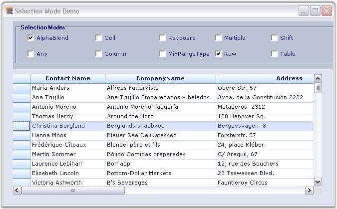

::: {style="DISPLAY: none"}
{#d2h_url_template}{#d2h_package_url style="WIDTH: 0px; DISPLAY: none; HEIGHT: 0px"}
:::

::: {.d2h_secondary_topic style="PADDING-BOTTOM: 10pt; MARGIN: 0pt; PADDING-LEFT: 0pt; PADDING-RIGHT: 0pt; PADDING-TOP: 0pt"}
#### Selection Modes {#selection-modes style="tab-stops: 0pt"}

[]{style="FONT-FAMILY: 'Trebuchet MS','sans-serif'; COLOR: #15428b; FONT-SIZE: 9pt"} 

Essential Grid supports different selection modes for grid cells. A specific selection behavior can be set through the **GridControl.AllowSelection** property.

 

The following screen shot shows a window with a list of selection modes.

[]{style="FONT-FAMILY: 'Trebuchet MS','sans-serif'; COLOR: #15428b; FONT-SIZE: 9pt"} 

{border="0"}

[]{style="FONT-FAMILY: 'Trebuchet MS','sans-serif'; COLOR: #15428b; FONT-SIZE: 9pt"} 

*[Figure ]{style="FONT-SIZE: 9pt"}[186]{style="FONT-SIZE: 9pt"}[: Selection Mode]{style="FONT-SIZE: 9pt"}*

[]{style="FONT-FAMILY: 'Trebuchet MS','sans-serif'; COLOR: #15428b; FONT-SIZE: 9pt"} 

Different types of selection modes are listed with their corresponding descriptions:

[]{style="FONT-FAMILY: 'Trebuchet MS','sans-serif'; COLOR: #15428b; FONT-SIZE: 9pt"} 

[·      ]{style="FONT-FAMILY: Symbol"}The alpha blending to highlight selected cells can be achieved by using **GridSelectionFlags.AlphaBlend** option or selecting the **AlphaBlend** check box under **Selection Modes** group box in the UI.

[·      ]{style="FONT-FAMILY: Symbol"}The default behavior for selecting cells, rows, columns, tables, multiple extending **SHIFT** key support, and alpha blending can be achieved by using **GridSelectionFlags.Any** option or selecting the **Any** check box under **Selection Modes** group box in the UI.

[·      ]{style="FONT-FAMILY: Symbol"}Column selection can be achieved by using **GridSelectionFlags.Column** option or selecting the **Column** check box under **Selection Modes** group box in the UI.

[·      ]{style="FONT-FAMILY: Symbol"}Row selection can be achieved by using **GridSelectionFlags.Row** option or selecting the **Row** check box under **Selection Modes** group box in the UI.

[·      ]{style="FONT-FAMILY: Symbol"}An existing selection can be extended when a user holds the **SHIFT** key and uses the arrow keys by using **GridSelectionFlags.Keyboard** option or selecting the **Keyboard** check box under **Selection Modes** group box in the UI.

[·      ]{style="FONT-FAMILY: Symbol"}Selection of both rows and columns simultaneously when multiple selection is enabled can be achieved by using **GridSelectionFlags.MixRangeType** option or selecting the **MixRangeType** check box under **Selection Modes** group box in the UI.

[·      ]{style="FONT-FAMILY: Symbol"}Selection of entire table can be achieved by using **GridSelectionFlags.Table** option or selecting the **Table** check box under **Selection Modes** group box in the UI.

[·      ]{style="FONT-FAMILY: Symbol"}Selection of multiple ranges of cells using the **CTRL** key can be achieved by using **GridSelectionFlags.Multiple** option or selecting the **Multiple** check box under **Selection Modes** group box in the UI.

[·      ]{style="FONT-FAMILY: Symbol"}An existing selection using the **SHIFT** key can be extended by using **GridSelectionFlags.Shift** option or selecting the **Shift** check box under **Selection Modes** group box in the UI.

[·      ]{style="FONT-FAMILY: Symbol"}Selection of cells using the **CTRL** key can be disabled by using **GridSelectionFlags.None** option or selecting the **Cell** check box under **Selection Modes** group box in the UI.

[]{style="FONT-FAMILY: 'Trebuchet MS','sans-serif'; COLOR: #15428b; FONT-SIZE: 9pt"} 

Setting Specific Selection Mode

[]{style="FONT-FAMILY: 'Trebuchet MS','sans-serif'; COLOR: #15428b; FONT-SIZE: 9pt"} 

Specific selection modes can be set by using the following code examples:

[]{style="FONT-FAMILY: 'Trebuchet MS','sans-serif'; COLOR: #15428b; FONT-SIZE: 9pt"} 

1.   Using C#

[]{style="FONT-FAMILY: 'Trebuchet MS','sans-serif'; COLOR: #15428b; FONT-SIZE: 9pt"} 

+-------------------------------------------------------------------------------------------------------------------------------------------------------------------------------+
| **[\[C#\]]{style="FONT-FAMILY: 'Courier New'; COLOR: black"}**                                                                                                                |
|                                                                                                                                                                               |
| []{style="FONT-FAMILY: 'Courier New'; COLOR: black"}                                                                                                                          |
|                                                                                                                                                                               |
| [this]{style="FONT-FAMILY: 'Courier New'; COLOR: blue"}[.gridControl1.AllowSelection = [GridSelectionFlags]{style="COLOR: #2b91af"}.Row;]{style="FONT-FAMILY: 'Courier New'"} |
+-------------------------------------------------------------------------------------------------------------------------------------------------------------------------------+

[]{style="FONT-FAMILY: 'Trebuchet MS','sans-serif'; COLOR: #15428b; FONT-SIZE: 9pt"} 

2.   Using VB.NET

[]{style="FONT-FAMILY: 'Trebuchet MS','sans-serif'; COLOR: #15428b; FONT-SIZE: 9pt"} 

+--------------------------------------------------------------------------------------------------------------------------------------------------+
| **[\[VB.NET\]]{style="FONT-FAMILY: 'Courier New'; COLOR: black"}**                                                                               |
|                                                                                                                                                  |
| []{style="FONT-FAMILY: 'Courier New'; COLOR: black"}                                                                                             |
|                                                                                                                                                  |
| [Me]{style="FONT-FAMILY: 'Courier New'; COLOR: blue"}[.gridControl1.AllowSelection = GridSelectionFlags.Row]{style="FONT-FAMILY: 'Courier New'"} |
+--------------------------------------------------------------------------------------------------------------------------------------------------+

 

[]{#p343} 

 

[]{#related-topics}
:::
