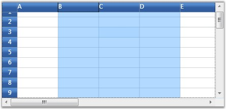
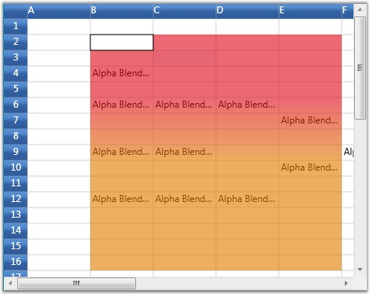
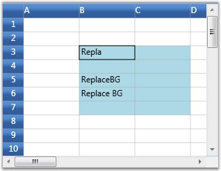
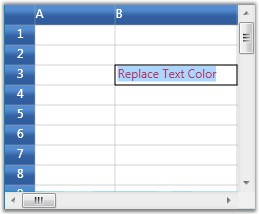
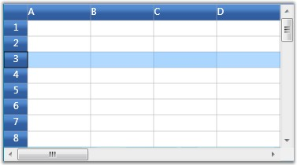

::: {style="DISPLAY: none"}
{#d2h_url_template}{#d2h_package_url style="WIDTH: 0px; DISPLAY: none; HEIGHT: 0px"}
:::

::::::::: {.d2h_secondary_topic style="PADDING-BOTTOM: 10pt; MARGIN: 0pt; PADDING-LEFT: 0pt; PADDING-RIGHT: 0pt; PADDING-TOP: 0pt"}
#### Selection Modes {#selection-modes style="tab-stops: 0pt"}

[]{#p209}There are two modes of selection available in the Grid. They are,

[]{style="COLOR: #15428b"} 

[·      ]{style="FONT-FAMILY: Symbol"}Model-Based Selection

**[]{style="COLOR: #15428b"}** 

1.   In Model-based selection, you will be able to select cell ranges; but the selections will have no knowledge of nested tables, grouping or sorting and hence the functionality is limited like a data bound grid (GridData control).

2.   To use the model selection capability, set AllowSelections to any flag except none.

3.   Selection can be made through keyboard and mouse.

[]{style="COLOR: #15428b"} 

[·      ]{style="FONT-FAMILY: Symbol"}Record-Based Selection

**[]{style="COLOR: #15428b"}** 

1.   It is designed specifically for the data bound grids.

2.   In Record-based selection, the complete grid records (rows) will be selected and these selections function properly with nested tables, sorting, and so on.

3.   To use the record selections, you must set AllowSelections to none and then set ListBoxSelectionMode to any flag except none.

4.   Selection can be made through keyboard and mouse with some restriction. For more details, see Record-based Selection in this topic.

 

Let us know more about these selection Modes.

 

Model-Based Selection

 

Model-based selection is cell-based selection mode that allows you to do a selection across the cell, which is not possible with record-based selection. It can be set by initializing AllowSelection property to a Flag value, say, Row.

 

::: {style="BORDER-BOTTOM: windowtext 1pt solid; BORDER-LEFT: medium none; PADDING-BOTTOM: 1pt; MARGIN-TOP: 9pt; PADDING-LEFT: 0pt; PADDING-RIGHT: 0pt; MARGIN-BOTTOM: 9pt; BORDER-TOP: windowtext 1pt solid; BORDER-RIGHT: medium none; PADDING-TOP: 1pt"}
{border="0"}Note: Setting the Flag to None will disable selecting of cells.
:::

 

The possible values for this type of selection are defined by the enum GridSelectionFlags. To control the selection behavior of the grid, set any of the following flags to the AllowSelection property.

 

Selection Flags

 

Table 15: Selection Flags

::: {align="center"}
  -------------- -------------------------------------------------------------------------------------------------------------------------------------------------------------------------------------
  Flag           Description
  None           Disables selecting of cells.
  Row            Allows selection of rows.
  Column         Allows selection of columns.
  Table          Allows selection of the whole table.
  Cell           Allows selection of an individual cell.
  Multiple       Allows selection of multiple ranges of cells. The user has to press CTRL Key to select multiple ranges.
  Shift          Allows extending existing selection when user holds SHIFT Key and clicks on a cell.
  Keyboard       Allows extending existing selection when user holds SHIFT Key and presses arrow keys.
  MixRangeType   Allows both rows and columns to be selected at the same time when Multiple is specified. By default, the grid does not allow row and column ranges to be selected at the same time.
  Any            Allows selection of rows, columns, table, cell and multiple ranges of cells; also extends SHIFT Key support and alpha blending.
  -------------- -------------------------------------------------------------------------------------------------------------------------------------------------------------------------------------
:::

 

You can combine more than one flag to customize the current selection behavior.

 

Example

 

Here is an example code snippet that sets the selection mode for selecting multiple columns.

 

+-----------------------------------------------------------------------------------------------------------------------------------------------------------------------------------------+
| [\[C#\]]{style="FONT-FAMILY: 'Courier New'; COLOR: black"}                                                                                                                              |
|                                                                                                                                                                                         |
| []{style="FONT-FAMILY: 'Courier New'; COLOR: blue"}                                                                                                                                     |
|                                                                                                                                                                                         |
| [grid.Model.Options.AllowSelection = [GridSelectionFlags]{style="COLOR: #2b91af"}.Multiple \| [GridSelectionFlags]{style="COLOR: #2b91af"}.Column;]{style="FONT-FAMILY: 'Courier New'"} |
+-----------------------------------------------------------------------------------------------------------------------------------------------------------------------------------------+

[]{style="COLOR: #15428b"} 

[{border="0"}]{style="COLOR: #15428b"}[]{style="COLOR: #15428b"}

Figure 72: Selecting multiple Columns

[]{style="COLOR: #15428b"} 

Format Selections

 

It is possible to modify the appearance of the selection through property settings. The following properties work in combinations to produce some special effects.

 

Table 16: Property

::: {align="center"}
+-----------------------------------+-----------------------------------------------------+
| Property                          | Description                                         |
+-----------------------------------+-----------------------------------------------------+
| DrawSelectionOptions              | Defines the selection behavior for the grid.        |
|                                   |                                                     |
|                                   | Important options are:                              |
|                                   |                                                     |
|                                   | AlphaBlend                                          |
|                                   |                                                     |
|                                   | ReplaceBackground                                   |
|                                   |                                                     |
|                                   | ReplaceTextColor                                    |
+-----------------------------------+-----------------------------------------------------+
| HighlightSelectionAlphaBlend      | Specifies the alpha blend color used for selection. |
+-----------------------------------+-----------------------------------------------------+
| HighlightSelectionBackground      | Specifies the background color for selection.       |
+-----------------------------------+-----------------------------------------------------+
| HighlightSelectionForeground      | Specifies the foreground color for selection.       |
+-----------------------------------+-----------------------------------------------------+
:::

 

Below code provides alpha blended selection:

 

+--------------------------------------------------------------------------------------------------------------------------------------------------------------------------------+
| [\[C#\]]{style="FONT-FAMILY: 'Courier New'; COLOR: black"}                                                                                                                     |
|                                                                                                                                                                                |
| []{style="FONT-FAMILY: 'Courier New'; COLOR: blue"}                                                                                                                            |
|                                                                                                                                                                                |
| [LinearGradientBrush brush = [new]{style="COLOR: blue"} LinearGradientBrush([new]{style="COLOR: blue"} GradientStopCollection()]{style="FONT-FAMILY: 'Courier New'"}           |
|                                                                                                                                                                                |
| [{  [new]{style="COLOR: blue"} GradientStop(GridUtil.GetXamlConvertedValue\<Color\>([\"#A0E01020\"]{style="COLOR: #a31515"}), 0d),]{style="FONT-FAMILY: 'Courier New'"}        |
|                                                                                                                                                                                |
| [   [new]{style="COLOR: blue"} GradientStop(GridUtil.GetXamlConvertedValue\<Color\>([\"#A0E01020\"]{style="COLOR: #a31515"}), 0.318681d),]{style="FONT-FAMILY: 'Courier New'"} |
|                                                                                                                                                                                |
| [   [new]{style="COLOR: blue"} GradientStop(GridUtil.GetXamlConvertedValue\<Color\>([\"#A0E08000\"]{style="COLOR: #a31515"}), 0.604396d),]{style="FONT-FAMILY: 'Courier New'"} |
|                                                                                                                                                                                |
| [   [new]{style="COLOR: blue"} GradientStop(GridUtil.GetXamlConvertedValue\<Color\>([\"#A0E08000\"]{style="COLOR: #a31515"}), 1d)]{style="FONT-FAMILY: 'Courier New'"}         |
|                                                                                                                                                                                |
| [                });]{style="FONT-FAMILY: 'Courier New'"}                                                                                                                      |
|                                                                                                                                                                                |
| [brush.StartPoint = [new]{style="COLOR: blue"} Point(0.5, -0.0430693);]{style="FONT-FAMILY: 'Courier New'"}                                                                    |
|                                                                                                                                                                                |
| [brush.EndPoint = [new]{style="COLOR: blue"} Point(0.5, 0.928826);]{style="FONT-FAMILY: 'Courier New'"}                                                                        |
|                                                                                                                                                                                |
| [grid.Model.Options.HighlightSelectionAlphaBlend = brush;]{style="FONT-FAMILY: 'Courier New'"}                                                                                 |
|                                                                                                                                                                                |
| [grid.Model.Options.DrawSelectionOptions = GridDrawSelectionOptions.AlphaBlend;]{style="FONT-FAMILY: 'Courier New'"}                                                           |
+--------------------------------------------------------------------------------------------------------------------------------------------------------------------------------+

[]{style="COLOR: #15428b"} 

{border="0"}

Figure 73: Alpha-blended selection

 

Below code lets you set the background of the selection:

 

+-------------------------------------------------------------------------------------------------------------------------------------------------------+
| [\[C#\]]{style="FONT-FAMILY: 'Courier New'; COLOR: black"}                                                                                            |
|                                                                                                                                                       |
| **[]{style="FONT-FAMILY: 'Courier New'; COLOR: black"}**                                                                                              |
|                                                                                                                                                       |
| [grid.Model.Options.DrawSelectionOptions = [GridDrawSelectionOptions]{style="COLOR: #2b91af"}.ReplaceBackground;]{style="FONT-FAMILY: 'Courier New'"} |
|                                                                                                                                                       |
| [grid.Model.Options.HighlightSelectionBackground = [Brushes]{style="COLOR: #2b91af"}.LightBlue;]{style="FONT-FAMILY: 'Courier New'"}                  |
+-------------------------------------------------------------------------------------------------------------------------------------------------------+

[]{style="COLOR: #15428b"} 

[]{style="COLOR: #15428b"} 

{border="0"}

Figure 74: Selection Background set to blue

***[]{style="COLOR: #15428b"}*** 

Below code lets you set the foreground of the selection:

[]{style="COLOR: #15428b"} 

+----------------------------------------------------------------------------------------------------------------------------+
| [\[C#\]]{style="FONT-FAMILY: 'Courier New'; COLOR: black"}                                                                 |
|                                                                                                                            |
| **[]{style="FONT-FAMILY: 'Courier New'; COLOR: black"}**                                                                   |
|                                                                                                                            |
| [grid.Model.Options.DrawSelectionOptions = GridDrawSelectionOptions.ReplaceTextColor;]{style="FONT-FAMILY: 'Courier New'"} |
|                                                                                                                            |
| [grid.Model.Options.HighlightSelectionForeground = Brushes.Red;]{style="FONT-FAMILY: 'Courier New'"}                       |
+----------------------------------------------------------------------------------------------------------------------------+

[]{style="COLOR: #15428b"} 

{border="0"}

Figure 75:: Foreground of the selection set to pink

***[]{style="COLOR: #15428b"}*** 

Record-Based Selection

 

This type of selection mechanism allows selection in terms of record (entire row). It is not cell-based. This selection mode is specifically designed for a data-bound grid in which the grid data can be organized as a collection of record rows.

 

Grid offers the following three types of record-based selections which are together called as List Box Selection Modes.

 

[·      ]{style="FONT-FAMILY: Symbol"}SelectionMode--One

[·      ]{style="FONT-FAMILY: Symbol"}SelectionMode--MultiSimple

[·      ]{style="FONT-FAMILY: Symbol"}SelectionMode-MultiExtended

 

To enable record-based selection, set the ListBoxSelectionMode property to any of the above specified List Box Selection Mode values. To enable list box selection, turn off the model-based selection by setting the AllowSelection property to Row. Below is a detailed description of List Box Selection Modes.

 

 SelectionMode-One

 

It allows you to select only one item (record). Say, you have selected a record. Now if you select some other record, the previous record selection will be cleared. Hence it is a one record selection mode. The following code is used to set this mode:

 

+---------------------------------------------------------------------------------------------------------------------------------------------------------------------------------+
| [\[C#\]]{style="FONT-FAMILY: 'Courier New'"}                                                                                                                                    |
|                                                                                                                                                                                 |
| []{style="FONT-FAMILY: 'Courier New'"}                                                                                                                                          |
|                                                                                                                                                                                 |
| [grid.AllowSelection = [GridSelectionFlags]{style="COLOR: #2b91af"}.]{style="FONT-FAMILY: 'Courier New'"}[Row]{style="FONT-FAMILY: 'Calibri','sans-serif'; FONT-SIZE: 11pt"}[;\ |
| grid.Model.Options.ListBoxSelectionMode = [GridSelectionMode]{style="COLOR: #2b91af"}.One;]{style="FONT-FAMILY: 'Courier New'"}                                                 |
+---------------------------------------------------------------------------------------------------------------------------------------------------------------------------------+

[]{style="COLOR: #15428b"} 

[{border="0"}]{style="COLOR: #15428b"}[]{style="COLOR: #15428b"}

Figure 76: SelectionMode-one

***[]{style="COLOR: #15428b"}*** 

::: {style="BORDER-BOTTOM: windowtext 1pt solid; BORDER-LEFT: medium none; PADDING-BOTTOM: 1pt; MARGIN-TOP: 9pt; PADDING-LEFT: 0pt; PADDING-RIGHT: 0pt; MARGIN-BOTTOM: 9pt; BORDER-TOP: windowtext 1pt solid; BORDER-RIGHT: medium none; PADDING-TOP: 1pt"}
{border="0"}Note: Record can be selected using a single mouse click or using UP or DOWN Arrow Keys
:::

 

SelectionMode - MultiSimple

In this selection mode, you will be able to select multiple items individually. Say, you have selected a record using mouse and you want to select one more record. Click another record and you will notice that the previous selection is not cleared. You can hence select multiple records without the need of SHIFT or CTRL keys.

 

The following code is used to set this mode:

 

+-----------------------------------------------------------------------------------------------------------------------------------------+
| [\[C#\]]{style="FONT-FAMILY: 'Courier New'"}                                                                                            |
|                                                                                                                                         |
| []{style="FONT-FAMILY: 'Courier New'"}                                                                                                  |
|                                                                                                                                         |
| [grid.AllowSelection = [GridSelectionFlags]{style="COLOR: #2b91af"}.Row;\                                                               |
| grid.Model.Options.ListBoxSelectionMode = [GridSelectionMode]{style="COLOR: #2b91af"}.MultiSimple;]{style="FONT-FAMILY: 'Courier New'"} |
+-----------------------------------------------------------------------------------------------------------------------------------------+

[]{style="COLOR: #15428b"} 

{border="0"}

Figure 77: SelectionMode - MultiSimple

[]{style="COLOR: #15428b"} 

::: {style="BORDER-BOTTOM: windowtext 1pt solid; BORDER-LEFT: medium none; PADDING-BOTTOM: 1pt; MARGIN-TOP: 9pt; PADDING-LEFT: 0pt; PADDING-RIGHT: 0pt; MARGIN-BOTTOM: 9pt; BORDER-TOP: windowtext 1pt solid; BORDER-RIGHT: medium none; PADDING-TOP: 1pt"}
{border="0"}Note: It does not support the use of SHIFT, CTRL and arrow keys to extend the selection.
:::

[]{style="COLOR: #15428b"} 

SelectionMode - MultiExtended

 

This selection type allows multiple items selection through SHIFT, CTRL and arrow keys.

 

You can do any of the following when this selection mode is enabled:

 

[·      ]{style="FONT-FAMILY: Symbol"}Select a record, hold down the SHIFT key and select fourth record, for example. You will notice all the records in between 1st and the 4th record are also selected.

[·      ]{style="FONT-FAMILY: Symbol"}You can make random selection by holding down the CTRL key.

[·      ]{style="FONT-FAMILY: Symbol"}Hold down the Shift key and select the records using the UP or DOWN ARROW keys.

 

The following code is used to set this mode:

 

+----------------------------------------------------------------------------------------------------------------------------------------------------------+
| [\[C#\]]{style="FONT-FAMILY: 'Calibri','sans-serif'; COLOR: black; FONT-SIZE: 11pt"}**[]{style="FONT-FAMILY: 'Calibri','sans-serif'; FONT-SIZE: 11pt"}** |
|                                                                                                                                                          |
| []{style="FONT-FAMILY: 'Calibri','sans-serif'; FONT-SIZE: 11pt"}                                                                                         |
|                                                                                                                                                          |
| [grid.AllowSelection = [GridSelectionFlags]{style="COLOR: #2b91af"}.Row;\                                                                                |
| grid.Model.Options.ListBoxSelectionMode = [GridSelectionMode]{style="COLOR: #2b91af"}.MultiExtended;]{style="FONT-FAMILY: 'Courier New'"}                |
+----------------------------------------------------------------------------------------------------------------------------------------------------------+

[]{style="COLOR: #15428b"} 

[]{style="COLOR: #15428b"} 

{border="0"}

Figure 78: SelectionMode - MultiExtended

***[]{style="COLOR: #15428b"}*** 

The Model.Selections Collection

 

The entire grid selections are managed by the GridModel.Selections collection. It exposes several APIs that let you add, remove and operate on different grid selections. Below is the description of some important properties and APIs:

 

Table 17: Property/Methods

::: {align="center"}
  ------------------------------- ----------------------------------------------------------------------------------------------------
  Property/Method                 Description
  Add(), Remove()                 Adds or removes the specified range to/from the collection.
  InsertRows(), InsertColumns()   Inserts new rows or columns into the collection.
  RemoveRows(), RemoveColumns()   Removes the specified rows or columns from the collection.
  Ranges                          A GridRangeInfoList collection that stores all the selected ranges for the grid.
  SelectRange()                   Adds or removes a range to/from the collection.
  GetSelectedRanges()             Retrieves a list of selected ranges and if there are no selected ranges, returns the current cell.
  GetSelectedRows()               Returns the number of selected rows.
  GetSelectedCols()               Returns the number of selected columns.
  ------------------------------- ----------------------------------------------------------------------------------------------------
:::

 

 

[]{#related-topics}
:::::::::
