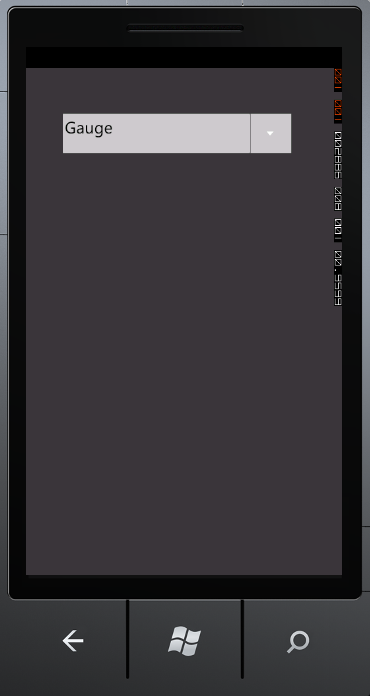
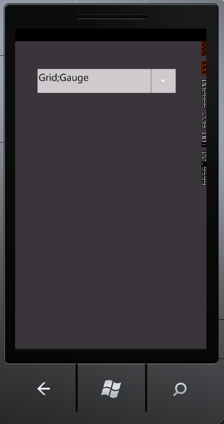

::: {style="DISPLAY: none"}
{#d2h_url_template}{#d2h_package_url style="WIDTH: 0px; DISPLAY: none; HEIGHT: 0px"}
:::

::: {.d2h_secondary_topic style="PADDING-BOTTOM: 10pt; MARGIN: 0pt; PADDING-LEFT: 0pt; PADDING-RIGHT: 0pt; PADDING-TOP: 0pt"}
#### Selection Mode Support {#selection-mode-support style="tab-stops: 0pt"}

AutoComplete supports two kinds of *Selection Mode* namely Single and Multiple. You can select the Mode using the *SelectionMode* property.

When the *SelectionMode* property is set to Single, only one item can be selected at a time. The following image illustrates the Single selection mode.

{border="0"}

Figure 17: SelectionMode-Single

 

When the *SelectionMode* is set to Multiple, multiple items can be selected. Use the *SeparatorChar* property to separate the selected items. By default the SeparatorChar is set to semicolon (;). Once an item is selected the *Separatorchar* has to be entered in the text box to select the next item. The following image illustrates the Multiple selection mode.

 

{border="0"}

Figure 18: SelectionMode-Multiple

 

 

Adding Selection Support to an Application

The *Selectionmode* property is used to attain these functionalities by setting its value as Single or Multiple. By default the value is set to Single. The following code illustrates how to set the *SelectionMode* property:

 

+---------------------------------------------------------------------------------------------------------------------------------------------------------------------------------------------------------------------------------------------------------------------------------------------------------------------------------------------------------------------------------------------------------------------------------------------------------------------------------------------------------------------------------------------------------------------------------------------------------------------------------------------------------+
| **[\[XAML\]]{style="FONT-FAMILY: 'Courier New'"}**                                                                                                                                                                                                                                                                                                                                                                                                                                                                                                                                                                                                      |
|                                                                                                                                                                                                                                                                                                                                                                                                                                                                                                                                                                                                                                                         |
| [\<]{style="FONT-FAMILY: 'Courier New'; COLOR: blue"}[syncfusion]{style="FONT-FAMILY: 'Courier New'; COLOR: #a31515"}[:]{style="FONT-FAMILY: 'Courier New'; COLOR: blue"}[AutoComplete]{style="FONT-FAMILY: 'Courier New'; COLOR: #a31515"}[ x]{style="FONT-FAMILY: 'Courier New'; COLOR: red"}[:]{style="FONT-FAMILY: 'Courier New'; COLOR: blue"}[Name]{style="FONT-FAMILY: 'Courier New'; COLOR: red"}[=\"AutoComplete1\"]{style="FONT-FAMILY: 'Courier New'; COLOR: blue"}[ SelectionMode]{style="FONT-FAMILY: 'Courier New'; COLOR: red"}[=\"Multiple\"/\>]{style="FONT-FAMILY: 'Courier New'; COLOR: blue"}[]{style="FONT-FAMILY: 'Courier New'"} |
+---------------------------------------------------------------------------------------------------------------------------------------------------------------------------------------------------------------------------------------------------------------------------------------------------------------------------------------------------------------------------------------------------------------------------------------------------------------------------------------------------------------------------------------------------------------------------------------------------------------------------------------------------------+

 

+-----------------------------------------------------------------------------------------------------------------------------------------------------------------------------------------------------------------------------------------------------------+
| **[\[C#\]]{style="FONT-FAMILY: 'Courier New'"}**                                                                                                                                                                                                          |
|                                                                                                                                                                                                                                                           |
| [AutoComplete]{style="FONT-FAMILY: 'Courier New'; COLOR: teal"}[ autoComplete1 = [new]{style="COLOR: blue"} [AutoComplete]{style="COLOR: teal"}();]{style="FONT-FAMILY: 'Courier New'"}                                                                   |
|                                                                                                                                                                                                                                                           |
| [this]{style="FONT-FAMILY: 'Courier New'; COLOR: blue"}[.]{style="FONT-FAMILY: 'Courier New'"}[autoComplete1]{style="FONT-FAMILY: 'Courier New'"}[.SelectionMode = [SelectionMode]{style="COLOR: #2b91af"}.Multiple;]{style="FONT-FAMILY: 'Courier New'"} |
+-----------------------------------------------------------------------------------------------------------------------------------------------------------------------------------------------------------------------------------------------------------+

 

Tables for property, and Event

Property

Table 5: Property Table for Multiple Selection

  --------------- ----------------------------------------------------- -------------------- ----------------------- -----------------
  Property        Description                                           Type                 Data Type               Reference links
  SelectionMode   Gets or sets the SelectionMode of the AutoComplete.   DependencyProperty   SelectionMode(Single)   NA
  --------------- ----------------------------------------------------- -------------------- ----------------------- -----------------

 

 

Events

Table 6: Event Table for Multiple Selection

+----------------------+-----------------------------------------------------------------------------------+------------------------------------+-----------------------------------+---------------------+
| **Event**            | **Description**                                                                   | **Arguments**                      | **Type**                          | **Reference links** |
+----------------------+-----------------------------------------------------------------------------------+------------------------------------+-----------------------------------+---------------------+
| SelectionModeChanged | When the *SelectionMode* property value is changed, this event will be triggered. | DependencyObject,                  | DependencyPropertyChangedCallBack | NA                  |
|                      |                                                                                   |                                    |                                   |                     |
|                      | This cannot be cancelled.                                                         | DependencyPropertyChangedEventArgs |                                   |                     |
+======================+===================================================================================+====================================+===================================+=====================+

 

Sample Link

To access a Basic Core Features demo:

1.  Open the Syncfusion Dashboard.

2.  Click the **Windows Phones** drop-down list and select **Explore Samples**.

3.   [Navigate to]{style="FONT-WEIGHT: normal"} WindowsPhoneSampleBrowser-\> Tools -\> AutoComplete Demo

 

[]{#related-topics}
:::
