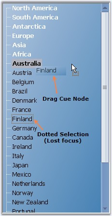
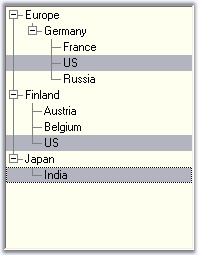

::: {style="DISPLAY: none"}
{#d2h_url_template}{#d2h_package_url style="WIDTH: 0px; DISPLAY: none; HEIGHT: 0px"}
:::

::::::: {.d2h_secondary_topic style="PADDING-BOTTOM: 10pt; MARGIN: 0pt; PADDING-LEFT: 0pt; PADDING-RIGHT: 0pt; PADDING-TOP: 0pt"}
##### Selection Settings While Drag Drop {#selection-settings-while-drag-drop style="MARGIN-LEFT: 18pt; tab-stops: 18.0pt"}

**[]{style="COLOR: #15428b"}** 

While performing a [[drag and drop]{.UGHyperlink}](../../../../../../../../Documents%20and%20Settings/sylviap/Desktop/Tools%20-%20Part%202.docx#_Drag_And_Drop) operation, when a node is selected and dragged, the node will be drawn with a dotted rectangle, when it loses focus. This feature is enabled by setting the KeepDottedSelection property of the TreeViewAdv to true.

 

The semi-transparent image which is drawn besides the cursor, during the drag and drop operation, can be displayed at a distance from the mouse cursor, by enabling the KeepDragCapturePoint property.

 

The semi-transparent image that is drawn, can be hidden or shown using the ShowDragNodeCue property. []{#p971}

[]{style="COLOR: #15428b"} 

::: {align="center"}
  ---------------------- ---------------------------------------------------------------------------------------------------------------------------------------------------------------
  treeViewAdv Property   Description
  KeepDottedSelection    Value which indicates if the selected node must draw a dotted rectangle when it loses focus.
  KeepDragCapturePoint   Gets or sets a value which indicates whether cue image should be drawn at a distance below the cursor during the drag drop operation. Default value is false.
  ShowDragNodeCue        Specifies whether a semitransparent image of the selected node is drawn besides the cursor during the drag and drop operation.
  ---------------------- ---------------------------------------------------------------------------------------------------------------------------------------------------------------
:::

[]{style="COLOR: #15428b"} 

{border="0"}

[]{style="COLOR: #15428b"} 

Figure 1133: Illustrates Selection features while Drag Drop

[]{style="COLOR: #15428b"} 

To cancel the selection or editing, use CancelMode and CancelEditMode methods.

[]{style="COLOR: #15428b"} 

::: {align="center"}
  --------------------------- -----------------------------------------------------------------------------------------------------
  treeViewAdv methods         Description
  CancelMode                  Cancels the selection or editing of a node.
  CancelEditMode              Cancels the edit mode of a particular node.
  LastMousePositionToClient   Gets the last mouse position to the client or returns the last point at which the mouse is clicked.
  --------------------------- -----------------------------------------------------------------------------------------------------
:::

[]{style="COLOR: #15428b"} 

Row Selection

**[]{style="COLOR: #15428b"}** 

The **FullRowSelect** property allows you to specify if the entire row of the selected item is highlighted and clicking anywhere on an item\'s row causes it to be selected.

**[]{style="COLOR: #15428b"}** 

::: {align="center"}
  ---------------------- -----------------------------------------------------------------------------------------------------
  treeViewAdv Property   Description
  FullRowSelect          Specifies whether the whole row of a treeview needs to be selected on selecting a node of that row.
  ---------------------- -----------------------------------------------------------------------------------------------------
:::

[]{style="COLOR: #15428b"} 

::: {align="center"}
+-----------------------------------+----------------------------------------------------------------------------------------------------+
| treeViewAdv Method                | Description                                                                                        |
+-----------------------------------+----------------------------------------------------------------------------------------------------+
| GetHeightOfRows                   | To get the height of the rows of a tree from the start point to the end point. The parameters are, |
|                                   |                                                                                                    |
|                                   |                                                                                                    |
|                                   |                                                                                                    |
|                                   | (i)start - Represents the start point.                                                             |
|                                   |                                                                                                    |
|                                   | (ii)end - Represents the end point.                                                                |
+-----------------------------------+----------------------------------------------------------------------------------------------------+
:::

[]{style="COLOR: #15428b"} 

+-----------------------------------------------------------------------------------------------------------------------------------+
| **[\[C#\]]{style="FONT-FAMILY: 'Courier New'; COLOR: black"}**                                                                    |
|                                                                                                                                   |
| []{style="FONT-FAMILY: 'Courier New'; COLOR: black"}                                                                              |
|                                                                                                                                   |
| [this]{style="FONT-FAMILY: 'Courier New'; COLOR: blue"}[.treeViewAdv1.GetHeightOfRows(1, 2);]{style="FONT-FAMILY: 'Courier New'"} |
+-----------------------------------------------------------------------------------------------------------------------------------+

[]{style="COLOR: #15428b"} 

+----------------------------------------------------------------------------------------------------------------------------------------------------------------------+
| **[\[VB.NET\]]{style="FONT-FAMILY: 'Courier New'; COLOR: black"}**                                                                                                   |
|                                                                                                                                                                      |
| []{style="FONT-FAMILY: 'Courier New'; COLOR: black"}                                                                                                                 |
|                                                                                                                                                                      |
| [Me]{style="FONT-FAMILY: 'Courier New'; COLOR: blue"}[.treeViewAdv1.GetHeightOfRows(1, 2)]{style="FONT-FAMILY: 'Courier New'"}[]{style="FONT-FAMILY: 'Courier New'"} |
+----------------------------------------------------------------------------------------------------------------------------------------------------------------------+

[]{style="COLOR: #15428b"} 

{border="0"}

[]{style="COLOR: #15428b"} 

Figure 1134: FullRow MultiLevel Selected Nodes

 

 

 

 

[]{#related-topics}
:::::::
