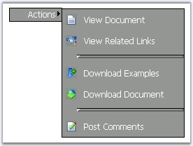

::: {style="DISPLAY: none"}
{#d2h_url_template}{#d2h_package_url style="WIDTH: 0px; DISPLAY: none; HEIGHT: 0px"}
:::

::::: {.d2h_secondary_topic style="PADDING-BOTTOM: 10pt; MARGIN: 0pt; PADDING-LEFT: 0pt; PADDING-RIGHT: 0pt; PADDING-TOP: 0pt"}
##### Separator Settings {#separator-settings style="tab-stops: 0pt"}

[]{style="FONT-FAMILY: 'Trebuchet MS','sans-serif'; COLOR: #15428b; FONT-SIZE: 9pt"} 

When separator lines have to be provided between the items, the **ItemClass** property can be used. When this is set to **Separator** value for an item with the **Text** value left empty, a line will be displayed.

[]{style="FONT-FAMILY: 'Trebuchet MS','sans-serif'; COLOR: #15428b; FONT-SIZE: 9pt"} 

::: {align="center"}
+-----------------------------------+----------------------------------------------------------------------------------------+
| Property                          | Description                                                                            |
+-----------------------------------+----------------------------------------------------------------------------------------+
| ItemClass                         | Gets/sets the item type. Default value is Common. The options included are as follows: |
|                                   |                                                                                        |
|                                   | [·      ]{style="FONT-FAMILY: Symbol"}\                                                |
|                                   | Common                                                                                 |
|                                   |                                                                                        |
|                                   | [·      ]{style="FONT-FAMILY: Symbol"}Separator                                        |
+-----------------------------------+----------------------------------------------------------------------------------------+
:::

[]{style="FONT-FAMILY: 'Trebuchet MS','sans-serif'; COLOR: #15428b; FONT-SIZE: 9pt"} 

{border="0"}

**[]{style="FONT-FAMILY: 'Trebuchet MS','sans-serif'; COLOR: #15428b; FONT-SIZE: 9pt"}** 

Figure 226: Menu with ItemClass property set

[]{style="FONT-FAMILY: 'Trebuchet MS','sans-serif'; COLOR: #15428b; FONT-SIZE: 9pt"} 

Customizing Separator

[]{style="FONT-FAMILY: 'Trebuchet MS','sans-serif'; COLOR: #15428b; FONT-SIZE: 9pt"} 

The default separator styles can be overridden by using the css style definitions for the separator by applying it through **SeparatorCSSClass** property.

[]{style="FONT-FAMILY: 'Trebuchet MS','sans-serif'; COLOR: #15428b; FONT-SIZE: 9pt"} 

::: {align="center"}
+-----------------------------------+-----------------------------------------------------------------------+
|                                   |                                                                       |
|                                   |                                                                       |
| Menu Property                     | Description                                                           |
+-----------------------------------+-----------------------------------------------------------------------+
|                                   |                                                                       |
|                                   |                                                                       |
| SeparatorCSSClass                 | Specifies the class name of the css definitions to use for separator. |
+-----------------------------------+-----------------------------------------------------------------------+
:::

[]{style="FONT-FAMILY: 'Trebuchet MS','sans-serif'; COLOR: #15428b; FONT-SIZE: 9pt"} 

{border="0"}

 

Figure 227: Menu with custom Separator settings

[]{style="FONT-FAMILY: 'Trebuchet MS','sans-serif'; COLOR: #15428b; FONT-SIZE: 9pt"} 

The separator can be customized by specifying the colors and types by overriding the default settings as shown below. Also the separator can be applied to the entire row else can be set such that it does not apply to the left image segment as shown in the above image. Here the default css style names are used with custom style definitions overriding the default values.

[]{style="FONT-FAMILY: 'Trebuchet MS','sans-serif'; COLOR: #15428b; FONT-SIZE: 9pt"} 

+-------------------------------------------------------------------------------------------------------------------------------------------------------------------------------------+
| [.menuSep]{style="FONT-FAMILY: 'Courier New'; COLOR: maroon; FONT-SIZE: 9pt"}[ [.menuSepImg]{style="COLOR: maroon"}]{style="FONT-FAMILY: 'Courier New'; FONT-SIZE: 9pt"}            |
|                                                                                                                                                                                     |
| [{]{style="FONT-FAMILY: 'Courier New'; FONT-SIZE: 9pt"}                                                                                                                             |
|                                                                                                                                                                                     |
| [       [line-height]{style="COLOR: red"}: [0px]{style="COLOR: blue"};]{style="FONT-FAMILY: 'Courier New'; FONT-SIZE: 9pt"}                                                         |
|                                                                                                                                                                                     |
| [       [font-size]{style="COLOR: red"}:[0px]{style="COLOR: blue"};       ]{style="FONT-FAMILY: 'Courier New'; FONT-SIZE: 9pt"}                                                     |
|                                                                                                                                                                                     |
| [       [border-top]{style="COLOR: red"}:[1px]{style="COLOR: blue"} [solid]{style="COLOR: blue"} [black]{style="COLOR: blue"};]{style="FONT-FAMILY: 'Courier New'; FONT-SIZE: 9pt"} |
|                                                                                                                                                                                     |
| [       [border-style]{style="COLOR: red"}:[outset]{style="COLOR: blue"};]{style="FONT-FAMILY: 'Courier New'; FONT-SIZE: 9pt"}                                                      |
|                                                                                                                                                                                     |
| [}]{style="FONT-FAMILY: 'Courier New'; FONT-SIZE: 9pt"}                                                                                                                             |
|                                                                                                                                                                                     |
| []{style="FONT-FAMILY: 'Courier New'; FONT-SIZE: 9pt"}                                                                                                                              |
|                                                                                                                                                                                     |
| [.menuImg]{style="FONT-FAMILY: 'Courier New'; COLOR: maroon; FONT-SIZE: 9pt"}                                                                                                       |
|                                                                                                                                                                                     |
| [{]{style="FONT-FAMILY: 'Courier New'; FONT-SIZE: 9pt"}                                                                                                                             |
|                                                                                                                                                                                     |
| [       [height]{style="COLOR: red"}:[16px]{style="COLOR: blue"};]{style="FONT-FAMILY: 'Courier New'; FONT-SIZE: 9pt"}                                                              |
|                                                                                                                                                                                     |
| [       [width]{style="COLOR: red"}:[16px]{style="COLOR: blue"};]{style="FONT-FAMILY: 'Courier New'; FONT-SIZE: 9pt"}                                                               |
|                                                                                                                                                                                     |
| [}]{style="FONT-FAMILY: 'Courier New'; FONT-SIZE: 9pt"}                                                                                                                             |
+-------------------------------------------------------------------------------------------------------------------------------------------------------------------------------------+

 

 

[]{#related-topics}
:::::
