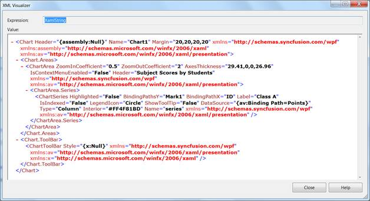

::: {style="DISPLAY: none"}
{#d2h_url_template}{#d2h_package_url style="WIDTH: 0px; DISPLAY: none; HEIGHT: 0px"}
:::

:::: {.d2h_secondary_topic style="PADDING-BOTTOM: 10pt; MARGIN: 0pt; PADDING-LEFT: 0pt; PADDING-RIGHT: 0pt; PADDING-TOP: 0pt"}
##### Serialization {#serialization style="tab-stops: 0pt"}

Serialization is the process of converting the state of an object into a form that can be persisted or transported. The complement of serialization is deserialization, which converts a stream into an object. Together, these processes allow data to be easily stored and transferred[.]{style="COLOR: black"}

 

Serialization in Essential Chart WPF

Essential Chart WPF has built-in support to serialize itself into stream of XAML string. Essential Chart works on the basis of XamlWriter.Save. The API Chart.Serialize will serialize the Chart control into XAML string. API Chart.Deserialize will do [complement for ]{style="FONT-FAMILY: 'Segoe UI','sans-serif'; COLOR: black"}Chart.Serialize, it converts the XAML string passed as parameter to this method into Chart object.

 

Following are some useful behaviors of Essential Chart Serialization feature.

[·      ]{style="FONT-FAMILY: Symbol"}Essential Chart WPF serialization is able to save Bindings to the Chart control that is being serialized.

[·      ]{style="FONT-FAMILY: Symbol"}Essential Chart WPF serialization can serialize Templates and Styles. For instance, ChartAxis.LabelTemplate can be serialized. Hence you can save and restore the template that is defined for ChartAxis Labels.

[·      ]{style="FONT-FAMILY: Symbol"}Essential Chart WPF can serialize almost all types of data bound to it except XML data.

[·      ]{style="FONT-FAMILY: Symbol"}The Chart control will access the data set to the ChartSeries and saves them. If Binding is set on the ChartSeries.DataSource, then the serialized string will contain Binding code in the XAML string. If ChartSeries.DataSource is initialized in XAML or C#, then the serialized string will contain the run time value of the collection.

[·      ]{style="FONT-FAMILY: Symbol"}Essential Chart Serialization feature enables to save and restore almost all interactive features available in Chart WPF. Interactive features namely, the current value of Zooming position, the interactive cursor position and so on can be saved and restored.

 

Use Case Scenarios

[]{#_Serialize_Chart_control}[]{#_Deserialize_Chart_control}[·      ]{style="FONT-FAMILY: Symbol"}Serialization feature can be used to clone Chart object.

[·      ]{style="FONT-FAMILY: Symbol"}Chart can be saved into a XML / text file and restored.

[·      ]{style="FONT-FAMILY: Symbol"}Chart can be stored into database and retrieved from application.

[·      ]{style="FONT-FAMILY: Symbol"}Chart can be shipped across network. Chart can be serialized to XML and transfer it across network through web requests and responses.

[·      ]{style="FONT-FAMILY: Symbol"}Apply Styles to the Chart and try to serialize the Chart, and reload the chart from saved XAML.

[·      ]{style="FONT-FAMILY: Symbol"}Save and load Chart with templates applied using StaticResources and Key References.

[·      ]{style="FONT-FAMILY: Symbol"}Save and Load the DataBound Chart Series.

[]{style="FONT-FAMILY: 'Calibri','sans-serif'; COLOR: black"} 

Methods

Table 166: MethodsTable

::: {align="center"}
+-------------+------------------------------------------------------------------------------------------------------------------------------------------------------------------------------+-----------------------------------------------------------------------------------------------------------------------------------------------------------------------------+-----------------------------------------------------------------------------------------------------------------------------------------------------------------------+------------------------------------------------------------------------------------------------------------------------------------------------------------------------------+-----------------------------------------------------------------------------------------------------------------------------------------------------------------------------------------------------+
| **Method**  | **[Description ]{style="FONT-FAMILY: 'Calibri','sans-serif'; COLOR: black; FONT-SIZE: 11pt"}[]{style="FONT-FAMILY: 'Calibri','sans-serif'; COLOR: black; FONT-SIZE: 11pt"}** | **[Parameters ]{style="FONT-FAMILY: 'Calibri','sans-serif'; COLOR: black; FONT-SIZE: 11pt"}[]{style="FONT-FAMILY: 'Calibri','sans-serif'; COLOR: black; FONT-SIZE: 11pt"}** | **[Type ]{style="FONT-FAMILY: 'Calibri','sans-serif'; COLOR: black; FONT-SIZE: 11pt"}[]{style="FONT-FAMILY: 'Calibri','sans-serif'; COLOR: black; FONT-SIZE: 11pt"}** | **[Return Type ]{style="FONT-FAMILY: 'Calibri','sans-serif'; COLOR: black; FONT-SIZE: 11pt"}[]{style="FONT-FAMILY: 'Calibri','sans-serif'; COLOR: black; FONT-SIZE: 11pt"}** | **[Reference links ]{style="FONT-FAMILY: 'Calibri','sans-serif'; COLOR: black; FONT-SIZE: 11pt"}[]{style="FONT-FAMILY: 'Calibri','sans-serif'; COLOR: black; FONT-SIZE: 11pt"}**                    |
+-------------+------------------------------------------------------------------------------------------------------------------------------------------------------------------------------+-----------------------------------------------------------------------------------------------------------------------------------------------------------------------------+-----------------------------------------------------------------------------------------------------------------------------------------------------------------------+------------------------------------------------------------------------------------------------------------------------------------------------------------------------------+-----------------------------------------------------------------------------------------------------------------------------------------------------------------------------------------------------+
| Serialize   | Serializes the Chart control into XAML string.                                                                                                                               |                                                                                                                                                                             | N/A                                                                                                                                                                   | string                                                                                                                                                                       | [[Serialize]{style="COLOR: blue"}](http://sharepoint.syncfusion.com/workspace/Lists/FR%20Related%20Documentation%20Work/Attachments/4137/UG_WPF_Chart_5735_Final.docx#_Serialize_Chart_control)     |
|             |                                                                                                                                                                              |                                                                                                                                                                             |                                                                                                                                                                       |                                                                                                                                                                              |                                                                                                                                                                                                     |
|             |                                                                                                                                                                              | Public void Serialize()                                                                                                                                                     |                                                                                                                                                                       |                                                                                                                                                                              |                                                                                                                                                                                                     |
+-------------+------------------------------------------------------------------------------------------------------------------------------------------------------------------------------+-----------------------------------------------------------------------------------------------------------------------------------------------------------------------------+-----------------------------------------------------------------------------------------------------------------------------------------------------------------------+------------------------------------------------------------------------------------------------------------------------------------------------------------------------------+-----------------------------------------------------------------------------------------------------------------------------------------------------------------------------------------------------+
| Deserialize | Deserializes the string that is being passed as parameter into Chart object. Returns null if the string parameter does not represent Chart object.                           |                                                                                                                                                                             | N/A                                                                                                                                                                   | object                                                                                                                                                                       | [[Deserialize]{style="COLOR: blue"}](http://sharepoint.syncfusion.com/workspace/Lists/FR%20Related%20Documentation%20Work/Attachments/4137/UG_WPF_Chart_5735_Final.docx#_Deserialize_Chart_control) |
|             |                                                                                                                                                                              |                                                                                                                                                                             |                                                                                                                                                                       |                                                                                                                                                                              |                                                                                                                                                                                                     |
|             |                                                                                                                                                                              | Public object Deserialize(string)                                                                                                                                           |                                                                                                                                                                       |                                                                                                                                                                              |                                                                                                                                                                                                     |
+=============+==============================================================================================================================================================================+=============================================================================================================================================================================+=======================================================================================================================================================================+==============================================================================================================================================================================+=====================================================================================================================================================================================================+
:::

[]{style="FONT-FAMILY: 'Calibri','sans-serif'; COLOR: black"} 

Sample Link

To run the UI WPF sample:

1.  Open Essential Studio Dashboard by selecting Start -\> Program -\> Syncfusion-\> Essential Studio \<\<Version Number\>\> -\> Dashboard.

2.  Select Run locally installed samples, from the WPF drop-down list on the User Interface pane.

3.  Select Chart in the sample browser.

4.  Select User Interaction -\> Serialization Demo on the Essential Chart pane and click the Run Sample button.

 

To open the sample project:

Go to the following sample location in your system: 

***"\<sample installation location\>\\Syncfusion\\EssentialStudio\\Version Number \\WPF\\Chart.WPF\\Samples\\3.5\\WindowsSamples\\User Interaction\\Serialization Demo"***

 

This location contains two sub folders CS and VB.  You can open the sample projects from the respective folders based on your application developing language.[]{style="FONT-FAMILY: 'Verdana','sans-serif'"}

 

 

###### 4.1.1.10.10.1      Adding Serialization to an Application {#adding-serialization-to-an-application style="tab-stops: 0pt"}

Serialize Chart control

The following code snippet explains the serialization of the Chart control.

 

+--------------------------------------------------------------------------------------------------------------------+
| **[\[C#\]]{style="FONT-FAMILY: 'Courier New'"}**                                                                   |
|                                                                                                                    |
| [       [string]{style="COLOR: blue"} Serializedstring =  Chart1.Serialize();]{style="FONT-FAMILY: 'Courier New'"} |
|                                                                                                                    |
|                                                                                                                    |
+--------------------------------------------------------------------------------------------------------------------+

 

The Chart1 in above code snippet represents the Chart object, and Serializedstring in above code snippet will have the serialized string (XAML string) while execution.

 

{border="0"}

*[Figure 1 Serialized XAML string representing Essential Chart WPF]{style="FONT-SIZE: 9pt"}*

 

Deserialize Chart control

The following code snippet explains the deserialization of the Chart control.

[]{style="FONT-FAMILY: 'Segoe UI','sans-serif'"} 

+--------------------------------------------------------------------------------------------------------------------------------------------------------------------------------------------+
| **[\[C#\]]{style="FONT-FAMILY: 'Courier New'"}**                                                                                                                                           |
|                                                                                                                                                                                            |
| [Chart]{style="FONT-FAMILY: 'Courier New'; COLOR: #2b91af"}[ DeserializedChartControl = [new]{style="COLOR: blue"} [Chart]{style="COLOR: #2b91af"}();]{style="FONT-FAMILY: 'Courier New'"} |
|                                                                                                                                                                                            |
| [DeserializedChartControl = DeserializedChartControl.Deserialize(Serializedstring) [as]{style="COLOR: blue"} [Chart]{style="COLOR: #2b91af"};]{style="FONT-FAMILY: 'Courier New'"}         |
|                                                                                                                                                                                            |
|                                                                                                                                                                                            |
+--------------------------------------------------------------------------------------------------------------------------------------------------------------------------------------------+

[]{style="FONT-FAMILY: 'Segoe UI','sans-serif'"} 

The Chart1 in above code snippet represents the Chart object, and Serialized string in the above code snippet needs to be XAML representation of a Chart object. If the string passed as a parameter to this method does not represent the Chart object, then the method will return Null value.

[]{#related-topics}
::::
