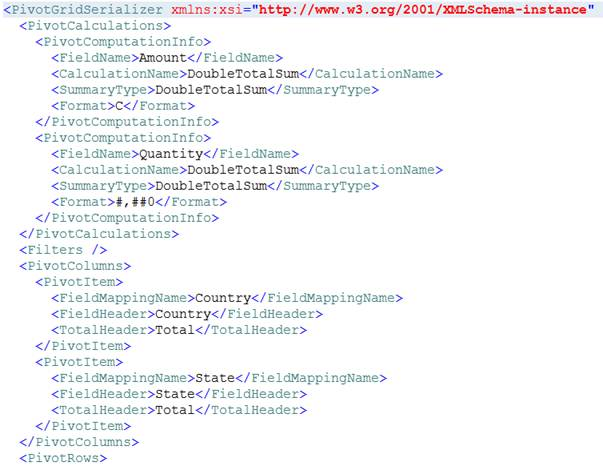

::: {style="DISPLAY: none"}
{#d2h_url_template}{#d2h_package_url style="WIDTH: 0px; DISPLAY: none; HEIGHT: 0px"}
:::

::::: {#nsbanner .d2h_main_nsbanner style="BORDER-BOTTOM: #999999 1px solid; POSITION: relative; PADDING-BOTTOM: 0px; BACKGROUND-COLOR: transparent; PADDING-LEFT: 0px; PADDING-RIGHT: 0px; DISPLAY: none; BORDER-TOP: #999999 1px solid; PADDING-TOP: 0px; LEFT: 0px"}
:::: {#TitleRow .d2h_main_titlerow style="PADDING-BOTTOM: 4px; BACKGROUND-COLOR: transparent; PADDING-LEFT: 22px; WIDTH: 100%; PADDING-RIGHT: 10px; DISPLAY: none; PADDING-TOP: 4px"}
::: {#ienav .d2h_main_ienav style="DISPLAY: none"}
{#D2HPrevious .D2HPreviousEnabled}  {#D2HNext .D2HNextEnabled}
:::
::::
:::::

::::: {#nstext .d2h_main_nstext style="PADDING-BOTTOM: 10px; BACKGROUND-COLOR: transparent; PADDING-LEFT: 22px; PADDING-RIGHT: 10px; HEIGHT: 100%; OVERFLOW: auto; PADDING-TOP: 5px" hasuserbackground="true" valign="bottom"}
::: {#d2h_breadcrumbs .d2h_breadcrumbs}
[Essential Studio User Guide Documentation](ms-xhelp:///?Id=12457748-09e3-4d74-a240-8e049cedf030){.d2h_breadcrumbsNormal}[ \> ]{.d2h_breadcrumbsLinkSeparator}[Business Intelligence Edition](ms-xhelp:///?Id=fdf33dd8-62b2-47b9-ad7b-fc50e590bca5){.d2h_breadcrumbsNormal}[ \> ]{.d2h_breadcrumbsLinkSeparator}[Essential BI Silverlight](ms-xhelp:///?Id=c006b39c-6aa2-4637-b7de-3e7b6cb3f9f9){.d2h_breadcrumbsNormal}[ \> ]{.d2h_breadcrumbsLinkSeparator}[Essential Pivot Grid]{.d2h_breadcrumbsContentsOnly}[ \> ]{.d2h_breadcrumbsLinkSeparator}[Features](ms-xhelp:///?Id=9d7968f1-d52c-4e79-a6ae-fb01305e9f98){.d2h_breadcrumbsNormal}
:::

## Serialization/Deserialization {#serializationdeserialization style="tab-stops: 0pt"}

 

Using this feature, you can save the current state of **PivotGrid** as an XML file format and restore the same at any time.

The following properties of **PivotGrid** control can be serialized.

 

::: {align="center"}
  ---------------------------- ----------------------------------------------
  Property Name                Type
  AllowResizeColumns           bool
  AllowResizeRows              bool
  AllowSelection               bool
  AutoSizeColumnCount          int
  AutoSizeOption               GridAutoSizeOption
  DeferLayoutUpdate            bool
  Filters                      ObservableCollection\<FilterExpression\>
  FreezeHeaders                bool
  IsDynamicData                bool
  PivotCalculations            ObservableCollection\<PivotComputationInfo\>
  PivotColumns                 ObservableCollection\<PivotItem\>
  PivotFields                  ObservableCollection\<PivotItem\>
  PivotRows                    ObservableCollection\<PivotItem\>
  ShowCalculationsAsColumns    bool
  ShowGrandTotals              bool
  ShowGroupingBar              bool
  GroupingBar.AllowFiltering   bool
  GroupingBar.AllowSorting     bool
  ---------------------------- ----------------------------------------------
:::

 

On Serialization, the expand and the collapse state of PivotGrid cells are maintained. So while de-serializing, the item source specified for the Grid should be as same as that when used in Serialization. This can be ignored by setting **IgnoreExpandCollapseOnSerialization** property of PivotGrid control to False.

 

Use Case Scenarios

Serialization can be implemented for applications which need to save its data and structure after the application is closed. Serialization supports to save the structure and data of **PivotGridControl** to an XML file and it can be loaded at any time.

 

Adding Serialization/Deserialization

 

Serialization/Deserialization can be achieved using the following code snippet,

 

+--------------------------------------------------------------------------------------------------------------------------------------------------+
| [\[C#\]]{style="FONT-FAMILY: 'Courier New'"}                                                                                                     |
|                                                                                                                                                  |
| []{style="FONT-FAMILY: 'Courier New'"}                                                                                                           |
|                                                                                                                                                  |
| [///]{style="FONT-FAMILY: 'Courier New'; COLOR: gray"}[ Serialize the PivotGrid into XML file format.]{style="FONT-FAMILY: 'Courier New'"}       |
|                                                                                                                                                  |
| [this]{style="FONT-FAMILY: 'Courier New'; COLOR: blue"}[.pivotGrid1.Serialize();]{style="FONT-FAMILY: 'Courier New'"}                            |
|                                                                                                                                                  |
| []{style="FONT-FAMILY: 'Courier New'"}                                                                                                           |
|                                                                                                                                                  |
| [///]{style="FONT-FAMILY: 'Courier New'; COLOR: gray"}[ De serialize the PivotGrid from the saved XML file.]{style="FONT-FAMILY: 'Courier New'"} |
|                                                                                                                                                  |
| [this]{style="FONT-FAMILY: 'Courier New'; COLOR: blue"}[.pivotGrid1.Deserialize();]{style="FONT-FAMILY: 'Courier New'"}                          |
|                                                                                                                                                  |
| []{style="FONT-FAMILY: 'Courier New'; FONT-SIZE: 9pt"}                                                                                           |
+--------------------------------------------------------------------------------------------------------------------------------------------------+

 

+----------------------------------------------------------------------------------------------------------------------+
| **[\[VB\]]{style="FONT-FAMILY: 'Courier New'"}**                                                                     |
|                                                                                                                      |
| [\' Serialize the PivotGrid into XML file format.]{style="FONT-FAMILY: 'Courier New'"}                               |
|                                                                                                                      |
| [Me]{style="FONT-FAMILY: 'Courier New'; COLOR: blue"}[.pivotGrid1.Serialize()]{style="FONT-FAMILY: 'Courier New'"}   |
|                                                                                                                      |
| []{style="FONT-FAMILY: 'Courier New'"}                                                                               |
|                                                                                                                      |
| [\' De serialize the PivotGrid from the saved XML file.]{style="FONT-FAMILY: 'Courier New'"}                         |
|                                                                                                                      |
| [Me]{style="FONT-FAMILY: 'Courier New'; COLOR: blue"}[.pivotGrid1.Deserialize()]{style="FONT-FAMILY: 'Courier New'"} |
|                                                                                                                      |
| **[]{style="FONT-FAMILY: 'Courier New'"}**                                                                           |
+----------------------------------------------------------------------------------------------------------------------+

 

Methods

  --------------- ------------------------------------------------------------------------------- ------------ ------ -------------
  Method          Description                                                                     Parameters   Type   Return Type
  Serialize()     Serializes the PivotGrid into XML file format using the save file dialog        \-           void   void
  Deserialize()   Deserializes the PivotGrid from the saved XML file using the open file dialog   \-           void   void
  --------------- ------------------------------------------------------------------------------- ------------ ------ -------------

 

{border="0"}

Figure 19: Serialized XML file

 

Sample Link

To access Serialization Demo sample:

1.   Open the Syncfusion Dashboard.

2.   Click Business Intelligence.

3.   Click the **Silverlight** drop-down list, and select **Explore Samples**.

4.   Navigate to Syncfusion.PivotAnalysis.Silverlight.Samples -\> Syncfusion.PivotAnalysis.Silverlight.Samples -\> Samples -\> SerializationDemo.

 

[]{#related-topics}
:::::
