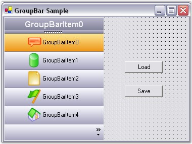
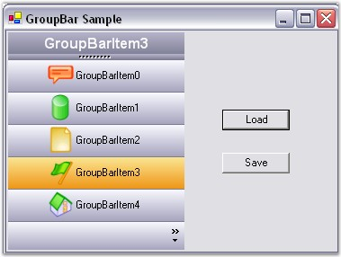

::: {style="DISPLAY: none"}
{#d2h_url_template}{#d2h_package_url style="WIDTH: 0px; DISPLAY: none; HEIGHT: 0px"}
:::

::: {.d2h_secondary_topic style="PADDING-BOTTOM: 10pt; MARGIN: 0pt; PADDING-LEFT: 0pt; PADDING-RIGHT: 0pt; PADDING-TOP: 0pt"}
##### Serialization of Layout State {#serialization-of-layout-state style="MARGIN-LEFT: 18pt; tab-stops: 18.0pt"}

[]{style="COLOR: #15428b"} 

The Layout state of GroupBar can be saved and loaded using the **AppStateSerializer** class.

 

The following step-by-step procedure helps you to achieve the same.

[]{style="COLOR: #15428b"} 

1.   Include the required namespaces.

[]{style="COLOR: #15428b"} 

+------------------------------------------------------------------------------------------------------------------------------------------------+
| **[\[C#\]]{style="FONT-FAMILY: 'Courier New'; COLOR: black"}**                                                                                 |
|                                                                                                                                                |
| []{style="FONT-FAMILY: 'Courier New'; COLOR: black"}                                                                                           |
|                                                                                                                                                |
| [using]{style="FONT-FAMILY: 'Courier New'; COLOR: blue"}[ Syncfusion.Windows.Forms;]{style="FONT-FAMILY: 'Courier New'; COLOR: black"}         |
|                                                                                                                                                |
| [using]{style="FONT-FAMILY: 'Courier New'; COLOR: blue"}[ Syncfusion.Windows.Forms.Tools;]{style="FONT-FAMILY: 'Courier New'; COLOR: black"}   |
|                                                                                                                                                |
| [using]{style="FONT-FAMILY: 'Courier New'; COLOR: blue"}[ Syncfusion.Runtime.Serialization;]{style="FONT-FAMILY: 'Courier New'; COLOR: black"} |
+------------------------------------------------------------------------------------------------------------------------------------------------+

[]{style="COLOR: #15428b"} 

+-------------------------------------------------------------------------------------------------------------------------------------------------+
| **[\[VB.NET\]]{style="FONT-FAMILY: 'Courier New'; COLOR: black"}**                                                                              |
|                                                                                                                                                 |
| []{style="FONT-FAMILY: 'Courier New'; COLOR: black"}                                                                                            |
|                                                                                                                                                 |
| [Imports]{style="FONT-FAMILY: 'Courier New'; COLOR: blue"}[ Syncfusion.Windows.Forms]{style="FONT-FAMILY: 'Courier New'; COLOR: black"}         |
|                                                                                                                                                 |
| [Imports]{style="FONT-FAMILY: 'Courier New'; COLOR: blue"}[ Syncfusion.Windows.Forms.Tools]{style="FONT-FAMILY: 'Courier New'; COLOR: black"}   |
|                                                                                                                                                 |
| [Imports]{style="FONT-FAMILY: 'Courier New'; COLOR: blue"}[ Syncfusion.Runtime.Serialization]{style="FONT-FAMILY: 'Courier New'; COLOR: black"} |
+-------------------------------------------------------------------------------------------------------------------------------------------------+

[]{style="COLOR: #15428b"} 

2.   Drag and drop a GroupBar control from the toolbox onto the form, add GroupBar Items using the **GroupBar Item Collection** **Editor** and add two buttons to the form for \'Load\' and \'Save\' as shown below.

[]{style="FONT-SIZE: 8pt"} 

[{border="0"}]{style="FONT-SIZE: 8pt"}[]{style="FONT-SIZE: 8pt"}

[]{style="COLOR: #15428b"} 

Figure 889: Form with GroupBar Control, Load and Save Buttons

[]{style="FONT-SIZE: 8pt"} 

3.   Store the layout information of the selected GroupBar Item in an XML file using the AppStateSerializer class. In the Form_Closing and Save_Button click, call the following method,

[]{style="FONT-SIZE: 8pt"} 

+----------------------------------------------------------------------------------------------------------------------------------------------------------------------------------------------------------------------------------------------------------------+
| **[\[C#\]]{style="FONT-FAMILY: 'Courier New'; COLOR: black"}**                                                                                                                                                                                                 |
|                                                                                                                                                                                                                                                                |
| []{style="FONT-FAMILY: 'Courier New'; COLOR: black"}                                                                                                                                                                                                           |
|                                                                                                                                                                                                                                                                |
| [private void]{style="FONT-FAMILY: 'Courier New'; COLOR: blue"}[ SaveState ()]{style="FONT-FAMILY: 'Courier New'; COLOR: black"}                                                                                                                               |
|                                                                                                                                                                                                                                                                |
| [{]{style="FONT-FAMILY: 'Courier New'; COLOR: black"}                                                                                                                                                                                                          |
|                                                                                                                                                                                                                                                                |
| [// Create a temporary storage.]{style="FONT-FAMILY: 'Courier New'; COLOR: green"}                                                                                                                                                                             |
|                                                                                                                                                                                                                                                                |
| [ArrayList temp = ]{style="FONT-FAMILY: 'Courier New'; COLOR: black"}[new]{style="FONT-FAMILY: 'Courier New'; COLOR: blue"}[ ArrayList();]{style="FONT-FAMILY: 'Courier New'; COLOR: black"}                                                                   |
|                                                                                                                                                                                                                                                                |
| [foreach (GroupBarItem gbi ]{style="FONT-FAMILY: 'Courier New'; COLOR: black"}[in this]{style="FONT-FAMILY: 'Courier New'; COLOR: blue"}[.groupBar1.GroupBarItems)]{style="FONT-FAMILY: 'Courier New'; COLOR: black"}                                          |
|                                                                                                                                                                                                                                                                |
| [{]{style="FONT-FAMILY: 'Courier New'; COLOR: black"}                                                                                                                                                                                                          |
|                                                                                                                                                                                                                                                                |
| [// Store the index of each GroupBar Item in the Navigation Pane.]{style="FONT-FAMILY: 'Courier New'; COLOR: green"}                                                                                                                                           |
|                                                                                                                                                                                                                                                                |
| [if ]{style="FONT-FAMILY: 'Courier New'; COLOR: blue"}[(gbi.InNavigationPane == ]{style="FONT-FAMILY: 'Courier New'; COLOR: black"}[true]{style="FONT-FAMILY: 'Courier New'; COLOR: blue"}[)]{style="FONT-FAMILY: 'Courier New'; COLOR: black"}                |
|                                                                                                                                                                                                                                                                |
| [temp.Add(]{style="FONT-FAMILY: 'Courier New'; COLOR: black"}[this]{style="FONT-FAMILY: 'Courier New'; COLOR: blue"}[.groupBar1.GroupBarItems.IndexOf(gbi));]{style="FONT-FAMILY: 'Courier New'; COLOR: black"}                                                |
|                                                                                                                                                                                                                                                                |
| [}]{style="FONT-FAMILY: 'Courier New'; COLOR: black"}                                                                                                                                                                                                          |
|                                                                                                                                                                                                                                                                |
| [// Store the index of the selected GroupBar Item.]{style="FONT-FAMILY: 'Courier New'; COLOR: green"}                                                                                                                                                          |
|                                                                                                                                                                                                                                                                |
| [temp.Add(]{style="FONT-FAMILY: 'Courier New'; COLOR: black"}[this]{style="FONT-FAMILY: 'Courier New'; COLOR: blue"}[.groupBar1.SelectedItem);]{style="FONT-FAMILY: 'Courier New'; COLOR: black"}                                                              |
|                                                                                                                                                                                                                                                                |
| [// Persist this information to an XML file using the AppStateSerializer class.]{style="FONT-FAMILY: 'Courier New'; COLOR: green"}                                                                                                                             |
|                                                                                                                                                                                                                                                                |
| [AppStateSerializer aser = ]{style="FONT-FAMILY: 'Courier New'; COLOR: black"}[new]{style="FONT-FAMILY: 'Courier New'; COLOR: blue"}[ AppStateSerializer(SerializeMode.XMLFile, \"..\\\\..\\\\StateInfo\");]{style="FONT-FAMILY: 'Courier New'; COLOR: black"} |
|                                                                                                                                                                                                                                                                |
| [aser.SerializeObject(\"StackedModeState\", temp);]{style="FONT-FAMILY: 'Courier New'; COLOR: black"}                                                                                                                                                          |
|                                                                                                                                                                                                                                                                |
| [aser.PersistNow();]{style="FONT-FAMILY: 'Courier New'; COLOR: black"}                                                                                                                                                                                         |
|                                                                                                                                                                                                                                                                |
| [}]{style="FONT-FAMILY: 'Courier New'; COLOR: black"}                                                                                                                                                                                                          |
+----------------------------------------------------------------------------------------------------------------------------------------------------------------------------------------------------------------------------------------------------------------+

[]{style="COLOR: #15428b"} 

+-----------------------------------------------------------------------------------------------------------------------------------------------------------------------------------------------------------------------------------------------------------------------+
| **[\[VB.NET\]]{style="FONT-FAMILY: 'Courier New'; COLOR: black"}**                                                                                                                                                                                                    |
|                                                                                                                                                                                                                                                                       |
| []{style="FONT-FAMILY: 'Courier New'; COLOR: black"}                                                                                                                                                                                                                  |
|                                                                                                                                                                                                                                                                       |
| [Private]{style="FONT-FAMILY: 'Courier New'; COLOR: blue"}[ [Sub]{style="COLOR: blue"} SaveState()]{style="FONT-FAMILY: 'Courier New'"}                                                                                                                               |
|                                                                                                                                                                                                                                                                       |
| [\' Create a temporary storage.]{style="FONT-FAMILY: 'Courier New'; COLOR: green"}                                                                                                                                                                                    |
|                                                                                                                                                                                                                                                                       |
| [Dim]{style="FONT-FAMILY: 'Courier New'; COLOR: blue"}[ temp [As]{style="COLOR: blue"} ArrayList = [New]{style="COLOR: blue"} ArrayList()]{style="FONT-FAMILY: 'Courier New'"}                                                                                        |
|                                                                                                                                                                                                                                                                       |
| [For]{style="FONT-FAMILY: 'Courier New'; COLOR: blue"}[ [Each]{style="COLOR: blue"} gbi [As]{style="COLOR: blue"} GroupBarItem [In]{style="COLOR: blue"} [Me]{style="COLOR: blue"}.groupBar1.GroupBarItems]{style="FONT-FAMILY: 'Courier New'"}                       |
|                                                                                                                                                                                                                                                                       |
| [\' Store the index of each GroupBar Item in the Navigation Pane.]{style="FONT-FAMILY: 'Courier New'; COLOR: green"}                                                                                                                                                  |
|                                                                                                                                                                                                                                                                       |
| [If]{style="FONT-FAMILY: 'Courier New'; COLOR: blue"}[ gbi.InNavigationPane = [True]{style="COLOR: blue"} [Then]{style="COLOR: blue"}]{style="FONT-FAMILY: 'Courier New'"}                                                                                            |
|                                                                                                                                                                                                                                                                       |
| [temp.Add([Me]{style="COLOR: blue"}.groupBar1.GroupBarItems.IndexOf(gbi))]{style="FONT-FAMILY: 'Courier New'"}                                                                                                                                                        |
|                                                                                                                                                                                                                                                                       |
| [End]{style="FONT-FAMILY: 'Courier New'; COLOR: blue"}[ [If]{style="COLOR: blue"}]{style="FONT-FAMILY: 'Courier New'"}                                                                                                                                                |
|                                                                                                                                                                                                                                                                       |
| [Next]{style="FONT-FAMILY: 'Courier New'; COLOR: blue"}[ gbi]{style="FONT-FAMILY: 'Courier New'"}                                                                                                                                                                     |
|                                                                                                                                                                                                                                                                       |
| [\' Store the index of the selected GroupBar Item.]{style="FONT-FAMILY: 'Courier New'; COLOR: green"}                                                                                                                                                                 |
|                                                                                                                                                                                                                                                                       |
| [temp.Add([Me]{style="COLOR: blue"}.groupBar1.SelectedItem)]{style="FONT-FAMILY: 'Courier New'"}                                                                                                                                                                      |
|                                                                                                                                                                                                                                                                       |
| [\' Persist this information to an XML file using the AppStateSerializer class.]{style="FONT-FAMILY: 'Courier New'; COLOR: green"}                                                                                                                                    |
|                                                                                                                                                                                                                                                                       |
| [Dim]{style="FONT-FAMILY: 'Courier New'; COLOR: blue"}[ aser [As]{style="COLOR: blue"} AppStateSerializer = [New]{style="COLOR: blue"} AppStateSerializer(SerializeMode.XMLFile, [\"..\\..\\StateInfo\"]{style="COLOR: maroon"})]{style="FONT-FAMILY: 'Courier New'"} |
|                                                                                                                                                                                                                                                                       |
| [aser.SerializeObject([\"StackedModeState\"]{style="COLOR: maroon"}, temp)]{style="FONT-FAMILY: 'Courier New'"}                                                                                                                                                       |
|                                                                                                                                                                                                                                                                       |
| [aser.PersistNow()]{style="FONT-FAMILY: 'Courier New'"}                                                                                                                                                                                                               |
|                                                                                                                                                                                                                                                                       |
| [End]{style="FONT-FAMILY: 'Courier New'; COLOR: blue"}[ [Sub]{style="COLOR: blue"}]{style="FONT-FAMILY: 'Courier New'"}                                                                                                                                               |
+-----------------------------------------------------------------------------------------------------------------------------------------------------------------------------------------------------------------------------------------------------------------------+

[]{style="COLOR: #15428b"} 

4.   Retrieve the persisted layout information from the XML file using the AppStateSerializer class. In the Form_Load event and Load_Button click, call the following method,

[]{style="COLOR: #15428b"} 

+---------------------------------------------------------------------------------------------------------------------------------------------------------------------------------------------------+
| **[\[C#\]]{style="FONT-FAMILY: 'Courier New'; COLOR: black"}**                                                                                                                                    |
|                                                                                                                                                                                                   |
| []{style="FONT-FAMILY: 'Courier New'; COLOR: black"}                                                                                                                                              |
|                                                                                                                                                                                                   |
| [private]{style="FONT-FAMILY: 'Courier New'; COLOR: blue"}[ [void]{style="COLOR: blue"} LoadState ()]{style="FONT-FAMILY: 'Courier New'"}                                                         |
|                                                                                                                                                                                                   |
| [{]{style="FONT-FAMILY: 'Courier New'"}                                                                                                                                                           |
|                                                                                                                                                                                                   |
| [// De-Persist this information from the XML file using the AppStateSerializer class.]{style="FONT-FAMILY: 'Courier New'; COLOR: green"}                                                          |
|                                                                                                                                                                                                   |
| [AppStateSerializer aser = [new]{style="COLOR: blue"} AppStateSerializer(SerializeMode.XMLFile, \"..\\\\..\\\\StateInfo\");]{style="FONT-FAMILY: 'Courier New'"}                                  |
|                                                                                                                                                                                                   |
| [ArrayList temp = aser.DeserializeObject(\"StackedModeState\") [as]{style="COLOR: blue"} ArrayList;]{style="FONT-FAMILY: 'Courier New'"}                                                          |
|                                                                                                                                                                                                   |
| [// Reset the InNavigationPane for all GroupBar Items.]{style="FONT-FAMILY: 'Courier New'; COLOR: green"}                                                                                         |
|                                                                                                                                                                                                   |
| [foreach]{style="FONT-FAMILY: 'Courier New'; COLOR: blue"}[ (GroupBarItem gbi [in]{style="COLOR: blue"} [this]{style="COLOR: blue"}.groupBar1.GroupBarItems)]{style="FONT-FAMILY: 'Courier New'"} |
|                                                                                                                                                                                                   |
| [{]{style="FONT-FAMILY: 'Courier New'"}                                                                                                                                                           |
|                                                                                                                                                                                                   |
| [gbi.InNavigationPane = [false]{style="COLOR: blue"};]{style="FONT-FAMILY: 'Courier New'"}                                                                                                        |
|                                                                                                                                                                                                   |
| [}]{style="FONT-FAMILY: 'Courier New'"}                                                                                                                                                           |
|                                                                                                                                                                                                   |
| [// Restore the saved state by setting the appropriate InNavigationPane entries.]{style="FONT-FAMILY: 'Courier New'; COLOR: green"}                                                               |
|                                                                                                                                                                                                   |
| [int]{style="FONT-FAMILY: 'Courier New'; COLOR: blue"}[ index;]{style="FONT-FAMILY: 'Courier New'"}                                                                                               |
|                                                                                                                                                                                                   |
| [for]{style="FONT-FAMILY: 'Courier New'; COLOR: blue"}[([int]{style="COLOR: blue"} i=0; i\<temp.Count-1; i++)]{style="FONT-FAMILY: 'Courier New'"}                                                |
|                                                                                                                                                                                                   |
| [{]{style="FONT-FAMILY: 'Courier New'"}                                                                                                                                                           |
|                                                                                                                                                                                                   |
| [index = ([int]{style="COLOR: blue"})temp\[i\];]{style="FONT-FAMILY: 'Courier New'"}                                                                                                              |
|                                                                                                                                                                                                   |
| [this]{style="FONT-FAMILY: 'Courier New'; COLOR: blue"}[.groupBar1.GroupBarItems\[index\].InNavigationPane = [true]{style="COLOR: blue"};]{style="FONT-FAMILY: 'Courier New'"}                    |
|                                                                                                                                                                                                   |
| [}]{style="FONT-FAMILY: 'Courier New'"}                                                                                                                                                           |
|                                                                                                                                                                                                   |
| [// Restore the selected GroupBar Item.]{style="FONT-FAMILY: 'Courier New'; COLOR: green"}                                                                                                        |
|                                                                                                                                                                                                   |
| [this]{style="FONT-FAMILY: 'Courier New'; COLOR: blue"}[.groupBar1.SelectedItem = ([int]{style="COLOR: blue"})temp\[temp.Count-1\];]{style="FONT-FAMILY: 'Courier New'"}                          |
|                                                                                                                                                                                                   |
| [}]{style="FONT-FAMILY: 'Courier New'"}                                                                                                                                                           |
+---------------------------------------------------------------------------------------------------------------------------------------------------------------------------------------------------+

[]{style="COLOR: #15428b"} 

+-------------------------------------------------------------------------------------------------------------------------------------------------------------------------------------------------------------------------------------------------------------------------------------------------------------------------------------------------------------------------------------------------------------------------------------------------------------+
| **[\[VB.NET\]]{style="FONT-FAMILY: 'Courier New'; COLOR: black"}**                                                                                                                                                                                                                                                                                                                                                                                          |
|                                                                                                                                                                                                                                                                                                                                                                                                                                                             |
| []{style="FONT-FAMILY: 'Courier New'; COLOR: black"}                                                                                                                                                                                                                                                                                                                                                                                                        |
|                                                                                                                                                                                                                                                                                                                                                                                                                                                             |
| [Private]{style="FONT-FAMILY: 'Courier New'; COLOR: blue"}[ [Sub]{style="COLOR: blue"} LoadState()]{style="FONT-FAMILY: 'Courier New'"}                                                                                                                                                                                                                                                                                                                     |
|                                                                                                                                                                                                                                                                                                                                                                                                                                                             |
| [\' De-Persist this information from the XML file using the AppStateSerializer class.]{style="FONT-FAMILY: 'Courier New'; COLOR: green"}                                                                                                                                                                                                                                                                                                                    |
|                                                                                                                                                                                                                                                                                                                                                                                                                                                             |
| [Dim]{style="FONT-FAMILY: 'Courier New'; COLOR: blue"}[ aser [As]{style="COLOR: blue"} AppStateSerializer = [New]{style="COLOR: blue"} AppStateSerializer(SerializeMode.XMLFile, [\"..\\..\\StateInfo\"]{style="COLOR: maroon"})]{style="FONT-FAMILY: 'Courier New'"}                                                                                                                                                                                       |
|                                                                                                                                                                                                                                                                                                                                                                                                                                                             |
| [Dim]{style="FONT-FAMILY: 'Courier New'; COLOR: blue"}[ temp [As]{style="COLOR: blue"} ArrayList = [CType]{style="COLOR: blue"}(IIf([TypeOf]{style="COLOR: blue"} aser.DeserializeObject([\"StackedModeState\"]{style="COLOR: maroon"}) [Is]{style="COLOR: blue"} ArrayList,                        aser.DeserializeObject([\"StackedModeState\"]{style="COLOR: maroon"}), [Nothing]{style="COLOR: blue"}), ArrayList)]{style="FONT-FAMILY: 'Courier New'"} |
|                                                                                                                                                                                                                                                                                                                                                                                                                                                             |
| [\' Reset the InNavigationPane for all GroupBar Items.]{style="FONT-FAMILY: 'Courier New'; COLOR: green"}                                                                                                                                                                                                                                                                                                                                                   |
|                                                                                                                                                                                                                                                                                                                                                                                                                                                             |
| [For]{style="FONT-FAMILY: 'Courier New'; COLOR: blue"}[ [Each]{style="COLOR: blue"} gbi [As]{style="COLOR: blue"} GroupBarItem [In]{style="COLOR: blue"} [Me]{style="COLOR: blue"}.groupBar1.GroupBarItems]{style="FONT-FAMILY: 'Courier New'"}                                                                                                                                                                                                             |
|                                                                                                                                                                                                                                                                                                                                                                                                                                                             |
| [gbi.InNavigationPane = [False]{style="COLOR: blue"}]{style="FONT-FAMILY: 'Courier New'"}                                                                                                                                                                                                                                                                                                                                                                   |
|                                                                                                                                                                                                                                                                                                                                                                                                                                                             |
| [Next]{style="FONT-FAMILY: 'Courier New'; COLOR: blue"}[ gbi]{style="FONT-FAMILY: 'Courier New'"}                                                                                                                                                                                                                                                                                                                                                           |
|                                                                                                                                                                                                                                                                                                                                                                                                                                                             |
| [\' Restore the saved state by setting the appropriate InNavigationPane entries.]{style="FONT-FAMILY: 'Courier New'; COLOR: green"}                                                                                                                                                                                                                                                                                                                         |
|                                                                                                                                                                                                                                                                                                                                                                                                                                                             |
| [Dim]{style="FONT-FAMILY: 'Courier New'; COLOR: blue"}[ index [As]{style="COLOR: blue"} [Integer]{style="COLOR: blue"}]{style="FONT-FAMILY: 'Courier New'"}                                                                                                                                                                                                                                                                                                 |
|                                                                                                                                                                                                                                                                                                                                                                                                                                                             |
| [Dim]{style="FONT-FAMILY: 'Courier New'; COLOR: blue"}[ i [As]{style="COLOR: blue"} [Integer]{style="COLOR: blue"} = 0]{style="FONT-FAMILY: 'Courier New'"}                                                                                                                                                                                                                                                                                                 |
|                                                                                                                                                                                                                                                                                                                                                                                                                                                             |
| [Do]{style="FONT-FAMILY: 'Courier New'; COLOR: blue"}[ [While]{style="COLOR: blue"} i \< temp.Count - 1]{style="FONT-FAMILY: 'Courier New'"}                                                                                                                                                                                                                                                                                                                |
|                                                                                                                                                                                                                                                                                                                                                                                                                                                             |
| [index = [CInt]{style="COLOR: blue"}(temp(i))]{style="FONT-FAMILY: 'Courier New'"}                                                                                                                                                                                                                                                                                                                                                                          |
|                                                                                                                                                                                                                                                                                                                                                                                                                                                             |
| [Me]{style="FONT-FAMILY: 'Courier New'; COLOR: blue"}[.groupBar1.GroupBarItems(index).InNavigationPane = [True]{style="COLOR: blue"}]{style="FONT-FAMILY: 'Courier New'"}                                                                                                                                                                                                                                                                                   |
|                                                                                                                                                                                                                                                                                                                                                                                                                                                             |
| [i += 1]{style="FONT-FAMILY: 'Courier New'"}                                                                                                                                                                                                                                                                                                                                                                                                                |
|                                                                                                                                                                                                                                                                                                                                                                                                                                                             |
| [Loop]{style="FONT-FAMILY: 'Courier New'; COLOR: blue"}                                                                                                                                                                                                                                                                                                                                                                                                     |
|                                                                                                                                                                                                                                                                                                                                                                                                                                                             |
| [\' Restore the selected GroupBar Item.]{style="FONT-FAMILY: 'Courier New'; COLOR: green"}                                                                                                                                                                                                                                                                                                                                                                  |
|                                                                                                                                                                                                                                                                                                                                                                                                                                                             |
| [Me]{style="FONT-FAMILY: 'Courier New'; COLOR: blue"}[.groupBar1.SelectedItem = [CInt]{style="COLOR: blue"}(temp(temp.Count - 1))]{style="FONT-FAMILY: 'Courier New'"}                                                                                                                                                                                                                                                                                      |
|                                                                                                                                                                                                                                                                                                                                                                                                                                                             |
| [End]{style="FONT-FAMILY: 'Courier New'; COLOR: blue"}[ [Sub]{style="COLOR: blue"}]{style="FONT-FAMILY: 'Courier New'"}                                                                                                                                                                                                                                                                                                                                     |
+-------------------------------------------------------------------------------------------------------------------------------------------------------------------------------------------------------------------------------------------------------------------------------------------------------------------------------------------------------------------------------------------------------------------------------------------------------------+

[]{style="COLOR: #15428b"} 

Output

[]{style="COLOR: #15428b"} 

At run-time, select any GroupBar Item and save it\'s state using the Save_Button click and close the form.

 

Select GroupBarItem3 and close the form.

[]{style="FONT-FAMILY: 'Verdana','sans-serif'; COLOR: #4a5c8c; FONT-SIZE: 8pt"} 

Again open the same application. You can see the persisted layout state of GroupBarItem3 as shown in the following figure.

[]{style="COLOR: #4a5c8c; FONT-SIZE: 8pt"} 

{border="0"}

***[]{style="COLOR: #15428b"}*** 

Figure 890: Illustrates Persisted State of GroupBarItem3

 

 

[]{#p616} 

 

[]{#related-topics}
:::
