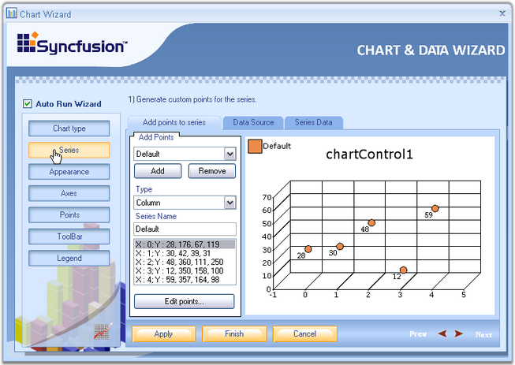
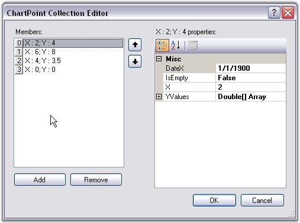
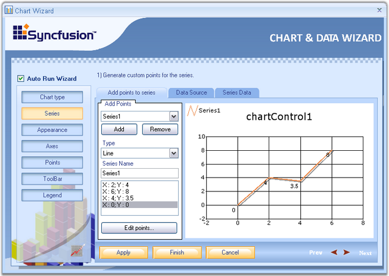
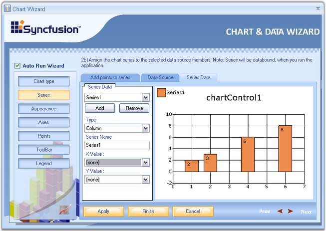

::: {style="DISPLAY: none"}
{#d2h_url_template}{#d2h_package_url style="WIDTH: 0px; DISPLAY: none; HEIGHT: 0px"}
:::

::::: {#nsbanner .d2h_main_nsbanner style="BORDER-BOTTOM: #999999 1px solid; POSITION: relative; PADDING-BOTTOM: 0px; BACKGROUND-COLOR: transparent; PADDING-LEFT: 0px; PADDING-RIGHT: 0px; DISPLAY: none; BORDER-TOP: #999999 1px solid; PADDING-TOP: 0px; LEFT: 0px"}
:::: {#TitleRow .d2h_main_titlerow style="PADDING-BOTTOM: 4px; BACKGROUND-COLOR: transparent; PADDING-LEFT: 22px; WIDTH: 100%; PADDING-RIGHT: 10px; DISPLAY: none; PADDING-TOP: 4px"}
::: {#ienav .d2h_main_ienav style="DISPLAY: none"}
{#D2HPrevious .D2HPreviousEnabled}  {#D2HNext .D2HNextEnabled}
:::
::::
:::::

:::: {#nstext .d2h_main_nstext style="PADDING-BOTTOM: 10px; BACKGROUND-COLOR: transparent; PADDING-LEFT: 22px; PADDING-RIGHT: 10px; HEIGHT: 100%; OVERFLOW: auto; PADDING-TOP: 5px" hasuserbackground="true" valign="bottom"}
::: {#d2h_breadcrumbs .d2h_breadcrumbs}
[Essential Studio User Guide Documentation](ms-xhelp:///?Id=12457748-09e3-4d74-a240-8e049cedf030){.d2h_breadcrumbsNormal}[ \> ]{.d2h_breadcrumbsLinkSeparator}[User Interface Edition](ms-xhelp:///?Id=c29296b7-531c-413b-a0ec-488ca1f7f669){.d2h_breadcrumbsNormal}[ \> ]{.d2h_breadcrumbsLinkSeparator}[Essential Windows](ms-xhelp:///?Id=e60759d8-47a4-4570-9d7a-16a68d63f2ea){.d2h_breadcrumbsNormal}[ \> ]{.d2h_breadcrumbsLinkSeparator}[Essential Chart]{.d2h_breadcrumbsContentsOnly}[ \> ]{.d2h_breadcrumbsLinkSeparator}[Concepts and Features](ms-xhelp:///?Id=71321e9c-336c-4c1c-a127-be9f135ad4bb){.d2h_breadcrumbsNormal}[ \> ]{.d2h_breadcrumbsLinkSeparator}[Chart Wizard](ms-xhelp:///?Id=75ed87e0-40c7-4e39-8fb1-d0da77b99911){.d2h_breadcrumbsNormal}
:::

### Series {#series style="tab-stops: 0pt"}

 

A Chart can display multiple series. Properties such as Name, Data source, Series Data can be set or changed for any of the series, easily, through this wizard.

 

{border="0"}

 

Figure 11: Series button selected in Chart Wizard

 

Below are the three tabs in the Wizard for Series.

 

1.   Add points to series

 

2.   Click **Add** button to add a new series.

 

3.   Select the series to which you need to add points.

 

4.   This tab provides options to select any chart type using the **Type** combobox and series name using **Series Name** textbox.

 

5.   Clicking the **Edit points** button, opens the **ChartPoint Collection Editor**.

 

{border="0"}

**** 

Figure 12: ChartPoint Collection Editor

 

6.   Click **Add** to add points to the series. Give **X** and **Y** values. Click **Ok**.

 

{border="0"}

**** 

Figure 13: Adding Points to Series

 

**Data source -** The data source to connect with, can be selected using the data source page. Once the data source is selected, it will guide you through the connectivity steps. Refer [Data Binding in Chart Through Chart Wizard]{.UGHyperlink} topic for detailed information. This topic describes data binding techniques at  the design-time through Chart Wizard tools.

 

**Series Data -** Using this tab, we can change the type of the chart. Whenever an external data source is selected using the Data Source tab, XValue and YValue ComboBox will be supplied with all the column names of the external data source.

 

Select one column for XValue and another for YValue, between which you wanted to draw the chart. Refer [Data Binding in Chart Through Chart Wizard]{.UGHyperlink} topic for detailed information.

 

{border="0"}

**** 

Figure 14: Setting the Chart Type

 

**See Also**

 

[Chart Series]{.UGHyperlink}[]{.UGHyperlink}

 

[]{#p15} 

 

[]{#related-topics}
::::
