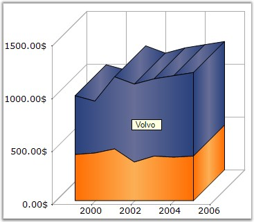

::: {style="DISPLAY: none"}
{#d2h_url_template}{#d2h_package_url style="WIDTH: 0px; DISPLAY: none; HEIGHT: 0px"}
:::

:::: {.d2h_secondary_topic style="PADDING-BOTTOM: 10pt; MARGIN: 0pt; PADDING-LEFT: 0pt; PADDING-RIGHT: 0pt; PADDING-TOP: 0pt"}
#### SeriesToolTipFormat {#seriestooltipformat style="tab-stops: 0pt"}

**[]{style="FONT-FAMILY: 'Trebuchet MS','sans-serif'; FONT-SIZE: 9pt"}** 

Specifies the format for tooltip display in series.

[]{style="FONT-FAMILY: 'Trebuchet MS','sans-serif'; FONT-SIZE: 9pt"} 

::: {align="center"}
+---------------------------------------+--------------------------------------------------------------------------------------------------------------------------------------------------------------+
| **[]{style="FONT-FAMILY: 'Trebuchet MS','sans-serif'; FONT-SIZE: 9pt"}**                                                                                                                             |
|                                                                                                                                                                                                      |
| Details                                                                                                                                                                                              |
+---------------------------------------+--------------------------------------------------------------------------------------------------------------------------------------------------------------+
| Possible Values                       | {0}  -  Series Name                                                                                                                                          |
|                                       |                                                                                                                                                              |
|                                       | {1}  -  Series Style tooltip                                                                                                                                 |
+---------------------------------------+--------------------------------------------------------------------------------------------------------------------------------------------------------------+
| Default Value                         | {0}                                                                                                                                                          |
+---------------------------------------+--------------------------------------------------------------------------------------------------------------------------------------------------------------+
| 2D / 3D Limitations                   | No                                                                                                                                                           |
+---------------------------------------+--------------------------------------------------------------------------------------------------------------------------------------------------------------+
| Applies to Chart Element              | Any Series                                                                                                                                                   |
+---------------------------------------+--------------------------------------------------------------------------------------------------------------------------------------------------------------+
| Applies to Chart Types                | Area Charts, Radar Chart, Polar Chart, ThreeLineBreak Chart,PointAndFigure Chart, StepLine Chart, Spline Chart, HiloOpenClose(3D), RotatedSpline, Kagi Chart |
+---------------------------------------+--------------------------------------------------------------------------------------------------------------------------------------------------------------+
:::

**[]{style="FONT-FAMILY: 'Trebuchet MS','sans-serif'; FONT-SIZE: 9pt"}** 

Here is some sample code.

[]{style="FONT-FAMILY: 'Trebuchet MS','sans-serif'; FONT-SIZE: 9pt"} 

+----------------------------------------------------------------------------------------------------------------------------------------------------------------------------------------------------------------------------------------------------------------------------------+
| **[\[C#\]]{style="FONT-FAMILY: 'Courier New'; COLOR: black"}**                                                                                                                                                                                                                   |
|                                                                                                                                                                                                                                                                                  |
| **[]{style="FONT-FAMILY: 'Courier New'; COLOR: black"}**                                                                                                                                                                                                                         |
|                                                                                                                                                                                                                                                                                  |
| [this]{style="FONT-FAMILY: 'Courier New'; COLOR: blue"}[.ChartWebControl1.Series\[1\].SeriesToolTipFormat = \"]{style="FONT-FAMILY: 'Courier New'; COLOR: black"}[{0}]{style="FONT-FAMILY: 'Courier New'; COLOR: maroon"}[\";]{style="FONT-FAMILY: 'Courier New'; COLOR: black"} |
+----------------------------------------------------------------------------------------------------------------------------------------------------------------------------------------------------------------------------------------------------------------------------------+

[]{style="FONT-FAMILY: 'Trebuchet MS','sans-serif'; FONT-SIZE: 9pt"} 

+-------------------------------------------------------------------------------------------------------------------------------------------------------------------------------------------------------------------------------------------------------------------------------------+
| **[\[VB.NET\]]{style="FONT-FAMILY: 'Courier New'; COLOR: black"}**                                                                                                                                                                                                                  |
|                                                                                                                                                                                                                                                                                     |
| **[]{style="FONT-FAMILY: 'Courier New'; COLOR: black"}**                                                                                                                                                                                                                            |
|                                                                                                                                                                                                                                                                                     |
| [Private]{style="FONT-FAMILY: 'Courier New'; COLOR: blue"}[ Me.ChartWebControl1.Series(1).SeriesToolTipFormat = \"]{style="FONT-FAMILY: 'Courier New'; COLOR: black"}[{0}]{style="FONT-FAMILY: 'Courier New'; COLOR: maroon"}[\"]{style="FONT-FAMILY: 'Courier New'; COLOR: black"} |
+-------------------------------------------------------------------------------------------------------------------------------------------------------------------------------------------------------------------------------------------------------------------------------------+

**[]{style="FONT-FAMILY: 'Trebuchet MS','sans-serif'; FONT-SIZE: 9pt"}** 

{border="0"}

**[]{style="FONT-FAMILY: 'Courier New'; COLOR: black; FONT-SIZE: 9pt"}** 

Figure 186: SeriesToolTipFormat set to \"{0}\"

[]{style="FONT-FAMILY: 'Trebuchet MS','sans-serif'; FONT-SIZE: 9pt"} 

See Also

 

[]{#p144}[[Column Charts]{style="COLOR: blue"}, ]{.UGHyperlink}[Bar Charts]{.UGHyperlink}[, ]{.UGHyperlink}[Area Charts]{.UGHyperlink}[,]{.UGHyperlink}[Histogram Chart]{.UGHyperlink}[, ]{.UGHyperlink}[Tornado Chart]{.UGHyperlink}[, ]{.UGHyperlink}[Polar and Radar Chart]{.UGHyperlink}[, ]{.UGHyperlink}[Pie Chart]{.UGHyperlink}[, ]{.UGHyperlink}[Three Line Break Chart]{.UGHyperlink}[, ]{.UGHyperlink}[Box and Whisker Chart]{.UGHyperlink}[, ]{.UGHyperlink}[Renko chart]{.UGHyperlink}[, ]{.UGHyperlink}[Line Chart]{.UGHyperlink}[, ]{.UGHyperlink}[Spline Chart]{.UGHyperlink}[, ]{.UGHyperlink}[Step line Chart]{.UGHyperlink}[, ]{.UGHyperlink}[Kagi Chart]{.UGHyperlink}[, ]{.UGHyperlink}[Bubble And Scatter Chart]{.UGHyperlink}[]{.UGHyperlink}

 

[]{#related-topics}
::::
