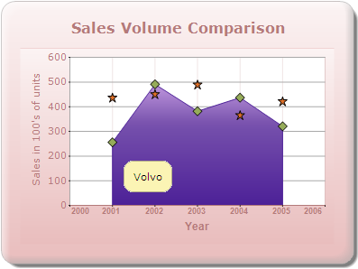

::: {style="DISPLAY: none"}
{#d2h_url_template}{#d2h_package_url style="WIDTH: 0px; DISPLAY: none; HEIGHT: 0px"}
:::

:::::: {.d2h_secondary_topic style="PADDING-BOTTOM: 10pt; MARGIN: 0pt; PADDING-LEFT: 0pt; PADDING-RIGHT: 0pt; PADDING-TOP: 0pt"}
#### SeriesToolTipFormat {#seriestooltipformat style="tab-stops: 0pt"}

SeriesToolTipFormat specifies the format for tooltips displayed in a series.

[]{style="FONT-FAMILY: 'Calibri','sans-serif'"} 

::: {align="center"}
+-------------------------------------+---------------------------------------------------------------------------------------------------------------------------------------------------------------------------------------+
| Details                                                                                                                                                                                                                     |
+-------------------------------------+---------------------------------------------------------------------------------------------------------------------------------------------------------------------------------------+
| Possible values                     | {0} - Series name.                                                                                                                                                                    |
|                                     |                                                                                                                                                                                       |
|                                     | {1} - Series style tooltip.                                                                                                                                                           |
+-------------------------------------+---------------------------------------------------------------------------------------------------------------------------------------------------------------------------------------+
| Default value                       | {0}                                                                                                                                                                                   |
+-------------------------------------+---------------------------------------------------------------------------------------------------------------------------------------------------------------------------------------+
| 2D/3D limitations                   | No                                                                                                                                                                                    |
+-------------------------------------+---------------------------------------------------------------------------------------------------------------------------------------------------------------------------------------+
| Application to chart element        | Any series                                                                                                                                                                            |
+-------------------------------------+---------------------------------------------------------------------------------------------------------------------------------------------------------------------------------------+
| Application to chart types          | Area charts, Radar chart, Polar chart, Three Line Break chart, Point and Figure chart, Step Line chart, Spline chart, HiLoOpenClose (3D) chart, Rotated Spline chart, and Kagi chart. |
+-------------------------------------+---------------------------------------------------------------------------------------------------------------------------------------------------------------------------------------+
:::

The following code snippet is used to set the format for ToolTips in a series.

[]{style="FONT-FAMILY: 'Calibri','sans-serif'"} 

**chartModel.Series\[1\].SeriesToolTipFormat = [\"{0}\"]{style="COLOR: #a31515"};**

[]{style="FONT-FAMILY: 'Calibri','sans-serif'"} 

[]{style="FONT-FAMILY: 'Calibri','sans-serif'"} 

{border="0"}

Figure 333: SeriesToolTipFormat

Sets the tooltip of the style object associated with the series.

 

::: {align="center"}
+------------------------------+--------------------------------------------------------------------------------------------------------------------------------------------------------------------------------------------------------------------------------------------------------------------------------------------+
| Details                                                                                                                                                                                                                                                                                                                   |
+------------------------------+--------------------------------------------------------------------------------------------------------------------------------------------------------------------------------------------------------------------------------------------------------------------------------------------+
| Possible values              | Any string value.                                                                                                                                                                                                                                                                          |
+------------------------------+--------------------------------------------------------------------------------------------------------------------------------------------------------------------------------------------------------------------------------------------------------------------------------------------+
| Default value                | Nil                                                                                                                                                                                                                                                                                        |
+------------------------------+--------------------------------------------------------------------------------------------------------------------------------------------------------------------------------------------------------------------------------------------------------------------------------------------+
| 2D/3D limitations            | No                                                                                                                                                                                                                                                                                         |
+------------------------------+--------------------------------------------------------------------------------------------------------------------------------------------------------------------------------------------------------------------------------------------------------------------------------------------+
| Application to chart element | Any series                                                                                                                                                                                                                                                                                 |
+------------------------------+--------------------------------------------------------------------------------------------------------------------------------------------------------------------------------------------------------------------------------------------------------------------------------------------+
| Application to chart types   | Scatter chart, HiLoOpenClose chart (3D) chart, Column charts, Bar charts, Bubble chart, Line charts, Box and Whisker chart, Tornado chart, Combination chart, Gantt chart, Candle chart, HiLo chart (3D) chart, Polar chart, Radar chart, Pie chart, Accumulation charts, and Area charts. |
+------------------------------+--------------------------------------------------------------------------------------------------------------------------------------------------------------------------------------------------------------------------------------------------------------------------------------------+
:::

 

The following code snippet uses a ToolTip in the Column chart.

[]{style="FONT-FAMILY: 'Calibri','sans-serif'"} 

::: {style="BORDER-BOTTOM: #c8c8c8 1pt solid; BORDER-LEFT: #c8c8c8 1pt solid; PADDING-BOTTOM: 1pt; MARGIN-TOP: 0pt; PADDING-LEFT: 4pt; PADDING-RIGHT: 4pt; MARGIN-BOTTOM: 0pt; BACKGROUND: #f0f0f0; BORDER-TOP: #c8c8c8 1pt solid; BORDER-RIGHT: #c8c8c8 1pt solid; PADDING-TOP: 1pt"}
[chartModel]{style="FONT-FAMILY: 'Courier New'; COLOR: blue"}[.ShowToolTips = [true]{style="COLOR: blue"};]{style="FONT-FAMILY: 'Courier New'"}

[            series1.PointsToolTipFormat = [\"{1}\"]{style="COLOR: #a31515"};]{style="FONT-FAMILY: 'Courier New'"}

[            series1.Style.ToolTip = [\"Tooltip of Series1\"]{style="COLOR: #a31515"};]{style="FONT-FAMILY: 'Courier New'"}[ ]{style="FONT-FAMILY: 'Courier New'"}
:::

[]{#related-topics}
::::::
