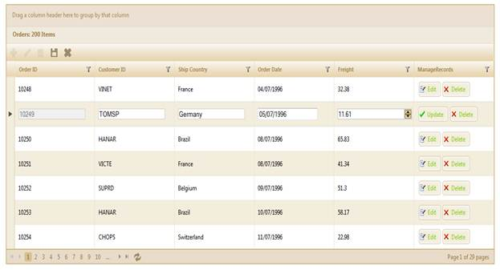

::: {style="DISPLAY: none"}
{#d2h_url_template}{#d2h_package_url style="WIDTH: 0px; DISPLAY: none; HEIGHT: 0px"}
:::

::: {.d2h_secondary_topic style="PADDING-BOTTOM: 10pt; MARGIN: 0pt; PADDING-LEFT: 0pt; PADDING-RIGHT: 0pt; PADDING-TOP: 0pt"}
##### Server Mode {#server-mode style="tab-stops: 0pt"}

###### 5.7.9.2.1.1 Through GridBuilder {#through-gridbuilder style="tab-stops: 0pt"}

The steps to work with the unbound column editing feature through **GridBuilder** are as follows:

1.  Add the **MicrosoftMvcValidation.debug.js** file in the master page.

 

+-------------------------------------------------------------------------------------------------------------------------------------------------------------------------------------------------------------------------------------------------------------------------------------------------------------------------------------------------------------------------------------------------------------------------------------------------------------------------------------------------------------------------------+
| **[\[ASPX\]]{style="FONT-FAMILY: 'Courier New'"}**                                                                                                                                                                                                                                                                                                                                                                                                                                                                            |
|                                                                                                                                                                                                                                                                                                                                                                                                                                                                                                                               |
| [\<]{style="FONT-FAMILY: 'Courier New'; COLOR: blue"}[head]{style="FONT-FAMILY: 'Courier New'; COLOR: maroon"}[ [runat]{style="COLOR: red"}[=\"server\"\>]{style="COLOR: blue"}]{style="FONT-FAMILY: 'Courier New'"}                                                                                                                                                                                                                                                                                                          |
|                                                                                                                                                                                                                                                                                                                                                                                                                                                                                                                               |
| [    [\<]{style="COLOR: blue"}[title]{style="COLOR: maroon"}[\>\<]{style="COLOR: blue"}[asp]{style="COLOR: maroon"}[:]{style="COLOR: blue"}[ContentPlaceHolder]{style="COLOR: maroon"} [ID]{style="COLOR: red"}[=\"TitleContent\"]{style="COLOR: blue"} [runat]{style="COLOR: red"}[=\"server\"]{style="COLOR: blue"} [/\>\</]{style="COLOR: blue"}[title]{style="COLOR: maroon"}[\>]{style="COLOR: blue"}]{style="FONT-FAMILY: 'Courier New'"}                                                                               |
|                                                                                                                                                                                                                                                                                                                                                                                                                                                                                                                               |
| [.........]{style="FONT-FAMILY: 'Courier New'; COLOR: blue"}                                                                                                                                                                                                                                                                                                                                                                                                                                                                  |
|                                                                                                                                                                                                                                                                                                                                                                                                                                                                                                                               |
| [\<]{style="FONT-FAMILY: 'Courier New'; COLOR: blue"}[script]{style="FONT-FAMILY: 'Courier New'; COLOR: maroon"}[ [src]{style="COLOR: red"}[=\"]{style="COLOR: blue"}[\<%]{style="BACKGROUND: yellow"}[=]{style="COLOR: blue"} Url.Content(\"\~/Scripts/MicrosoftMvcValidation.debug.js\") [%\>]{style="BACKGROUND: yellow"}[\"]{style="COLOR: blue"} [type]{style="COLOR: red"}[=\"text/javascript\"\>\</]{style="COLOR: blue"}[script]{style="COLOR: maroon"}[\>]{style="COLOR: blue"}]{style="FONT-FAMILY: 'Courier New'"} |
|                                                                                                                                                                                                                                                                                                                                                                                                                                                                                                                               |
| [    ]{style="FONT-FAMILY: 'Courier New'"}                                                                                                                                                                                                                                                                                                                                                                                                                                                                                    |
|                                                                                                                                                                                                                                                                                                                                                                                                                                                                                                                               |
| [\</]{style="FONT-FAMILY: 'Courier New'; COLOR: blue"}[head]{style="FONT-FAMILY: 'Courier New'; COLOR: maroon"}[\>]{style="FONT-FAMILY: 'Courier New'; COLOR: blue"}[]{style="FONT-SIZE: 12pt"}                                                                                                                                                                                                                                                                                                                               |
+-------------------------------------------------------------------------------------------------------------------------------------------------------------------------------------------------------------------------------------------------------------------------------------------------------------------------------------------------------------------------------------------------------------------------------------------------------------------------------------------------------------------------------+

2.  [[Create a model in the application.]{style="FONT-FAMILY: 'Arial','sans-serif'"}](http://help.syncfusion.com/ug_94/User%20Interface/ASP.NET%20MVC/Grid/Documents/addingamodeltotheapplication.htm)

3.  [[Create a strongly typed view.]{style="FONT-FAMILY: 'Arial','sans-serif'"}](http://help.syncfusion.com/ug_94/User%20Interface/ASP.NET%20MVC/Grid/Documents/62creatingastronglyt.htm)

4.  In the view, use the **Model** property in the **Datasource()** method to bind the data source.

+--------------------------------------------------------------------------------------------------------------------------------------------------------------------------------------------------------------------------------------------------+
|  **[\[ASPX\]]{style="FONT-FAMILY: 'Courier New'"}**                                                                                                                                                                                              |
|                                                                                                                                                                                                                                                  |
| [\<%]{style="FONT-FAMILY: 'Courier New'; BACKGROUND: yellow"}[=]{style="FONT-FAMILY: 'Courier New'; COLOR: blue"}[Html.Grid\<[EditableOrder]{style="COLOR: #2b91af"}\>([\"Grid1\"]{style="COLOR: #a31515"})]{style="FONT-FAMILY: 'Courier New'"} |
|                                                                                                                                                                                                                                                  |
| [                         .Datasource(Model) ]{style="FONT-FAMILY: 'Courier New'"}                                                                                                                                                               |
|                                                                                                                                                                                                                                                  |
| [                         .Caption([\"Orders\"]{style="COLOR: #a31515"})]{style="FONT-FAMILY: 'Courier New'"}                                                                                                                                    |
|                                                                                                                                                                                                                                                  |
| [                         .Column(column =\>]{style="FONT-FAMILY: 'Courier New'"}                                                                                                                                                                |
|                                                                                                                                                                                                                                                  |
| [                         {]{style="FONT-FAMILY: 'Courier New'"}                                                                                                                                                                                 |
|                                                                                                                                                                                                                                                  |
| [                             column.Add(p =\> p.OrderID).HeaderText([\"Order ID\"]{style="COLOR: #a31515"});]{style="FONT-FAMILY: 'Courier New'"}                                                                                               |
|                                                                                                                                                                                                                                                  |
| [                             column.Add(p =\> p.CustomerID).HeaderText([\"Customer ID\"]{style="COLOR: #a31515"});]{style="FONT-FAMILY: 'Courier New'"}                                                                                         |
|                                                                                                                                                                                                                                                  |
| [                             column.Add(p =\> p.ShipCountry).HeaderText([\"Ship Country\"]{style="COLOR: #a31515"}).CellEditType([CellEditType]{style="COLOR: #2b91af"}.DropdownEdit);]{style="FONT-FAMILY: 'Courier New'"}                     |
|                                                                                                                                                                                                                                                  |
| [                             column.Add(p =\> p.OrderDate).HeaderText([\"Order Date\"]{style="COLOR: #a31515"}).Format([\"{0:MM/dd/yyyy}\"]{style="COLOR: #a31515"});]{style="FONT-FAMILY: 'Courier New'"}                                      |
|                                                                                                                                                                                                                                                  |
| [                             column.Add(p =\> p.Freight).HeaderText([\"Freight\"]{style="COLOR: #a31515"}).Format([\"{0:C}\"]{style="COLOR: #a31515"});]{style="FONT-FAMILY: 'Courier New'"}                                                    |
|                                                                                                                                                                                                                                                  |
| [                             column.Add(p =\> p.Delivered).HeaderText([\"Delivered\"]{style="COLOR: #a31515"});]{style="FONT-FAMILY: 'Courier New'"}                                                                                            |
|                                                                                                                                                                                                                                                  |
| [                         })]{style="FONT-FAMILY: 'Courier New'"}                                                                                                                                                                                |
|                                                                                                                                                                                                                                                  |
| [                        ]{style="FONT-FAMILY: 'Courier New'"}                                                                                                                                                                                   |
|                                                                                                                                                                                                                                                  |
|                                                                                                                                                                                                                                                  |
|                                                                                                                                                                                                                                                  |
| [%\>]{style="FONT-FAMILY: 'Courier New'; BACKGROUND: yellow"}[]{style="FONT-SIZE: 12pt"}                                                                                                                                                         |
+--------------------------------------------------------------------------------------------------------------------------------------------------------------------------------------------------------------------------------------------------+

  

+------------------------------------------------------------------------------------------------------------------------------------------------------------------------------------------------------------------------------+
| **[\[Razor\]]{style="FONT-FAMILY: 'Courier New'"}**                                                                                                                                                                          |
|                                                                                                                                                                                                                              |
| [\@{]{style="FONT-FAMILY: 'Courier New'; BACKGROUND: yellow"}[ Html.Grid\<[EditableOrder]{style="COLOR: #2b91af"}\>([\"Grid1\"]{style="COLOR: #a31515"})]{style="FONT-FAMILY: 'Courier New'"}                                |
|                                                                                                                                                                                                                              |
| [                         .Datasource(Model) ]{style="FONT-FAMILY: 'Courier New'"}                                                                                                                                           |
|                                                                                                                                                                                                                              |
| [                         .Caption([\"Orders\"]{style="COLOR: #a31515"})]{style="FONT-FAMILY: 'Courier New'"}                                                                                                                |
|                                                                                                                                                                                                                              |
| [                         .Column(column =\>]{style="FONT-FAMILY: 'Courier New'"}                                                                                                                                            |
|                                                                                                                                                                                                                              |
| [                         {]{style="FONT-FAMILY: 'Courier New'"}                                                                                                                                                             |
|                                                                                                                                                                                                                              |
|                                                                                                                                                                                                                              |
|                                                                                                                                                                                                                              |
| [                             column.Add(p =\> p.OrderID).HeaderText([\"Order ID\"]{style="COLOR: #a31515"});]{style="FONT-FAMILY: 'Courier New'"}                                                                           |
|                                                                                                                                                                                                                              |
| [                             column.Add(p =\> p.CustomerID).HeaderText([\"Customer ID\"]{style="COLOR: #a31515"});]{style="FONT-FAMILY: 'Courier New'"}                                                                     |
|                                                                                                                                                                                                                              |
| [                             column.Add(p =\> p.ShipCountry).HeaderText([\"Ship Country\"]{style="COLOR: #a31515"}).CellEditType([CellEditType]{style="COLOR: #2b91af"}.DropdownEdit);]{style="FONT-FAMILY: 'Courier New'"} |
|                                                                                                                                                                                                                              |
| [                             column.Add(p =\> p.OrderDate).HeaderText([\"Order Date\"]{style="COLOR: #a31515"}).Format([\"{0:MM/dd/yyyy}\"]{style="COLOR: #a31515"});]{style="FONT-FAMILY: 'Courier New'"}                  |
|                                                                                                                                                                                                                              |
| [                             column.Add(p =\> p.Freight).HeaderText([\"Freight\"]{style="COLOR: #a31515"}).Format([\"{0:C}\"]{style="COLOR: #a31515"});]{style="FONT-FAMILY: 'Courier New'"}                                |
|                                                                                                                                                                                                                              |
| [                             column.Add(p =\> p.Delivered).HeaderText([\"Delivered\"]{style="COLOR: #a31515"});]{style="FONT-FAMILY: 'Courier New'"}                                                                        |
|                                                                                                                                                                                                                              |
| [                         })]{style="FONT-FAMILY: 'Courier New'"}                                                                                                                                                            |
|                                                                                                                                                                                                                              |
| [                        ]{style="FONT-FAMILY: 'Courier New'"}                                                                                                                                                               |
|                                                                                                                                                                                                                              |
| [ .Render();]{style="FONT-FAMILY: 'Courier New'"}                                                                                                                                                                            |
|                                                                                                                                                                                                                              |
| [}]{style="FONT-FAMILY: 'Courier New'; BACKGROUND: yellow"}[]{style="FONT-SIZE: 12pt"}                                                                                                                                       |
+------------------------------------------------------------------------------------------------------------------------------------------------------------------------------------------------------------------------------+

 

5.  Enable the editing mode by setting the edit mode to **Normal**[ ]{style="FONT-SIZE: 7pt"}and configure the editing properties such as allow **New**, **Allow Edit**, and **Allow Delete** as displayed below:

 

+---------------------------------------------------------------------------------------------------------------------------------------------------------------------------------------------------------------------------------------------------------------+
| **[\[ASPX\]]{style="FONT-FAMILY: 'Courier New'"}**                                                                                                                                                                                                            |
|                                                                                                                                                                                                                                                               |
|                                                                                                                                                                                                                                                               |
|                                                                                                                                                                                                                                                               |
| [\<%]{style="FONT-FAMILY: 'Courier New'; BACKGROUND: yellow"}[=]{style="FONT-FAMILY: 'Courier New'; COLOR: blue"}[Html.Syncfusion().Grid\<[EditableOrder]{style="COLOR: #2b91af"}\>([\"Grid1\"]{style="COLOR: #a31515"})]{style="FONT-FAMILY: 'Courier New'"} |
|                                                                                                                                                                                                                                                               |
| [.Editing( edit=\>{]{style="FONT-FAMILY: 'Courier New'"}                                                                                                                                                                                                      |
|                                                                                                                                                                                                                                                               |
| [        edit.AllowEdit([true]{style="COLOR: blue"}, [\"OrderSave\"]{style="COLOR: #a31515"})]{style="FONT-FAMILY: 'Courier New'"}                                                                                                                            |
|                                                                                                                                                                                                                                                               |
| [        .AllowNew([true]{style="COLOR: blue"}, [\"AddOrder\"]{style="COLOR: #a31515"})]{style="FONT-FAMILY: 'Courier New'"}                                                                                                                                  |
|                                                                                                                                                                                                                                                               |
| [       .AllowDelete([true]{style="COLOR: blue"}, [\"DeleteOrder\"]{style="COLOR: #a31515"});]{style="FONT-FAMILY: 'Courier New'"}                                                                                                                            |
|                                                                                                                                                                                                                                                               |
| **[})               ]{style="FONT-FAMILY: 'Courier New'"}**                                                                                                                                                                                                   |
|                                                                                                                                                                                                                                                               |
| [    [%\>]{style="BACKGROUND: yellow"}]{style="FONT-FAMILY: 'Courier New'"}                                                                                                                                                                                   |
|                                                                                                                                                                                                                                                               |
| []{style="FONT-SIZE: 12pt"}                                                                                                                                                                                                                                   |
+---------------------------------------------------------------------------------------------------------------------------------------------------------------------------------------------------------------------------------------------------------------+

 

+-----------------------------------------------------------------------------------------------------------------------------------------------------------------------------------------------------------+
| **[\[Razor\]]{style="FONT-FAMILY: 'Courier New'"}**                                                                                                                                                       |
|                                                                                                                                                                                                           |
| [@(]{style="FONT-FAMILY: 'Courier New'; BACKGROUND: yellow"}[ Html.Syncfusion().Grid\<[EditableOrder]{style="COLOR: #2b91af"}\>([\"Grid1\"]{style="COLOR: #a31515"})]{style="FONT-FAMILY: 'Courier New'"} |
|                                                                                                                                                                                                           |
| [.Editing( edit=\>{]{style="FONT-FAMILY: 'Courier New'"}                                                                                                                                                  |
|                                                                                                                                                                                                           |
| [        edit.AllowEdit([true]{style="COLOR: blue"}, [\"OrderSave\"]{style="COLOR: #a31515"})]{style="FONT-FAMILY: 'Courier New'"}                                                                        |
|                                                                                                                                                                                                           |
| [        .AllowNew([true]{style="COLOR: blue"}, [\"AddOrder\"]{style="COLOR: #a31515"})]{style="FONT-FAMILY: 'Courier New'"}                                                                              |
|                                                                                                                                                                                                           |
| [       .AllowDelete([true]{style="COLOR: blue"}, [\"DeleteOrder\"]{style="COLOR: #a31515"});]{style="FONT-FAMILY: 'Courier New'"}                                                                        |
|                                                                                                                                                                                                           |
| **[})]{style="FONT-FAMILY: 'Courier New'"}**                                                                                                                                                              |
|                                                                                                                                                                                                           |
| [)]{style="FONT-FAMILY: 'Courier New'; BACKGROUND: yellow"}[]{style="FONT-SIZE: 12pt"}                                                                                                                    |
+-----------------------------------------------------------------------------------------------------------------------------------------------------------------------------------------------------------+

[]{style="FONT-SIZE: 8pt"} 

6.  Essential Grid allows editing and deleting records through grid unbound column items. In this example, **AddNew**, **Edit**, **Delete**, **Save**, and **Cancel** buttons have been added in the toolbar items. Therefore, configure the toolbar as displayed below:

 

+--------------------------------------------------------------------------------------------------------------------------------------------------------------------------------------------------------------------------------------------------------------------------------------------------------------------------------------------------------------------------------+
| **[\[ASPX\]]{style="FONT-FAMILY: 'Courier New'"}**                                                                                                                                                                                                                                                                                                                             |
|                                                                                                                                                                                                                                                                                                                                                                                |
|                                                                                                                                                                                                                                                                                                                                                                                |
|                                                                                                                                                                                                                                                                                                                                                                                |
| [\<%]{style="FONT-FAMILY: 'Courier New'; BACKGROUND: yellow"}[=]{style="FONT-FAMILY: 'Courier New'; COLOR: blue"}[Html.Grid\<[EditableOrder]{style="COLOR: #2b91af"}\>([\"Grid1\"]{style="COLOR: #a31515"})]{style="FONT-FAMILY: 'Courier New'"}                                                                                                                               |
|                                                                                                                                                                                                                                                                                                                                                                                |
| [                         .Datasource(Model)]{style="FONT-FAMILY: 'Courier New'"}                                                                                                                                                                                                                                                                                              |
|                                                                                                                                                                                                                                                                                                                                                                                |
| [.column.Add([\"ManageRecords\"]{style="COLOR: #a31515"}, col =\>]{style="FONT-FAMILY: Consolas"}                                                                                                                                                                                                                                                                              |
|                                                                                                                                                                                                                                                                                                                                                                                |
| [                             {]{style="FONT-FAMILY: Consolas"}                                                                                                                                                                                                                                                                                                                |
|                                                                                                                                                                                                                                                                                                                                                                                |
| [                           // Unbound column for editing records.]{style="FONT-FAMILY: 'Courier New'; COLOR: green"}                                                                                                                                                                                                                                                          |
|                                                                                                                                                                                                                                                                                                                                                                                |
| []{style="FONT-FAMILY: Consolas"}                                                                                                                                                                                                                                                                                                                                              |
|                                                                                                                                                                                                                                                                                                                                                                                |
| [                                 col.Commands(cmd =\>]{style="FONT-FAMILY: Consolas"}                                                                                                                                                                                                                                                                                         |
|                                                                                                                                                                                                                                                                                                                                                                                |
| [                                 {]{style="FONT-FAMILY: Consolas"}                                                                                                                                                                                                                                                                                                            |
|                                                                                                                                                                                                                                                                                                                                                                                |
| [                                     cmd.Command([CommandTypes]{style="COLOR: #2b91af"}.Edit).Text([\"Edit\"]{style="COLOR: #a31515"}).ImageUrl([\"/Content/Edit.png\"]{style="COLOR: #a31515"}).ItemType([UnBoundItemTypes]{style="COLOR: #2b91af"}.Button).ItemOption([UnboundItemOptions]{style="COLOR: #2b91af"}.ImageOnly);]{style="FONT-FAMILY: Consolas"}              |
|                                                                                                                                                                                                                                                                                                                                                                                |
| [                                 });]{style="FONT-FAMILY: Consolas"}                                                                                                                                                                                                                                                                                                          |
|                                                                                                                                                                                                                                                                                                                                                                                |
| [           // Unbound column for updating records.]{style="FONT-FAMILY: 'Courier New'; COLOR: green"}                                                                                                                                                                                                                                                                         |
|                                                                                                                                                                                                                                                                                                                                                                                |
| []{style="FONT-FAMILY: Consolas"}                                                                                                                                                                                                                                                                                                                                              |
|                                                                                                                                                                                                                                                                                                                                                                                |
| [                                 col.Commands(cmd =\>]{style="FONT-FAMILY: Consolas"}                                                                                                                                                                                                                                                                                         |
|                                                                                                                                                                                                                                                                                                                                                                                |
| [                                 {]{style="FONT-FAMILY: Consolas"}                                                                                                                                                                                                                                                                                                            |
|                                                                                                                                                                                                                                                                                                                                                                                |
| [                                     cmd.Command([CommandTypes]{style="COLOR: #2b91af"}.Update).Text([\"Update\"]{style="COLOR: #a31515"}).ImageUrl([\"/Content/Update.png\"]{style="COLOR: #a31515"}).ItemType([UnBoundItemTypes]{style="COLOR: #2b91af"}.HyperLink).ItemOption([UnboundItemOptions]{style="COLOR: #2b91af"}.ImagePlusText);]{style="FONT-FAMILY: Consolas"} |
|                                                                                                                                                                                                                                                                                                                                                                                |
| [                                 });]{style="FONT-FAMILY: Consolas"}                                                                                                                                                                                                                                                                                                          |
|                                                                                                                                                                                                                                                                                                                                                                                |
| [           ]{style="FONT-FAMILY: Consolas"}[// Unbound column for deleting records.]{style="FONT-FAMILY: 'Courier New'; COLOR: green"}                                                                                                                                                                                                                                        |
|                                                                                                                                                                                                                                                                                                                                                                                |
| []{style="FONT-FAMILY: Consolas"}                                                                                                                                                                                                                                                                                                                                              |
|                                                                                                                                                                                                                                                                                                                                                                                |
| [                                 col.Commands(cmd1 =\>]{style="FONT-FAMILY: Consolas"}                                                                                                                                                                                                                                                                                        |
|                                                                                                                                                                                                                                                                                                                                                                                |
| [                                 {]{style="FONT-FAMILY: Consolas"}                                                                                                                                                                                                                                                                                                            |
|                                                                                                                                                                                                                                                                                                                                                                                |
| [                                     cmd1.Command([CommandTypes]{style="COLOR: #2b91af"}.Delete).Text([\"Delete\"]{style="COLOR: #a31515"}).ImageUrl([\"/Content/Delete.png\"]{style="COLOR: #a31515"}).ItemType([UnBoundItemTypes]{style="COLOR: #2b91af"}.Button).ItemOption([UnboundItemOptions]{style="COLOR: #2b91af"}.TextOnly);]{style="FONT-FAMILY: Consolas"}        |
|                                                                                                                                                                                                                                                                                                                                                                                |
| [                                 });]{style="FONT-FAMILY: Consolas"}                                                                                                                                                                                                                                                                                                          |
|                                                                                                                                                                                                                                                                                                                                                                                |
| [                             }).UnBound([true]{style="COLOR: blue"});]{style="FONT-FAMILY: Consolas"}[ // Unbound must be true to make it  as unbound column]{style="FONT-FAMILY: 'Courier New'; COLOR: green"}                                                                                                                                                               |
|                                                                                                                                                                                                                                                                                                                                                                                |
| []{style="FONT-FAMILY: Consolas"}                                                                                                                                                                                                                                                                                                                                              |
|                                                                                                                                                                                                                                                                                                                                                                                |
| [                            ]{style="FONT-FAMILY: Consolas"}                                                                                                                                                                                                                                                                                                                  |
|                                                                                                                                                                                                                                                                                                                                                                                |
| [                         })]{style="FONT-FAMILY: Consolas"}                                                                                                                                                                                                                                                                                                                   |
|                                                                                                                                                                                                                                                                                                                                                                                |
| [%\>]{style="FONT-FAMILY: 'Courier New'; BACKGROUND: yellow"}[]{style="FONT-SIZE: 12pt"}                                                                                                                                                                                                                                                                                       |
+--------------------------------------------------------------------------------------------------------------------------------------------------------------------------------------------------------------------------------------------------------------------------------------------------------------------------------------------------------------------------------+

  

+--------------------------------------------------------------------------------------------------------------------------------------------------------------------------------------------------------------------------------------------------------------------------------------------------------------------------------------------------------------------------------------------------+
| **[\[Razor\]]{style="FONT-FAMILY: 'Courier New'"}**                                                                                                                                                                                                                                                                                                                                              |
|                                                                                                                                                                                                                                                                                                                                                                                                  |
| [@(]{style="FONT-FAMILY: 'Courier New'; BACKGROUND: yellow"}[ Html.Grid\<[EditableOrder]{style="COLOR: #2b91af"}\>([\"Grid1\"]{style="COLOR: #a31515"})]{style="FONT-FAMILY: 'Courier New'"}                                                                                                                                                                                                     |
|                                                                                                                                                                                                                                                                                                                                                                                                  |
| [                         .Datasource(Model)]{style="FONT-FAMILY: 'Courier New'"}                                                                                                                                                                                                                                                                                                                |
|                                                                                                                                                                                                                                                                                                                                                                                                  |
| [.column.Add([\"ManageRecords\"]{style="COLOR: #a31515"}, col =\>]{style="FONT-FAMILY: Consolas; FONT-SIZE: 9.5pt"}                                                                                                                                                                                                                                                                              |
|                                                                                                                                                                                                                                                                                                                                                                                                  |
| [                             {]{style="FONT-FAMILY: Consolas; FONT-SIZE: 9.5pt"}                                                                                                                                                                                                                                                                                                                |
|                                                                                                                                                                                                                                                                                                                                                                                                  |
| [                           // Unbound column for editing records.]{style="FONT-FAMILY: 'Courier New'; COLOR: green"}                                                                                                                                                                                                                                                                            |
|                                                                                                                                                                                                                                                                                                                                                                                                  |
| []{style="FONT-FAMILY: Consolas; FONT-SIZE: 9.5pt"}                                                                                                                                                                                                                                                                                                                                              |
|                                                                                                                                                                                                                                                                                                                                                                                                  |
| [                                 col.Commands(cmd =\>]{style="FONT-FAMILY: Consolas; FONT-SIZE: 9.5pt"}                                                                                                                                                                                                                                                                                         |
|                                                                                                                                                                                                                                                                                                                                                                                                  |
| [                                 {]{style="FONT-FAMILY: Consolas; FONT-SIZE: 9.5pt"}                                                                                                                                                                                                                                                                                                            |
|                                                                                                                                                                                                                                                                                                                                                                                                  |
| [                                     cmd.Command([CommandTypes]{style="COLOR: #2b91af"}.Edit).Text([\"Edit\"]{style="COLOR: #a31515"}).ImageUrl([\"/Content/Edit.png\"]{style="COLOR: #a31515"}).ItemType([UnBoundItemTypes]{style="COLOR: #2b91af"}.Button).ItemOption([UnboundItemOptions]{style="COLOR: #2b91af"}.ImageOnly);]{style="FONT-FAMILY: Consolas; FONT-SIZE: 9.5pt"}              |
|                                                                                                                                                                                                                                                                                                                                                                                                  |
| [                                 });]{style="FONT-FAMILY: Consolas; FONT-SIZE: 9.5pt"}                                                                                                                                                                                                                                                                                                          |
|                                                                                                                                                                                                                                                                                                                                                                                                  |
| [           // Unbound column for updating records.]{style="FONT-FAMILY: 'Courier New'; COLOR: green"}                                                                                                                                                                                                                                                                                           |
|                                                                                                                                                                                                                                                                                                                                                                                                  |
| []{style="FONT-FAMILY: Consolas; FONT-SIZE: 9.5pt"}                                                                                                                                                                                                                                                                                                                                              |
|                                                                                                                                                                                                                                                                                                                                                                                                  |
| [                                 col.Commands(cmd =\>]{style="FONT-FAMILY: Consolas; FONT-SIZE: 9.5pt"}                                                                                                                                                                                                                                                                                         |
|                                                                                                                                                                                                                                                                                                                                                                                                  |
| [                                 {]{style="FONT-FAMILY: Consolas; FONT-SIZE: 9.5pt"}                                                                                                                                                                                                                                                                                                            |
|                                                                                                                                                                                                                                                                                                                                                                                                  |
| [                                     cmd.Command([CommandTypes]{style="COLOR: #2b91af"}.Update).Text([\"Update\"]{style="COLOR: #a31515"}).ImageUrl([\"/Content/Update.png\"]{style="COLOR: #a31515"}).ItemType([UnBoundItemTypes]{style="COLOR: #2b91af"}.HyperLink).ItemOption([UnboundItemOptions]{style="COLOR: #2b91af"}.ImagePlusText);]{style="FONT-FAMILY: Consolas; FONT-SIZE: 9.5pt"} |
|                                                                                                                                                                                                                                                                                                                                                                                                  |
| [                                 });]{style="FONT-FAMILY: Consolas; FONT-SIZE: 9.5pt"}                                                                                                                                                                                                                                                                                                          |
|                                                                                                                                                                                                                                                                                                                                                                                                  |
| [           ]{style="FONT-FAMILY: Consolas; FONT-SIZE: 9.5pt"}[// Unbound column for deleting records.]{style="FONT-FAMILY: 'Courier New'; COLOR: green"}                                                                                                                                                                                                                                        |
|                                                                                                                                                                                                                                                                                                                                                                                                  |
| []{style="FONT-FAMILY: Consolas; FONT-SIZE: 9.5pt"}                                                                                                                                                                                                                                                                                                                                              |
|                                                                                                                                                                                                                                                                                                                                                                                                  |
| [                                 col.Commands(cmd1 =\>]{style="FONT-FAMILY: Consolas; FONT-SIZE: 9.5pt"}                                                                                                                                                                                                                                                                                        |
|                                                                                                                                                                                                                                                                                                                                                                                                  |
| [                                 {]{style="FONT-FAMILY: Consolas; FONT-SIZE: 9.5pt"}                                                                                                                                                                                                                                                                                                            |
|                                                                                                                                                                                                                                                                                                                                                                                                  |
| [                                     cmd1.Command([CommandTypes]{style="COLOR: #2b91af"}.Delete).Text([\"Delete\"]{style="COLOR: #a31515"}).ImageUrl([\"/Content/Delete.png\"]{style="COLOR: #a31515"}).ItemType([UnBoundItemTypes]{style="COLOR: #2b91af"}.Button).ItemOption([UnboundItemOptions]{style="COLOR: #2b91af"}.TextOnly);]{style="FONT-FAMILY: Consolas; FONT-SIZE: 9.5pt"}        |
|                                                                                                                                                                                                                                                                                                                                                                                                  |
| [                                 });]{style="FONT-FAMILY: Consolas; FONT-SIZE: 9.5pt"}                                                                                                                                                                                                                                                                                                          |
|                                                                                                                                                                                                                                                                                                                                                                                                  |
| [                             }).UnBound([true]{style="COLOR: blue"});]{style="FONT-FAMILY: Consolas; FONT-SIZE: 9.5pt"}[ // Unbound must be true to make it  as unbound column]{style="FONT-FAMILY: 'Courier New'; COLOR: green"}                                                                                                                                                               |
|                                                                                                                                                                                                                                                                                                                                                                                                  |
| []{style="FONT-FAMILY: Consolas; FONT-SIZE: 9.5pt"}                                                                                                                                                                                                                                                                                                                                              |
|                                                                                                                                                                                                                                                                                                                                                                                                  |
| [                            ]{style="FONT-FAMILY: Consolas; FONT-SIZE: 9.5pt"}                                                                                                                                                                                                                                                                                                                  |
|                                                                                                                                                                                                                                                                                                                                                                                                  |
| [                         })]{style="FONT-FAMILY: Consolas; FONT-SIZE: 9.5pt"}                                                                                                                                                                                                                                                                                                                   |
|                                                                                                                                                                                                                                                                                                                                                                                                  |
| [       ]{style="FONT-FAMILY: 'Courier New'"}                                                                                                                                                                                                                                                                                                                                                    |
|                                                                                                                                                                                                                                                                                                                                                                                                  |
| [   [)]{style="BACKGROUND: yellow"}]{style="FONT-FAMILY: 'Courier New'"}                                                                                                                                                                                                                                                                                                                         |
+--------------------------------------------------------------------------------------------------------------------------------------------------------------------------------------------------------------------------------------------------------------------------------------------------------------------------------------------------------------------------------------------------+

[]{style="FONT-SIZE: 8pt"} 

7.  Specify the primary property which uniquely identifies the grid record.

 

+---------------------------------------------------------------------------------------------------------------------------------------------------------------------------------------------------------------------------------------------------------------+
| **[\[ASPX\]]{style="FONT-FAMILY: 'Courier New'"}**                                                                                                                                                                                                            |
|                                                                                                                                                                                                                                                               |
|                                                                                                                                                                                                                                                               |
|                                                                                                                                                                                                                                                               |
| [\<%]{style="FONT-FAMILY: 'Courier New'; BACKGROUND: yellow"}[=]{style="FONT-FAMILY: 'Courier New'; COLOR: blue"}[Html.Syncfusion().Grid\<[EditableOrder]{style="COLOR: #2b91af"}\>([\"Grid1\"]{style="COLOR: #a31515"})]{style="FONT-FAMILY: 'Courier New'"} |
|                                                                                                                                                                                                                                                               |
| [.Editing( edit=\>{]{style="FONT-FAMILY: 'Courier New'"}                                                                                                                                                                                                      |
|                                                                                                                                                                                                                                                               |
|                                                                                                                                                                                                                                                               |
|                                                                                                                                                                                                                                                               |
| **[edit.PrimaryKey(key =\> key.Add(p =\> p.OrderID)); [// Add primary key to primary key collections.]{style="COLOR: green"}]{style="FONT-FAMILY: 'Courier New'"}**                                                                                           |
|                                                                                                                                                                                                                                                               |
| [})**            **]{style="FONT-FAMILY: 'Courier New'"}                                                                                                                                                                                                      |
|                                                                                                                                                                                                                                                               |
| [    [%\>]{style="BACKGROUND: yellow"}]{style="FONT-FAMILY: 'Courier New'"}[]{style="FONT-SIZE: 12pt"}                                                                                                                                                        |
+---------------------------------------------------------------------------------------------------------------------------------------------------------------------------------------------------------------------------------------------------------------+

 

+------------------------------------------------------------------------------------------------------------------------------------------------------------------------------------------------------------+
| **[\[Razor\]]{style="FONT-FAMILY: 'Courier New'"}**                                                                                                                                                        |
|                                                                                                                                                                                                            |
|                                                                                                                                                                                                            |
|                                                                                                                                                                                                            |
| [\@{]{style="FONT-FAMILY: 'Courier New'; BACKGROUND: yellow"}[ Html.Syncfusion().Grid\<[EditableOrder]{style="COLOR: #2b91af"}\>([\"Grid1\"]{style="COLOR: #a31515"})]{style="FONT-FAMILY: 'Courier New'"} |
|                                                                                                                                                                                                            |
| [.Editing( edit=\>{]{style="FONT-FAMILY: 'Courier New'"}                                                                                                                                                   |
|                                                                                                                                                                                                            |
|                                                                                                                                                                                                            |
|                                                                                                                                                                                                            |
| **[edit.PrimaryKey(key =\> key.Add(p =\> p.OrderID)); [// Add primary key to primary key collections.]{style="COLOR: green"}]{style="FONT-FAMILY: 'Courier New'"}**                                        |
|                                                                                                                                                                                                            |
| [})** ** ]{style="FONT-FAMILY: 'Courier New'"}                                                                                                                                                             |
|                                                                                                                                                                                                            |
| [.Render();]{style="FONT-FAMILY: 'Courier New'"}                                                                                                                                                           |
|                                                                                                                                                                                                            |
| [}]{style="FONT-FAMILY: 'Courier New'; BACKGROUND: yellow"}[]{style="FONT-SIZE: 12pt"}                                                                                                                     |
+------------------------------------------------------------------------------------------------------------------------------------------------------------------------------------------------------------+

8.  In the controller, create a method to add new records to grid as displayed below. In this example, the repository method **Add()** is being created to insert records to the database. Refer to the repository action method displayed below.

[]{style="FONT-FAMILY: 'Times New Roman','serif'; FONT-SIZE: 12pt"} 

+--------------------------------------------------------------------------------------------------------------------------------------------------------------------------------------------------------------------------------------------------------------------------------------------------------------------------------------------------------------------------------------------------------+
| **[Controller]{style="FONT-FAMILY: 'Courier New'; COLOR: black"}**[]{style="FONT-FAMILY: 'Times New Roman','serif'"}                                                                                                                                                                                                                                                                                   |
|                                                                                                                                                                                                                                                                                                                                                                                                        |
| [///]{style="FONT-FAMILY: 'Courier New'; COLOR: gray"}[ ]{style="FONT-FAMILY: 'Courier New'; COLOR: green"}[\<summary\>]{style="FONT-FAMILY: 'Courier New'; COLOR: gray"}[]{style="FONT-FAMILY: 'Times New Roman','serif'"}                                                                                                                                                                            |
|                                                                                                                                                                                                                                                                                                                                                                                                        |
| [///]{style="FONT-FAMILY: 'Courier New'; COLOR: gray"}[ Used to insert the record into the database and refresh the grid.]{style="FONT-FAMILY: 'Courier New'; COLOR: green"}[]{style="FONT-FAMILY: 'Times New Roman','serif'"}                                                                                                                                                                         |
|                                                                                                                                                                                                                                                                                                                                                                                                        |
| [///]{style="FONT-FAMILY: 'Courier New'; COLOR: gray"}[ ]{style="FONT-FAMILY: 'Courier New'; COLOR: green"}[\</summary\>]{style="FONT-FAMILY: 'Courier New'; COLOR: gray"}[]{style="FONT-FAMILY: 'Times New Roman','serif'"}                                                                                                                                                                           |
|                                                                                                                                                                                                                                                                                                                                                                                                        |
| [///]{style="FONT-FAMILY: 'Courier New'; COLOR: gray"}[ ]{style="FONT-FAMILY: 'Courier New'; COLOR: green"}[\<param name=\"ord\"\>]{style="FONT-FAMILY: 'Courier New'; COLOR: gray"}[Editable order.]{style="FONT-FAMILY: 'Courier New'; COLOR: green"}[\</param\>]{style="FONT-FAMILY: 'Courier New'; COLOR: gray"}[]{style="FONT-FAMILY: 'Times New Roman','serif'"}                                 |
|                                                                                                                                                                                                                                                                                                                                                                                                        |
| [///]{style="FONT-FAMILY: 'Courier New'; COLOR: gray"}[ ]{style="FONT-FAMILY: 'Courier New'; COLOR: green"}[\<returns\>]{style="FONT-FAMILY: 'Courier New'; COLOR: gray"}[HtmlActionResult returns the data displayed in the grid.]{style="FONT-FAMILY: 'Courier New'; COLOR: green"}[\</returns\>]{style="FONT-FAMILY: 'Courier New'; COLOR: gray"}[]{style="FONT-FAMILY: 'Times New Roman','serif'"} |
|                                                                                                                                                                                                                                                                                                                                                                                                        |
| [\[[AcceptVerbs]{style="COLOR: #2b91af"}([HttpVerbs]{style="COLOR: #2b91af"}.Post)\]]{style="FONT-FAMILY: 'Courier New'"}[]{style="FONT-FAMILY: 'Times New Roman','serif'"}                                                                                                                                                                                                                            |
|                                                                                                                                                                                                                                                                                                                                                                                                        |
| [public]{style="FONT-FAMILY: 'Courier New'; COLOR: blue"}[ [ActionResult]{style="COLOR: #2b91af"} AddOrder([EditableOrder]{style="COLOR: #2b91af"} ord)]{style="FONT-FAMILY: 'Courier New'"}[]{style="FONT-FAMILY: 'Times New Roman','serif'"}                                                                                                                                                         |
|                                                                                                                                                                                                                                                                                                                                                                                                        |
| [{]{style="FONT-FAMILY: 'Courier New'"}[]{style="FONT-FAMILY: 'Times New Roman','serif'"}                                                                                                                                                                                                                                                                                                              |
|                                                                                                                                                                                                                                                                                                                                                                                                        |
| [// Repository action method Add() is used to insert records in the data source.]{style="FONT-FAMILY: 'Courier New'; COLOR: green"}[]{style="FONT-FAMILY: 'Times New Roman','serif'"}                                                                                                                                                                                                                  |
|                                                                                                                                                                                                                                                                                                                                                                                                        |
| **[OrderRepository]{style="FONT-FAMILY: 'Courier New'; COLOR: #2b91af"}[.Add(ord);]{style="FONT-FAMILY: 'Courier New'"}**[]{style="FONT-FAMILY: 'Times New Roman','serif'"}                                                                                                                                                                                                                            |
|                                                                                                                                                                                                                                                                                                                                                                                                        |
| [// After adding the record into the database, refresh the grid.]{style="FONT-FAMILY: 'Courier New'; COLOR: green"}[]{style="FONT-FAMILY: 'Times New Roman','serif'"}                                                                                                                                                                                                                                  |
|                                                                                                                                                                                                                                                                                                                                                                                                        |
| [var]{style="FONT-FAMILY: 'Courier New'; COLOR: blue"}[ data = [OrderRepository]{style="COLOR: #2b91af"}.GetAllRecords();]{style="FONT-FAMILY: 'Courier New'"}[]{style="FONT-FAMILY: 'Times New Roman','serif'"}                                                                                                                                                                                       |
|                                                                                                                                                                                                                                                                                                                                                                                                        |
| [return]{style="FONT-FAMILY: 'Courier New'; COLOR: blue"}[ data.GridActions\<[EditableOrder]{style="COLOR: #2b91af"}\>();]{style="FONT-FAMILY: 'Courier New'"}[]{style="FONT-FAMILY: 'Times New Roman','serif'"}                                                                                                                                                                                       |
|                                                                                                                                                                                                                                                                                                                                                                                                        |
| [}]{style="FONT-FAMILY: 'Courier New'"}[]{style="FONT-FAMILY: 'Times New Roman','serif'"}                                                                                                                                                                                                                                                                                                              |
+--------------------------------------------------------------------------------------------------------------------------------------------------------------------------------------------------------------------------------------------------------------------------------------------------------------------------------------------------------------------------------------------------------+

[]{style="FONT-FAMILY: 'Times New Roman','serif'"} 

 

9.  In the controller, create a method to save changes as displayed below.

[]{style="FONT-SIZE: 8pt"} 

 In this example, the repository method **Update()** is used to update records to the data source.

 

+---------------------------------------------------------------------------------------------------------------------------------------------------------------------------------------------------------------------------------------------------------------------------------------------------------------------------------------------------------+
| **[Controller]{style="FONT-FAMILY: 'Courier New'; COLOR: black"}**                                                                                                                                                                                                                                                                                      |
|                                                                                                                                                                                                                                                                                                                                                         |
| [///]{style="FONT-FAMILY: 'Courier New'; COLOR: gray"}[ Used to insert the record into database and refresh the grid.]{style="FONT-FAMILY: 'Courier New'; COLOR: green"}                                                                                                                                                                                |
|                                                                                                                                                                                                                                                                                                                                                         |
| [///]{style="FONT-FAMILY: 'Courier New'; COLOR: gray"}[ ]{style="FONT-FAMILY: 'Courier New'; COLOR: green"}[\</summary\>]{style="FONT-FAMILY: 'Courier New'; COLOR: gray"}                                                                                                                                                                              |
|                                                                                                                                                                                                                                                                                                                                                         |
| [///]{style="FONT-FAMILY: 'Courier New'; COLOR: gray"}[ ]{style="FONT-FAMILY: 'Courier New'; COLOR: green"}[\<param name=\"ord\"\>]{style="FONT-FAMILY: 'Courier New'; COLOR: gray"}[Editable order.]{style="FONT-FAMILY: 'Courier New'; COLOR: green"}[\</param\>]{style="FONT-FAMILY: 'Courier New'; COLOR: gray"}                                    |
|                                                                                                                                                                                                                                                                                                                                                         |
| [///]{style="FONT-FAMILY: 'Courier New'; COLOR: gray"}[ ]{style="FONT-FAMILY: 'Courier New'; COLOR: green"}[\<returns\>]{style="FONT-FAMILY: 'Courier New'; COLOR: gray"}[HtmlActionResult returns the data is displayed in the grid.]{style="FONT-FAMILY: 'Courier New'; COLOR: green"}[\</returns\>]{style="FONT-FAMILY: 'Courier New'; COLOR: gray"} |
|                                                                                                                                                                                                                                                                                                                                                         |
| [\[[AcceptVerbs]{style="COLOR: #2b91af"}([HttpVerbs]{style="COLOR: #2b91af"}.Post)\]]{style="FONT-FAMILY: 'Courier New'"}                                                                                                                                                                                                                               |
|                                                                                                                                                                                                                                                                                                                                                         |
| [public]{style="FONT-FAMILY: 'Courier New'; COLOR: blue"}[ [ActionResult]{style="COLOR: #2b91af"} OrderSave([EditableOrder]{style="COLOR: #2b91af"} ord)]{style="FONT-FAMILY: 'Courier New'"}                                                                                                                                                           |
|                                                                                                                                                                                                                                                                                                                                                         |
| [{]{style="FONT-FAMILY: 'Courier New'"}                                                                                                                                                                                                                                                                                                                 |
|                                                                                                                                                                                                                                                                                                                                                         |
| [// Repository action method Update() is used to update the records in the data source.]{style="FONT-FAMILY: 'Courier New'; COLOR: green"}                                                                                                                                                                                                              |
|                                                                                                                                                                                                                                                                                                                                                         |
| **[OrderRepository]{style="FONT-FAMILY: 'Courier New'; COLOR: #2b91af"}[.Update(ord);]{style="FONT-FAMILY: 'Courier New'"}**                                                                                                                                                                                                                            |
|                                                                                                                                                                                                                                                                                                                                                         |
| [// After saving the records to the data source, refresh the grid.]{style="FONT-FAMILY: 'Courier New'; COLOR: green"}                                                                                                                                                                                                                                   |
|                                                                                                                                                                                                                                                                                                                                                         |
| [var]{style="FONT-FAMILY: 'Courier New'; COLOR: blue"}[ data = [OrderRepository]{style="COLOR: #2b91af"}.GetAllRecords();]{style="FONT-FAMILY: 'Courier New'"}                                                                                                                                                                                          |
|                                                                                                                                                                                                                                                                                                                                                         |
| [return]{style="FONT-FAMILY: 'Courier New'; COLOR: blue"}[ data.GridActions\<[EditableOrder]{style="COLOR: #2b91af"}\>();]{style="FONT-FAMILY: 'Courier New'"}                                                                                                                                                                                          |
|                                                                                                                                                                                                                                                                                                                                                         |
| [}]{style="FONT-FAMILY: 'Courier New'"}[]{style="FONT-SIZE: 12pt"}                                                                                                                                                                                                                                                                                      |
+---------------------------------------------------------------------------------------------------------------------------------------------------------------------------------------------------------------------------------------------------------------------------------------------------------------------------------------------------------+

 

10\. In the controller, create a method to delete the records from the database as displayed below.

 

In this example, the repository action **Delete()** will delete the record from the data source.

 

+------------------------------------------------------------------------------------------------------------------------------------------------------------------------------------------------------------------------------------------------------------------------------------------------------------------------------------------------------+
| **[Controller]{style="FONT-FAMILY: 'Courier New'"}**                                                                                                                                                                                                                                                                                                 |
|                                                                                                                                                                                                                                                                                                                                                      |
| [///]{style="FONT-FAMILY: 'Courier New'; COLOR: gray"}[ ]{style="FONT-FAMILY: 'Courier New'; COLOR: green"}[\<summary\>]{style="FONT-FAMILY: 'Courier New'; COLOR: gray"}                                                                                                                                                                            |
|                                                                                                                                                                                                                                                                                                                                                      |
| [///]{style="FONT-FAMILY: 'Courier New'; COLOR: gray"}[ Used to delete the records from the data source and refresh the grid.]{style="FONT-FAMILY: 'Courier New'; COLOR: green"}                                                                                                                                                                     |
|                                                                                                                                                                                                                                                                                                                                                      |
| [///]{style="FONT-FAMILY: 'Courier New'; COLOR: gray"}[ ]{style="FONT-FAMILY: 'Courier New'; COLOR: green"}[\</summary\>]{style="FONT-FAMILY: 'Courier New'; COLOR: gray"}                                                                                                                                                                           |
|                                                                                                                                                                                                                                                                                                                                                      |
| [///]{style="FONT-FAMILY: 'Courier New'; COLOR: gray"}[ ]{style="FONT-FAMILY: 'Courier New'; COLOR: green"}[\<param name=\"OrderID\"\>]{style="FONT-FAMILY: 'Courier New'; COLOR: gray"}[Primary key values.]{style="FONT-FAMILY: 'Courier New'; COLOR: green"}[\</param\>]{style="FONT-FAMILY: 'Courier New'; COLOR: gray"}                         |
|                                                                                                                                                                                                                                                                                                                                                      |
| [///]{style="FONT-FAMILY: 'Courier New'; COLOR: gray"}[ ]{style="FONT-FAMILY: 'Courier New'; COLOR: green"}[\<returns\>]{style="FONT-FAMILY: 'Courier New'; COLOR: gray"}[HtmlActionResult returns the data displayed in the grid.]{style="FONT-FAMILY: 'Courier New'; COLOR: green"}[\</returns\>]{style="FONT-FAMILY: 'Courier New'; COLOR: gray"} |
|                                                                                                                                                                                                                                                                                                                                                      |
| [\[[AcceptVerbs]{style="COLOR: #2b91af"}([HttpVerbs]{style="COLOR: #2b91af"}.Post)\]]{style="FONT-FAMILY: 'Courier New'"}                                                                                                                                                                                                                            |
|                                                                                                                                                                                                                                                                                                                                                      |
| [public]{style="FONT-FAMILY: 'Courier New'; COLOR: blue"}[ [ActionResult]{style="COLOR: #2b91af"} DeleteOrder([int]{style="COLOR: blue"} OrderID)]{style="FONT-FAMILY: 'Courier New'"}                                                                                                                                                               |
|                                                                                                                                                                                                                                                                                                                                                      |
| [{]{style="FONT-FAMILY: 'Courier New'"}                                                                                                                                                                                                                                                                                                              |
|                                                                                                                                                                                                                                                                                                                                                      |
| [// Repository action Delete() deletes the given primary value record from the data source.]{style="FONT-FAMILY: 'Courier New'; COLOR: green"}                                                                                                                                                                                                       |
|                                                                                                                                                                                                                                                                                                                                                      |
| **[OrderRepository]{style="FONT-FAMILY: 'Courier New'; COLOR: #2b91af"}[.Delete(OrderID);]{style="FONT-FAMILY: 'Courier New'"}**                                                                                                                                                                                                                     |
|                                                                                                                                                                                                                                                                                                                                                      |
| [// After deleting, refresh the grid.]{style="FONT-FAMILY: 'Courier New'; COLOR: green"}                                                                                                                                                                                                                                                             |
|                                                                                                                                                                                                                                                                                                                                                      |
| [var]{style="FONT-FAMILY: 'Courier New'; COLOR: blue"}[ data = [OrderRepository]{style="COLOR: #2b91af"}.GetAllRecords();]{style="FONT-FAMILY: 'Courier New'"}                                                                                                                                                                                       |
|                                                                                                                                                                                                                                                                                                                                                      |
| [return]{style="FONT-FAMILY: 'Courier New'; COLOR: blue"}[ data.GridActions\<[EditableOrder]{style="COLOR: #2b91af"}\>();]{style="FONT-FAMILY: 'Courier New'"}                                                                                                                                                                                       |
|                                                                                                                                                                                                                                                                                                                                                      |
| [}]{style="FONT-FAMILY: 'Courier New'"}[]{style="FONT-SIZE: 12pt"}                                                                                                                                                                                                                                                                                   |
+------------------------------------------------------------------------------------------------------------------------------------------------------------------------------------------------------------------------------------------------------------------------------------------------------------------------------------------------------+

[]{style="FONT-SIZE: 8pt"} 

11\. Run the application and click the **Edit** button to edit the record. The grid will appear as displayed below.

 

{border="0"}

Figure 192: Dialog Editing through Grid Builder

[  ]{style="FONT-FAMILY: 'Courier New'"}

###### 5.7.9.2.1.2 Through GridPropertiesModel {#through-gridpropertiesmodel style="tab-stops: 0pt"}

The steps to work with the editing feature through GridPropertiesModel are as follows.[ ]{style="FONT-SIZE: 8pt"}

1.  Add the **MicrosoftMvcValidation.debug.js** file in the master page.

 

+---------------------------------------------------------------------------------------------------------------------------------------------------------------------------------------------------------------------------------------------------------------------------------------------------------------------------------------------------------------------------------------------------------------------------------------------------------------------------------------------------------------------------------------------------------------------------------------------------------------------+
| **[\[ASPX\]]{style="FONT-FAMILY: 'Courier New'"}**                                                                                                                                                                                                                                                                                                                                                                                                                                                                                                                                                                  |
|                                                                                                                                                                                                                                                                                                                                                                                                                                                                                                                                                                                                                     |
|                                                                                                                                                                                                                                                                                                                                                                                                                                                                                                                                                                                                                     |
|                                                                                                                                                                                                                                                                                                                                                                                                                                                                                                                                                                                                                     |
| [\<]{style="FONT-FAMILY: 'Courier New'; COLOR: blue"}[head]{style="FONT-FAMILY: 'Courier New'; COLOR: maroon"}[ [runat]{style="COLOR: red"}[=\"server\"\>]{style="COLOR: blue"}]{style="FONT-FAMILY: 'Courier New'"}                                                                                                                                                                                                                                                                                                                                                                                                |
|                                                                                                                                                                                                                                                                                                                                                                                                                                                                                                                                                                                                                     |
| [\<]{style="FONT-FAMILY: 'Courier New'; COLOR: blue"}[title]{style="FONT-FAMILY: 'Courier New'; COLOR: maroon"}[\>\<]{style="FONT-FAMILY: 'Courier New'; COLOR: blue"}[asp]{style="FONT-FAMILY: 'Courier New'; COLOR: maroon"}[:]{style="FONT-FAMILY: 'Courier New'; COLOR: blue"}[ContentPlaceHolder]{style="FONT-FAMILY: 'Courier New'; COLOR: maroon"}[ [ID]{style="COLOR: red"}[=\"TitleContent\"]{style="COLOR: blue"} [runat]{style="COLOR: red"}[=\"server\"]{style="COLOR: blue"} [/\>\</]{style="COLOR: blue"}[title]{style="COLOR: maroon"}[\>]{style="COLOR: blue"}]{style="FONT-FAMILY: 'Courier New'"} |
|                                                                                                                                                                                                                                                                                                                                                                                                                                                                                                                                                                                                                     |
| [.........]{style="FONT-FAMILY: 'Courier New'; COLOR: blue"}                                                                                                                                                                                                                                                                                                                                                                                                                                                                                                                                                        |
|                                                                                                                                                                                                                                                                                                                                                                                                                                                                                                                                                                                                                     |
| [\<]{style="FONT-FAMILY: 'Courier New'; COLOR: blue"}[script]{style="FONT-FAMILY: 'Courier New'; COLOR: maroon"}[ [src]{style="COLOR: red"}[=\"]{style="COLOR: blue"}[\<%]{style="BACKGROUND: yellow"}[=]{style="COLOR: blue"} Url.Content(\"\~/Scripts/MicrosoftMvcValidation.debug.js\") [%\>]{style="BACKGROUND: yellow"}[\"]{style="COLOR: blue"} [type]{style="COLOR: red"}[=\"text/javascript\"\>\</]{style="COLOR: blue"}[script]{style="COLOR: maroon"}[\>]{style="COLOR: blue"}]{style="FONT-FAMILY: 'Courier New'"}                                                                                       |
|                                                                                                                                                                                                                                                                                                                                                                                                                                                                                                                                                                                                                     |
| [\</]{style="FONT-FAMILY: 'Courier New'; COLOR: blue"}[head]{style="FONT-FAMILY: 'Courier New'; COLOR: maroon"}[\>]{style="FONT-FAMILY: 'Courier New'; COLOR: blue"}[]{style="FONT-SIZE: 12pt"}                                                                                                                                                                                                                                                                                                                                                                                                                     |
+---------------------------------------------------------------------------------------------------------------------------------------------------------------------------------------------------------------------------------------------------------------------------------------------------------------------------------------------------------------------------------------------------------------------------------------------------------------------------------------------------------------------------------------------------------------------------------------------------------------------+

2.  [[Create a model in the application.]{style="FONT-FAMILY: 'Arial','sans-serif'"}](http://help.syncfusion.com/ug_94/User%20Interface/ASP.NET%20MVC/Grid/Documents/addingamodeltotheapplication.htm)

3.  Add the following code in the **Index.aspx** file to create the Grid control in the view.

 

+-----------------------------------------------------------------------------------------------------------------------------------------------------------------------------------------------------------------------------------------------------------------------------------------------------------+
| **[\[ASPX\]]{style="FONT-FAMILY: 'Courier New'"}**                                                                                                                                                                                                                                                        |
|                                                                                                                                                                                                                                                                                                           |
|                                                                                                                                                                                                                                                                                                           |
|                                                                                                                                                                                                                                                                                                           |
| [\<%]{style="FONT-FAMILY: 'Courier New'; BACKGROUND: yellow"}[=]{style="FONT-FAMILY: 'Courier New'; COLOR: blue"}[Html.Syncfusion().Grid\<[Order]{style="COLOR: #2b91af"}\>([\"Grid1\"]{style="COLOR: #a31515"}, [\"GridModel\"]{style="COLOR: #a31515"}, column =\>]{style="FONT-FAMILY: 'Courier New'"} |
|                                                                                                                                                                                                                                                                                                           |
| [    {]{style="FONT-FAMILY: 'Courier New'"}                                                                                                                                                                                                                                                               |
|                                                                                                                                                                                                                                                                                                           |
| [        column.Add(p =\> p.OrderID).HeaderText([\"Order ID\"]{style="COLOR: #a31515"});]{style="FONT-FAMILY: 'Courier New'"}                                                                                                                                                                             |
|                                                                                                                                                                                                                                                                                                           |
| [        column.Add(p =\> p.CustomerID).HeaderText([\"Customer ID\"]{style="COLOR: #a31515"});]{style="FONT-FAMILY: 'Courier New'"}                                                                                                                                                                       |
|                                                                                                                                                                                                                                                                                                           |
| [        column.Add(p =\> p.ShipCountry).HeaderText([\"Ship Country]{style="COLOR: #a31515"};]{style="FONT-FAMILY: 'Courier New'"}                                                                                                                                                                        |
|                                                                                                                                                                                                                                                                                                           |
| [        column.Add(p =\> p.OrderDate).HeaderText([\"Order Date\"]{style="COLOR: #a31515"}).Format([\"{0:MM/dd/yyyy}\"]{style="COLOR: #a31515"});]{style="FONT-FAMILY: 'Courier New'"}                                                                                                                    |
|                                                                                                                                                                                                                                                                                                           |
| [        column.Add(p =\> p.Freight).HeaderText([\"Freight]{style="COLOR: #a31515"};]{style="FONT-FAMILY: 'Courier New'"}                                                                                                                                                                                 |
|                                                                                                                                                                                                                                                                                                           |
| [        column.Add(p =\> p.Delivered).HeaderText([\"Delivered\"]{style="COLOR: #a31515"});]{style="FONT-FAMILY: 'Courier New'"}                                                                                                                                                                          |
|                                                                                                                                                                                                                                                                                                           |
| [                         })]{style="FONT-FAMILY: 'Courier New'"}                                                                                                                                                                                                                                         |
|                                                                                                                                                                                                                                                                                                           |
|                                                                                                                                                                                                                                                                                                           |
|                                                                                                                                                                                                                                                                                                           |
| [     })[%\>]{style="BACKGROUND: yellow"}]{style="FONT-FAMILY: 'Courier New'"}                                                                                                                                                                                                                            |
|                                                                                                                                                                                                                                                                                                           |
|                                                                                                                                                                                                                                                                                                           |
|                                                                                                                                                                                                                                                                                                           |
| []{style="FONT-SIZE: 12pt"}                                                                                                                                                                                                                                                                               |
+-----------------------------------------------------------------------------------------------------------------------------------------------------------------------------------------------------------------------------------------------------------------------------------------------------------+

 

 

+------------------------------------------------------------------------------------------------------------------------------------------------------------------------------------------------------------------------------------------------------+
| **[\[Razor\]]{style="FONT-FAMILY: 'Courier New'"}**                                                                                                                                                                                                  |
|                                                                                                                                                                                                                                                      |
|                                                                                                                                                                                                                                                      |
|                                                                                                                                                                                                                                                      |
| [@(]{style="FONT-FAMILY: 'Courier New'; BACKGROUND: yellow"}[Html.Syncfusion().Grid\<[Order]{style="COLOR: #2b91af"}\>([\"Grid1\"]{style="COLOR: #a31515"}, [\"GridModel\"]{style="COLOR: #a31515"}, column =\>]{style="FONT-FAMILY: 'Courier New'"} |
|                                                                                                                                                                                                                                                      |
| [    {]{style="FONT-FAMILY: 'Courier New'"}                                                                                                                                                                                                          |
|                                                                                                                                                                                                                                                      |
| [        column.Add(p =\> p.OrderID).HeaderText([\"Order ID\"]{style="COLOR: #a31515"});]{style="FONT-FAMILY: 'Courier New'"}                                                                                                                        |
|                                                                                                                                                                                                                                                      |
| [        column.Add(p =\> p.CustomerID).HeaderText([\"Customer ID\"]{style="COLOR: #a31515"});]{style="FONT-FAMILY: 'Courier New'"}                                                                                                                  |
|                                                                                                                                                                                                                                                      |
| [        column.Add(p =\> p.ShipCountry).HeaderText([\"Ship Country]{style="COLOR: #a31515"};]{style="FONT-FAMILY: 'Courier New'"}                                                                                                                   |
|                                                                                                                                                                                                                                                      |
| [        column.Add(p =\> p.OrderDate).HeaderText([\"Order Date\"]{style="COLOR: #a31515"}).Format([\"{0:MM/dd/yyyy}\"]{style="COLOR: #a31515"});]{style="FONT-FAMILY: 'Courier New'"}                                                               |
|                                                                                                                                                                                                                                                      |
| [        column.Add(p =\> p.Freight).HeaderText([\"Freight]{style="COLOR: #a31515"};]{style="FONT-FAMILY: 'Courier New'"}                                                                                                                            |
|                                                                                                                                                                                                                                                      |
| [        column.Add(p =\> p.Delivered).HeaderText([\"Delivered\"]{style="COLOR: #a31515"});]{style="FONT-FAMILY: 'Courier New'"}                                                                                                                     |
|                                                                                                                                                                                                                                                      |
| [                         })]{style="FONT-FAMILY: 'Courier New'"}                                                                                                                                                                                    |
|                                                                                                                                                                                                                                                      |
| [)]{style="FONT-FAMILY: 'Courier New'; BACKGROUND: yellow"}                                                                                                                                                                                          |
|                                                                                                                                                                                                                                                      |
| []{style="FONT-SIZE: 12pt"}                                                                                                                                                                                                                          |
+------------------------------------------------------------------------------------------------------------------------------------------------------------------------------------------------------------------------------------------------------+

 

4.  Customize the unbound column as shown below:

 

+--------------------------------------------------------------------------------------------------------------------------------------------------------------------------------------------------------------------------------------------------------------------------------------------------------------------------------------------------------------------------------------------------+
| **[\[ASPX\]]{style="FONT-FAMILY: 'Courier New'"}**                                                                                                                                                                                                                                                                                                                                               |
|                                                                                                                                                                                                                                                                                                                                                                                                  |
|                                                                                                                                                                                                                                                                                                                                                                                                  |
|                                                                                                                                                                                                                                                                                                                                                                                                  |
| [\<%]{style="FONT-FAMILY: 'Courier New'; BACKGROUND: yellow"}[=]{style="FONT-FAMILY: 'Courier New'; COLOR: blue"}[Html.Syncfusion().Grid\<[Order]{style="COLOR: #2b91af"}\>([\"Grid1\"]{style="COLOR: #a31515"}, [\"GridModel\"]{style="COLOR: #a31515"}, column =\>]{style="FONT-FAMILY: 'Courier New'"}                                                                                        |
|                                                                                                                                                                                                                                                                                                                                                                                                  |
| [    {]{style="FONT-FAMILY: 'Courier New'"}                                                                                                                                                                                                                                                                                                                                                      |
|                                                                                                                                                                                                                                                                                                                                                                                                  |
| [.column.Add([\"ManageRecords\"]{style="COLOR: #a31515"}, col =\>]{style="FONT-FAMILY: Consolas; FONT-SIZE: 9.5pt"}                                                                                                                                                                                                                                                                              |
|                                                                                                                                                                                                                                                                                                                                                                                                  |
| [                             {]{style="FONT-FAMILY: Consolas; FONT-SIZE: 9.5pt"}                                                                                                                                                                                                                                                                                                                |
|                                                                                                                                                                                                                                                                                                                                                                                                  |
| [                           // Unbound column for editing records.]{style="FONT-FAMILY: 'Courier New'; COLOR: green"}                                                                                                                                                                                                                                                                            |
|                                                                                                                                                                                                                                                                                                                                                                                                  |
| []{style="FONT-FAMILY: Consolas; FONT-SIZE: 9.5pt"}                                                                                                                                                                                                                                                                                                                                              |
|                                                                                                                                                                                                                                                                                                                                                                                                  |
| [                                 col.Commands(cmd =\>]{style="FONT-FAMILY: Consolas; FONT-SIZE: 9.5pt"}                                                                                                                                                                                                                                                                                         |
|                                                                                                                                                                                                                                                                                                                                                                                                  |
| [                                 {]{style="FONT-FAMILY: Consolas; FONT-SIZE: 9.5pt"}                                                                                                                                                                                                                                                                                                            |
|                                                                                                                                                                                                                                                                                                                                                                                                  |
| [                                     cmd.Command([CommandTypes]{style="COLOR: #2b91af"}.Edit).Text([\"Edit\"]{style="COLOR: #a31515"}).ImageUrl([\"/Content/Edit.png\"]{style="COLOR: #a31515"}).ItemType([UnBoundItemTypes]{style="COLOR: #2b91af"}.Button).ItemOption([UnboundItemOptions]{style="COLOR: #2b91af"}.ImageOnly);]{style="FONT-FAMILY: Consolas; FONT-SIZE: 9.5pt"}              |
|                                                                                                                                                                                                                                                                                                                                                                                                  |
| [                                 });]{style="FONT-FAMILY: Consolas; FONT-SIZE: 9.5pt"}                                                                                                                                                                                                                                                                                                          |
|                                                                                                                                                                                                                                                                                                                                                                                                  |
| [           // Unbound column for updating records.]{style="FONT-FAMILY: 'Courier New'; COLOR: green"}                                                                                                                                                                                                                                                                                           |
|                                                                                                                                                                                                                                                                                                                                                                                                  |
| []{style="FONT-FAMILY: Consolas; FONT-SIZE: 9.5pt"}                                                                                                                                                                                                                                                                                                                                              |
|                                                                                                                                                                                                                                                                                                                                                                                                  |
| [                                 col.Commands(cmd =\>]{style="FONT-FAMILY: Consolas; FONT-SIZE: 9.5pt"}                                                                                                                                                                                                                                                                                         |
|                                                                                                                                                                                                                                                                                                                                                                                                  |
| [                                 {]{style="FONT-FAMILY: Consolas; FONT-SIZE: 9.5pt"}                                                                                                                                                                                                                                                                                                            |
|                                                                                                                                                                                                                                                                                                                                                                                                  |
| [                                     cmd.Command([CommandTypes]{style="COLOR: #2b91af"}.Update).Text([\"Update\"]{style="COLOR: #a31515"}).ImageUrl([\"/Content/Update.png\"]{style="COLOR: #a31515"}).ItemType([UnBoundItemTypes]{style="COLOR: #2b91af"}.HyperLink).ItemOption([UnboundItemOptions]{style="COLOR: #2b91af"}.ImagePlusText);]{style="FONT-FAMILY: Consolas; FONT-SIZE: 9.5pt"} |
|                                                                                                                                                                                                                                                                                                                                                                                                  |
| [                                 });]{style="FONT-FAMILY: Consolas; FONT-SIZE: 9.5pt"}                                                                                                                                                                                                                                                                                                          |
|                                                                                                                                                                                                                                                                                                                                                                                                  |
| [           ]{style="FONT-FAMILY: Consolas; FONT-SIZE: 9.5pt"}[// Unbound column for deleting records.]{style="FONT-FAMILY: 'Courier New'; COLOR: green"}                                                                                                                                                                                                                                        |
|                                                                                                                                                                                                                                                                                                                                                                                                  |
| []{style="FONT-FAMILY: Consolas; FONT-SIZE: 9.5pt"}                                                                                                                                                                                                                                                                                                                                              |
|                                                                                                                                                                                                                                                                                                                                                                                                  |
| [                                 col.Commands(cmd1 =\>]{style="FONT-FAMILY: Consolas; FONT-SIZE: 9.5pt"}                                                                                                                                                                                                                                                                                        |
|                                                                                                                                                                                                                                                                                                                                                                                                  |
| [                                 {]{style="FONT-FAMILY: Consolas; FONT-SIZE: 9.5pt"}                                                                                                                                                                                                                                                                                                            |
|                                                                                                                                                                                                                                                                                                                                                                                                  |
| [                                     cmd1.Command([CommandTypes]{style="COLOR: #2b91af"}.Delete).Text([\"Delete\"]{style="COLOR: #a31515"}).ImageUrl([\"/Content/Delete.png\"]{style="COLOR: #a31515"}).ItemType([UnBoundItemTypes]{style="COLOR: #2b91af"}.Button).ItemOption([UnboundItemOptions]{style="COLOR: #2b91af"}.TextOnly);]{style="FONT-FAMILY: Consolas; FONT-SIZE: 9.5pt"}        |
|                                                                                                                                                                                                                                                                                                                                                                                                  |
| [                                 });]{style="FONT-FAMILY: Consolas; FONT-SIZE: 9.5pt"}                                                                                                                                                                                                                                                                                                          |
|                                                                                                                                                                                                                                                                                                                                                                                                  |
| [                             }).UnBound([true]{style="COLOR: blue"});]{style="FONT-FAMILY: Consolas; FONT-SIZE: 9.5pt"}[ // Unbound must be true to make it  as unbound column]{style="FONT-FAMILY: 'Courier New'; COLOR: green"}                                                                                                                                                               |
|                                                                                                                                                                                                                                                                                                                                                                                                  |
| []{style="FONT-FAMILY: Consolas; FONT-SIZE: 9.5pt"}                                                                                                                                                                                                                                                                                                                                              |
|                                                                                                                                                                                                                                                                                                                                                                                                  |
| [                            ]{style="FONT-FAMILY: Consolas; FONT-SIZE: 9.5pt"}                                                                                                                                                                                                                                                                                                                  |
|                                                                                                                                                                                                                                                                                                                                                                                                  |
| [                         })]{style="FONT-FAMILY: Consolas; FONT-SIZE: 9.5pt"}                                                                                                                                                                                                                                                                                                                   |
|                                                                                                                                                                                                                                                                                                                                                                                                  |
| [%\>]{style="FONT-FAMILY: 'Courier New'; BACKGROUND: yellow"}[]{style="FONT-SIZE: 12pt"}                                                                                                                                                                                                                                                                                                         |
+--------------------------------------------------------------------------------------------------------------------------------------------------------------------------------------------------------------------------------------------------------------------------------------------------------------------------------------------------------------------------------------------------+

  

+--------------------------------------------------------------------------------------------------------------------------------------------------------------------------------------------------------------------------------------------------------------------------------------------------------------------------------------------------------------------------------------------------+
|                                                                                                                                                                                                                                                                                                                                                                                                  |
|                                                                                                                                                                                                                                                                                                                                                                                                  |
| [@(]{style="FONT-FAMILY: 'Courier New'; BACKGROUND: yellow"}[Html.Syncfusion().Grid\<[Order]{style="COLOR: #2b91af"}\>([\"Grid1\"]{style="COLOR: #a31515"}, [\"GridModel\"]{style="COLOR: #a31515"}, column =\>]{style="FONT-FAMILY: 'Courier New'"}                                                                                                                                             |
|                                                                                                                                                                                                                                                                                                                                                                                                  |
| [    {]{style="FONT-FAMILY: 'Courier New'"}                                                                                                                                                                                                                                                                                                                                                      |
|                                                                                                                                                                                                                                                                                                                                                                                                  |
| [.column.Add([\"ManageRecords\"]{style="COLOR: #a31515"}, col =\>]{style="FONT-FAMILY: Consolas; FONT-SIZE: 9.5pt"}                                                                                                                                                                                                                                                                              |
|                                                                                                                                                                                                                                                                                                                                                                                                  |
| [                             {]{style="FONT-FAMILY: Consolas; FONT-SIZE: 9.5pt"}                                                                                                                                                                                                                                                                                                                |
|                                                                                                                                                                                                                                                                                                                                                                                                  |
| [                           // Unbound column for editing records.]{style="FONT-FAMILY: 'Courier New'; COLOR: green"}                                                                                                                                                                                                                                                                            |
|                                                                                                                                                                                                                                                                                                                                                                                                  |
| []{style="FONT-FAMILY: Consolas; FONT-SIZE: 9.5pt"}                                                                                                                                                                                                                                                                                                                                              |
|                                                                                                                                                                                                                                                                                                                                                                                                  |
| [                                 col.Commands(cmd =\>]{style="FONT-FAMILY: Consolas; FONT-SIZE: 9.5pt"}                                                                                                                                                                                                                                                                                         |
|                                                                                                                                                                                                                                                                                                                                                                                                  |
| [                                 {]{style="FONT-FAMILY: Consolas; FONT-SIZE: 9.5pt"}                                                                                                                                                                                                                                                                                                            |
|                                                                                                                                                                                                                                                                                                                                                                                                  |
| [                                     cmd.Command([CommandTypes]{style="COLOR: #2b91af"}.Edit).Text([\"Edit\"]{style="COLOR: #a31515"}).ImageUrl([\"/Content/Edit.png\"]{style="COLOR: #a31515"}).ItemType([UnBoundItemTypes]{style="COLOR: #2b91af"}.Button).ItemOption([UnboundItemOptions]{style="COLOR: #2b91af"}.ImageOnly);]{style="FONT-FAMILY: Consolas; FONT-SIZE: 9.5pt"}              |
|                                                                                                                                                                                                                                                                                                                                                                                                  |
| [                                 });]{style="FONT-FAMILY: Consolas; FONT-SIZE: 9.5pt"}                                                                                                                                                                                                                                                                                                          |
|                                                                                                                                                                                                                                                                                                                                                                                                  |
| [           // Unbound column for updating records.]{style="FONT-FAMILY: 'Courier New'; COLOR: green"}                                                                                                                                                                                                                                                                                           |
|                                                                                                                                                                                                                                                                                                                                                                                                  |
| []{style="FONT-FAMILY: Consolas; FONT-SIZE: 9.5pt"}                                                                                                                                                                                                                                                                                                                                              |
|                                                                                                                                                                                                                                                                                                                                                                                                  |
| [                                 col.Commands(cmd =\>]{style="FONT-FAMILY: Consolas; FONT-SIZE: 9.5pt"}                                                                                                                                                                                                                                                                                         |
|                                                                                                                                                                                                                                                                                                                                                                                                  |
| [                                 {]{style="FONT-FAMILY: Consolas; FONT-SIZE: 9.5pt"}                                                                                                                                                                                                                                                                                                            |
|                                                                                                                                                                                                                                                                                                                                                                                                  |
| [                                     cmd.Command([CommandTypes]{style="COLOR: #2b91af"}.Update).Text([\"Update\"]{style="COLOR: #a31515"}).ImageUrl([\"/Content/Update.png\"]{style="COLOR: #a31515"}).ItemType([UnBoundItemTypes]{style="COLOR: #2b91af"}.HyperLink).ItemOption([UnboundItemOptions]{style="COLOR: #2b91af"}.ImagePlusText);]{style="FONT-FAMILY: Consolas; FONT-SIZE: 9.5pt"} |
|                                                                                                                                                                                                                                                                                                                                                                                                  |
| [                                 });]{style="FONT-FAMILY: Consolas; FONT-SIZE: 9.5pt"}                                                                                                                                                                                                                                                                                                          |
|                                                                                                                                                                                                                                                                                                                                                                                                  |
| [           ]{style="FONT-FAMILY: Consolas; FONT-SIZE: 9.5pt"}[// Unbound column for deleting records.]{style="FONT-FAMILY: 'Courier New'; COLOR: green"}                                                                                                                                                                                                                                        |
|                                                                                                                                                                                                                                                                                                                                                                                                  |
| []{style="FONT-FAMILY: Consolas; FONT-SIZE: 9.5pt"}                                                                                                                                                                                                                                                                                                                                              |
|                                                                                                                                                                                                                                                                                                                                                                                                  |
| [                                 col.Commands(cmd1 =\>]{style="FONT-FAMILY: Consolas; FONT-SIZE: 9.5pt"}                                                                                                                                                                                                                                                                                        |
|                                                                                                                                                                                                                                                                                                                                                                                                  |
| [                                 {]{style="FONT-FAMILY: Consolas; FONT-SIZE: 9.5pt"}                                                                                                                                                                                                                                                                                                            |
|                                                                                                                                                                                                                                                                                                                                                                                                  |
| [                                     cmd1.Command([CommandTypes]{style="COLOR: #2b91af"}.Delete).Text([\"Delete\"]{style="COLOR: #a31515"}).ImageUrl([\"/Content/Delete.png\"]{style="COLOR: #a31515"}).ItemType([UnBoundItemTypes]{style="COLOR: #2b91af"}.Button).ItemOption([UnboundItemOptions]{style="COLOR: #2b91af"}.TextOnly);]{style="FONT-FAMILY: Consolas; FONT-SIZE: 9.5pt"}        |
|                                                                                                                                                                                                                                                                                                                                                                                                  |
| [                                 });]{style="FONT-FAMILY: Consolas; FONT-SIZE: 9.5pt"}                                                                                                                                                                                                                                                                                                          |
|                                                                                                                                                                                                                                                                                                                                                                                                  |
| [                             }).UnBound([true]{style="COLOR: blue"});]{style="FONT-FAMILY: Consolas; FONT-SIZE: 9.5pt"}[ // Unbound must be true to make it  as unbound column]{style="FONT-FAMILY: 'Courier New'; COLOR: green"}                                                                                                                                                               |
|                                                                                                                                                                                                                                                                                                                                                                                                  |
| []{style="FONT-FAMILY: Consolas; FONT-SIZE: 9.5pt"}                                                                                                                                                                                                                                                                                                                                              |
|                                                                                                                                                                                                                                                                                                                                                                                                  |
| [                            ]{style="FONT-FAMILY: Consolas; FONT-SIZE: 9.5pt"}                                                                                                                                                                                                                                                                                                                  |
|                                                                                                                                                                                                                                                                                                                                                                                                  |
| [                         })]{style="FONT-FAMILY: Consolas; FONT-SIZE: 9.5pt"}[       ]{style="FONT-FAMILY: 'Courier New'"}                                                                                                                                                                                                                                                                      |
|                                                                                                                                                                                                                                                                                                                                                                                                  |
| [   [)]{style="BACKGROUND: yellow"}]{style="FONT-FAMILY: 'Courier New'"}                                                                                                                                                                                                                                                                                                                         |
+--------------------------------------------------------------------------------------------------------------------------------------------------------------------------------------------------------------------------------------------------------------------------------------------------------------------------------------------------------------------------------------------------+

[]{style="FONT-SIZE: 8pt"} 

5.  Create a **GridPropertiesModel** in the **Index** method and assign the grid properties in the model.

 

+------------------------------------------------------------------------------------------------------------------------------------------------------------------------------------------------------------------------------------------------------------------------------------------+
| **[Controller]{style="FONT-FAMILY: 'Courier New'; COLOR: black"}**                                                                                                                                                                                                                       |
|                                                                                                                                                                                                                                                                                          |
| [GridPropertiesModel]{style="FONT-FAMILY: 'Courier New'; COLOR: #2b91af"}[\<[EditableOrder]{style="COLOR: #2b91af"}\> model = [new]{style="COLOR: blue"} [GridPropertiesModel]{style="COLOR: #2b91af"}\<[EditableOrder]{style="COLOR: #2b91af"}\>()]{style="FONT-FAMILY: 'Courier New'"} |
|                                                                                                                                                                                                                                                                                          |
| [            {]{style="FONT-FAMILY: 'Courier New'"}                                                                                                                                                                                                                                      |
|                                                                                                                                                                                                                                                                                          |
| [                DataSource = [OrderRepository]{style="COLOR: #2b91af"}.GetAllRecords(),]{style="FONT-FAMILY: 'Courier New'"}                                                                                                                                                            |
|                                                                                                                                                                                                                                                                                          |
| [                Caption = [\"Orders\"]{style="COLOR: #a31515"},]{style="FONT-FAMILY: 'Courier New'"}                                                                                                                                                                                    |
|                                                                                                                                                                                                                                                                                          |
| [                AllowPaging = [true]{style="COLOR: blue"},]{style="FONT-FAMILY: 'Courier New'"}                                                                                                                                                                                         |
|                                                                                                                                                                                                                                                                                          |
| [                AllowSorting = [true]{style="COLOR: blue"},]{style="FONT-FAMILY: 'Courier New'"}                                                                                                                                                                                        |
|                                                                                                                                                                                                                                                                                          |
| [                AllowGrouping=[true]{style="COLOR: blue"},]{style="FONT-FAMILY: 'Courier New'"}                                                                                                                                                                                         |
|                                                                                                                                                                                                                                                                                          |
| [                AutoFormat=[Skins]{style="COLOR: #2b91af"}.Sandune]{style="FONT-FAMILY: 'Courier New'"}                                                                                                                                                                                 |
|                                                                                                                                                                                                                                                                                          |
| [            };]{style="FONT-FAMILY: 'Courier New'"}                                                                                                                                                                                                                                     |
|                                                                                                                                                                                                                                                                                          |
|                                                                                                                                                                                                                                                                                          |
|                                                                                                                                                                                                                                                                                          |
| [            ViewData\[[\"GridModel\"]{style="COLOR: #a31515"}\] = model;]{style="FONT-FAMILY: 'Courier New'"}[]{style="FONT-SIZE: 12pt"}                                                                                                                                                |
+------------------------------------------------------------------------------------------------------------------------------------------------------------------------------------------------------------------------------------------------------------------------------------------+

 [ ]{style="FONT-SIZE: 8pt"}

6.  Enable editing by using the **Editing** property in the **GridPropertiesModel** and configure the editing properties such as **AllowEdit** and **AllowDelete** as displayed below.

[            ]{style="FONT-FAMILY: Consolas; FONT-SIZE: 9.5pt"}

+----------------------------------------------------------------------------------------------------------------------------------------------------------------------------------------------------------------------------------------------------------------------------+
| **[Controller]{style="FONT-FAMILY: 'Courier New'; COLOR: black"}**                                                                                                                                                                                                         |
|                                                                                                                                                                                                                                                                            |
| [// Create an object for grid editing and enable the edit, add new, and delete actions.]{style="FONT-FAMILY: 'Courier New'; COLOR: green"}                                                                                                                                 |
|                                                                                                                                                                                                                                                                            |
| [GridEditing]{style="FONT-FAMILY: 'Courier New'; COLOR: #2b91af"}[ edit = [new]{style="COLOR: blue"} [GridEditing]{style="COLOR: #2b91af"}() { AllowEdit = [true]{style="COLOR: blue"}, AllowDelete = [true]{style="COLOR: blue"}  };]{style="FONT-FAMILY: 'Courier New'"} |
|                                                                                                                                                                                                                                                                            |
| [// Set the action mappers for the insert, delete, and save actions.]{style="FONT-FAMILY: 'Courier New'; COLOR: green"}                                                                                                                                                    |
|                                                                                                                                                                                                                                                                            |
| [edit.DeleteMapper = [\"DeleteOrder\"]{style="COLOR: #a31515"};]{style="FONT-FAMILY: 'Courier New'"}                                                                                                                                                                       |
|                                                                                                                                                                                                                                                                            |
| [edit.GridSaveMapper = [\"OrderSave\"]{style="COLOR: #a31515"};]{style="FONT-FAMILY: 'Courier New'"}                                                                                                                                                                       |
|                                                                                                                                                                                                                                                                            |
| [edit.InsertMapper =[\"AddOrder\";]{style="COLOR: #a31515"}]{style="FONT-FAMILY: 'Courier New'"}[]{style="FONT-SIZE: 12pt"}                                                                                                                                                |
+----------------------------------------------------------------------------------------------------------------------------------------------------------------------------------------------------------------------------------------------------------------------------+

 

7.  Specify the **GridEditMode** through the **EditMode** property.**[ ]{style="COLOR: #4e84c4; FONT-SIZE: 16pt"}**

 

+---------------------------------------------------------------------------------------------------------------------------------+
| **[Controller]{style="FONT-FAMILY: 'Courier New'; COLOR: black"}**                                                              |
|                                                                                                                                 |
| [// Set the Edit mode.]{style="FONT-FAMILY: 'Courier New'; COLOR: green"}                                                       |
|                                                                                                                                 |
| [edit.EditMode = [GridEditMode]{style="COLOR: #2b91af"}.Normal;]{style="FONT-FAMILY: 'Courier New'"}[]{style="FONT-SIZE: 12pt"} |
+---------------------------------------------------------------------------------------------------------------------------------+

[]{style="FONT-SIZE: 8pt"} 

8.  Specify the primary property which uniquely identifies the grid record.

 

+----------------------------------------------------------------------------------------------------------------------------------------------------------------------------------------------------------------------------+
| **[Controller]{style="FONT-FAMILY: 'Courier New'; COLOR: black"}**                                                                                                                                                         |
|                                                                                                                                                                                                                            |
| [// Add the PrimaryKey value to uniquely identify the record.]{style="FONT-FAMILY: 'Courier New'; COLOR: green"}                                                                                                           |
|                                                                                                                                                                                                                            |
| [edit.PrimaryKey = [new]{style="COLOR: blue"} [List]{style="COLOR: #2b91af"}\<[string]{style="COLOR: blue"}\>() { [\"OrderID\"]{style="COLOR: #a31515"} };]{style="FONT-FAMILY: 'Courier New'"}[]{style="FONT-SIZE: 12pt"} |
+----------------------------------------------------------------------------------------------------------------------------------------------------------------------------------------------------------------------------+

[]{style="FONT-SIZE: 8pt"} 

9.  Add the edit object to the model.

 

+------------------------------------------------------------------------------------------+
| **[Controller]{style="FONT-FAMILY: 'Courier New'; COLOR: black"}**                       |
|                                                                                          |
| [// Add the edit object to the model.]{style="FONT-FAMILY: 'Courier New'; COLOR: green"} |
|                                                                                          |
| [model.Editing = edit;]{style="FONT-FAMILY: 'Courier New'"}[]{style="FONT-SIZE: 12pt"}   |
+------------------------------------------------------------------------------------------+

 

10\. In the controller, create a method to add new records to the grid as displayed below. In this example, the repository method **Add()** is being created to insert records to the database. Refer to the repository action method displayed below.

[]{style="FONT-FAMILY: 'Times New Roman','serif'; FONT-SIZE: 12pt"} 

+--------------------------------------------------------------------------------------------------------------------------------------------------------------------------------------------------------------------------------------------------------------------------------------------------------------------------------------------------------------------------------------------------------+
| **[Controller]{style="FONT-FAMILY: 'Courier New'; COLOR: black"}**[]{style="FONT-FAMILY: 'Times New Roman','serif'"}                                                                                                                                                                                                                                                                                   |
|                                                                                                                                                                                                                                                                                                                                                                                                        |
| [///]{style="FONT-FAMILY: 'Courier New'; COLOR: gray"}[ ]{style="FONT-FAMILY: 'Courier New'; COLOR: green"}[\<summary\>]{style="FONT-FAMILY: 'Courier New'; COLOR: gray"}[]{style="FONT-FAMILY: 'Times New Roman','serif'"}                                                                                                                                                                            |
|                                                                                                                                                                                                                                                                                                                                                                                                        |
| [///]{style="FONT-FAMILY: 'Courier New'; COLOR: gray"}[ Used to insert the record into the database and refresh the grid.]{style="FONT-FAMILY: 'Courier New'; COLOR: green"}[]{style="FONT-FAMILY: 'Times New Roman','serif'"}                                                                                                                                                                         |
|                                                                                                                                                                                                                                                                                                                                                                                                        |
| [///]{style="FONT-FAMILY: 'Courier New'; COLOR: gray"}[ ]{style="FONT-FAMILY: 'Courier New'; COLOR: green"}[\</summary\>]{style="FONT-FAMILY: 'Courier New'; COLOR: gray"}[]{style="FONT-FAMILY: 'Times New Roman','serif'"}                                                                                                                                                                           |
|                                                                                                                                                                                                                                                                                                                                                                                                        |
| [///]{style="FONT-FAMILY: 'Courier New'; COLOR: gray"}[ ]{style="FONT-FAMILY: 'Courier New'; COLOR: green"}[\<param name=\"ord\"\>]{style="FONT-FAMILY: 'Courier New'; COLOR: gray"}[Editable order.]{style="FONT-FAMILY: 'Courier New'; COLOR: green"}[\</param\>]{style="FONT-FAMILY: 'Courier New'; COLOR: gray"}[]{style="FONT-FAMILY: 'Times New Roman','serif'"}                                 |
|                                                                                                                                                                                                                                                                                                                                                                                                        |
| [///]{style="FONT-FAMILY: 'Courier New'; COLOR: gray"}[ ]{style="FONT-FAMILY: 'Courier New'; COLOR: green"}[\<returns\>]{style="FONT-FAMILY: 'Courier New'; COLOR: gray"}[HtmlActionResult returns the data displayed in the grid.]{style="FONT-FAMILY: 'Courier New'; COLOR: green"}[\</returns\>]{style="FONT-FAMILY: 'Courier New'; COLOR: gray"}[]{style="FONT-FAMILY: 'Times New Roman','serif'"} |
|                                                                                                                                                                                                                                                                                                                                                                                                        |
| [\[[AcceptVerbs]{style="COLOR: #2b91af"}([HttpVerbs]{style="COLOR: #2b91af"}.Post)\]]{style="FONT-FAMILY: 'Courier New'"}[]{style="FONT-FAMILY: 'Times New Roman','serif'"}                                                                                                                                                                                                                            |
|                                                                                                                                                                                                                                                                                                                                                                                                        |
| [public]{style="FONT-FAMILY: 'Courier New'; COLOR: blue"}[ [ActionResult]{style="COLOR: #2b91af"} AddOrder([EditableOrder]{style="COLOR: #2b91af"} ord)]{style="FONT-FAMILY: 'Courier New'"}[]{style="FONT-FAMILY: 'Times New Roman','serif'"}                                                                                                                                                         |
|                                                                                                                                                                                                                                                                                                                                                                                                        |
| [{]{style="FONT-FAMILY: 'Courier New'"}[]{style="FONT-FAMILY: 'Times New Roman','serif'"}                                                                                                                                                                                                                                                                                                              |
|                                                                                                                                                                                                                                                                                                                                                                                                        |
| [// Repository action method Add() is used to insert records in the data source.]{style="FONT-FAMILY: 'Courier New'; COLOR: green"}[]{style="FONT-FAMILY: 'Times New Roman','serif'"}                                                                                                                                                                                                                  |
|                                                                                                                                                                                                                                                                                                                                                                                                        |
| **[OrderRepository]{style="FONT-FAMILY: 'Courier New'; COLOR: #2b91af"}[.Add(ord);]{style="FONT-FAMILY: 'Courier New'"}**[]{style="FONT-FAMILY: 'Times New Roman','serif'"}                                                                                                                                                                                                                            |
|                                                                                                                                                                                                                                                                                                                                                                                                        |
| [// After adding the record into the database, refresh the grid.]{style="FONT-FAMILY: 'Courier New'; COLOR: green"}[]{style="FONT-FAMILY: 'Times New Roman','serif'"}                                                                                                                                                                                                                                  |
|                                                                                                                                                                                                                                                                                                                                                                                                        |
| [var]{style="FONT-FAMILY: 'Courier New'; COLOR: blue"}[ data = [OrderRepository]{style="COLOR: #2b91af"}.GetAllRecords();]{style="FONT-FAMILY: 'Courier New'"}[]{style="FONT-FAMILY: 'Times New Roman','serif'"}                                                                                                                                                                                       |
|                                                                                                                                                                                                                                                                                                                                                                                                        |
| [return]{style="FONT-FAMILY: 'Courier New'; COLOR: blue"}[ data.GridActions\<[EditableOrder]{style="COLOR: #2b91af"}\>();]{style="FONT-FAMILY: 'Courier New'"}[]{style="FONT-FAMILY: 'Times New Roman','serif'"}                                                                                                                                                                                       |
|                                                                                                                                                                                                                                                                                                                                                                                                        |
| [}]{style="FONT-FAMILY: 'Courier New'"}[]{style="FONT-FAMILY: 'Times New Roman','serif'"}                                                                                                                                                                                                                                                                                                              |
+--------------------------------------------------------------------------------------------------------------------------------------------------------------------------------------------------------------------------------------------------------------------------------------------------------------------------------------------------------------------------------------------------------+

[]{style="FONT-FAMILY: 'Times New Roman','serif'; FONT-SIZE: 12pt"} 

11\. In the controller, create a method to save changes as displayed below.

 

 In this example, the repository method **Update()** is used to update records to the data source:

 

+------------------------------------------------------------------------------------------------------------------------------------------------------------------------------------------------------------------------------------------------------------------------------------------------------------------------------------------------------+
| **[Controller]{style="FONT-FAMILY: 'Courier New'; COLOR: black"}**                                                                                                                                                                                                                                                                                   |
|                                                                                                                                                                                                                                                                                                                                                      |
| [///]{style="FONT-FAMILY: 'Courier New'; COLOR: gray"}[ Used to insert the record in the database and refresh the grid.]{style="FONT-FAMILY: 'Courier New'; COLOR: green"}                                                                                                                                                                           |
|                                                                                                                                                                                                                                                                                                                                                      |
| [///]{style="FONT-FAMILY: 'Courier New'; COLOR: gray"}[ ]{style="FONT-FAMILY: 'Courier New'; COLOR: green"}[\</summary\>]{style="FONT-FAMILY: 'Courier New'; COLOR: gray"}                                                                                                                                                                           |
|                                                                                                                                                                                                                                                                                                                                                      |
| [///]{style="FONT-FAMILY: 'Courier New'; COLOR: gray"}[ ]{style="FONT-FAMILY: 'Courier New'; COLOR: green"}[\<param name=\"ord\"\>]{style="FONT-FAMILY: 'Courier New'; COLOR: gray"}[Editable order.]{style="FONT-FAMILY: 'Courier New'; COLOR: green"}[\</param\>]{style="FONT-FAMILY: 'Courier New'; COLOR: gray"}                                 |
|                                                                                                                                                                                                                                                                                                                                                      |
| [///]{style="FONT-FAMILY: 'Courier New'; COLOR: gray"}[ ]{style="FONT-FAMILY: 'Courier New'; COLOR: green"}[\<returns\>]{style="FONT-FAMILY: 'Courier New'; COLOR: gray"}[HtmlActionResult returns the data displayed in the grid.]{style="FONT-FAMILY: 'Courier New'; COLOR: green"}[\</returns\>]{style="FONT-FAMILY: 'Courier New'; COLOR: gray"} |
|                                                                                                                                                                                                                                                                                                                                                      |
| [\[[AcceptVerbs]{style="COLOR: #2b91af"}([HttpVerbs]{style="COLOR: #2b91af"}.Post)\]]{style="FONT-FAMILY: 'Courier New'"}                                                                                                                                                                                                                            |
|                                                                                                                                                                                                                                                                                                                                                      |
| [public]{style="FONT-FAMILY: 'Courier New'; COLOR: blue"}[ [ActionResult]{style="COLOR: #2b91af"} OrderSave([EditableOrder]{style="COLOR: #2b91af"} ord)]{style="FONT-FAMILY: 'Courier New'"}                                                                                                                                                        |
|                                                                                                                                                                                                                                                                                                                                                      |
| [{]{style="FONT-FAMILY: 'Courier New'"}                                                                                                                                                                                                                                                                                                              |
|                                                                                                                                                                                                                                                                                                                                                      |
| [// Repository action method Update is used to update the records into datasource.]{style="FONT-FAMILY: 'Courier New'; COLOR: green"}                                                                                                                                                                                                                |
|                                                                                                                                                                                                                                                                                                                                                      |
| **[OrderRepository]{style="FONT-FAMILY: 'Courier New'; COLOR: #2b91af"}[.Update(ord);]{style="FONT-FAMILY: 'Courier New'"}**                                                                                                                                                                                                                         |
|                                                                                                                                                                                                                                                                                                                                                      |
| [//After saving the records into datasource refresh the grid.]{style="FONT-FAMILY: 'Courier New'; COLOR: green"}                                                                                                                                                                                                                                     |
|                                                                                                                                                                                                                                                                                                                                                      |
| [var]{style="FONT-FAMILY: 'Courier New'; COLOR: blue"}[ data = [OrderRepository]{style="COLOR: #2b91af"}.GetAllRecords();]{style="FONT-FAMILY: 'Courier New'"}                                                                                                                                                                                       |
|                                                                                                                                                                                                                                                                                                                                                      |
| [return]{style="FONT-FAMILY: 'Courier New'; COLOR: blue"}[ data.GridActions\<[EditableOrder]{style="COLOR: #2b91af"}\>();]{style="FONT-FAMILY: 'Courier New'"}                                                                                                                                                                                       |
|                                                                                                                                                                                                                                                                                                                                                      |
| [}]{style="FONT-FAMILY: 'Courier New'"}[]{style="FONT-SIZE: 12pt"}                                                                                                                                                                                                                                                                                   |
+------------------------------------------------------------------------------------------------------------------------------------------------------------------------------------------------------------------------------------------------------------------------------------------------------------------------------------------------------+

 

12\. In the controller, create a method to delete the records from the database as displayed below.

[]{style="FONT-SIZE: 8pt"} 

In this example, the repository action **Delete()** will delete the record from the data source.

 

+------------------------------------------------------------------------------------------------------------------------------------------------------------------------------------------------------------------------------------------------------------------------------------------------------------------------------------------------------+
| **[Controller]{style="FONT-FAMILY: 'Courier New'"}**                                                                                                                                                                                                                                                                                                 |
|                                                                                                                                                                                                                                                                                                                                                      |
| [///]{style="FONT-FAMILY: 'Courier New'; COLOR: gray"}[ ]{style="FONT-FAMILY: 'Courier New'; COLOR: green"}[\<summary\>]{style="FONT-FAMILY: 'Courier New'; COLOR: gray"}                                                                                                                                                                            |
|                                                                                                                                                                                                                                                                                                                                                      |
| [///]{style="FONT-FAMILY: 'Courier New'; COLOR: gray"}[ Used to delete records from the data source and refresh the grid.]{style="FONT-FAMILY: 'Courier New'; COLOR: green"}                                                                                                                                                                         |
|                                                                                                                                                                                                                                                                                                                                                      |
| [///]{style="FONT-FAMILY: 'Courier New'; COLOR: gray"}[ ]{style="FONT-FAMILY: 'Courier New'; COLOR: green"}[\</summary\>]{style="FONT-FAMILY: 'Courier New'; COLOR: gray"}                                                                                                                                                                           |
|                                                                                                                                                                                                                                                                                                                                                      |
| [///]{style="FONT-FAMILY: 'Courier New'; COLOR: gray"}[ ]{style="FONT-FAMILY: 'Courier New'; COLOR: green"}[\<param name=\"OrderID\"\>]{style="FONT-FAMILY: 'Courier New'; COLOR: gray"}[Primary key values.]{style="FONT-FAMILY: 'Courier New'; COLOR: green"}[\</param\>]{style="FONT-FAMILY: 'Courier New'; COLOR: gray"}                         |
|                                                                                                                                                                                                                                                                                                                                                      |
| [///]{style="FONT-FAMILY: 'Courier New'; COLOR: gray"}[ ]{style="FONT-FAMILY: 'Courier New'; COLOR: green"}[\<returns\>]{style="FONT-FAMILY: 'Courier New'; COLOR: gray"}[HtmlActionResult returns the data displayed in the grid.]{style="FONT-FAMILY: 'Courier New'; COLOR: green"}[\</returns\>]{style="FONT-FAMILY: 'Courier New'; COLOR: gray"} |
|                                                                                                                                                                                                                                                                                                                                                      |
| [\[[AcceptVerbs]{style="COLOR: #2b91af"}([HttpVerbs]{style="COLOR: #2b91af"}.Post)\]]{style="FONT-FAMILY: 'Courier New'"}                                                                                                                                                                                                                            |
|                                                                                                                                                                                                                                                                                                                                                      |
| [public]{style="FONT-FAMILY: 'Courier New'; COLOR: blue"}[ [ActionResult]{style="COLOR: #2b91af"} DeleteOrder([int]{style="COLOR: blue"} OrderID)]{style="FONT-FAMILY: 'Courier New'"}                                                                                                                                                               |
|                                                                                                                                                                                                                                                                                                                                                      |
| [{]{style="FONT-FAMILY: 'Courier New'"}                                                                                                                                                                                                                                                                                                              |
|                                                                                                                                                                                                                                                                                                                                                      |
| [// Repoistory action Delete() deletes the given primary value record from the data source.]{style="FONT-FAMILY: 'Courier New'; COLOR: green"}                                                                                                                                                                                                       |
|                                                                                                                                                                                                                                                                                                                                                      |
| **[OrderRepository]{style="FONT-FAMILY: 'Courier New'; COLOR: #2b91af"}[.Delete(OrderID);]{style="FONT-FAMILY: 'Courier New'"}**                                                                                                                                                                                                                     |
|                                                                                                                                                                                                                                                                                                                                                      |
| [// After deleting, refresh the grid.]{style="FONT-FAMILY: 'Courier New'; COLOR: green"}                                                                                                                                                                                                                                                             |
|                                                                                                                                                                                                                                                                                                                                                      |
| [var]{style="FONT-FAMILY: 'Courier New'; COLOR: blue"}[ data = [OrderRepository]{style="COLOR: #2b91af"}.GetAllRecords();]{style="FONT-FAMILY: 'Courier New'"}                                                                                                                                                                                       |
|                                                                                                                                                                                                                                                                                                                                                      |
| [return]{style="FONT-FAMILY: 'Courier New'; COLOR: blue"}[ data.GridActions\<[EditableOrder]{style="COLOR: #2b91af"}\>();]{style="FONT-FAMILY: 'Courier New'"}                                                                                                                                                                                       |
|                                                                                                                                                                                                                                                                                                                                                      |
| [}]{style="FONT-FAMILY: 'Courier New'"}[]{style="FONT-SIZE: 12pt"}                                                                                                                                                                                                                                                                                   |
+------------------------------------------------------------------------------------------------------------------------------------------------------------------------------------------------------------------------------------------------------------------------------------------------------------------------------------------------------+

 

13\. Run the application. The grid will appear as displayed below.

{border="0"}

Figure 193:    Unbound Column Editing through the GridPropertiesMode

 

[]{#related-topics}
:::
