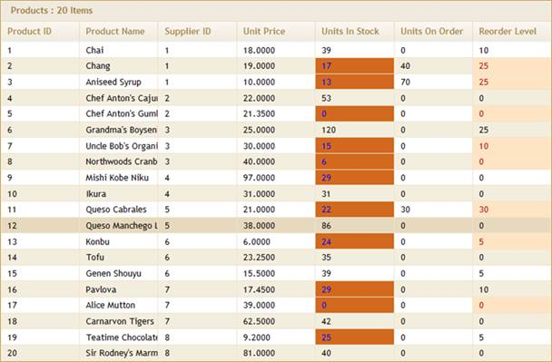

::: {style="DISPLAY: none"}
{#d2h_url_template}{#d2h_package_url style="WIDTH: 0px; DISPLAY: none; HEIGHT: 0px"}
:::

:::: {.d2h_secondary_topic style="PADDING-BOTTOM: 10pt; MARGIN: 0pt; PADDING-LEFT: 0pt; PADDING-RIGHT: 0pt; PADDING-TOP: 0pt"}
##### Server Mode {#server-mode style="tab-stops: 0pt"}

###### [5.9.2.1.1.1  ]{style="FONT-WEIGHT: normal"}Using GridBuilder[]{style="FONT-WEIGHT: normal"} {#using-gridbuilder style="tab-stops: 0pt"}

 

1.   Create a model in the application (Refer to [[Getting Started\>Adding a Model to the Application]{style="COLOR: blue"}]{.underline}).

2.   Create a strongly typed view (Refer to [[How to\>Strongly Typed View]{style="COLOR: blue"}]{.underline}).

3.   In the view, you can use its **Model** property in **Datasource()** to bind the data source.

 

+--------------------------------------------------------------------------------------------------------------------------------------------------------------------------------------------------------------------------------------------------------------+
| **[View \[ASPX\]]{style="FONT-FAMILY: 'Courier New'"}**                                                                                                                                                                                                      |
|                                                                                                                                                                                                                                                              |
| [\<%]{style="FONT-FAMILY: 'Courier New'; BACKGROUND: yellow"}[=]{style="FONT-FAMILY: 'Courier New'; COLOR: blue"}[Html.Syncfusion().Grid\<[Product]{style="COLOR: #2b91af"}\>([\"CustomGrid\"]{style="COLOR: #a31515"})]{style="FONT-FAMILY: 'Courier New'"} |
|                                                                                                                                                                                                                                                              |
| **[            .Datasource(Model)]{style="FONT-FAMILY: 'Courier New'"}**                                                                                                                                                                                     |
|                                                                                                                                                                                                                                                              |
| [            .Caption([\"Products\"]{style="COLOR: #a31515"})]{style="FONT-FAMILY: 'Courier New'"}                                                                                                                                                           |
|                                                                                                                                                                                                                                                              |
| [            .ShowRowHeader([false]{style="COLOR: blue"})]{style="FONT-FAMILY: 'Courier New'"}                                                                                                                                                               |
|                                                                                                                                                                                                                                                              |
| [            .AutoFormat([Skins]{style="COLOR: #2b91af"}.Sandune)      ]{style="FONT-FAMILY: 'Courier New'"}                                                                                                                                                 |
|                                                                                                                                                                                                                                                              |
| [            .Column(column =\>{]{style="FONT-FAMILY: 'Courier New'"}                                                                                                                                                                                        |
|                                                                                                                                                                                                                                                              |
| []{style="FONT-FAMILY: 'Courier New'"}                                                                                                                                                                                                                       |
|                                                                                                                                                                                                                                                              |
| [                column.Add(c =\> c.ProductID).HeaderText([\"Product ID\"]{style="COLOR: #a31515"});]{style="FONT-FAMILY: 'Courier New'"}                                                                                                                    |
|                                                                                                                                                                                                                                                              |
| [                column.Add(c =\> c.ProductName).HeaderText([\"Product Name\"]{style="COLOR: #a31515"});]{style="FONT-FAMILY: 'Courier New'"}                                                                                                                |
|                                                                                                                                                                                                                                                              |
| [                column.Add(c =\> c.SupplierID).HeaderText([\"Supplier ID\"]{style="COLOR: #a31515"});]{style="FONT-FAMILY: 'Courier New'"}                                                                                                                  |
|                                                                                                                                                                                                                                                              |
| [                column.Add(c =\> c.UnitPrice).HeaderText([\"Unit Price\"]{style="COLOR: #a31515"});]{style="FONT-FAMILY: 'Courier New'"}                                                                                                                    |
|                                                                                                                                                                                                                                                              |
| [                column.Add(c =\> c.UnitsInStock).HeaderText([\"Units In Stock\"]{style="COLOR: #a31515"});]{style="FONT-FAMILY: 'Courier New'"}                                                                                                             |
|                                                                                                                                                                                                                                                              |
| [                column.Add(c =\> c.UnitsOnOrder).HeaderText([\"Units On Order\"]{style="COLOR: #a31515"});]{style="FONT-FAMILY: 'Courier New'"}                                                                                                             |
|                                                                                                                                                                                                                                                              |
| [                column.Add(c =\> c.ReorderLevel).HeaderText([\"Reorder Level\"]{style="COLOR: #a31515"});]{style="FONT-FAMILY: 'Courier New'"}                                                                                                              |
|                                                                                                                                                                                                                                                              |
| [            }) ]{style="FONT-FAMILY: 'Courier New'"}                                                                                                                                                                                                        |
|                                                                                                                                                                                                                                                              |
| [        [%\>]{style="BACKGROUND: yellow"}]{style="FONT-FAMILY: 'Courier New'"}                                                                                                                                                                              |
+--------------------------------------------------------------------------------------------------------------------------------------------------------------------------------------------------------------------------------------------------------------+

 

 

 

+--------------------------------------------------------------------------------------------------------------------------------------------------------------------------------------------------------------------------------------------------------------+
| **[View \[cshtml\]]{style="FONT-FAMILY: 'Courier New'"}**                                                                                                                                                                                                    |
|                                                                                                                                                                                                                                                              |
| [\@{]{style="FONT-FAMILY: 'Courier New'; BACKGROUND: yellow"}[ ]{style="FONT-FAMILY: 'Courier New'; COLOR: blue"}[Html.Syncfusion().Grid\<[Product]{style="COLOR: #2b91af"}\>([\"CustomGrid\"]{style="COLOR: #a31515"})]{style="FONT-FAMILY: 'Courier New'"} |
|                                                                                                                                                                                                                                                              |
| **[            .Datasource(Model)]{style="FONT-FAMILY: 'Courier New'"}**                                                                                                                                                                                     |
|                                                                                                                                                                                                                                                              |
| [            .Caption([\"Products\"]{style="COLOR: #a31515"})]{style="FONT-FAMILY: 'Courier New'"}                                                                                                                                                           |
|                                                                                                                                                                                                                                                              |
| [            .ShowRowHeader([false]{style="COLOR: blue"})]{style="FONT-FAMILY: 'Courier New'"}                                                                                                                                                               |
|                                                                                                                                                                                                                                                              |
| [            .AutoFormat([Skins]{style="COLOR: #2b91af"}.Sandune)      ]{style="FONT-FAMILY: 'Courier New'"}                                                                                                                                                 |
|                                                                                                                                                                                                                                                              |
| [            .Column(column =\>{]{style="FONT-FAMILY: 'Courier New'"}                                                                                                                                                                                        |
|                                                                                                                                                                                                                                                              |
| []{style="FONT-FAMILY: 'Courier New'"}                                                                                                                                                                                                                       |
|                                                                                                                                                                                                                                                              |
| [                column.Add(c =\> c.ProductID).HeaderText([\"Product ID\"]{style="COLOR: #a31515"});]{style="FONT-FAMILY: 'Courier New'"}                                                                                                                    |
|                                                                                                                                                                                                                                                              |
| [                column.Add(c =\> c.ProductName).HeaderText([\"Product Name\"]{style="COLOR: #a31515"});]{style="FONT-FAMILY: 'Courier New'"}                                                                                                                |
|                                                                                                                                                                                                                                                              |
| [                column.Add(c =\> c.SupplierID).HeaderText([\"Supplier ID\"]{style="COLOR: #a31515"});]{style="FONT-FAMILY: 'Courier New'"}                                                                                                                  |
|                                                                                                                                                                                                                                                              |
| [                column.Add(c =\> c.UnitPrice).HeaderText([\"Unit Price\"]{style="COLOR: #a31515"});]{style="FONT-FAMILY: 'Courier New'"}                                                                                                                    |
|                                                                                                                                                                                                                                                              |
| [                column.Add(c =\> c.UnitsInStock).HeaderText([\"Units In Stock\"]{style="COLOR: #a31515"});]{style="FONT-FAMILY: 'Courier New'"}                                                                                                             |
|                                                                                                                                                                                                                                                              |
| [                column.Add(c =\> c.UnitsOnOrder).HeaderText([\"Units On Order\"]{style="COLOR: #a31515"});]{style="FONT-FAMILY: 'Courier New'"}                                                                                                             |
|                                                                                                                                                                                                                                                              |
| [                column.Add(c =\> c.ReorderLevel).HeaderText([\"Reorder Level\"]{style="COLOR: #a31515"});]{style="FONT-FAMILY: 'Courier New'"}                                                                                                              |
|                                                                                                                                                                                                                                                              |
| [            }).Render();]{style="FONT-FAMILY: 'Courier New'"}                                                                                                                                                                                               |
|                                                                                                                                                                                                                                                              |
| [        [}]{style="BACKGROUND: yellow"}]{style="FONT-FAMILY: 'Courier New'"}                                                                                                                                                                                |
+--------------------------------------------------------------------------------------------------------------------------------------------------------------------------------------------------------------------------------------------------------------+

 

4.   Configure the **QueryCellInfo()** action as shown below to perform custom formatting at the cell level.

 

 

+-----------------------------------------------------------------------------------------------------------------------------------------------------------------------------------------------------------------------------------------------------------------------------+
| **[View \[ASPX\]]{style="FONT-FAMILY: 'Courier New'"}**                                                                                                                                                                                                                     |
|                                                                                                                                                                                                                                                                             |
| []{style="FONT-FAMILY: 'Courier New'; BACKGROUND: yellow"}                                                                                                                                                                                                                  |
|                                                                                                                                                                                                                                                                             |
| [\<%]{style="FONT-FAMILY: 'Courier New'; BACKGROUND: yellow"}[=]{style="FONT-FAMILY: 'Courier New'; COLOR: blue"}[Html.Syncfusion().Grid\<Product\>(\"CustomGrid\")]{style="FONT-FAMILY: 'Courier New'"}                                                                    |
|                                                                                                                                                                                                                                                                             |
| [            .Datasource(Model)]{style="FONT-FAMILY: 'Courier New'"}                                                                                                                                                                                                        |
|                                                                                                                                                                                                                                                                             |
| [            .Caption(\"Products\")            ]{style="FONT-FAMILY: 'Courier New'"}                                                                                                                                                                                        |
|                                                                                                                                                                                                                                                                             |
| [            **.QueryCellInfo( cell =\>** ]{style="FONT-FAMILY: 'Courier New'"}                                                                                                                                                                                             |
|                                                                                                                                                                                                                                                                             |
| **[                {]{style="FONT-FAMILY: 'Courier New'"}**                                                                                                                                                                                                                 |
|                                                                                                                                                                                                                                                                             |
| **[                    [if]{style="COLOR: blue"} (cell.TableCellType == [GridTableCellType]{style="COLOR: #2b91af"}.RecordFieldCell \|\| cell.TableCellType == [GridTableCellType]{style="COLOR: #2b91af"}.AlternateRecordFieldCell)]{style="FONT-FAMILY: 'Courier New'"}** |
|                                                                                                                                                                                                                                                                             |
| **[                    {]{style="FONT-FAMILY: 'Courier New'"}**                                                                                                                                                                                                             |
|                                                                                                                                                                                                                                                                             |
| **[                        ]{style="FONT-FAMILY: 'Courier New'"}**                                                                                                                                                                                                          |
|                                                                                                                                                                                                                                                                             |
| **[                        [if]{style="COLOR: blue"} (cell.Column.MappingName == [\"UnitsInStock\"]{style="COLOR: #a31515"})]{style="FONT-FAMILY: 'Courier New'"}**                                                                                                         |
|                                                                                                                                                                                                                                                                             |
| **[                        {]{style="FONT-FAMILY: 'Courier New'"}**                                                                                                                                                                                                         |
|                                                                                                                                                                                                                                                                             |
| **[                            [if]{style="COLOR: blue"} (cell.Data.UnitsInStock \<= 30)]{style="FONT-FAMILY: 'Courier New'"}**                                                                                                                                             |
|                                                                                                                                                                                                                                                                             |
| **[                                cell.HtmlAttributes\[[\"style\"]{style="COLOR: #a31515"}\] = [\"color:Blue;background-color:Chocolate;\"]{style="COLOR: #a31515"};                                ]{style="FONT-FAMILY: 'Courier New'"}**                                |
|                                                                                                                                                                                                                                                                             |
| **[                        }]{style="FONT-FAMILY: 'Courier New'"}**                                                                                                                                                                                                         |
|                                                                                                                                                                                                                                                                             |
| **[]{style="FONT-FAMILY: 'Courier New'"}**                                                                                                                                                                                                                                  |
|                                                                                                                                                                                                                                                                             |
| **[                        [if]{style="COLOR: blue"} (cell.Column.MappingName == [\"ReorderLevel\"]{style="COLOR: #a31515"})]{style="FONT-FAMILY: 'Courier New'"}**                                                                                                         |
|                                                                                                                                                                                                                                                                             |
| **[                        {]{style="FONT-FAMILY: 'Courier New'"}**                                                                                                                                                                                                         |
|                                                                                                                                                                                                                                                                             |
| **[                            [if]{style="COLOR: blue"} (cell.Data.UnitsInStock \< 25)]{style="FONT-FAMILY: 'Courier New'"}**                                                                                                                                              |
|                                                                                                                                                                                                                                                                             |
| **[                                cell.HtmlAttributes\[[\"style\"]{style="COLOR: #a31515"}\] = [\"color:#ac0c0c;background-color:Bisque;\"]{style="COLOR: #a31515"};]{style="FONT-FAMILY: 'Courier New'"}**                                                                |
|                                                                                                                                                                                                                                                                             |
| **[                        }               ]{style="FONT-FAMILY: 'Courier New'"}**                                                                                                                                                                                          |
|                                                                                                                                                                                                                                                                             |
| **[       })]{style="FONT-FAMILY: 'Courier New'"}**[     ]{style="FONT-FAMILY: 'Courier New'"}                                                                                                                                                                              |
|                                                                                                                                                                                                                                                                             |
| [ [%\>]{style="BACKGROUND: yellow"}]{style="FONT-FAMILY: 'Courier New'"}                                                                                                                                                                                                    |
+-----------------------------------------------------------------------------------------------------------------------------------------------------------------------------------------------------------------------------------------------------------------------------+

 

+-----------------------------------------------------------------------------------------------------------------------------------------------------------------------------------------------------------------------------------------------------------------------------+
| **[View \[cshtml\]]{style="FONT-FAMILY: 'Courier New'"}**                                                                                                                                                                                                                   |
|                                                                                                                                                                                                                                                                             |
| [\@{]{style="FONT-FAMILY: 'Courier New'; BACKGROUND: yellow"}[ ]{style="FONT-FAMILY: 'Courier New'; COLOR: blue"}[Html.Syncfusion().Grid\<Product\>(\"CustomGrid\")]{style="FONT-FAMILY: 'Courier New'"}                                                                    |
|                                                                                                                                                                                                                                                                             |
| [            .Datasource(Model)]{style="FONT-FAMILY: 'Courier New'"}                                                                                                                                                                                                        |
|                                                                                                                                                                                                                                                                             |
| [            .Caption(\"Products\")            ]{style="FONT-FAMILY: 'Courier New'"}                                                                                                                                                                                        |
|                                                                                                                                                                                                                                                                             |
| [            **.QueryCellInfo( cell =\>** ]{style="FONT-FAMILY: 'Courier New'"}                                                                                                                                                                                             |
|                                                                                                                                                                                                                                                                             |
| **[                {]{style="FONT-FAMILY: 'Courier New'"}**                                                                                                                                                                                                                 |
|                                                                                                                                                                                                                                                                             |
| **[                    [if]{style="COLOR: blue"} (cell.TableCellType == [GridTableCellType]{style="COLOR: #2b91af"}.RecordFieldCell \|\| cell.TableCellType == [GridTableCellType]{style="COLOR: #2b91af"}.AlternateRecordFieldCell)]{style="FONT-FAMILY: 'Courier New'"}** |
|                                                                                                                                                                                                                                                                             |
| **[                    {]{style="FONT-FAMILY: 'Courier New'"}**                                                                                                                                                                                                             |
|                                                                                                                                                                                                                                                                             |
| **[                        ]{style="FONT-FAMILY: 'Courier New'"}**                                                                                                                                                                                                          |
|                                                                                                                                                                                                                                                                             |
| **[                        [if]{style="COLOR: blue"} (cell.Column.MappingName == [\"UnitsInStock\"]{style="COLOR: #a31515"})]{style="FONT-FAMILY: 'Courier New'"}**                                                                                                         |
|                                                                                                                                                                                                                                                                             |
| **[                        {]{style="FONT-FAMILY: 'Courier New'"}**                                                                                                                                                                                                         |
|                                                                                                                                                                                                                                                                             |
| **[                            [if]{style="COLOR: blue"} (cell.Data.UnitsInStock \<= 30)]{style="FONT-FAMILY: 'Courier New'"}**                                                                                                                                             |
|                                                                                                                                                                                                                                                                             |
| **[                                cell.HtmlAttributes\[[\"style\"]{style="COLOR: #a31515"}\] = [\"color:Blue;background-color:Chocolate;\"]{style="COLOR: #a31515"};                                ]{style="FONT-FAMILY: 'Courier New'"}**                                |
|                                                                                                                                                                                                                                                                             |
| **[                        }]{style="FONT-FAMILY: 'Courier New'"}**                                                                                                                                                                                                         |
|                                                                                                                                                                                                                                                                             |
| **[]{style="FONT-FAMILY: 'Courier New'"}**                                                                                                                                                                                                                                  |
|                                                                                                                                                                                                                                                                             |
| **[                        [if]{style="COLOR: blue"} (cell.Column.MappingName == [\"ReorderLevel\"]{style="COLOR: #a31515"})]{style="FONT-FAMILY: 'Courier New'"}**                                                                                                         |
|                                                                                                                                                                                                                                                                             |
| **[                        {]{style="FONT-FAMILY: 'Courier New'"}**                                                                                                                                                                                                         |
|                                                                                                                                                                                                                                                                             |
| **[                            [if]{style="COLOR: blue"} (cell.Data.UnitsInStock \< 25)]{style="FONT-FAMILY: 'Courier New'"}**                                                                                                                                              |
|                                                                                                                                                                                                                                                                             |
| **[                                cell.HtmlAttributes\[[\"style\"]{style="COLOR: #a31515"}\] = [\"color:#ac0c0c;background-color:Bisque;\"]{style="COLOR: #a31515"};]{style="FONT-FAMILY: 'Courier New'"}**                                                                |
|                                                                                                                                                                                                                                                                             |
| **[                        }     ]{style="FONT-FAMILY: 'Courier New'"}**                                                                                                                                                                                                    |
|                                                                                                                                                                                                                                                                             |
| **[                 })]{style="FONT-FAMILY: 'Courier New'"}**[.Render();]{style="FONT-FAMILY: 'Courier New'"}                                                                                                                                                               |
|                                                                                                                                                                                                                                                                             |
| [        [}]{style="BACKGROUND: yellow"}]{style="FONT-FAMILY: 'Courier New'"}                                                                                                                                                                                               |
+-----------------------------------------------------------------------------------------------------------------------------------------------------------------------------------------------------------------------------------------------------------------------------+

 

5.   Run the application. The grid will appear as shown below.

 

 

{border="0"}

Figure 207: Dynamic Formatting Applied to the Grid using QueryCellInfo

**[]{style="COLOR: black"}** 

**[]{style="COLOR: black"}** 

###### [5.9.2.1.1.2  ]{style="FONT-WEIGHT: normal"}Using GridPropertiesModel[]{style="FONT-WEIGHT: normal"} {#using-gridpropertiesmodel style="tab-stops: 0pt"}

1.   Create a model in the application (Refer to [[Getting Started\>Adding a Model to the Application]{style="COLOR: blue"}]{.underline}).

2.   Add the following code in the **Index.aspx** file to create the Grid control in the view.

 

+-------------------------------------------------------------------------------------------------------------------------------------------------------------------------------------------------------------------------------------------------------------------------------------------------------------------+
| **[View \[ASPX\]]{style="FONT-FAMILY: 'Courier New'; COLOR: black"}[]{style="FONT-FAMILY: 'Courier New'"}**                                                                                                                                                                                                       |
|                                                                                                                                                                                                                                                                                                                   |
| [\<%]{style="FONT-FAMILY: 'Courier New'; BACKGROUND: yellow"}[=]{style="FONT-FAMILY: 'Courier New'; COLOR: blue"}[Html.Syncfusion().Grid\<[Product]{style="COLOR: #2b91af"}\>([\"Orders_Grid\"]{style="COLOR: #a31515"},[\"GridModel\"]{style="COLOR: #a31515"}, column=\> {]{style="FONT-FAMILY: 'Courier New'"} |
|                                                                                                                                                                                                                                                                                                                   |
| [                    column.Add(c =\> c.ProductID).HeaderText([\"Product ID\"]{style="COLOR: #a31515"});]{style="FONT-FAMILY: 'Courier New'"}                                                                                                                                                                     |
|                                                                                                                                                                                                                                                                                                                   |
| [                    column.Add(c =\> c.ProductName).HeaderText([\"Product Name\"]{style="COLOR: #a31515"});]{style="FONT-FAMILY: 'Courier New'"}                                                                                                                                                                 |
|                                                                                                                                                                                                                                                                                                                   |
| [                    column.Add(c =\> c.SupplierID).HeaderText([\"Supplier ID\"]{style="COLOR: #a31515"});]{style="FONT-FAMILY: 'Courier New'"}                                                                                                                                                                   |
|                                                                                                                                                                                                                                                                                                                   |
| [                    column.Add(c =\> c.UnitPrice).HeaderText([\"Unit Price\"]{style="COLOR: #a31515"});]{style="FONT-FAMILY: 'Courier New'"}                                                                                                                                                                     |
|                                                                                                                                                                                                                                                                                                                   |
| [                    column.Add(c =\> c.UnitsInStock).HeaderText([\"Units In Stock\"]{style="COLOR: #a31515"});]{style="FONT-FAMILY: 'Courier New'"}                                                                                                                                                              |
|                                                                                                                                                                                                                                                                                                                   |
| [                    column.Add(c =\> c.UnitsOnOrder).HeaderText([\"Units On Order\"]{style="COLOR: #a31515"});]{style="FONT-FAMILY: 'Courier New'"}                                                                                                                                                              |
|                                                                                                                                                                                                                                                                                                                   |
| [                    column.Add(c =\> c.ReorderLevel).HeaderText([\"Reorder Level\"]{style="COLOR: #a31515"});    })[%\>]{style="BACKGROUND: yellow"}]{style="FONT-FAMILY: 'Courier New'"}                                                                                                                        |
+-------------------------------------------------------------------------------------------------------------------------------------------------------------------------------------------------------------------------------------------------------------------------------------------------------------------+

 

::: {align="center"}
+------------------------------------------------------------------------------------------------------------------------------------------------------------------------------------------------------------------------------------------------------------------------------------------------------------------------------------------------------------------------------------------------------------------------------------------------------------------------------+
| **[View \[cshtml\]]{style="FONT-FAMILY: 'Courier New'"}**                                                                                                                                                                                                                                                                                                                                                                                                                    |
|                                                                                                                                                                                                                                                                                                                                                                                                                                                                              |
| [ ]{style="FONT-FAMILY: 'Courier New'"}[@(]{style="FONT-FAMILY: Consolas; BACKGROUND: yellow; FONT-SIZE: 9.5pt"}[new]{style="FONT-FAMILY: Consolas; COLOR: blue; FONT-SIZE: 9.5pt"}[ [HtmlString]{style="COLOR: #2b91af"}(]{style="FONT-FAMILY: Consolas; FONT-SIZE: 9.5pt"}[Html.Syncfusion().Grid\<[Product]{style="COLOR: #2b91af"}\>([\"Orders_Grid\"]{style="COLOR: #a31515"},[\"GridModel\"]{style="COLOR: #a31515"}, column=\> {]{style="FONT-FAMILY: 'Courier New'"} |
|                                                                                                                                                                                                                                                                                                                                                                                                                                                                              |
| [                    column.Add(c =\> c.ProductID).HeaderText([\"Product ID\"]{style="COLOR: #a31515"});]{style="FONT-FAMILY: 'Courier New'"}                                                                                                                                                                                                                                                                                                                                |
|                                                                                                                                                                                                                                                                                                                                                                                                                                                                              |
| [                    column.Add(c =\> c.ProductName).HeaderText([\"Product Name\"]{style="COLOR: #a31515"});]{style="FONT-FAMILY: 'Courier New'"}                                                                                                                                                                                                                                                                                                                            |
|                                                                                                                                                                                                                                                                                                                                                                                                                                                                              |
| [                    column.Add(c =\> c.SupplierID).HeaderText([\"Supplier ID\"]{style="COLOR: #a31515"});]{style="FONT-FAMILY: 'Courier New'"}                                                                                                                                                                                                                                                                                                                              |
|                                                                                                                                                                                                                                                                                                                                                                                                                                                                              |
| [                    column.Add(c =\> c.UnitPrice).HeaderText([\"Unit Price\"]{style="COLOR: #a31515"});]{style="FONT-FAMILY: 'Courier New'"}                                                                                                                                                                                                                                                                                                                                |
|                                                                                                                                                                                                                                                                                                                                                                                                                                                                              |
| [                    column.Add(c =\> c.UnitsInStock).HeaderText([\"Units In Stock\"]{style="COLOR: #a31515"});]{style="FONT-FAMILY: 'Courier New'"}                                                                                                                                                                                                                                                                                                                         |
|                                                                                                                                                                                                                                                                                                                                                                                                                                                                              |
| [                    column.Add(c =\> c.UnitsOnOrder).HeaderText([\"Units On Order\"]{style="COLOR: #a31515"});]{style="FONT-FAMILY: 'Courier New'"}                                                                                                                                                                                                                                                                                                                         |
|                                                                                                                                                                                                                                                                                                                                                                                                                                                                              |
| [                    column.Add(c =\> c.ReorderLevel).HeaderText([\"Reorder Level\"]{style="COLOR: #a31515"});    }).]{style="FONT-FAMILY: 'Courier New'"}[ToString())[)]{style="BACKGROUND: yellow"}    ]{style="FONT-FAMILY: Consolas; FONT-SIZE: 9.5pt"}[    ]{style="FONT-FAMILY: 'Courier New'"}[]{style="FONT-FAMILY: 'Courier New'"}                                                                                                                                  |
+------------------------------------------------------------------------------------------------------------------------------------------------------------------------------------------------------------------------------------------------------------------------------------------------------------------------------------------------------------------------------------------------------------------------------------------------------------------------------+
:::

[                                                                     ]{style="FONT-FAMILY: 'Calibri','sans-serif'"}[  ]{style="FONT-FAMILY: Consolas; FONT-SIZE: 9.5pt"}**[]{style="FONT-FAMILY: 'Calibri','sans-serif'"}**

[]{style="FONT-FAMILY: Consolas; FONT-SIZE: 9.5pt"} 

3.   Create a **GridPropertiesModel** in the **Index** method. Assign grid properties in this model and pass the model from the controller to the view using the **ViewData** class as shown below.

 

+--------------------------------------------------------------------------------------------------------------------------------------------------------------------------------+
| **[Controller]{style="FONT-FAMILY: 'Courier New'"}**                                                                                                                           |
|                                                                                                                                                                                |
| []{style="FONT-FAMILY: 'Courier New'"}                                                                                                                                         |
|                                                                                                                                                                                |
| [        [// Create a model and assign a data source.]{style="COLOR: green"}]{style="FONT-FAMILY: 'Courier New'"}                                                              |
|                                                                                                                                                                                |
| [        [GridPropertiesModel]{style="COLOR: #2b91af"} model = [new]{style="COLOR: blue"} [GridPropertiesModel]{style="COLOR: #2b91af"}()]{style="FONT-FAMILY: 'Courier New'"} |
|                                                                                                                                                                                |
| [        {]{style="FONT-FAMILY: 'Courier New'"}                                                                                                                                |
|                                                                                                                                                                                |
| [  DataSource=[new]{style="COLOR: blue"} [NorthwindDataClassesDataContext]{style="COLOR: #2b91af"}().Products,]{style="FONT-FAMILY: 'Courier New'"}                            |
|                                                                                                                                                                                |
| [            Caption=[\"Product\"]{style="COLOR: #a31515"} ,]{style="FONT-FAMILY: 'Courier New'"}                                                                              |
|                                                                                                                                                                                |
| [            AutoFormat=[Skins]{style="COLOR: #2b91af"}.Sandune]{style="FONT-FAMILY: 'Courier New'"}                                                                           |
|                                                                                                                                                                                |
| []{style="FONT-FAMILY: 'Courier New'"}                                                                                                                                         |
|                                                                                                                                                                                |
| [        };]{style="FONT-FAMILY: 'Courier New'"}                                                                                                                               |
+--------------------------------------------------------------------------------------------------------------------------------------------------------------------------------+

 

4.   Create an action for the **QueryCellInfo()** action as shown below to perform custom formatting in cell level.

 

+-----------------------------------------------------------------------------------------------------------------------------------------------------------------------------------------------------------------------------------------------------------------+
| **[Controller]{style="FONT-FAMILY: 'Courier New'"}**                                                                                                                                                                                                            |
|                                                                                                                                                                                                                                                                 |
| **[]{style="FONT-FAMILY: 'Courier New'"}**                                                                                                                                                                                                                      |
|                                                                                                                                                                                                                                                                 |
| [        \[[ChildActionOnly]{style="COLOR: #2b91af"}\]]{style="FONT-FAMILY: 'Courier New'"}                                                                                                                                                                     |
|                                                                                                                                                                                                                                                                 |
| [        [public]{style="COLOR: blue"} [void]{style="COLOR: blue"} QueryAction([GridTableCell]{style="COLOR: #2b91af"}\<[Product]{style="COLOR: #2b91af"}\> cell)]{style="FONT-FAMILY: 'Courier New'"}                                                          |
|                                                                                                                                                                                                                                                                 |
| [        {]{style="FONT-FAMILY: 'Courier New'"}                                                                                                                                                                                                                 |
|                                                                                                                                                                                                                                                                 |
| [            [// TableCellType is validation. Check for Record field cells.]{style="COLOR: green"}]{style="FONT-FAMILY: 'Courier New'"}                                                                                                                         |
|                                                                                                                                                                                                                                                                 |
| [            [if]{style="COLOR: blue"} (cell.TableCellType == [GridTableCellType]{style="COLOR: #2b91af"}.RecordFieldCell \|\| cell.TableCellType == [GridTableCellType]{style="COLOR: #2b91af"}.AlternateRecordFieldCell)]{style="FONT-FAMILY: 'Courier New'"} |
|                                                                                                                                                                                                                                                                 |
| [            {]{style="FONT-FAMILY: 'Courier New'"}                                                                                                                                                                                                             |
|                                                                                                                                                                                                                                                                 |
| [        ]{style="FONT-FAMILY: 'Courier New'"}                                                                                                                                                                                                                  |
|                                                                                                                                                                                                                                                                 |
| [                [if]{style="COLOR: blue"} (cell.Column.MappingName == [\"UnitsInStock\"]{style="COLOR: #a31515"})]{style="FONT-FAMILY: 'Courier New'"}                                                                                                         |
|                                                                                                                                                                                                                                                                 |
| [                {]{style="FONT-FAMILY: 'Courier New'"}                                                                                                                                                                                                         |
|                                                                                                                                                                                                                                                                 |
| []{style="FONT-FAMILY: 'Courier New'"}                                                                                                                                                                                                                          |
|                                                                                                                                                                                                                                                                 |
| [                    [if]{style="COLOR: blue"} (cell.Data.UnitsInStock \<= 30)]{style="FONT-FAMILY: 'Courier New'"}                                                                                                                                             |
|                                                                                                                                                                                                                                                                 |
| [                    {]{style="FONT-FAMILY: 'Courier New'"}                                                                                                                                                                                                     |
|                                                                                                                                                                                                                                                                 |
| [                        [// Apply background color and font style for the record field cell.]{style="COLOR: green"}]{style="FONT-FAMILY: 'Courier New'"}                                                                                                       |
|                                                                                                                                                                                                                                                                 |
| [                        cell.HtmlAttributes\[[\"style\"]{style="COLOR: #a31515"}\] = [\"color:Blue;background-color:Chocolate;\"]{style="COLOR: #a31515"};]{style="FONT-FAMILY: 'Courier New'"}                                                                |
|                                                                                                                                                                                                                                                                 |
| [                    }]{style="FONT-FAMILY: 'Courier New'"}                                                                                                                                                                                                     |
|                                                                                                                                                                                                                                                                 |
| [                }]{style="FONT-FAMILY: 'Courier New'"}                                                                                                                                                                                                         |
|                                                                                                                                                                                                                                                                 |
| []{style="FONT-FAMILY: 'Courier New'"}                                                                                                                                                                                                                          |
|                                                                                                                                                                                                                                                                 |
| [                [if]{style="COLOR: blue"} (cell.Column.MappingName == [\"ReorderLevel\"]{style="COLOR: #a31515"})]{style="FONT-FAMILY: 'Courier New'"}                                                                                                         |
|                                                                                                                                                                                                                                                                 |
| [                {]{style="FONT-FAMILY: 'Courier New'"}                                                                                                                                                                                                         |
|                                                                                                                                                                                                                                                                 |
| [                    [if]{style="COLOR: blue"} (cell.Data.UnitsInStock \< 25)]{style="FONT-FAMILY: 'Courier New'"}                                                                                                                                              |
|                                                                                                                                                                                                                                                                 |
| [                    {]{style="FONT-FAMILY: 'Courier New'"}                                                                                                                                                                                                     |
|                                                                                                                                                                                                                                                                 |
| [                        [// Apply background color and font style for the record field cell.]{style="COLOR: green"}]{style="FONT-FAMILY: 'Courier New'"}                                                                                                       |
|                                                                                                                                                                                                                                                                 |
| [                        cell.HtmlAttributes\[[\"style\"]{style="COLOR: #a31515"}\] = [\"color:#ac0c0c;background-color:Bisque;\"]{style="COLOR: #a31515"};]{style="FONT-FAMILY: 'Courier New'"}                                                                |
|                                                                                                                                                                                                                                                                 |
| [                    }]{style="FONT-FAMILY: 'Courier New'"}                                                                                                                                                                                                     |
|                                                                                                                                                                                                                                                                 |
| [                }]{style="FONT-FAMILY: 'Courier New'"}                                                                                                                                                                                                         |
|                                                                                                                                                                                                                                                                 |
| []{style="FONT-FAMILY: 'Courier New'"}                                                                                                                                                                                                                          |
|                                                                                                                                                                                                                                                                 |
| [            }]{style="FONT-FAMILY: 'Courier New'"}                                                                                                                                                                                                             |
|                                                                                                                                                                                                                                                                 |
| []{style="FONT-FAMILY: 'Courier New'"}                                                                                                                                                                                                                          |
|                                                                                                                                                                                                                                                                 |
| [        }]{style="FONT-FAMILY: 'Courier New'"}                                                                                                                                                                                                                 |
+-----------------------------------------------------------------------------------------------------------------------------------------------------------------------------------------------------------------------------------------------------------------+

 

5.   Bind the action to **GridPropertiesModel** and pass the model to the view using the **View Data** method as given below:

 

+-----------------------------------------------------------------------------------------------------------------------------------------------------------------------------------------------------------------------------------------------------------------------------------------+
| **[Controller]{style="FONT-FAMILY: 'Courier New'"}**                                                                                                                                                                                                                                    |
|                                                                                                                                                                                                                                                                                         |
| []{style="FONT-FAMILY: 'Courier New'; COLOR: #2b91af"}                                                                                                                                                                                                                                  |
|                                                                                                                                                                                                                                                                                         |
| [           GridPropertiesModel]{style="FONT-FAMILY: 'Courier New'; COLOR: #2b91af"}[\<[Product]{style="COLOR: #2b91af"}\> model = [new]{style="COLOR: blue"} [GridPropertiesModel]{style="COLOR: #2b91af"}\<[Product]{style="COLOR: #2b91af"}\>()]{style="FONT-FAMILY: 'Courier New'"} |
|                                                                                                                                                                                                                                                                                         |
| [            {]{style="FONT-FAMILY: 'Courier New'"}                                                                                                                                                                                                                                     |
|                                                                                                                                                                                                                                                                                         |
| [                DataSource = [new]{style="COLOR: blue"} [NorthwindDataContext]{style="COLOR: #2b91af"}().Products.Take(20).ToList(),]{style="FONT-FAMILY: 'Courier New'"}                                                                                                              |
|                                                                                                                                                                                                                                                                                         |
| [                Caption = [\"Product\"]{style="COLOR: #a31515"},]{style="FONT-FAMILY: 'Courier New'"}                                                                                                                                                                                  |
|                                                                                                                                                                                                                                                                                         |
| [                AutoFormat = [Skins]{style="COLOR: #2b91af"}.Sandune]{style="FONT-FAMILY: 'Courier New'"}                                                                                                                                                                              |
|                                                                                                                                                                                                                                                                                         |
| [            };]{style="FONT-FAMILY: 'Courier New'"}                                                                                                                                                                                                                                    |
|                                                                                                                                                                                                                                                                                         |
| **[            model.QueryCellInfo = QueryAction;]{style="FONT-FAMILY: 'Courier New'"}**                                                                                                                                                                                                |
|                                                                                                                                                                                                                                                                                         |
| [            ViewData\[[\"GridModel\"]{style="COLOR: #a31515"}\] = model;]{style="FONT-FAMILY: 'Courier New'"}                                                                                                                                                                          |
+-----------------------------------------------------------------------------------------------------------------------------------------------------------------------------------------------------------------------------------------------------------------------------------------+

[]{style="FONT-FAMILY: Consolas; FONT-SIZE: 9.5pt"} 

[]{style="FONT-FAMILY: Consolas; FONT-SIZE: 9.5pt"} 

6.   Run the application. The grid will appear as shown below.

 

{border="0"}

Figure 208: Dynamic Formatting Applied to Grid Using QueryCellInfo

 

[]{#related-topics}
::::
