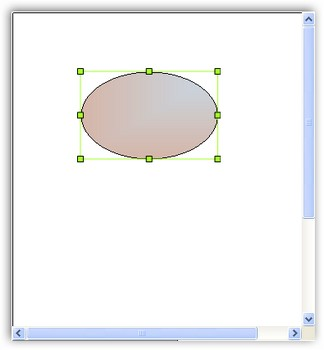
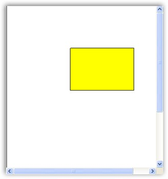

::: {style="DISPLAY: none"}
{#d2h_url_template}{#d2h_package_url style="WIDTH: 0px; DISPLAY: none; HEIGHT: 0px"}
:::

::::::::::::::::: {.d2h_secondary_topic style="PADDING-BOTTOM: 10pt; MARGIN: 0pt; PADDING-LEFT: 0pt; PADDING-RIGHT: 0pt; PADDING-TOP: 0pt"}
#### Server-Side Events {#server-side-events style="tab-stops: 0pt"}

[]{style="FONT-FAMILY: 'Trebuchet MS','sans-serif'; COLOR: #15428b; FONT-SIZE: 9pt"} 

DiagramWebControl has the following server-side events.

[]{style="FONT-FAMILY: 'Trebuchet MS','sans-serif'; COLOR: #15428b; FONT-SIZE: 9pt"} 

[·      ]{style="FONT-FAMILY: Symbol"}CallbackRefresh

[·      ]{style="FONT-FAMILY: Symbol"}CanvaClick

[·      ]{style="FONT-FAMILY: Symbol"}DiagramZoom

[·      ]{style="FONT-FAMILY: Symbol"}Disposed

[·      ]{style="FONT-FAMILY: Symbol"}ImageGridCellUpdating

[·      ]{style="FONT-FAMILY: Symbol"}Init

[·      ]{style="FONT-FAMILY: Symbol"}KeyDown

[·      ]{style="FONT-FAMILY: Symbol"}KeyPress

[·      ]{style="FONT-FAMILY: Symbol"}LayoutUpdated

[·      ]{style="FONT-FAMILY: Symbol"}Load

[·      ]{style="FONT-FAMILY: Symbol"}PostbackDescriptors

[·      ]{style="FONT-FAMILY: Symbol"}PreRender

[·      ]{style="FONT-FAMILY: Symbol"}Unload

[·      ]{style="FONT-FAMILY: Symbol"}DataBinding

[·      ]{style="FONT-FAMILY: Symbol"}NodeChangeText

[·      ]{style="FONT-FAMILY: Symbol"}NodeClick

[·      ]{style="FONT-FAMILY: Symbol"}NodeDoubleClick

[·      ]{style="FONT-FAMILY: Symbol"}NodeDrop

[·      ]{style="FONT-FAMILY: Symbol"}NodeDropFromPalette

[·      ]{style="FONT-FAMILY: Symbol"}NodeResize

[·      ]{style="FONT-FAMILY: Symbol"}NodeUpdate

[]{style="FONT-FAMILY: 'Trebuchet MS','sans-serif'; COLOR: #15428b; FONT-SIZE: 9pt"} 

CallbackRefresh Event

[]{style="FONT-FAMILY: 'Trebuchet MS','sans-serif'; COLOR: #15428b; FONT-SIZE: 9pt"} 

This is a server-side event that is triggered with the client-side args, after calling client object Refresh( sArg ) method.

 

The event handler receives an argument of type **Syncfusion.Web.UI.WebControls.Shared.CallbackEventArgs** containing data related to this event. The following Syncfusion.Web.UI.WebControls.Shared.CallbackEventArgs member provides information specific to this event.

[]{style="FONT-FAMILY: 'Trebuchet MS','sans-serif'; COLOR: #15428b; FONT-SIZE: 9pt"} 

::: {align="center"}
+-----------------------------------+-----------------------------------+
|                                   |                                   |
|                                   |                                   |
| Member                            | Description                       |
+-----------------------------------+-----------------------------------+
| CallbackArgument                  | The arguments sent by the client. |
+-----------------------------------+-----------------------------------+
:::

[]{style="FONT-FAMILY: 'Trebuchet MS','sans-serif'; COLOR: #15428b; FONT-SIZE: 9pt"} 

CanvaClick Event

[]{style="FONT-FAMILY: 'Trebuchet MS','sans-serif'; COLOR: #15428b; FONT-SIZE: 9pt"} 

This is a server-side event that is triggered after a canva is clicked.

 

The event handler receives an argument of type **Syncfusion.Web.UI.WebControls.Diagram.CanvaClickEventArgs** containing data related to this event. The following Syncfusion.Web.UI.WebControls.Diagram.CanvaClickEventArgs members provide information specific to this event.

[]{style="FONT-FAMILY: 'Trebuchet MS','sans-serif'; COLOR: #15428b; FONT-SIZE: 9pt"} 

::: {align="center"}
+-----------------------------------+-----------------------------------------------------------------+
|                                   |                                                                 |
|                                   |                                                                 |
| Member                            | Description                                                     |
+-----------------------------------+-----------------------------------------------------------------+
| AltKey                            | Indicates whether the ALT key was pressed.                      |
+-----------------------------------+-----------------------------------------------------------------+
| CtrlKey                           | Indicates whether the CTRL key was pressed.                     |
+-----------------------------------+-----------------------------------------------------------------+
| DiagramWebControl                 | Current DiagramWebControl                                       |
+-----------------------------------+-----------------------------------------------------------------+
| MouseXInModel                     | Mouse X position in current model.                              |
+-----------------------------------+-----------------------------------------------------------------+
| MouseYInModel                     | Mouse Y position in current model.                              |
+-----------------------------------+-----------------------------------------------------------------+
| PosX                              | Mouse X position in current DiagramWebControl for current view. |
+-----------------------------------+-----------------------------------------------------------------+
| PosY                              | Mouse Y position in current DiagramWebControl for current view. |
+-----------------------------------+-----------------------------------------------------------------+
| ScrollLeft                        | Left scroll position in current DiagramWebControl.              |
+-----------------------------------+-----------------------------------------------------------------+
| ScrollTop                         | Top scroll position in current DiagramWebControl.               |
+-----------------------------------+-----------------------------------------------------------------+
| ShiftKey                          | Indicates whether the SHIFT key was pressed.                    |
+-----------------------------------+-----------------------------------------------------------------+
:::

[]{style="FONT-FAMILY: 'Trebuchet MS','sans-serif'; COLOR: #15428b; FONT-SIZE: 9pt"} 

DiagramZoom Event

[]{style="FONT-FAMILY: 'Trebuchet MS','sans-serif'; COLOR: #15428b; FONT-SIZE: 9pt"} 

This is a server-side event that is triggered after the diagram zoom operation.

 

The event handler receives an argument of type **Syncfusion.Web.UI.WebControls.Diagram.DiagramZoomEventArgs** containing data related to this event. The following Syncfusion.Web.UI.WebControls.Diagram.DiagramZoomEventArgs members provide information specific to this event.

 

::: {align="center"}
  ------------------- ----------------------------------------------------
  Member              Description
  DiagramWebControl   Current DiagramWebControl
  MouseXInModel       Mouse X position in current model.
  MouseYInModel       Mouse Y position in current model.
  ScrollLeft          Left scroll position in current DiagramWebControl.
  ScrollTop           Top scroll position in current DiagramWebControl.
  Zoom                Current zoom value in current DiagramWebControl.
  ------------------- ----------------------------------------------------
:::

[]{style="FONT-FAMILY: 'Trebuchet MS','sans-serif'; COLOR: #15428b; FONT-SIZE: 9pt"} 

ImageGridCellUpdating Event

[]{style="FONT-FAMILY: 'Trebuchet MS','sans-serif'; COLOR: #15428b; FONT-SIZE: 9pt"} 

This is a server-side event that is triggered when the client\'s image grid image needs to be updated.

 

The event handler receives an argument of type **Syncfusion.Web.UI.WebControls.Diagram.ImageGridCellUpdatingEventArgs** containing data related to this event. The following Syncfusion.Web.UI.WebControls.Diagram.ImageGridCellUpdatingEventArgs members provide information specific to this event.

[]{style="FONT-FAMILY: 'Trebuchet MS','sans-serif'; COLOR: #15428b; FONT-SIZE: 9pt"} 

::: {align="center"}
  --------------- ----------------------------------------
  Member          Description
  Graphics        Graphics to draw on.
  ImageOrigin     Image origin in document.
  Magnification   DiagramWebControl magnification value.
  --------------- ----------------------------------------
:::

[]{style="FONT-FAMILY: 'Trebuchet MS','sans-serif'; COLOR: #15428b; FONT-SIZE: 9pt"} 

KeyDown Event

[]{style="FONT-FAMILY: 'Trebuchet MS','sans-serif'; COLOR: #15428b; FONT-SIZE: 9pt"} 

This is a server-side event that is triggered in response to a key down event.

 

The event handler receives an argument of type **Syncfusion.Web.UI.WebControls.Diagram.KeybEventArgs** containing data related to this event. The following Syncfusion.Web.UI.WebControls.Diagram.KeybEventArgs members provide information specific to this event.

[]{style="FONT-FAMILY: 'Trebuchet MS','sans-serif'; COLOR: #15428b; FONT-SIZE: 9pt"} 

::: {align="center"}
  ------------------- ----------------------------------------------------
  Member              Description
  AltKey              Indicates whether the ALT key was pressed.
  CtrlKey             Indicates whether the CTRL key was pressed.
  DiagramWebControl   Current DiagramWebControl
  KeyCode             Unicode key character
  MouseXInModel       Mouse X position in current model.
  MouseYInModel       Mouse Y position in current model.
  ScrollLeft          Left scroll position in current DiagramWebControl.
  ScrollTop           Top scroll position in current DiagramWebControl.
  ShiftKey            Indicates whether the SHIFT key was pressed.
  ------------------- ----------------------------------------------------
:::

[]{style="FONT-FAMILY: 'Trebuchet MS','sans-serif'; COLOR: #15428b; FONT-SIZE: 9pt"} 

KeyPress Event

[]{style="FONT-FAMILY: 'Trebuchet MS','sans-serif'; COLOR: #15428b; FONT-SIZE: 9pt"} 

This is a server-side event that is triggered in response to a key press event.

 

The event handler receives an argument of type **Syncfusion.Web.UI.WebControls.Diagram.KeybEventArgs** containing data related to this event. The following Syncfusion.Web.UI.WebControls.Diagram.KeybEventArgs members provide information specific to this event.

[]{style="FONT-FAMILY: 'Trebuchet MS','sans-serif'; COLOR: #15428b; FONT-SIZE: 9pt"} 

::: {align="center"}
  ------------------- ----------------------------------------------------
  Member              Description
  AltKey              Indicates whether the ALT key was pressed.
  CtrlKey             Indicates whether the CTRL key was pressed.
  DiagramWebControl   Current DiagramWebControl
  KeyCode             Unicode key character
  MouseXInModel       Mouse X position in current model.
  MouseYInModel       Mouse Y position in current model.
  ScrollLeft          Left scroll position in current DiagramWebControl.
  ScrollTop           Top scroll position in current DiagramWebControl.
  ShiftKey            Indicates whether the SHIFT key was pressed.
  ------------------- ----------------------------------------------------
:::

[]{style="FONT-FAMILY: 'Trebuchet MS','sans-serif'; COLOR: #15428b; FONT-SIZE: 9pt"} 

KeyUp Event

[]{style="FONT-FAMILY: 'Trebuchet MS','sans-serif'; COLOR: #15428b; FONT-SIZE: 9pt"} 

This is a server-side event that is triggered in response to a key press event.

 

The event handler receives an argument of type **Syncfusion.Web.UI.WebControls.Diagram.KeybEventArgs** containing data related to this event. The following Syncfusion.Web.UI.WebControls.Diagram.KeybEventArgs members provide information specific to this event.

[]{style="FONT-FAMILY: 'Trebuchet MS','sans-serif'; COLOR: #15428b; FONT-SIZE: 9pt"} 

::: {align="center"}
  ------------------- ----------------------------------------------------
  Member              Description
  AltKey              Indicates whether the ALT key was pressed.
  CtrlKey             Indicates whether the CTRL key was pressed.
  DiagramWebControl   Current DiagramWebControl
  KeyCode             Unicode key character
  MouseXInModel       Mouse X position in current model.
  MouseYInModel       Mouse Y position in current model.
  ScrollLeft          Left scroll position in current DiagramWebControl.
  ScrollTop           Top scroll position in current DiagramWebControl.
  ShiftKey            Indicates whether the SHIFT key was pressed.
  ------------------- ----------------------------------------------------
:::

[]{style="FONT-FAMILY: 'Trebuchet MS','sans-serif'; COLOR: #15428b; FONT-SIZE: 9pt"} 

NodeChangeText Event

[]{style="FONT-FAMILY: 'Trebuchet MS','sans-serif'; COLOR: #15428b; FONT-SIZE: 9pt"} 

This is a server-side event that is triggered when the node text is changed.

 

The event handler receives an argument of type **Syncfusion.Web.UI.WebControls.Diagram.NodeChangeTextEventArgs** containing data related to this event. The following Syncfusion.Web.UI.WebControls.Diagram.NodeChangeTextEventArgs members provide information specific to this event.

[]{style="FONT-FAMILY: 'Trebuchet MS','sans-serif'; COLOR: #15428b; FONT-SIZE: 9pt"} 

::: {align="center"}
  ------------------- --------------------------------------------------------------
  Member              Description
  AltKey              Indicates whether the ALT key was pressed.
  CtrlKey             Indicates whether the CTRL key was pressed.
  DiagramWebControl   Current DiagramWebControl.
  KeyCode             Unicode key character.
  MouseXInModel       Mouse X position in current model.
  MouseYInModel       Mouse Y position in current model.
  NewText             New node text
  Node                Node on which some action has been effectuated.
  NodeFullName        Full name of node on which some action has been effectuated.
  NodeName            Name of node on which some action has been effectuated.
  NodeUnderMouse      Node which is under the mouse cursor.
  OffsetX             X offset
  OffsetY             Y offset
  OldText             Old node text
  ScrollLeft          Left scroll position in current DiagramWebControl.
  ScrollTop           Top scroll position in current DiagramWebControl.
  ShiftKey            Indicates whether the SHIFT key was pressed.
  ------------------- --------------------------------------------------------------
:::

[]{style="FONT-FAMILY: 'Trebuchet MS','sans-serif'; COLOR: #15428b; FONT-SIZE: 9pt"} 

NodeClick Event

[]{style="FONT-FAMILY: 'Trebuchet MS','sans-serif'; COLOR: #15428b; FONT-SIZE: 9pt"} 

This is a server-side event that is triggered after a node is clicked.

 

The event handler receives an argument of type **Syncfusion.Web.UI.WebControls.Diagram.NodeClickEventArgs** containing data related to this event. The following Syncfusion.Web.UI.WebControls.Diagram.NodeClickEventArgs members provide information specific to this event.

[]{style="FONT-FAMILY: 'Trebuchet MS','sans-serif'; COLOR: #15428b; FONT-SIZE: 9pt"} 

::: {align="center"}
  Member              Description
  ------------------- --------------------------------------------------------------
  AltKey              Indicates whether the ALT key was pressed.
  ControlPoint        Gets active ControlPoint.
  ControlPointId      Gets ControlPoint id.
  CtrlKey             Indicates whether the CTRL key was pressed.
  DiagramWebControl   Current DiagramWebControl.
  EndPoint            Gets active EndPoint.
  KeyCode             Unicode key character
  MouseXInModel       Mouse X position in current model.
  MouseYInModel       Mouse Y position in current model.
  Node                Node on which some action has been effectuated.
  NodeFullName        Full name of node on which some action has been effectuated.
  NodeName            Name of node on which some action has been effectuated.
  NodeUnderMouse      Node which is under the mouse cursor.
  OffsetX             X Offset
  OffsetY             Y Offset
  PathNode            Gets PathNode.
  PathPoint           Gets active ControlPoint in local coordinates.
  PathPointId         Gets PathPointId.
  ScrollLeft          Left scroll position in current DiagramWebControl.
  ScrollTop           Top scroll position in current DiagramWebControl.
  ShiftKey            Indicates whether the SHIFT key was pressed.
:::

[]{style="FONT-FAMILY: 'Trebuchet MS','sans-serif'; COLOR: #15428b; FONT-SIZE: 9pt"} 

The following code example illustrates how to change the properties of a diagram node when the mouse is clicked over the node.

[]{style="FONT-FAMILY: 'Trebuchet MS','sans-serif'; COLOR: #15428b; FONT-SIZE: 9pt"} 

+---------------------------------------------------------------------------------------------------------------------------------------------------------------------------------------------------------------------------------------------------+
| **[\[C#\]]{style="FONT-FAMILY: 'Courier New'"}**                                                                                                                                                                                                  |
|                                                                                                                                                                                                                                                   |
| []{style="FONT-FAMILY: 'Courier New'"}                                                                                                                                                                                                            |
|                                                                                                                                                                                                                                                   |
| [this]{style="FONT-FAMILY: 'Courier New'; COLOR: blue"}[.DiagramWebControl1.NodeClick += [new]{style="COLOR: blue"} [NodeClickEventHandler]{style="COLOR: #2b91af"}(DiagramWebControl1_NodeClick);]{style="FONT-FAMILY: 'Courier New'"}           |
|                                                                                                                                                                                                                                                   |
| [protected]{style="FONT-FAMILY: 'Courier New'; COLOR: blue"}[ [void]{style="COLOR: blue"} DiagramWebControl1_NodeClick([object]{style="COLOR: blue"} sender, [NodeClickEventArgs]{style="COLOR: #2b91af"} e)]{style="FONT-FAMILY: 'Courier New'"} |
|                                                                                                                                                                                                                                                   |
| [{]{style="FONT-FAMILY: 'Courier New'"}                                                                                                                                                                                                           |
|                                                                                                                                                                                                                                                   |
| [ellipse.FillStyle.Color = System.Drawing.[Color]{style="COLOR: #2b91af"}.SaddleBrown;]{style="FONT-FAMILY: 'Courier New'"}                                                                                                                       |
|                                                                                                                                                                                                                                                   |
| [ellipse.FillStyle.ColorAlphaFactor = 100;]{style="FONT-FAMILY: 'Courier New'"}                                                                                                                                                                   |
|                                                                                                                                                                                                                                                   |
| [ellipse.FillStyle.ForeColor = System.Drawing.[Color]{style="COLOR: #2b91af"}.SteelBlue;]{style="FONT-FAMILY: 'Courier New'"}                                                                                                                     |
|                                                                                                                                                                                                                                                   |
| [ellipse.FillStyle.ForeColorAlphaFactor = 70;]{style="FONT-FAMILY: 'Courier New'"}                                                                                                                                                                |
|                                                                                                                                                                                                                                                   |
| [ellipse.FillStyle.Type = [FillStyleType]{style="COLOR: #2b91af"}.PathGradient;]{style="FONT-FAMILY: 'Courier New'"}                                                                                                                              |
|                                                                                                                                                                                                                                                   |
| [ellipse.FillStyle.PathBrushStyle = [PathGradientBrushStyle]{style="COLOR: #2b91af"}.RectangleLeftBottom;]{style="FONT-FAMILY: 'Courier New'"}                                                                                                    |
|                                                                                                                                                                                                                                                   |
| [ellipse.FillStyle.Type = [FillStyleType]{style="COLOR: #2b91af"}.Hatch;]{style="FONT-FAMILY: 'Courier New'"}                                                                                                                                     |
|                                                                                                                                                                                                                                                   |
| [ellipse.FillStyle.GradientAngle = 95;]{style="FONT-FAMILY: 'Courier New'"}                                                                                                                                                                       |
|                                                                                                                                                                                                                                                   |
| [ellipse.FillStyle.GradientCenter = 0.5f;]{style="FONT-FAMILY: 'Courier New'"}                                                                                                                                                                    |
|                                                                                                                                                                                                                                                   |
| [}]{style="FONT-FAMILY: 'Courier New'"}                                                                                                                                                                                                           |
+---------------------------------------------------------------------------------------------------------------------------------------------------------------------------------------------------------------------------------------------------+

[]{style="FONT-FAMILY: 'Trebuchet MS','sans-serif'; COLOR: #15428b; FONT-SIZE: 9pt"} 

{border="0"}

[]{style="FONT-FAMILY: 'Trebuchet MS','sans-serif'; COLOR: #15428b; FONT-SIZE: 9pt"} 

Figure 71: NodeClick Event

[]{style="FONT-FAMILY: 'Trebuchet MS','sans-serif'; COLOR: #15428b; FONT-SIZE: 9pt"} 

NodeDoubleClick Event

[]{style="FONT-FAMILY: 'Trebuchet MS','sans-serif'; COLOR: #15428b; FONT-SIZE: 9pt"} 

This is a server-side event that is triggered after a node is double-clicked.

 

The event handler receives an argument of type **Syncfusion.Web.UI.WebControls.Diagram.NodeDoubleClickEventArgs** containing data related to this event. The following Syncfusion.Web.UI.WebControls.Diagram.NodeDoubleClickEventArgs members provide information specific to this event.

[]{style="FONT-FAMILY: 'Trebuchet MS','sans-serif'; COLOR: #15428b; FONT-SIZE: 9pt"} 

::: {align="center"}
  ------------------- --------------------------------------------------------------
  Member              Description
  AltKey              Indicates whether the ALT key was pressed.
  CtrlKey             Indicates whether the CTRL key was pressed.
  DiagramWebControl   Current DiagramWebControl
  KeyCode             Unicode key character
  MouseXInModel       Mouse X position in current model.
  MouseYInModel       Mouse Y position in current model.
  Node                Node on which some action has been effectuated.
  NodeFullName        Full name of node on which some action has been effectuated.
  NodeName            Name of node on which some action has been effectuated.
  NodeUnderMouse      Node which is under the mouse cursor.
  OffsetX             X Offset
  OffsetY             Y Offset
  ScrollLeft          Left scroll position in current DiagramWebControl.
  ScrollTop           Top scroll position in current DiagramWebControl.
  ShiftKey            Indicates whether the SHIFT key was pressed.
  ------------------- --------------------------------------------------------------
:::

[]{style="FONT-FAMILY: 'Trebuchet MS','sans-serif'; COLOR: #15428b; FONT-SIZE: 9pt"} 

NodeDrop Event

[]{style="FONT-FAMILY: 'Trebuchet MS','sans-serif'; COLOR: #15428b; FONT-SIZE: 9pt"} 

This is a server-side event that is triggered after a node drop operation.

 

The event handler receives an argument of type **Syncfusion.Web.UI.WebControls.Diagram.NodeDropEventArgs** containing data related to this event. The following Syncfusion.Web.UI.WebControls.Diagram.NodeDropEventArgs members provide information specific to this event.

[]{style="FONT-FAMILY: 'Trebuchet MS','sans-serif'; COLOR: #15428b; FONT-SIZE: 9pt"} 

::: {align="center"}
  ------------------- --------------------------------------------------------------
  Member              Description
  AltKey              Indicates whether the ALT key was pressed.
  CtrlKey             Indicates whether the CTRL key was pressed.
  DiagramWebControl   Current DiagramWebControl
  KeyCode             Unicode key character
  MouseXInModel       Mouse X position in current model.
  MouseYInModel       Mouse Y position in current model.
  Node                Node on which some action has been effectuated.
  NodeFullName        Full name of node on which some action has been effectuated.
  NodeName            Name of node on which some action has been effectuated.
  NodeUnderMouse      Node which is under the mouse cursor.
  OffsetX             X Offset
  OffsetY             Y Offset
  ScrollLeft          Left scroll position in current DiagramWebControl.
  ScrollTop           Top scroll position in current DiagramWebControl.
  ShiftKey            Indicates whether the SHIFT key was pressed.
  ------------------- --------------------------------------------------------------
:::

[]{style="FONT-FAMILY: 'Trebuchet MS','sans-serif'; COLOR: #15428b; FONT-SIZE: 9pt"} 

NodeDropFromPalette Event

[]{style="FONT-FAMILY: 'Trebuchet MS','sans-serif'; COLOR: #15428b; FONT-SIZE: 9pt"} 

This is a server-side event that is triggered when a node is dragged from the PaletteGroupBar to the DiagramWebControl.

 

The event handler receives an argument of type **Syncfusion.Web.UI.WebControls.Diagram.NodeDropFromPaletteEventArgs** containing data related to this event. The following Syncfusion.Web.UI.WebControls.Diagram.NodeDropFromPaletteEventArgs members provide information specific to this event.

[]{style="FONT-FAMILY: 'Trebuchet MS','sans-serif'; COLOR: #15428b; FONT-SIZE: 9pt"} 

::: {align="center"}
  ------------------- ---------------------------------------------------------------------------------
  Member              Description
  DiagramWebControl   Current DiagramWebControl.
  GroupBarId          Gets GroupBar id.
  MouseXInModel       Mouse X position in current model.
  MouseYInModel       Mouse Y position in current model.
  Node                Gets dragged node.
  NodeId              Gets Node id in the palette.
  Palette             Gets the Symbol Palette from which the node has been dragged.
  PaletteGroupBar     Gets reference to PaletteGroupBar control from which the node has been dragged.
  PaletteId           Gets palette id.
  PosX                Gets node insert position on X.
  PosY                Gets node insert position on Y.
  ScrollLeft          Left scroll position in current DiagramWebControl.
  ScrollTop           Top scroll position in current DiagramWebControl.
  ------------------- ---------------------------------------------------------------------------------
:::

[]{style="FONT-FAMILY: 'Trebuchet MS','sans-serif'; COLOR: #15428b; FONT-SIZE: 9pt"} 

NodeResize Event

[]{style="FONT-FAMILY: 'Trebuchet MS','sans-serif'; COLOR: #15428b; FONT-SIZE: 9pt"} 

This is a server-side event that is triggered after a node is resized.

 

The event handler receives an argument of type **Syncfusion.Web.UI.WebControls.Diagram.NodeResizeEventArgs** containing data related to this event. The following Syncfusion.Web.UI.WebControls.Diagram.NodeResizeEventArgs members provide information specific to this event.

[]{style="FONT-FAMILY: 'Trebuchet MS','sans-serif'; COLOR: #15428b; FONT-SIZE: 9pt"} 

::: {align="center"}
  ------------------- --------------------------------------------------------------
  Member              Description
  AltKey              Indicates whether the ALT key was pressed.
  CtrlKey             Indicates whether the CTRL key was pressed.
  DiagramWebControl   Current DiagramWebControl
  KeyCode             Unicode key character
  MouseXInModel       Mouse X position in current model.
  MouseYInModel       Mouse Y position in current model.
  NewHeight           Gets new height of node.
  NewWidth            Gets new width of node.
  Node                Node on which some action has been effectuated.
  NodeFullName        Full name of node on which some action has been effectuated.
  NodeName            Name of node on which some action has been effectuated.
  NodeUnderMouse      Node which is under the mouse cursor.
  OffsetX             X Offset
  OffsetY             Y Offset
  ResizeCorner        Gets node resize corner.
  ScrollLeft          Left scroll position in current DiagramWebControl.
  ScrollTop           Top scroll position in current DiagramWebControl.
  ShiftKey            Indicates whether the SHIFT key was pressed.
  ------------------- --------------------------------------------------------------
:::

[]{style="FONT-FAMILY: 'Trebuchet MS','sans-serif'; COLOR: #15428b; FONT-SIZE: 9pt"} 

NodeUpdate Event

[]{style="FONT-FAMILY: 'Trebuchet MS','sans-serif'; COLOR: #15428b; FONT-SIZE: 9pt"} 

This is a server-side event that is triggered after a node is updated.

 

The event handler receives an argument of type **Syncfusion.Web.UI.WebControls.Diagram.NodeUpdateEventArgs** containing data related to this event. The following Syncfusion.Web.UI.WebControls.Diagram.NodeUpdateEventArgs members provide information specific to this event.

[]{style="FONT-FAMILY: 'Trebuchet MS','sans-serif'; COLOR: #15428b; FONT-SIZE: 9pt"} 

::: {align="center"}
  ------------------- --------------------------------------------------------------
  Member              Description
  AltKey              Indicates whether the ALT key was pressed.
  CtrlKey             Indicates whether the CTRL key was pressed.
  DiagramWebControl   Current DiagramWebControl
  KeyCode             Unicode key character
  MouseXInModel       Mouse X position in current model.
  MouseYInModel       Mouse Y position in current model.
  Node                Node on which some action has been effectuated.
  NodeFullName        Full name of node on which some action has been effectuated.
  NodeName            Name of node on which some action has been effectuated.
  NodeUnderMouse      Node which is under the mouse cursor.
  OffsetX             X Offset
  OffsetY             Y Offset
  ScrollLeft          Left scroll position in current DiagramWebControl.
  ScrollTop           Top scroll position in current DiagramWebControl.
  ShiftKey            Indicates whether the SHIFT key was pressed.
  UserArguments       Gets user arguments for the event.
  ------------------- --------------------------------------------------------------
:::

[]{style="FONT-FAMILY: 'Trebuchet MS','sans-serif'; COLOR: #15428b; FONT-SIZE: 9pt"} 

Example

[]{style="FONT-FAMILY: 'Trebuchet MS','sans-serif'; COLOR: #15428b; FONT-SIZE: 9pt"} 

To display a rectangle when the user clicks on the DiagramWebControl

[]{style="FONT-FAMILY: 'Trebuchet MS','sans-serif'; COLOR: #15428b; FONT-SIZE: 9pt"} 

1.   Drag the DiagramWebControl onto the web page.

2.   Right-click on the **DiagramWebControl**.

3.   Select **Properties** option in the pop-up menu that is displayed.

4.   Click **Events** in the properties menu.

5.   Double-click the **CanvaClick** event. This opens the aspx.cs file.

[]{style="FONT-FAMILY: 'Trebuchet MS','sans-serif'; COLOR: #15428b; FONT-SIZE: 9pt"} 

Include the following code snippet in the aspx.cs file to create a rectangle.

[]{style="FONT-FAMILY: 'Trebuchet MS','sans-serif'; COLOR: #15428b; FONT-SIZE: 9pt"} 

+-------------------------------------------------------------------------------------------------------------------------------------------------------------------------------------------------------------------------------------------------------------------------------------------+
| **[\[C#\]]{style="FONT-FAMILY: 'Courier New'"}**                                                                                                                                                                                                                                          |
|                                                                                                                                                                                                                                                                                           |
| []{style="FONT-FAMILY: 'Courier New'"}                                                                                                                                                                                                                                                    |
|                                                                                                                                                                                                                                                                                           |
| [protected]{style="FONT-FAMILY: 'Courier New'; COLOR: blue"}[ [void]{style="COLOR: blue"} DiagramWebControl1_CanvaClick([object]{style="COLOR: blue"} sender, Syncfusion.Web.UI.WebControls.Diagram.[CanvaClickEventArgs]{style="COLOR: #2b91af"} e)]{style="FONT-FAMILY: 'Courier New'"} |
|                                                                                                                                                                                                                                                                                           |
| [{]{style="FONT-FAMILY: 'Courier New'"}                                                                                                                                                                                                                                                   |
|                                                                                                                                                                                                                                                                                           |
| [Syncfusion.Windows.Forms.Diagram.[Rectangle]{style="COLOR: #2b91af"} rectangle = [new]{style="COLOR: blue"} Syncfusion.Windows.Forms.Diagram.[Rectangle]{style="COLOR: #2b91af"}(20, 20, 50, 30);]{style="FONT-FAMILY: 'Courier New'"}                                                   |
|                                                                                                                                                                                                                                                                                           |
| [rectangle.Name = [\"My first rectangle\"]{style="COLOR: #a31515"};]{style="FONT-FAMILY: 'Courier New'"}                                                                                                                                                                                  |
|                                                                                                                                                                                                                                                                                           |
| [DiagramWebControl1.Model.AppendChild(rectangle);]{style="FONT-FAMILY: 'Courier New'"}                                                                                                                                                                                                    |
|                                                                                                                                                                                                                                                                                           |
| [}]{style="FONT-FAMILY: 'Courier New'"}                                                                                                                                                                                                                                                   |
+-------------------------------------------------------------------------------------------------------------------------------------------------------------------------------------------------------------------------------------------------------------------------------------------+

[]{style="FONT-FAMILY: 'Trebuchet MS','sans-serif'; COLOR: #15428b; FONT-SIZE: 9pt"} 

6.   Run the application. Click on the DiagramWebControl canva to view the rectangle.

[]{style="FONT-FAMILY: 'Trebuchet MS','sans-serif'; COLOR: #15428b; FONT-SIZE: 9pt"} 

{border="0"}

[]{style="FONT-FAMILY: 'Trebuchet MS','sans-serif'; COLOR: #15428b; FONT-SIZE: 9pt"} 

Figure 72: CanvaClick Event Sample

[]{#related-topics}
:::::::::::::::::
