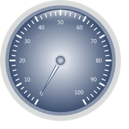

::: {style="DISPLAY: none"}
{#d2h_url_template}{#d2h_package_url style="WIDTH: 0px; DISPLAY: none; HEIGHT: 0px"}
:::

::: {.d2h_secondary_topic style="PADDING-BOTTOM: 10pt; MARGIN: 0pt; PADDING-LEFT: 0pt; PADDING-RIGHT: 0pt; PADDING-TOP: 0pt"}
##### ServerSide Export {#serverside-export style="tab-stops: 0pt"}

 

Refer to the following code to export the gauge in server side.

 

Step 1:

Controller:

 

Add the below code in your controller.

By setting the **GaugeExport** property to **ServerSide** and calling the **GenerateGaugeImage()** function, you can export the gauge in server side . Here you are setting the ImageFormat as Bmp and filename as "Gauge".

 

+--------------------------------------------------------------------------------------------------------------------------------------------------------------------------------------------+
| []{style="FONT-FAMILY: 'Calibri','sans-serif'"}                                                                                                                                            |
|                                                                                                                                                                                            |
| [public]{style="FONT-FAMILY: 'Calibri','sans-serif'; COLOR: blue"}[ [ActionResult]{style="COLOR: #2b91af"} Index()]{style="FONT-FAMILY: 'Calibri','sans-serif'"}                           |
|                                                                                                                                                                                            |
| [        {]{style="FONT-FAMILY: 'Calibri','sans-serif'"}                                                                                                                                   |
|                                                                                                                                                                                            |
| [            [CircularGaugeModel]{style="COLOR: #2b91af"} model = [new]{style="COLOR: blue"} [CircularGaugeModel]{style="COLOR: #2b91af"}();]{style="FONT-FAMILY: 'Calibri','sans-serif'"} |
|                                                                                                                                                                                            |
| [            model.Radius = 160;]{style="FONT-FAMILY: 'Calibri','sans-serif'"}                                                                                                             |
|                                                                                                                                                                                            |
| [            model.GaugeSkins = [GaugeSkins]{style="COLOR: #2b91af"}.VS2010;]{style="FONT-FAMILY: 'Calibri','sans-serif'"}                                                                 |
|                                                                                                                                                                                            |
| [            model.FrameType = [GaugeFrameType]{style="COLOR: #2b91af"}.FullCircle;]{style="FONT-FAMILY: 'Calibri','sans-serif'"}                                                          |
|                                                                                                                                                                                            |
| []{style="FONT-FAMILY: 'Calibri','sans-serif'"}                                                                                                                                            |
|                                                                                                                                                                                            |
| [            model.GaugeExport = [GaugeExport]{style="COLOR: #2b91af"}.ServerSide;]{style="FONT-FAMILY: 'Calibri','sans-serif'"}                                                           |
|                                                                                                                                                                                            |
| []{style="FONT-FAMILY: 'Calibri','sans-serif'"}                                                                                                                                            |
|                                                                                                                                                                                            |
| [            [CircularScale]{style="COLOR: #2b91af"} c_Scale = [new]{style="COLOR: blue"} [CircularScale]{style="COLOR: #2b91af"}();]{style="FONT-FAMILY: 'Calibri','sans-serif'"}         |
|                                                                                                                                                                                            |
| [            c_Scale.PointerCapRadius = 8;]{style="FONT-FAMILY: 'Calibri','sans-serif'"}                                                                                                   |
|                                                                                                                                                                                            |
| [            c_Scale.BackgroundBrush = [Brushes]{style="COLOR: #2b91af"}.Gray;]{style="FONT-FAMILY: 'Calibri','sans-serif'"}                                                               |
|                                                                                                                                                                                            |
| []{style="FONT-FAMILY: 'Calibri','sans-serif'"}                                                                                                                                            |
|                                                                                                                                                                                            |
| [            [GaugeLabelTick]{style="COLOR: #2b91af"} c_LabelTick = [new]{style="COLOR: blue"} [GaugeLabelTick]{style="COLOR: #2b91af"}();]{style="FONT-FAMILY: 'Calibri','sans-serif'"}   |
|                                                                                                                                                                                            |
| [            c_LabelTick.FontSize = 15;]{style="FONT-FAMILY: 'Calibri','sans-serif'"}                                                                                                      |
|                                                                                                                                                                                            |
| []{style="FONT-FAMILY: 'Calibri','sans-serif'"}                                                                                                                                            |
|                                                                                                                                                                                            |
| [            [TickMark]{style="COLOR: #2b91af"} \_minor = [new]{style="COLOR: blue"} [TickMark]{style="COLOR: #2b91af"}();]{style="FONT-FAMILY: 'Calibri','sans-serif'"}                   |
|                                                                                                                                                                                            |
| [            \_minor.TickStyle = [TickStyle]{style="COLOR: #2b91af"}.MinorTick;]{style="FONT-FAMILY: 'Calibri','sans-serif'"}                                                              |
|                                                                                                                                                                                            |
| [            \_minor.TickWidth = 1;]{style="FONT-FAMILY: 'Calibri','sans-serif'"}                                                                                                          |
|                                                                                                                                                                                            |
| [            \_minor.TickHeight = 9;]{style="FONT-FAMILY: 'Calibri','sans-serif'"}                                                                                                         |
|                                                                                                                                                                                            |
| [            \_minor.TickPlacement = [ScalePlacement]{style="COLOR: #2b91af"}.Outside;]{style="FONT-FAMILY: 'Calibri','sans-serif'"}                                                       |
|                                                                                                                                                                                            |
| [            \_minor.BackgroundBrush = [Brushes]{style="COLOR: #2b91af"}.White;]{style="FONT-FAMILY: 'Calibri','sans-serif'"}                                                              |
|                                                                                                                                                                                            |
| []{style="FONT-FAMILY: 'Calibri','sans-serif'"}                                                                                                                                            |
|                                                                                                                                                                                            |
| [            [TickMark]{style="COLOR: #2b91af"} \_major = [new]{style="COLOR: blue"} [TickMark]{style="COLOR: #2b91af"}();]{style="FONT-FAMILY: 'Calibri','sans-serif'"}                   |
|                                                                                                                                                                                            |
| [            \_major.TickStyle = [TickStyle]{style="COLOR: #2b91af"}.MajorTick;]{style="FONT-FAMILY: 'Calibri','sans-serif'"}                                                              |
|                                                                                                                                                                                            |
| [            \_major.TickWidth = 3;]{style="FONT-FAMILY: 'Calibri','sans-serif'"}                                                                                                          |
|                                                                                                                                                                                            |
| [            \_major.TickHeight = 14;]{style="FONT-FAMILY: 'Calibri','sans-serif'"}                                                                                                        |
|                                                                                                                                                                                            |
| [            \_major.TickPlacement = [ScalePlacement]{style="COLOR: #2b91af"}.Outside;]{style="FONT-FAMILY: 'Calibri','sans-serif'"}                                                       |
|                                                                                                                                                                                            |
| []{style="FONT-FAMILY: 'Calibri','sans-serif'"}                                                                                                                                            |
|                                                                                                                                                                                            |
| [            [CircularPointer]{style="COLOR: #2b91af"} c_Pointer = [new]{style="COLOR: blue"} [CircularPointer]{style="COLOR: #2b91af"}();]{style="FONT-FAMILY: 'Calibri','sans-serif'"}   |
|                                                                                                                                                                                            |
| [            c_Pointer.PointerLength = 100;]{style="FONT-FAMILY: 'Calibri','sans-serif'"}                                                                                                  |
|                                                                                                                                                                                            |
| [            c_Pointer.PointerWidth = 10;]{style="FONT-FAMILY: 'Calibri','sans-serif'"}                                                                                                    |
|                                                                                                                                                                                            |
| [            c_Pointer.BorderWidth = 2;]{style="FONT-FAMILY: 'Calibri','sans-serif'"}                                                                                                      |
|                                                                                                                                                                                            |
| [            c_Pointer.PointerPlacement = [ScalePlacement]{style="COLOR: #2b91af"}.Inside;]{style="FONT-FAMILY: 'Calibri','sans-serif'"}                                                   |
|                                                                                                                                                                                            |
| [            c_Pointer.MarkerStyle = [MarkerStyle]{style="COLOR: #2b91af"}.Trapezoid;]{style="FONT-FAMILY: 'Calibri','sans-serif'"}                                                        |
|                                                                                                                                                                                            |
| [            c_Pointer.Value = 0;]{style="FONT-FAMILY: 'Calibri','sans-serif'"}                                                                                                            |
|                                                                                                                                                                                            |
| []{style="FONT-FAMILY: 'Calibri','sans-serif'"}                                                                                                                                            |
|                                                                                                                                                                                            |
| [            c_Scale.Ticks.Add(\_minor);]{style="FONT-FAMILY: 'Calibri','sans-serif'"}                                                                                                     |
|                                                                                                                                                                                            |
| [            c_Scale.Ticks.Add(\_major);]{style="FONT-FAMILY: 'Calibri','sans-serif'"}                                                                                                     |
|                                                                                                                                                                                            |
| [            c_Scale.Pointers.Add(c_Pointer);]{style="FONT-FAMILY: 'Calibri','sans-serif'"}                                                                                                |
|                                                                                                                                                                                            |
| [            c_Scale.Labels.Add(c_LabelTick);]{style="FONT-FAMILY: 'Calibri','sans-serif'"}                                                                                                |
|                                                                                                                                                                                            |
| []{style="FONT-FAMILY: 'Calibri','sans-serif'"}                                                                                                                                            |
|                                                                                                                                                                                            |
| [            model.Scales.Add(c_Scale);]{style="FONT-FAMILY: 'Calibri','sans-serif'"}                                                                                                      |
|                                                                                                                                                                                            |
| []{style="FONT-FAMILY: 'Calibri','sans-serif'"}                                                                                                                                            |
|                                                                                                                                                                                            |
| [            [//Sets for server side export.]{style="COLOR: green"}]{style="FONT-FAMILY: 'Calibri','sans-serif'"}                                                                          |
|                                                                                                                                                                                            |
| [            model.GaugeExport = [GaugeExport]{style="COLOR: #2b91af"}.ServerSide;]{style="FONT-FAMILY: 'Calibri','sans-serif'"}                                                           |
|                                                                                                                                                                                            |
| [            [//Function to generate the gauge in Server or client side in Gif format.]{style="COLOR: green"}]{style="FONT-FAMILY: 'Calibri','sans-serif'"}                                |
|                                                                                                                                                                                            |
| [            model.GenerateGaugeImage(model, [\"Gauge\"]{style="COLOR: #a31515"}, [ImageFormat]{style="COLOR: #2b91af"}.Gif);]{style="FONT-FAMILY: 'Calibri','sans-serif'"}                |
|                                                                                                                                                                                            |
| []{style="FONT-FAMILY: 'Calibri','sans-serif'"}                                                                                                                                            |
|                                                                                                                                                                                            |
| [            ViewData\[[\"GaugeModel\"]{style="COLOR: #a31515"}\] = model;]{style="FONT-FAMILY: 'Calibri','sans-serif'"}                                                                   |
|                                                                                                                                                                                            |
| []{style="FONT-FAMILY: 'Calibri','sans-serif'"}                                                                                                                                            |
|                                                                                                                                                                                            |
| [            [return]{style="COLOR: blue"} View();]{style="FONT-FAMILY: 'Calibri','sans-serif'"}                                                                                           |
|                                                                                                                                                                                            |
| [        }]{style="FONT-FAMILY: 'Calibri','sans-serif'"}                                                                                                                                   |
+--------------------------------------------------------------------------------------------------------------------------------------------------------------------------------------------+

**[]{style="FONT-FAMILY: 'Calibri','sans-serif'"}** 

Step 2:

View:

 

Add the below code in view page.

 

+----------------------------------------------------------------------------------------------------------------------------------------------------------------------------------------------------------------------------------------------------------------------------------------------------------------------+
| **[View\[ASPX\]]{style="FONT-FAMILY: 'Calibri','sans-serif'"}**                                                                                                                                                                                                                                                      |
|                                                                                                                                                                                                                                                                                                                      |
| [\<%]{style="FONT-FAMILY: 'Calibri','sans-serif'; BACKGROUND: yellow"}[\--Rendering the linear gauge\--]{style="FONT-FAMILY: 'Calibri','sans-serif'; COLOR: darkgreen"}[%\>]{style="FONT-FAMILY: 'Calibri','sans-serif'; BACKGROUND: yellow"}[]{style="FONT-FAMILY: 'Calibri','sans-serif'"}                         |
|                                                                                                                                                                                                                                                                                                                      |
| []{style="FONT-FAMILY: 'Calibri','sans-serif'"}                                                                                                                                                                                                                                                                      |
|                                                                                                                                                                                                                                                                                                                      |
| [   [\<%]{style="BACKGROUND: yellow"}[=]{style="COLOR: blue"}Html.Syncfusion().CircularGauge([\"Gauge\"]{style="COLOR: #a31515"}, ([CircularGaugeModel]{style="COLOR: #2b91af"})ViewData\[[\"GaugeModel\"]{style="COLOR: #a31515"}\])[%\>]{style="BACKGROUND: yellow"}]{style="FONT-FAMILY: 'Calibri','sans-serif'"} |
+----------------------------------------------------------------------------------------------------------------------------------------------------------------------------------------------------------------------------------------------------------------------------------------------------------------------+

 

+----------------------------------------------------------------------------------------------------------------------------------------------------------------------------------------------------------------------------------------------------------------------------------------------------+
| **[View\[cshtml\]]{style="FONT-FAMILY: 'Calibri','sans-serif'"}**                                                                                                                                                                                                                                  |
|                                                                                                                                                                                                                                                                                                    |
| [@\*]{style="FONT-FAMILY: 'Calibri','sans-serif'; BACKGROUND: yellow"}[\--Rendering the linear gauge\--]{style="FONT-FAMILY: 'Calibri','sans-serif'; COLOR: darkgreen"}[\*@]{style="FONT-FAMILY: 'Calibri','sans-serif'; BACKGROUND: yellow"}[]{style="FONT-FAMILY: 'Calibri','sans-serif'"}       |
|                                                                                                                                                                                                                                                                                                    |
| []{style="FONT-FAMILY: 'Calibri','sans-serif'"}                                                                                                                                                                                                                                                    |
|                                                                                                                                                                                                                                                                                                    |
| [@]{style="FONT-FAMILY: Consolas; BACKGROUND: yellow; FONT-SIZE: 9.5pt"}[Html.Syncfusion().CircularGauge([\"Gauge\"]{style="COLOR: #a31515"},([CircularGaugeModel]{style="COLOR: #2b91af"})ViewData\[[\"GaugeModel\"]{style="COLOR: #a31515"}\])]{style="FONT-FAMILY: Consolas; FONT-SIZE: 9.5pt"} |
|                                                                                                                                                                                                                                                                                                    |
| []{style="FONT-FAMILY: 'Calibri','sans-serif'"}                                                                                                                                                                                                                                                    |
+----------------------------------------------------------------------------------------------------------------------------------------------------------------------------------------------------------------------------------------------------------------------------------------------------+

**[]{style="FONT-FAMILY: 'Calibri','sans-serif'"}** 

**[]{style="FONT-FAMILY: 'Calibri','sans-serif'"}** 

Step 3:

 

Run the code. You will get the below output. Then check the server map path location to get the exported Gauge.

 

{border="0"}

Figure 83: Exporting**[]{style="FONT-FAMILY: 'Calibri','sans-serif'"}**

[                              ]{style="FONT-FAMILY: 'Calibri','sans-serif'"}

[]{#related-topics}
:::
