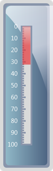

::: {style="DISPLAY: none"}
{#d2h_url_template}{#d2h_package_url style="WIDTH: 0px; DISPLAY: none; HEIGHT: 0px"}
:::

::: {.d2h_secondary_topic style="PADDING-BOTTOM: 10pt; MARGIN: 0pt; PADDING-LEFT: 0pt; PADDING-RIGHT: 0pt; PADDING-TOP: 0pt"}
##### ServerSide Export {#serverside-export style="tab-stops: 0pt"}

 

Refer to the below code to export the gauge in server side.

Step 1:

Controller:

 

Add the below code in your controller.

 By setting the **GaugeExport** property to **ServerSide** and calling the **GenerateGaugeImage()** function, you can export the gauge in server side . Here you are setting the ImageFormat as "Gif" and filename as "Gauge".

 

+-----------------------------------------------------------------------------------------------------------------------------------------------------------------------------------+
| []{style="FONT-FAMILY: 'Courier New'"}                                                                                                                                            |
|                                                                                                                                                                                   |
| [public]{style="FONT-FAMILY: 'Courier New'; COLOR: blue"}[ [ActionResult]{style="COLOR: #2b91af"} Index()]{style="FONT-FAMILY: 'Courier New'"}                                    |
|                                                                                                                                                                                   |
| [        {]{style="FONT-FAMILY: 'Courier New'"}                                                                                                                                   |
|                                                                                                                                                                                   |
| [            [LinearGaugeModel]{style="COLOR: #2b91af"} model = [new]{style="COLOR: blue"} [LinearGaugeModel]{style="COLOR: #2b91af"}();]{style="FONT-FAMILY: 'Courier New'"}     |
|                                                                                                                                                                                   |
| [            model.GaugeSkins = [GaugeSkins]{style="COLOR: #2b91af"}.VS2010;]{style="FONT-FAMILY: 'Courier New'"}                                                                 |
|                                                                                                                                                                                   |
| [            model.Height = 420;]{style="FONT-FAMILY: 'Courier New'"}                                                                                                             |
|                                                                                                                                                                                   |
| [            model.Width = 130;]{style="FONT-FAMILY: 'Courier New'"}                                                                                                              |
|                                                                                                                                                                                   |
| [            model.Orientation = [GaugeOrientation]{style="COLOR: #2b91af"}.Vertical;]{style="FONT-FAMILY: 'Courier New'"}                                                        |
|                                                                                                                                                                                   |
| []{style="FONT-FAMILY: 'Courier New'"}                                                                                                                                            |
|                                                                                                                                                                                   |
| [            [//Sets for server side export.]{style="COLOR: green"}]{style="FONT-FAMILY: 'Courier New'"}                                                                          |
|                                                                                                                                                                                   |
| [            model.GaugeExport = [GaugeExport]{style="COLOR: #2b91af"}.ServerSide;]{style="FONT-FAMILY: 'Courier New'"}                                                           |
|                                                                                                                                                                                   |
| []{style="FONT-FAMILY: 'Courier New'"}                                                                                                                                            |
|                                                                                                                                                                                   |
| [            [LinearScale]{style="COLOR: #2b91af"} l_Scale = [new]{style="COLOR: blue"} [LinearScale]{style="COLOR: #2b91af"}();]{style="FONT-FAMILY: 'Courier New'"}             |
|                                                                                                                                                                                   |
| [           ]{style="FONT-FAMILY: 'Courier New'"}                                                                                                                                 |
|                                                                                                                                                                                   |
| [            l_Scale.BackgroundBrush = [Brushes]{style="COLOR: #2b91af"}.White;]{style="FONT-FAMILY: 'Courier New'"}                                                              |
|                                                                                                                                                                                   |
| [            l_Scale.ScaleBarSize = 24;]{style="FONT-FAMILY: 'Courier New'"}                                                                                                      |
|                                                                                                                                                                                   |
| [            l_Scale.ScaleBarLength = 290;]{style="FONT-FAMILY: 'Courier New'"}                                                                                                   |
|                                                                                                                                                                                   |
| [            l_Scale.BorderWidth = 4;]{style="FONT-FAMILY: 'Courier New'"}                                                                                                        |
|                                                                                                                                                                                   |
| []{style="FONT-FAMILY: 'Courier New'"}                                                                                                                                            |
|                                                                                                                                                                                   |
| [            [GaugeLabelTick]{style="COLOR: #2b91af"} c_LabelTick = [new]{style="COLOR: blue"} [GaugeLabelTick]{style="COLOR: #2b91af"}();]{style="FONT-FAMILY: 'Courier New'"}   |
|                                                                                                                                                                                   |
| [            c_LabelTick.FontSize = 15;]{style="FONT-FAMILY: 'Courier New'"}                                                                                                      |
|                                                                                                                                                                                   |
| []{style="FONT-FAMILY: 'Courier New'"}                                                                                                                                            |
|                                                                                                                                                                                   |
| [            [TickMark]{style="COLOR: #2b91af"} \_minor = [new]{style="COLOR: blue"} [TickMark]{style="COLOR: #2b91af"}();]{style="FONT-FAMILY: 'Courier New'"}                   |
|                                                                                                                                                                                   |
| [            \_minor.TickStyle = [TickStyle]{style="COLOR: #2b91af"}.MinorTick;]{style="FONT-FAMILY: 'Courier New'"}                                                              |
|                                                                                                                                                                                   |
| [            \_minor.TickWidth = 4;]{style="FONT-FAMILY: 'Courier New'"}                                                                                                          |
|                                                                                                                                                                                   |
| [            \_minor.TickHeight = 6;]{style="FONT-FAMILY: 'Courier New'"}                                                                                                         |
|                                                                                                                                                                                   |
| [            \_minor.DistanceFromScale = -24;]{style="FONT-FAMILY: 'Courier New'"}                                                                                                |
|                                                                                                                                                                                   |
| [            \_minor.TickPlacement = [ScalePlacement]{style="COLOR: #2b91af"}.Outside;]{style="FONT-FAMILY: 'Courier New'"}                                                       |
|                                                                                                                                                                                   |
| []{style="FONT-FAMILY: 'Courier New'"}                                                                                                                                            |
|                                                                                                                                                                                   |
| []{style="FONT-FAMILY: 'Courier New'"}                                                                                                                                            |
|                                                                                                                                                                                   |
| [            [TickMark]{style="COLOR: #2b91af"} \_major = [new]{style="COLOR: blue"} [TickMark]{style="COLOR: #2b91af"}();]{style="FONT-FAMILY: 'Courier New'"}                   |
|                                                                                                                                                                                   |
| [            \_major.TickStyle = [TickStyle]{style="COLOR: #2b91af"}.MajorTick;]{style="FONT-FAMILY: 'Courier New'"}                                                              |
|                                                                                                                                                                                   |
| [            \_major.TickWidth = 4;]{style="FONT-FAMILY: 'Courier New'"}                                                                                                          |
|                                                                                                                                                                                   |
| [            \_major.TickHeight = 10;]{style="FONT-FAMILY: 'Courier New'"}                                                                                                        |
|                                                                                                                                                                                   |
| [            \_major.DistanceFromScale = -24;]{style="FONT-FAMILY: 'Courier New'"}                                                                                                |
|                                                                                                                                                                                   |
| [            \_major.TickPlacement = [ScalePlacement]{style="COLOR: #2b91af"}.Outside;]{style="FONT-FAMILY: 'Courier New'"}                                                       |
|                                                                                                                                                                                   |
| []{style="FONT-FAMILY: 'Courier New'"}                                                                                                                                            |
|                                                                                                                                                                                   |
| []{style="FONT-FAMILY: 'Courier New'"}                                                                                                                                            |
|                                                                                                                                                                                   |
| [            [LinearBarPointer]{style="COLOR: #2b91af"} b_Pointer = [new]{style="COLOR: blue"} [LinearBarPointer]{style="COLOR: #2b91af"}();]{style="FONT-FAMILY: 'Courier New'"} |
|                                                                                                                                                                                   |
| [            b_Pointer.Value = 32;]{style="FONT-FAMILY: 'Courier New'"}                                                                                                           |
|                                                                                                                                                                                   |
| [            b_Pointer.Opacity = 0.7;]{style="FONT-FAMILY: 'Courier New'"}                                                                                                        |
|                                                                                                                                                                                   |
| [            b_Pointer.PointerWidth = 18;]{style="FONT-FAMILY: 'Courier New'"}                                                                                                    |
|                                                                                                                                                                                   |
| []{style="FONT-FAMILY: 'Courier New'"}                                                                                                                                            |
|                                                                                                                                                                                   |
| [            l_Scale.Ticks.Add(\_minor);]{style="FONT-FAMILY: 'Courier New'"}                                                                                                     |
|                                                                                                                                                                                   |
| [            l_Scale.Ticks.Add(\_major);]{style="FONT-FAMILY: 'Courier New'"}                                                                                                     |
|                                                                                                                                                                                   |
| [            l_Scale.Pointers.Add(b_Pointer);]{style="FONT-FAMILY: 'Courier New'"}                                                                                                |
|                                                                                                                                                                                   |
| [            l_Scale.Labels.Add(c_LabelTick);]{style="FONT-FAMILY: 'Courier New'"}                                                                                                |
|                                                                                                                                                                                   |
| [            model.Scales.Add(l_Scale);]{style="FONT-FAMILY: 'Courier New'"}                                                                                                      |
|                                                                                                                                                                                   |
| []{style="FONT-FAMILY: 'Courier New'"}                                                                                                                                            |
|                                                                                                                                                                                   |
| [            [//Function to generate the gauge in server or client side in Gif format.]{style="COLOR: green"}]{style="FONT-FAMILY: 'Courier New'"}                                |
|                                                                                                                                                                                   |
| [            model.GenerateGaugeImage(model, [\"Gauge\"]{style="COLOR: #a31515"}, [ImageFormat]{style="COLOR: #2b91af"}.Gif);]{style="FONT-FAMILY: 'Courier New'"}                |
|                                                                                                                                                                                   |
| []{style="FONT-FAMILY: 'Courier New'"}                                                                                                                                            |
|                                                                                                                                                                                   |
| [            ViewData\[[\"GaugeModel\"]{style="COLOR: #a31515"}\] = model;]{style="FONT-FAMILY: 'Courier New'"}                                                                   |
|                                                                                                                                                                                   |
| [            [return]{style="COLOR: blue"} View();]{style="FONT-FAMILY: 'Courier New'"}                                                                                           |
|                                                                                                                                                                                   |
| [        }]{style="FONT-FAMILY: 'Courier New'"}                                                                                                                                   |
+-----------------------------------------------------------------------------------------------------------------------------------------------------------------------------------+

**[]{style="FONT-FAMILY: 'Calibri','sans-serif'"}** 

Step 2:

View:

 

Add the below code in view page.

 

+------------------------------------------------------------------------------------------------------------------------------------------------------------------------------------------------------------------------------------------------------------------------------------------------------------------+
| **[View\[ASPX\]]{style="FONT-FAMILY: 'Calibri','sans-serif'"}**                                                                                                                                                                                                                                                  |
|                                                                                                                                                                                                                                                                                                                  |
| [\<%]{style="FONT-FAMILY: 'Calibri','sans-serif'; BACKGROUND: yellow"}[\--Rendering the linear gauge\--]{style="FONT-FAMILY: 'Calibri','sans-serif'; COLOR: darkgreen"}[%\>]{style="FONT-FAMILY: 'Calibri','sans-serif'; BACKGROUND: yellow"}[]{style="FONT-FAMILY: 'Calibri','sans-serif'"}                     |
|                                                                                                                                                                                                                                                                                                                  |
| []{style="FONT-FAMILY: 'Calibri','sans-serif'"}                                                                                                                                                                                                                                                                  |
|                                                                                                                                                                                                                                                                                                                  |
| [   [\<%]{style="BACKGROUND: yellow"}[=]{style="COLOR: blue"}Html.Syncfusion().LinearGauge([\"Gauge\"]{style="COLOR: #a31515"}, ([LinearGaugeModel]{style="COLOR: #2b91af"})ViewData\[[\"GaugeModel\"]{style="COLOR: #a31515"}\])[%\>]{style="BACKGROUND: yellow"}]{style="FONT-FAMILY: 'Calibri','sans-serif'"} |
+------------------------------------------------------------------------------------------------------------------------------------------------------------------------------------------------------------------------------------------------------------------------------------------------------------------+

[]{style="FONT-FAMILY: 'Calibri','sans-serif'"} 

 

+-------------------------------------------------------------------------------------------------------------------------------------------------------------------------------------------------------------------------------------------------------------------------------------------------+
| **[View\[cshtml\]]{style="FONT-FAMILY: 'Calibri','sans-serif'"}**                                                                                                                                                                                                                               |
|                                                                                                                                                                                                                                                                                                 |
| [@\*]{style="FONT-FAMILY: 'Calibri','sans-serif'; BACKGROUND: yellow"}[\--Rendering the linear gauge\--]{style="FONT-FAMILY: 'Calibri','sans-serif'; COLOR: darkgreen"}[\*@]{style="FONT-FAMILY: 'Calibri','sans-serif'; BACKGROUND: yellow"}[]{style="FONT-FAMILY: 'Calibri','sans-serif'"}    |
|                                                                                                                                                                                                                                                                                                 |
| []{style="FONT-FAMILY: 'Calibri','sans-serif'"}                                                                                                                                                                                                                                                 |
|                                                                                                                                                                                                                                                                                                 |
| [@]{style="FONT-FAMILY: Consolas; BACKGROUND: yellow; FONT-SIZE: 9.5pt"}[Html.Syncfusion().LinearGauge([\"Gauge\"]{style="COLOR: #a31515"}, ([LinearGaugeModel]{style="COLOR: #2b91af"})ViewData\[[\"GaugeModel\"]{style="COLOR: #a31515"}\])]{style="FONT-FAMILY: Consolas; FONT-SIZE: 9.5pt"} |
|                                                                                                                                                                                                                                                                                                 |
| []{style="FONT-FAMILY: 'Calibri','sans-serif'; BACKGROUND: yellow"}                                                                                                                                                                                                                             |
+-------------------------------------------------------------------------------------------------------------------------------------------------------------------------------------------------------------------------------------------------------------------------------------------------+

[]{style="FONT-FAMILY: 'Calibri','sans-serif'"} 

[]{style="FONT-FAMILY: 'Calibri','sans-serif'"} 

Step 3:

**[]{style="FONT-FAMILY: 'Calibri','sans-serif'"}** 

Run the code. You will get the below output. Then check the server map path location to get the exported Gauge.

 

{border="0"}

Figure 119: Exporting

**[]{style="FONT-FAMILY: 'Calibri','sans-serif'"}** 

[]{#related-topics}
:::
