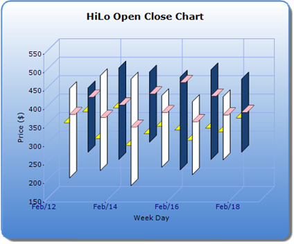

::: {style="DISPLAY: none"}
{#d2h_url_template}{#d2h_package_url style="WIDTH: 0px; DISPLAY: none; HEIGHT: 0px"}
:::

:::: {.d2h_secondary_topic style="PADDING-BOTTOM: 10pt; MARGIN: 0pt; PADDING-LEFT: 0pt; PADDING-RIGHT: 0pt; PADDING-TOP: 0pt"}
#### Set Open/Close tips color[]{style="FONT-SIZE: 16pt"} {#set-openclose-tips-color style="tab-stops: 0pt"}

 

The "**OpenTipColor**" and "**CloseTipColor**" properties will allow the user to set a color for the open and close tips of HiLoOpenClose type series.

::: {align="center"}
+--------------------------+--------------------+
|  Details                                      |
+--------------------------+--------------------+
| Possible Values          | Any color values   |
+--------------------------+--------------------+
| Default Value            | None               |
+--------------------------+--------------------+
| 2D / 3D Limitations      | No                 |
+--------------------------+--------------------+
| Applies to Chart Element | All series         |
+--------------------------+--------------------+
| Applies to Chart Types   | HiLoOpenClose Type |
+--------------------------+--------------------+
:::

 

The following code snippet illustrates this property:

 

+---------------------------------------------------------------------------------------------------------------------------------------------------------------------------------------------------------------------------------------------------------------------------------------------------------------------------------------------------------------------------------------------------------+
|  \[[C#\]]{style="FONT-FAMILY: 'Courier New'"}                                                                                                                                                                                                                                                                                                                                                           |
|                                                                                                                                                                                                                                                                                                                                                                                                         |
| [//Sets the OpenTipColor for the series open tips.This can be done for any number of series]{style="FONT-FAMILY: 'Courier New'; COLOR: green"}                                                                                                                                                                                                                                                          |
|                                                                                                                                                                                                                                                                                                                                                                                                         |
| [this]{style="FONT-FAMILY: 'Courier New'; COLOR: blue"}[.ChartWebControl1.Series\[0\].ConfigItems.HiLoOpenCloseItem.OpenTipColor   = [Color]{style="COLOR: #2b91af"}.Pink;]{style="FONT-FAMILY: 'Courier New'"}                                                                                                                                                                                         |
|                                                                                                                                                                                                                                                                                                                                                                                                         |
| [//Sets the CloseTipColor for the series close tips.This can be done for any number of series]{style="FONT-FAMILY: 'Courier New'; COLOR: green"}[ this]{style="FONT-FAMILY: 'Courier New'; COLOR: blue"}[.ChartWebControl1.Series\[0\].ConfigItems.HiLoOpenCloseItem.CloseTipColor = [Color]{style="COLOR: #2b91af"}.Yellow;]{style="FONT-FAMILY: 'Courier New'"}[]{style="FONT-FAMILY: 'Courier New'"} |
+---------------------------------------------------------------------------------------------------------------------------------------------------------------------------------------------------------------------------------------------------------------------------------------------------------------------------------------------------------------------------------------------------------+

 

 

+---------------------------------------------------------------------------------------------------------------------------------------------------------------------------------------------------------------------------------------------------------------------------------------------------------------------------------------------------------------+
|  \[[VB\]]{style="FONT-FAMILY: 'Courier New'"}                                                                                                                                                                                                                                                                                                                 |
|                                                                                                                                                                                                                                                                                                                                                               |
| [\'Sets the OpenTipColor for the series open tips.This can be done for any number of series]{style="FONT-FAMILY: 'Courier New'; COLOR: green"}                                                                                                                                                                                                                |
|                                                                                                                                                                                                                                                                                                                                                               |
| [Me.ChartWebControl1.Series(0).ConfigItems.HiLoOpenCloseItem.OpenTipColor = [Color]{style="COLOR: #2b91af"}. Pink]{style="FONT-FAMILY: 'Courier New'"}                                                                                                                                                                                                        |
|                                                                                                                                                                                                                                                                                                                                                               |
| [\'Sets the CloseTipColor for the series close tips.This can be done for any number of series]{style="FONT-FAMILY: 'Courier New'; COLOR: green"}[ ]{style="FONT-FAMILY: 'Courier New'; COLOR: blue"}[Me.ChartWebControl1.Series(0).ConfigItems.HiLoOpenCloseItem.CloseTipColor = [Color]{style="COLOR: #2b91af"}. Yellow]{style="FONT-FAMILY: 'Courier New'"} |
|                                                                                                                                                                                                                                                                                                                                                               |
| []{style="FONT-FAMILY: 'Courier New'"}                                                                                                                                                                                                                                                                                                                        |
+---------------------------------------------------------------------------------------------------------------------------------------------------------------------------------------------------------------------------------------------------------------------------------------------------------------------------------------------------------------+

 

{border="0"}

Figure 229: Set different color to Open/Close tips

 

Sample Link

 

To access a HiloOpenCloseChart sample:

1.   Open the Syncfusion Dashboard

2.   Select **User Interface**

3.   Click the **ASP.NET** drop-down list and select **Explore Samples**

4.   Navigate to **Chart.Web** -\> **Samples** -\> **3.5** -\> **Chart Types -\> FinancialCharts**[]{style="FONT-FAMILY: 'Calibri','sans-serif'; FONT-SIZE: 11pt"}

[]{style="LINE-HEIGHT: 115%; FONT-FAMILY: 'Calibri','sans-serif'; FONT-SIZE: 11pt"} 

 

 

[]{#related-topics}
::::
