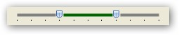
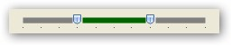

::: {style="DISPLAY: none"}
{#d2h_url_template}{#d2h_package_url style="WIDTH: 0px; DISPLAY: none; HEIGHT: 0px"}
:::

::: {.d2h_secondary_topic style="PADDING-BOTTOM: 10pt; MARGIN: 0pt; PADDING-LEFT: 0pt; PADDING-RIGHT: 0pt; PADDING-TOP: 0pt"}
#### Setting Channel Height {#setting-channel-height style="MARGIN-LEFT: 18pt; tab-stops: 18.0pt"}

[]{style="COLOR: #15428b"} 

You can set the required height of the channel over which the slider moves. In the following example illustrates the change in height of the channel from 4 to 6. It is measured in pixels.

 

The following code snippet illustrates the same.

[]{style="COLOR: #15428b"} 

a.   When the Channel height is set to 4 pixels.

[]{style="COLOR: #15428b"} 

+-----------------------------------------------------------------------+
| **[\[C#\]]{style="FONT-FAMILY: 'Courier New'; COLOR: black"}**        |
|                                                                       |
| []{style="FONT-FAMILY: 'Courier New'"}                                |
|                                                                       |
| [rangeSlider.ChannelHeight = 4;]{style="FONT-FAMILY: 'Courier New'"}  |
+-----------------------------------------------------------------------+

***[]{style="COLOR: #15428b"}*** 

{border="0"}\
\

{border="0"}

***[]{style="COLOR: #15428b"}*** 

Figure 1270: Design View of RangeSlider when the height is set to 4

***[]{style="COLOR: #15428b"}*** 

b.   When the Channel height is set to 6 pixels

[]{style="COLOR: #15428b"} 

+------------------------------------------------------------------------------------------------------------------------------------------------------------------------+
| **[\[]{style="FONT-FAMILY: 'Courier New'; COLOR: black"}[C#\]]{style="FONT-FAMILY: 'Courier New'; COLOR: black"}[]{style="FONT-FAMILY: 'Courier New'; COLOR: black"}** |
|                                                                                                                                                                        |
| []{style="FONT-FAMILY: 'Courier New'"}                                                                                                                                 |
|                                                                                                                                                                        |
| [rangeSlider.ChannelHeight = 6;]{style="FONT-FAMILY: 'Courier New'"}[]{style="FONT-FAMILY: 'Courier New'"}                                                             |
+------------------------------------------------------------------------------------------------------------------------------------------------------------------------+

[]{style="COLOR: #15428b"} 

{border="0"}

***[]{style="COLOR: #15428b"}*** 

{border="0"}

***[]{style="COLOR: #15428b"}*** 

Figure 1271: Design View of RangeSlider when the height is set to 6

 

[]{#related-topics}
:::
