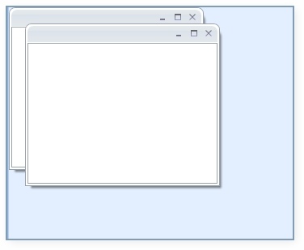
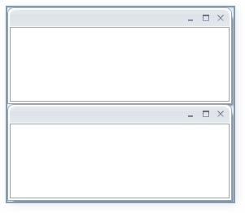
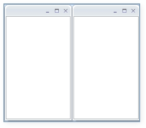

::: {style="DISPLAY: none"}
{#d2h_url_template}{#d2h_package_url style="WIDTH: 0px; DISPLAY: none; HEIGHT: 0px"}
:::

::: {.d2h_secondary_topic style="PADDING-BOTTOM: 10pt; MARGIN: 0pt; PADDING-LEFT: 0pt; PADDING-RIGHT: 0pt; PADDING-TOP: 0pt"}
#### Setting MDI Layout {#setting-mdi-layout style="tab-stops: 0pt"}

**SetMDILayout()**  method is used to set the MDILayout of the child. There are three types of layouts that are available: They are:

[·      ]{style="FONT-FAMILY: Symbol"}Cascade

[·      ]{style="FONT-FAMILY: Symbol"}Horizontal

[·      ]{style="FONT-FAMILY: Symbol"}Vertical

[]{style="FONT-FAMILY: 'Trebuchet MS','sans-serif'; COLOR: #15428b; FONT-SIZE: 9pt"} 

Cascade:

Cascade layout just cascades the window one by one as shown below:

 

+-------------------------------------------------------------------------------------------------------------------------------------------------------------------------------------------------+
| **[\[C#\]]{style="FONT-FAMILY: 'Courier New'"}**                                                                                                                                                |
|                                                                                                                                                                                                 |
| **[DockingManager]{style="FONT-FAMILY: 'Courier New'"}**[.SetMDILayout([MDILayout]{style="COLOR: #2b91af"}.Cascade);]{style="FONT-FAMILY: 'Courier New'"}[]{style="FONT-FAMILY: 'Courier New'"} |
+-------------------------------------------------------------------------------------------------------------------------------------------------------------------------------------------------+

 

{border="0"}

Figure 376: Cascaded Layout

                   

 

Horizontal:

This layout arranges the MDI windows in a horizontal manner as shown below:

+---------------------------------------------------------------------------------------------------------------------------------------------------------------------------------------------------------------------------------+
| **[\[C#\]]{style="FONT-FAMILY: 'Times New Roman','serif'; FONT-SIZE: 12pt"}**                                                                                                                                                   |
|                                                                                                                                                                                                                                 |
| **[DockingManager]{style="FONT-FAMILY: 'Courier New'"}**[.SetMDILayout([MDILayout]{style="COLOR: #2b91af"}.Horizontal);]{style="FONT-FAMILY: 'Courier New'"}[]{style="FONT-FAMILY: 'Times New Roman','serif'; FONT-SIZE: 12pt"} |
+---------------------------------------------------------------------------------------------------------------------------------------------------------------------------------------------------------------------------------+

 

{border="0"}

Figure 377: Horizontal Layout

**[]{style="FONT-FAMILY: 'Trebuchet MS','sans-serif'; COLOR: #15428b; FONT-SIZE: 9pt"}** 

Vertical Layout:

This layout arranges the MDI windows in a vertical manner as shown below:

+-------------------------------------------------------------------------------------------------------------------------------------------------------------------------------------------------------------------------------+
| **[\[C#\]]{style="FONT-FAMILY: 'Times New Roman','serif'; FONT-SIZE: 12pt"}**                                                                                                                                                 |
|                                                                                                                                                                                                                               |
| **[DockingManager]{style="FONT-FAMILY: 'Courier New'"}**[.SetMDILayout([MDILayout]{style="COLOR: #2b91af"}.Vertical);]{style="FONT-FAMILY: 'Courier New'"}[]{style="FONT-FAMILY: 'Times New Roman','serif'; FONT-SIZE: 12pt"} |
+-------------------------------------------------------------------------------------------------------------------------------------------------------------------------------------------------------------------------------+

 

{border="0"}

Figure 378: Vertical Layout

                                                           

 

 

[]{#related-topics}
:::
