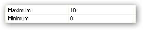

::: {style="DISPLAY: none"}
{#d2h_url_template}{#d2h_package_url style="WIDTH: 0px; DISPLAY: none; HEIGHT: 0px"}
:::

::: {.d2h_secondary_topic style="PADDING-BOTTOM: 10pt; MARGIN: 0pt; PADDING-LEFT: 0pt; PADDING-RIGHT: 0pt; PADDING-TOP: 0pt"}
#### Setting Minimum and Maximum values {#setting-minimum-and-maximum-values style="MARGIN-LEFT: 18pt; tab-stops: 18.0pt"}

 

These properties specify the Minimum and Maximum bounds of the RangeSlider control till which the channel extends.

 

In the following example the maximum bound is set to 10.

[]{style="COLOR: #15428b"} 

+------------------------------------------------------------------------------------------------------+
| **[\[C#\]]{style="FONT-FAMILY: 'Courier New'; COLOR: black"}**                                       |
|                                                                                                      |
| **[]{style="FONT-FAMILY: 'Courier New'; COLOR: black"}**                                             |
|                                                                                                      |
| [rangeSlider.Maximum = 20;]{style="FONT-FAMILY: 'Courier New'"}                                      |
|                                                                                                      |
| [rangeSlider.Minimum = 0;]{style="FONT-FAMILY: 'Courier New'"}[]{style="FONT-FAMILY: 'Courier New'"} |
+------------------------------------------------------------------------------------------------------+

***[]{style="COLOR: #15428b"}*** 

{border="0"}

***[]{style="COLOR: #15428b"}*** 

{border="0"}

**[]{style="COLOR: #333399; FONT-SIZE: 16pt"}** 

[]{#related-topics}
:::
