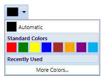
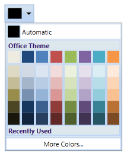
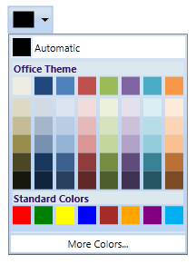

::: {style="DISPLAY: none"}
{#d2h_url_template}{#d2h_package_url style="WIDTH: 0px; DISPLAY: none; HEIGHT: 0px"}
:::

:::: {.d2h_secondary_topic style="PADDING-BOTTOM: 10pt; MARGIN: 0pt; PADDING-LEFT: 0pt; PADDING-RIGHT: 0pt; PADDING-TOP: 0pt"}
#### Setting Panel Visibilities {#setting-panel-visibilities style="tab-stops: 0pt"}

The ColorPickerPalette control includes three panels namely ThemePanel, StandardColorPanel, RecentlyUsedPanel. You can set the visibility of these panels by using the ThemePanelVisibility, StandardPanelVisibility, RecentlyUsedPanelVisibility properties respectively. The ThemePanel displays the palette of selected theme colors and their variant colors in the panel. The StandardColorPanel displays a palette of 8 preset colors in panel. The RecentlyUsedColor panel displays the most recently used colors.

 

Use Case Scenarios

You can use the ColorPickerPalette control to view the panels of your choice.

 

Adding Setting Panel Visibilities to an Application

Setting Panel Visibilities can be added to an application by using XAML or C# code.

The following code example illustrates how to add the Setting Panel Visibilities feature to an application through XAML.

 

+-------------------------------------------------------------------------------------------------------------------------------------------------------------------------------------------------------------------------------------------------------------------------------------------------------------------------------------------------------------------------------------------------------------------------------------------------------------------------------+
| **[\[XAML\]]{style="FONT-FAMILY: 'Courier New'"}**                                                                                                                                                                                                                                                                                                                                                                                                                            |
|                                                                                                                                                                                                                                                                                                                                                                                                                                                                               |
| **[]{style="FONT-FAMILY: 'Courier New'"}**                                                                                                                                                                                                                                                                                                                                                                                                                                    |
|                                                                                                                                                                                                                                                                                                                                                                                                                                                                               |
| [\<]{style="FONT-FAMILY: 'Courier New'; COLOR: blue"}[sync]{style="FONT-FAMILY: 'Courier New'; COLOR: #a31515"}[:]{style="FONT-FAMILY: 'Courier New'; COLOR: blue"}[ColorPickerPalette]{style="FONT-FAMILY: 'Courier New'; COLOR: #a31515"}[ x]{style="FONT-FAMILY: 'Courier New'; COLOR: red"}[:]{style="FONT-FAMILY: 'Courier New'; COLOR: blue"}[Name]{style="FONT-FAMILY: 'Courier New'; COLOR: red"}[=\"ColorPicker\" ]{style="FONT-FAMILY: 'Courier New'; COLOR: blue"} |
|                                                                                                                                                                                                                                                                                                                                                                                                                                                                               |
| [                         ]{style="FONT-FAMILY: 'Courier New'; COLOR: blue"}[ThemePanelVisibility]{style="FONT-FAMILY: 'Courier New'; COLOR: red"}[=\"Collapsed\"/\>]{style="FONT-FAMILY: 'Courier New'; COLOR: blue"}                                                                                                                                                                                                                                                        |
|                                                                                                                                                                                                                                                                                                                                                                                                                                                                               |
| [\<]{style="FONT-FAMILY: 'Courier New'; COLOR: blue"}[sync]{style="FONT-FAMILY: 'Courier New'; COLOR: #a31515"}[:]{style="FONT-FAMILY: 'Courier New'; COLOR: blue"}[ColorPickerPalette]{style="FONT-FAMILY: 'Courier New'; COLOR: #a31515"}[ x]{style="FONT-FAMILY: 'Courier New'; COLOR: red"}[:]{style="FONT-FAMILY: 'Courier New'; COLOR: blue"}[Name]{style="FONT-FAMILY: 'Courier New'; COLOR: red"}[=\"ColorPicker\" ]{style="FONT-FAMILY: 'Courier New'; COLOR: blue"} |
|                                                                                                                                                                                                                                                                                                                                                                                                                                                                               |
| [                         ]{style="FONT-FAMILY: 'Courier New'; COLOR: blue"}[StandardPanelVisibility]{style="FONT-FAMILY: 'Courier New'; COLOR: red"}[=\"Collapsed\"/\>]{style="FONT-FAMILY: 'Courier New'; COLOR: blue"}                                                                                                                                                                                                                                                     |
|                                                                                                                                                                                                                                                                                                                                                                                                                                                                               |
| [\<]{style="FONT-FAMILY: 'Courier New'; COLOR: blue"}[sync]{style="FONT-FAMILY: 'Courier New'; COLOR: #a31515"}[:]{style="FONT-FAMILY: 'Courier New'; COLOR: blue"}[ColorPickerPalette]{style="FONT-FAMILY: 'Courier New'; COLOR: #a31515"}[ x]{style="FONT-FAMILY: 'Courier New'; COLOR: red"}[:]{style="FONT-FAMILY: 'Courier New'; COLOR: blue"}[Name]{style="FONT-FAMILY: 'Courier New'; COLOR: red"}[=\"ColorPicker\" ]{style="FONT-FAMILY: 'Courier New'; COLOR: blue"} |
|                                                                                                                                                                                                                                                                                                                                                                                                                                                                               |
| [                         ]{style="FONT-FAMILY: 'Courier New'; COLOR: blue"}[RecentlyUsedPanelVisibility]{style="FONT-FAMILY: 'Courier New'; COLOR: red"}[=\"Collapsed\"/\>]{style="FONT-FAMILY: 'Courier New'; COLOR: blue"}                                                                                                                                                                                                                                                 |
|                                                                                                                                                                                                                                                                                                                                                                                                                                                                               |
| [              ]{style="FONT-FAMILY: 'Courier New'"}                                                                                                                                                                                                                                                                                                                                                                                                                          |
+-------------------------------------------------------------------------------------------------------------------------------------------------------------------------------------------------------------------------------------------------------------------------------------------------------------------------------------------------------------------------------------------------------------------------------------------------------------------------------+

 

The following code example illustrates how to add the Setting Panel Visibilities feature to an application through C#.

 

+---------------------------------------------------------------------------------------------------------------------------------------------------------------------------------------------------------+
| **[\[XAML\]]{style="FONT-FAMILY: 'Courier New'"}**                                                                                                                                                      |
|                                                                                                                                                                                                         |
| []{style="FONT-FAMILY: 'Courier New'; COLOR: #2b91af"}                                                                                                                                                  |
|                                                                                                                                                                                                         |
| [ColorPickerPalette]{style="FONT-FAMILY: 'Courier New'; COLOR: #2b91af"}[ colorpicker = [new]{style="COLOR: blue"} [ColorPickerPalette]{style="COLOR: #2b91af"}();]{style="FONT-FAMILY: 'Courier New'"} |
|                                                                                                                                                                                                         |
| [colorpicker.ThemePanelVisibility = System.Windows.[Visibility]{style="COLOR: #2b91af"}.Collapsed;]{style="FONT-FAMILY: 'Courier New'"}                                                                 |
|                                                                                                                                                                                                         |
| [colorpicker.StandardPanelVisibility = System.Windows.[Visibility]{style="COLOR: #2b91af"}.Collapsed;]{style="FONT-FAMILY: 'Courier New'"}                                                              |
|                                                                                                                                                                                                         |
| [colorpicker.RecentlyUsedPanelVisibility = System.Windows.]{style="FONT-FAMILY: 'Courier New'"}                                                                                                         |
|                                                                                                                                                                                                         |
| [                                          [Visibility]{style="COLOR: #2b91af"}.Collapsed;]{style="FONT-FAMILY: 'Courier New'"}                                                                         |
|                                                                                                                                                                                                         |
| [              ]{style="FONT-FAMILY: 'Courier New'"}                                                                                                                                                    |
+---------------------------------------------------------------------------------------------------------------------------------------------------------------------------------------------------------+

 

{border="0"}

Figure 190: ThemePanelVisibility, StandardPanelVisibility RecentlyUsedPanelVisibility is set to True

{border="0"}

Figure 191: ThemePanelVisibility is set to False

 

{border="0"}

Figure 192: StandaradPanelVisibility is set to False

 

{border="0"}

Figure 193: RecentlyUsedPanelVisibility is set to False[]{style="COLOR: #c00000"}

 

Properties

Table 18: Panel Visibility Properties Table

::: {align="center"}
  ----------------------------- --------------------------------------------------------------------- -------------------- ------------------------------------- -----------------
  Property                      Description                                                           Type                 Data Type                             Reference links
  ThemePanelVisibility          Enables or disables the visibility of the ThemePanel.                 DependencyProperty   ThemePanelVisibility.Visible          
  StandardPanelVisibility       Enables or disables the visibility of the StandardColorPanel.         DependencyProperty   StandardPanelVisibility.Visible        
  RecentlyUsedPanelVisibility   Enables or disables the visibility of the Recently Used ColorPanel.   DependencyProperty   RecentlyUsedPanelVisibility.Visible    
  ----------------------------- --------------------------------------------------------------------- -------------------- ------------------------------------- -----------------
:::

**[]{style="FONT-FAMILY: 'Trebuchet MS','sans-serif'; COLOR: #15428b; FONT-SIZE: 9pt"}** 

Sample Link

To view samples:

1.   Select Start -\> Programs -\> Syncfusion -\> Essential Studio x.x.xx -\> Dashboard.

2.   Select Run Locally Installed Samples in WPF Button.

3.   Now expand the DragAndDropManagerDemo tree-view item in the Sample Browser.

4.   Choose any one of the samples listed under it to launch.

[]{style="COLOR: #c00000"} 

[]{#related-topics}
::::
