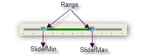

::: {style="DISPLAY: none"}
{#d2h_url_template}{#d2h_package_url style="WIDTH: 0px; DISPLAY: none; HEIGHT: 0px"}
:::

::: {.d2h_secondary_topic style="PADDING-BOTTOM: 10pt; MARGIN: 0pt; PADDING-LEFT: 0pt; PADDING-RIGHT: 0pt; PADDING-TOP: 0pt"}
#### Setting SliderMin and SliderMax {#setting-slidermin-and-slidermax style="MARGIN-LEFT: 18pt; tab-stops: 18.0pt"}

[]{style="COLOR: #15428b"} 

This position of the right and left thumb can be set using the **SliderMin** and **SliderMax** properties.

 

In the following example, the position of the right and left thumbs is set to 7,2.

[]{style="COLOR: #15428b"} 

+--------------------------------------------------------------------------------------------------------+
| **[\[C#\]]{style="FONT-FAMILY: 'Courier New'; COLOR: black"}**                                         |
|                                                                                                        |
| []{style="FONT-FAMILY: 'Courier New'"}                                                                 |
|                                                                                                        |
| [rangeSlider.SliderMax = 7;]{style="FONT-FAMILY: 'Courier New'"}                                       |
|                                                                                                        |
| [rangeSlider.SliderMin = 2;]{style="FONT-FAMILY: 'Courier New'"}[]{style="FONT-FAMILY: 'Courier New'"} |
+--------------------------------------------------------------------------------------------------------+

***[]{style="COLOR: #15428b"}*** 

{border="0"}

***[]{style="COLOR: #15428b"}*** 

{border="0"}

 

 

 

 

[]{#related-topics}
:::
