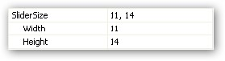
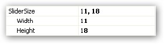

::: {style="DISPLAY: none"}
{#d2h_url_template}{#d2h_package_url style="WIDTH: 0px; DISPLAY: none; HEIGHT: 0px"}
:::

::: {.d2h_secondary_topic style="PADDING-BOTTOM: 10pt; MARGIN: 0pt; PADDING-LEFT: 0pt; PADDING-RIGHT: 0pt; PADDING-TOP: 0pt"}
#### Setting Slider Size {#setting-slider-size style="MARGIN-LEFT: 18pt; tab-stops: 18.0pt"}

[]{#p1088}[]{style="COLOR: #15428b"} 

You can set the required size for the slider. The height and the width of the control can be set.

 

The following example illustrates the same.

[]{style="COLOR: #15428b"} 

a.   When the slider is set to 11, 14.

[]{style="COLOR: #15428b"} 

+-----------------------------------------------------------------------------------------------------------------------+
| **[\[C#\]]{style="FONT-FAMILY: 'Courier New'; COLOR: black"}**                                                        |
|                                                                                                                       |
| []{style="FONT-FAMILY: 'Courier New'"}                                                                                |
|                                                                                                                       |
| [rangeSlider.SliderSize = new Size(11,14);]{style="FONT-FAMILY: 'Courier New'"}[]{style="FONT-FAMILY: 'Courier New'"} |
+-----------------------------------------------------------------------------------------------------------------------+

***[]{style="COLOR: #15428b"}*** 

{border="0"}

***[]{style="COLOR: #15428b"}*** 

{border="0"}

Figure 1275

***[]{style="COLOR: #15428b"}*** 

b.   When the slider is set to 11,18.

[]{style="COLOR: #15428b"} 

+-----------------------------------------------------------------------------------------------------------------------+
| []{#p1089}**[\[C#\]]{style="FONT-FAMILY: 'Courier New'; COLOR: black"}**                                              |
|                                                                                                                       |
| []{style="FONT-FAMILY: 'Courier New'"}                                                                                |
|                                                                                                                       |
| [rangeSlider.SliderSize = new Size(11,18);]{style="FONT-FAMILY: 'Courier New'"}[]{style="FONT-FAMILY: 'Courier New'"} |
+-----------------------------------------------------------------------------------------------------------------------+

***[]{style="COLOR: #15428b"}*** 

{border="0"}

***[]{style="COLOR: #15428b"}*** 

{border="0"}

 

Figure 1276

 

 

[]{#related-topics}
:::
