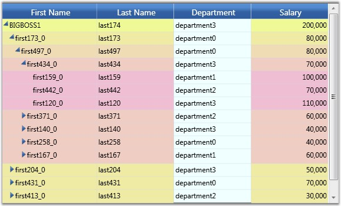

::: {style="DISPLAY: none"}
{#d2h_url_template}{#d2h_package_url style="WIDTH: 0px; DISPLAY: none; HEIGHT: 0px"}
:::

::: {.d2h_secondary_topic style="PADDING-BOTTOM: 10pt; MARGIN: 0pt; PADDING-LEFT: 0pt; PADDING-RIGHT: 0pt; PADDING-TOP: 0pt"}
#### Setting Style for the Column {#setting-style-for-the-column style="tab-stops: 0pt"}

You can also control the appearance of cells in a particular column by setting the GridStyleInfo values held in the GridTreeColumn.StyleInfo property for a particular column.

 

The following code example illustrates how to set this property for a column in the Grid Tree.

 

+-------------------------------------------------------------------------------------------------------------------------------------------------------------------------------------------------------------------------------------------------------------------------------+
| [\[C#\]]{style="FONT-FAMILY: 'Courier New'; COLOR: black"}                                                                                                                                                                                                                    |
|                                                                                                                                                                                                                                                                               |
| **[]{style="FONT-FAMILY: 'Courier New'; COLOR: green"}**                                                                                                                                                                                                                      |
|                                                                                                                                                                                                                                                                               |
| [GridTreeColumn]{style="FONT-FAMILY: 'Courier New'; COLOR: #2b91af"}[ tc = [new]{style="COLOR: blue"} [GridTreeColumn]{style="COLOR: #2b91af"}([\"Department\"]{style="COLOR: #a31515"}, [\"Department\"]{style="COLOR: #a31515"}, 100);]{style="FONT-FAMILY: 'Courier New'"} |
|                                                                                                                                                                                                                                                                               |
| [tc.StyleInfo.Background = [Brushes]{style="COLOR: #2b91af"}.Azure;]{style="FONT-FAMILY: 'Courier New'"}                                                                                                                                                                      |
|                                                                                                                                                                                                                                                                               |
| [gridTreeControl1.Columns.Add(tc); [ ]{style="COLOR: green"}]{style="FONT-FAMILY: 'Courier New'"}                                                                                                                                                                             |
+-------------------------------------------------------------------------------------------------------------------------------------------------------------------------------------------------------------------------------------------------------------------------------+

 

The following screen shot shows the StyleInfo property applied to the "Department" column in the Grid Tree.

 

{border="0"}

Figure 260: Column Styles

 

Grid cell background for the Department column is customized.

 

 

 

[]{#related-topics}
:::
