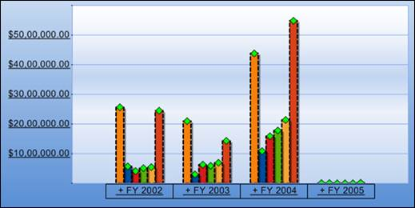

::: {style="DISPLAY: none"}
{#d2h_url_template}{#d2h_package_url style="WIDTH: 0px; DISPLAY: none; HEIGHT: 0px"}
:::

::: {.d2h_secondary_topic style="PADDING-BOTTOM: 10pt; MARGIN: 0pt; PADDING-LEFT: 0pt; PADDING-RIGHT: 0pt; PADDING-TOP: 0pt"}
#### Setting the Chart Symbol Over Each Series {#setting-the-chart-symbol-over-each-series style="tab-stops: 0pt"}

 

The chart symbol is set at the top of each chart series by assigning a proper value to the Shape property.

 

+-------------------------------------------------------------------------------------------------------------------------------------------------------------------------------------------------------------------------+
| **[\[C#\]]{style="FONT-FAMILY: 'Courier New'"}**                                                                                                                                                                        |
|                                                                                                                                                                                                                         |
| [foreach]{style="FONT-FAMILY: 'Courier New'; COLOR: blue"}[ ([ChartSeries]{style="COLOR: #2b91af"} series [in]{style="COLOR: blue"} [this]{style="COLOR: blue"}.olapChart1.Series)]{style="FONT-FAMILY: 'Courier New'"} |
|                                                                                                                                                                                                                         |
| [    series.Style.Symbol.Shape = [ChartSymbolShape]{style="COLOR: #2b91af"}.Diamond;            ]{style="FONT-FAMILY: 'Courier New'"}                                                                                   |
+-------------------------------------------------------------------------------------------------------------------------------------------------------------------------------------------------------------------------+

[]{style="FONT-FAMILY: 'Calibri','sans-serif'"} 

+---------------------------------------------------------------------------------------------------------------------------------------------------------------------------------------------------------------------------------------------+
| **[\[VB\]]{style="FONT-FAMILY: 'Courier New'"}**                                                                                                                                                                                            |
|                                                                                                                                                                                                                                             |
| [For]{style="FONT-FAMILY: 'Courier New'; COLOR: blue"}[ [Each]{style="COLOR: blue"} series [As]{style="COLOR: blue"} ChartSeries [In]{style="COLOR: blue"} [Me]{style="COLOR: blue"}.olapChart1.Series]{style="FONT-FAMILY: 'Courier New'"} |
|                                                                                                                                                                                                                                             |
| [series.Style.Symbol.Shape = [ChartSymbolShape]{style="COLOR: #2b91af"}.Diamond           ]{style="FONT-FAMILY: 'Courier New'"}                                                                                                             |
|                                                                                                                                                                                                                                             |
| [Next]{style="FONT-FAMILY: 'Courier New'; COLOR: blue"}[ series]{style="FONT-FAMILY: 'Courier New'"}[]{style="FONT-FAMILY: 'Calibri','sans-serif'"}                                                                                         |
+---------------------------------------------------------------------------------------------------------------------------------------------------------------------------------------------------------------------------------------------+

 

{border="0"}

 

Figure 14: Symbol over chart series

[]{#related-topics}
:::
