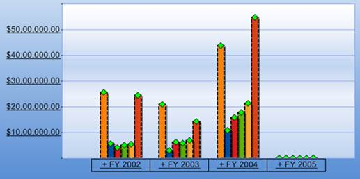

::: {style="DISPLAY: none"}
{#d2h_url_template}{#d2h_package_url style="WIDTH: 0px; DISPLAY: none; HEIGHT: 0px"}
:::

::: {.d2h_secondary_topic style="PADDING-BOTTOM: 10pt; MARGIN: 0pt; PADDING-LEFT: 0pt; PADDING-RIGHT: 0pt; PADDING-TOP: 0pt"}
#### Setting the Series Border Style, Width and Color {#setting-the-series-border-style-width-and-color style="tab-stops: 0pt"}

 

The style, width and color for the series border are set based on the following properties:

[·      ]{style="FONT-FAMILY: Symbol"}DashStyle

[·      ]{style="FONT-FAMILY: Symbol"}Width

[·      ]{style="FONT-FAMILY: Symbol"}Color

[]{style="FONT-FAMILY: 'Calibri','sans-serif'"} 

+-------------------------------------------------------------------------------------------------------------------------------------------------------------------------------------------------------------------------+
| **[\[C#\]]{style="FONT-FAMILY: 'Courier New'"}**                                                                                                                                                                        |
|                                                                                                                                                                                                                         |
| [foreach]{style="FONT-FAMILY: 'Courier New'; COLOR: blue"}[ ([ChartSeries]{style="COLOR: #2b91af"} series [in]{style="COLOR: blue"} [this]{style="COLOR: blue"}.olapChart1.Series)]{style="FONT-FAMILY: 'Courier New'"} |
|                                                                                                                                                                                                                         |
| [{]{style="FONT-FAMILY: 'Courier New'"}                                                                                                                                                                                 |
|                                                                                                                                                                                                                         |
| [series.Style.Border.Width = 1;            ]{style="FONT-FAMILY: 'Courier New'"}                                                                                                                                        |
|                                                                                                                                                                                                                         |
| [series.Style.Border.DashStyle = [DashStyle]{style="COLOR: #2b91af"}.DashDot;           ]{style="FONT-FAMILY: 'Courier New'"}                                                                                           |
|                                                                                                                                                                                                                         |
| [series.Style.Border.Color = [Color]{style="COLOR: #2b91af"}.Black;            ]{style="FONT-FAMILY: 'Courier New'"}                                                                                                    |
|                                                                                                                                                                                                                         |
| [}]{style="FONT-FAMILY: 'Courier New'"}[]{style="FONT-FAMILY: 'Calibri','sans-serif'"}                                                                                                                                  |
+-------------------------------------------------------------------------------------------------------------------------------------------------------------------------------------------------------------------------+

[]{style="FONT-FAMILY: 'Calibri','sans-serif'"} 

+---------------------------------------------------------------------------------------------------------------------------------------------------------------------------------------------------------------------------------------------+
| **[\[VB\]]{style="FONT-FAMILY: 'Courier New'"}**                                                                                                                                                                                            |
|                                                                                                                                                                                                                                             |
| [For]{style="FONT-FAMILY: 'Courier New'; COLOR: blue"}[ [Each]{style="COLOR: blue"} series [As]{style="COLOR: blue"} ChartSeries [In]{style="COLOR: blue"} [Me]{style="COLOR: blue"}.olapChart1.Series]{style="FONT-FAMILY: 'Courier New'"} |
|                                                                                                                                                                                                                                             |
| [series.Style.Border.Width = 1            ]{style="FONT-FAMILY: 'Courier New'"}                                                                                                                                                             |
|                                                                                                                                                                                                                                             |
| [series.Style.Border.DashStyle = [DashStyle]{style="COLOR: #2b91af"}.DashDot          ]{style="FONT-FAMILY: 'Courier New'"}                                                                                                                 |
|                                                                                                                                                                                                                                             |
| [series.Style.Border.Color = [Color]{style="COLOR: #2b91af"}.Black            ]{style="FONT-FAMILY: 'Courier New'"}                                                                                                                         |
|                                                                                                                                                                                                                                             |
| [Next]{style="FONT-FAMILY: 'Courier New'; COLOR: blue"}[ series]{style="FONT-FAMILY: 'Courier New'"}[]{style="FONT-FAMILY: 'Calibri','sans-serif'"}                                                                                         |
+---------------------------------------------------------------------------------------------------------------------------------------------------------------------------------------------------------------------------------------------+

 

 

{border="0"}

 

Figure 11: Chart Series Style

[]{#related-topics}
:::
