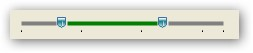

::: {style="DISPLAY: none"}
{#d2h_url_template}{#d2h_package_url style="WIDTH: 0px; DISPLAY: none; HEIGHT: 0px"}
:::

::: {.d2h_secondary_topic style="PADDING-BOTTOM: 10pt; MARGIN: 0pt; PADDING-LEFT: 0pt; PADDING-RIGHT: 0pt; PADDING-TOP: 0pt"}
#### Setting Tick Frequency {#setting-tick-frequency style="MARGIN-LEFT: 18pt; tab-stops: 18.0pt"}

[]{#p1091} 

The ticks can be placed at required intervals by setting the **TickFrequency** property to required number. For example, if the range is set from 0-100, where minimum is set to 0 and maximum is set to 100, and the **TickFrequency** is set to 20, then Ticks will be placed at positions 0,20,40,..,100.

 

The following example illustrates the same.

[]{style="COLOR: #15428b"} 

+------------------------------------------------------------------------------------------------------------+
| **[\[C#\]]{style="FONT-FAMILY: 'Courier New'; COLOR: black"}**                                             |
|                                                                                                            |
| []{style="FONT-FAMILY: 'Courier New'"}                                                                     |
|                                                                                                            |
| [rangeSlider.TickFrequency = 3;]{style="FONT-FAMILY: 'Courier New'"}[]{style="FONT-FAMILY: 'Courier New'"} |
+------------------------------------------------------------------------------------------------------------+

[]{style="COLOR: #15428b"} 

{border="0"}

***[]{style="COLOR: #15428b"}*** 

{border="0"}

***[]{style="COLOR: #15428b"}*** 

Figure 1280: Tick Frequency set to 3

 

[]{#related-topics}
:::
