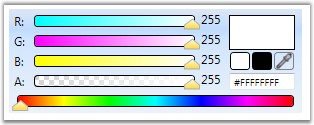
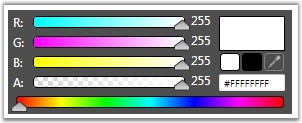
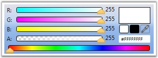
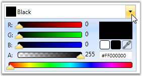
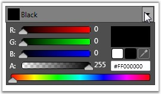
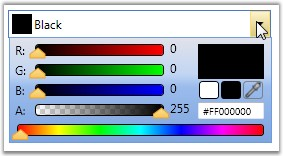
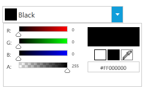

::: {style="DISPLAY: none"}
{#d2h_url_template}{#d2h_package_url style="WIDTH: 0px; DISPLAY: none; HEIGHT: 0px"}
:::

:::: {.d2h_secondary_topic style="PADDING-BOTTOM: 10pt; MARGIN: 0pt; PADDING-LEFT: 0pt; PADDING-RIGHT: 0pt; PADDING-TOP: 0pt"}
#### Setting VisualStyle for ColorPicker and ColorEdit Controls  {#setting-visualstyle-for-colorpicker-and-coloredit-controls style="tab-stops: 0pt"}

You can enhance the appearance of the ColorPicker and ColorEdit control, using the **VisualStyle** property. VisualStyle is an attached property, which gets or sets the value for the visual style. The various built-in visual styles are listed below.

 

::: {align="center"}
+-----------------------------------+--------------------------------------------------------------------------------------------------------+
| Property                          | Description                                                                                            |
+-----------------------------------+--------------------------------------------------------------------------------------------------------+
| VisualStyle                       | Sets the visual style for the ColorPicker and ColorEdit controls. The options provided are as follows. |
|                                   |                                                                                                        |
|                                   | []{style="FONT-FAMILY: 'Trebuchet MS','sans-serif'; COLOR: #15428b; FONT-SIZE: 9pt"}                   |
|                                   |                                                                                                        |
|                                   | [·      ]{style="FONT-FAMILY: Symbol"}Blend                                                            |
|                                   |                                                                                                        |
|                                   | [·      ]{style="FONT-FAMILY: Symbol"}Office2003                                                       |
|                                   |                                                                                                        |
|                                   | [·      ]{style="FONT-FAMILY: Symbol"}Office2007Blue                                                   |
|                                   |                                                                                                        |
|                                   | [·      ]{style="FONT-FAMILY: Symbol"}Office2007Black                                                  |
|                                   |                                                                                                        |
|                                   | [·      ]{style="FONT-FAMILY: Symbol"}Office2007Silver                                                 |
|                                   |                                                                                                        |
|                                   | [·      ]{style="FONT-FAMILY: Symbol"}ShinyBlue                                                        |
|                                   |                                                                                                        |
|                                   | [·      ]{style="FONT-FAMILY: Symbol"}ShinyRed                                                         |
|                                   |                                                                                                        |
|                                   | [·      ]{style="FONT-FAMILY: Symbol"}SyncOrange                                                       |
|                                   |                                                                                                        |
|                                   | [·      ]{style="FONT-FAMILY: Symbol"}VS2010                                                           |
|                                   |                                                                                                        |
|                                   | [·      ]{style="FONT-FAMILY: Symbol"}Metro                                                            |
|                                   |                                                                                                        |
|                                   |                                                                                                        |
+-----------------------------------+--------------------------------------------------------------------------------------------------------+
:::

 

To set the visual style for the ColorPicker and ColorEdit controls, use the following code.

 

+-----------------------------------------------------------------------------------------------------------------------------------------------------------------------------------------------------------------------------------------------------------------------------------------------------------------------------------------------------------------------------------------------------------------------------------------------------------------------------------------------------------------------------------------------------------------------------------------------------------------------------------------------------+
| **[\[XAML\]]{style="FONT-FAMILY: 'Courier New'; COLOR: black; FONT-SIZE: 9pt"}**                                                                                                                                                                                                                                                                                                                                                                                                                                                                                                                                                                    |
|                                                                                                                                                                                                                                                                                                                                                                                                                                                                                                                                                                                                                                                     |
| []{style="FONT-FAMILY: 'Courier New'; FONT-SIZE: 9pt"}                                                                                                                                                                                                                                                                                                                                                                                                                                                                                                                                                                                              |
|                                                                                                                                                                                                                                                                                                                                                                                                                                                                                                                                                                                                                                                     |
| [\<!\--]{style="FONT-FAMILY: 'Courier New'; COLOR: blue; FONT-SIZE: 9pt"}[ Adding ColorPicker ]{style="FONT-FAMILY: 'Courier New'; COLOR: green; FONT-SIZE: 9pt"}[\--\>]{style="FONT-FAMILY: 'Courier New'; COLOR: blue; FONT-SIZE: 9pt"}                                                                                                                                                                                                                                                                                                                                                                                                           |
|                                                                                                                                                                                                                                                                                                                                                                                                                                                                                                                                                                                                                                                     |
| [\<]{style="FONT-FAMILY: 'Courier New'; COLOR: blue; FONT-SIZE: 9pt"}[syncfusion:ColorPicker]{style="FONT-FAMILY: 'Courier New'; COLOR: #a31515; FONT-SIZE: 9pt"}[  ]{style="FONT-FAMILY: 'Courier New'; COLOR: blue; FONT-SIZE: 9pt"}[syncfusion:SkinStorage.VisualStyle]{style="FONT-FAMILY: 'Courier New'; COLOR: red; FONT-SIZE: 9pt"}[=]{style="FONT-FAMILY: 'Courier New'; COLOR: blue; FONT-SIZE: 9pt"}[\"[Office2003]{style="COLOR: blue"}\"[ ]{style="COLOR: blue"}[Name]{style="COLOR: red"}[=]{style="COLOR: blue"}\"[colorPicker]{style="COLOR: blue"}\"[/\>]{style="COLOR: blue"}]{style="FONT-FAMILY: 'Courier New'; FONT-SIZE: 9pt"} |
|                                                                                                                                                                                                                                                                                                                                                                                                                                                                                                                                                                                                                                                     |
| [\<!\--]{style="FONT-FAMILY: 'Courier New'; COLOR: blue; FONT-SIZE: 9pt"}[ Adding ColorEdit ]{style="FONT-FAMILY: 'Courier New'; COLOR: green; FONT-SIZE: 9pt"}[\--\>]{style="FONT-FAMILY: 'Courier New'; COLOR: blue; FONT-SIZE: 9pt"}                                                                                                                                                                                                                                                                                                                                                                                                             |
|                                                                                                                                                                                                                                                                                                                                                                                                                                                                                                                                                                                                                                                     |
| [\<]{style="FONT-FAMILY: 'Courier New'; COLOR: blue; FONT-SIZE: 9pt"}[syncfusion:ColorEdit]{style="FONT-FAMILY: 'Courier New'; COLOR: #a31515; FONT-SIZE: 9pt"}[ ]{style="FONT-FAMILY: 'Courier New'; COLOR: blue; FONT-SIZE: 9pt"}[syncfusion:SkinStorage.VisualStyle]{style="FONT-FAMILY: 'Courier New'; COLOR: red; FONT-SIZE: 9pt"}[=]{style="FONT-FAMILY: 'Courier New'; COLOR: blue; FONT-SIZE: 9pt"}[\"[Office2007Blue]{style="COLOR: blue"}\"[ ]{style="COLOR: blue"}[Name]{style="COLOR: red"}[=]{style="COLOR: blue"}\"[colorEdit]{style="COLOR: blue"}\"[/\>]{style="COLOR: blue"}]{style="FONT-FAMILY: 'Courier New'; FONT-SIZE: 9pt"}  |
+-----------------------------------------------------------------------------------------------------------------------------------------------------------------------------------------------------------------------------------------------------------------------------------------------------------------------------------------------------------------------------------------------------------------------------------------------------------------------------------------------------------------------------------------------------------------------------------------------------------------------------------------------------+

[]{style="FONT-FAMILY: 'Trebuchet MS','sans-serif'; COLOR: #15428b; FONT-SIZE: 9pt"} 

+------------------------------------------------------------------------------------------------------------------------------------------------+
| **[\[C#\]]{style="FONT-FAMILY: 'Courier New'; COLOR: black; FONT-SIZE: 9pt"}**                                                                 |
|                                                                                                                                                |
| []{style="FONT-FAMILY: 'Courier New'; COLOR: black; FONT-SIZE: 9pt"}                                                                           |
|                                                                                                                                                |
| [//Setting the visual style as Office2007Blue for ColorEdit ]{style="FONT-FAMILY: 'Courier New'; COLOR: green; FONT-SIZE: 9pt"}                |
|                                                                                                                                                |
| [SkinStorage.SetVisualStyle(colorEdit, [\"Office2007Blue\"]{style="COLOR: #a31515"});  ]{style="FONT-FAMILY: 'Courier New'; FONT-SIZE: 9pt"}   |
|                                                                                                                                                |
| []{style="FONT-FAMILY: 'Courier New'; FONT-SIZE: 9pt"}                                                                                         |
|                                                                                                                                                |
| [//Setting the visual style as Office2007Blue  for ColorPicker]{style="FONT-FAMILY: 'Courier New'; COLOR: green; FONT-SIZE: 9pt"}              |
|                                                                                                                                                |
| [SkinStorage.SetVisualStyle(colorPicker, [\"Office2007Blue\"]{style="COLOR: #a31515"});  ]{style="FONT-FAMILY: 'Courier New'; FONT-SIZE: 9pt"} |
+------------------------------------------------------------------------------------------------------------------------------------------------+

[]{style="FONT-FAMILY: 'Trebuchet MS','sans-serif'; COLOR: #15428b; FONT-SIZE: 9pt"} 

{border="0"}

Figure 168: ColorEdit with Visual Style set to \"Office2007Blue\"

**[]{style="FONT-FAMILY: 'Trebuchet MS','sans-serif'; COLOR: #15428b; FONT-SIZE: 9pt"}** 

{border="0"}

Figure 169: ColorEdit with Visual Style set to \"Blend\"

**[]{style="FONT-FAMILY: 'Trebuchet MS','sans-serif'; COLOR: #15428b; FONT-SIZE: 9pt"}** 

{border="0"}

Figure 170: ColorEdit with Visual Style set to \"Office2003\"

[]{style="FONT-FAMILY: 'Trebuchet MS','sans-serif'; COLOR: #15428b; FONT-SIZE: 9pt"} 

{border="0"}

Figure 171: ColorPicker with Visual Style set to \"Office2007Blue\"

**[]{style="FONT-FAMILY: 'Trebuchet MS','sans-serif'; COLOR: #15428b; FONT-SIZE: 9pt"}** 

{border="0"}

Figure 172: ColorPicker with Visual Style set to \"Blend\"

[]{style="FONT-FAMILY: 'Trebuchet MS','sans-serif'; COLOR: #15428b; FONT-SIZE: 9pt"} 

{border="0"}

Figure 173: ColorPicker with Visual Style set to \"Office2003\"

 

[]{#p87}{border="0"}

Figure 174: ColorPicker with Visual Style set to \"Metro"

[]{#related-topics}
::::
