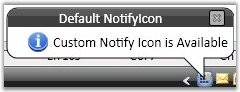
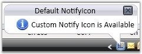
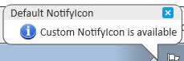

::: {style="DISPLAY: none"}
{#d2h_url_template}{#d2h_package_url style="WIDTH: 0px; DISPLAY: none; HEIGHT: 0px"}
:::

:::: {.d2h_secondary_topic style="PADDING-BOTTOM: 10pt; MARGIN: 0pt; PADDING-LEFT: 0pt; PADDING-RIGHT: 0pt; PADDING-TOP: 0pt"}
#### Setting VisualStyle for NotifyIcon {#setting-visualstyle-for-notifyicon style="tab-stops: 0pt"}

NotifyIcon supports different visual styles to enhance its look and feel. The visual style for the NotifyIcon is set by using the **VisualStyle** property.

[]{style="FONT-FAMILY: 'Trebuchet MS','sans-serif'; COLOR: #15428b; FONT-SIZE: 9pt"} 

::: {align="center"}
+-----------------------------------+------------------------------------------------------------------------------------------------------------------------------------------------------------------+
| Property                          | Description                                                                                                                                                      |
+-----------------------------------+------------------------------------------------------------------------------------------------------------------------------------------------------------------+
| VisualStyle                       | Sets the visual style for the NotifyIcon control. The options provided are as follows.                                                                           |
|                                   |                                                                                                                                                                  |
|                                   | []{style="FONT-FAMILY: 'Trebuchet MS','sans-serif'; COLOR: #15428b; FONT-SIZE: 9pt"}                                                                             |
|                                   |                                                                                                                                                                  |
|                                   | [·      ]{style="FONT-FAMILY: Symbol"}Blend                                                                                                                      |
|                                   |                                                                                                                                                                  |
|                                   | [·      ]{style="FONT-FAMILY: Symbol"}Office2003                                                                                                                 |
|                                   |                                                                                                                                                                  |
|                                   | [·      ]{style="FONT-FAMILY: Symbol"}Office2007Blue                                                                                                             |
|                                   |                                                                                                                                                                  |
|                                   | [·      ]{style="FONT-FAMILY: Symbol"}Office2007Black                                                                                                            |
|                                   |                                                                                                                                                                  |
|                                   | [·      ]{style="FONT-FAMILY: Symbol"}Office2007Silver                                                                                                           |
|                                   |                                                                                                                                                                  |
|                                   | [·      ]{style="FONT-FAMILY: Symbol"}ShinyBlue                                                                                                                  |
|                                   |                                                                                                                                                                  |
|                                   | [·      ]{style="FONT-FAMILY: Symbol"}ShinyRed                                                                                                                   |
|                                   |                                                                                                                                                                  |
|                                   | [·      ]{style="FONT-FAMILY: Symbol"}SyncOrange                                                                                                                 |
|                                   |                                                                                                                                                                  |
|                                   | [·      ]{style="FONT-FAMILY: Symbol; COLOR: #15428b; FONT-SIZE: 9pt"}VS2010[]{style="FONT-FAMILY: 'Trebuchet MS','sans-serif'; COLOR: #15428b; FONT-SIZE: 9pt"} |
|                                   |                                                                                                                                                                  |
|                                   | [·      ]{style="FONT-FAMILY: Symbol; COLOR: #15428b; FONT-SIZE: 9pt"}Metro[]{style="FONT-FAMILY: 'Trebuchet MS','sans-serif'; COLOR: #15428b; FONT-SIZE: 9pt"}  |
+-----------------------------------+------------------------------------------------------------------------------------------------------------------------------------------------------------------+
:::

[]{style="FONT-FAMILY: 'Trebuchet MS','sans-serif'; COLOR: #15428b; FONT-SIZE: 9pt"} 

The below code can be used to set various visual style.

[]{style="FONT-FAMILY: 'Trebuchet MS','sans-serif'; COLOR: #15428b; FONT-SIZE: 9pt"} 

+--------------------------------------------------------------------------------------------------------------------------------------------+
| **[\[C#\]]{style="FONT-FAMILY: 'Courier New'; COLOR: black; FONT-SIZE: 9pt"}**                                                             |
|                                                                                                                                            |
| []{style="FONT-FAMILY: 'Courier New'; COLOR: blue; FONT-SIZE: 9pt"}                                                                        |
|                                                                                                                                            |
| [//For Office2007Blue]{style="FONT-FAMILY: 'Courier New'; COLOR: green; FONT-SIZE: 9pt"}                                                   |
|                                                                                                                                            |
| [SkinStorage.VisualStyle(notifyIcon, [\"Office2007Blue\"]{style="COLOR: #a31515"});]{style="FONT-FAMILY: 'Courier New'; FONT-SIZE: 9pt"}   |
|                                                                                                                                            |
| []{style="FONT-FAMILY: 'Courier New'; FONT-SIZE: 9pt"}                                                                                     |
|                                                                                                                                            |
| [//For Blend]{style="FONT-FAMILY: 'Courier New'; COLOR: green; FONT-SIZE: 9pt"}                                                            |
|                                                                                                                                            |
| [SkinStorage.VisualStyle(notifyIcon, Blend[\");]{style="COLOR: #a31515"}]{style="FONT-FAMILY: 'Courier New'; FONT-SIZE: 9pt"}              |
|                                                                                                                                            |
| []{style="FONT-FAMILY: 'Courier New'; COLOR: #a31515; FONT-SIZE: 9pt"}                                                                     |
|                                                                                                                                            |
| [//For Office2007Silver]{style="FONT-FAMILY: 'Courier New'; COLOR: green; FONT-SIZE: 9pt"}                                                 |
|                                                                                                                                            |
| [SkinStorage.VisualStyle(notifyIcon, [\"Office2007Silver\"]{style="COLOR: #a31515"});]{style="FONT-FAMILY: 'Courier New'; FONT-SIZE: 9pt"} |
+--------------------------------------------------------------------------------------------------------------------------------------------+

[]{style="FONT-FAMILY: 'Trebuchet MS','sans-serif'; COLOR: #15428b; FONT-SIZE: 9pt"} 

[]{style="FONT-FAMILY: 'Trebuchet MS','sans-serif'; COLOR: #15428b; FONT-SIZE: 9pt"} 

{border="0"}

***[]{style="FONT-FAMILY: 'Trebuchet MS','sans-serif'; COLOR: #15428b; FONT-SIZE: 9pt"}*** 

Figure 756: NotifyIcon with \"Office2007Blue\" Visual Style

***[]{style="FONT-FAMILY: 'Trebuchet MS','sans-serif'; COLOR: #15428b; FONT-SIZE: 9pt"}*** 

***[]{style="FONT-FAMILY: 'Trebuchet MS','sans-serif'; COLOR: #15428b; FONT-SIZE: 9pt"}*** 

{border="0"}

***[]{style="FONT-FAMILY: 'Trebuchet MS','sans-serif'; COLOR: #15428b; FONT-SIZE: 9pt"}*** 

Figure 757: NotifyIcon with \"Blend\" Visual Style

***[]{style="FONT-FAMILY: 'Trebuchet MS','sans-serif'; COLOR: #15428b; FONT-SIZE: 9pt"}*** 

***[]{style="FONT-FAMILY: 'Trebuchet MS','sans-serif'; COLOR: #15428b; FONT-SIZE: 9pt"}*** 

{border="0"}

 

Figure 758: NotifyIcon with \"Office2007Silver\" Visual Style

{border="0"}

 

Figure 759: NotifyIcon with \"Metro\" Visual Style

 

[]{#p416} 

[]{#related-topics}
::::
