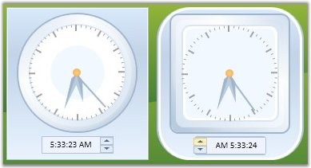
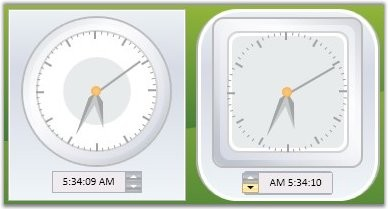

::: {style="DISPLAY: none"}
{#d2h_url_template}{#d2h_package_url style="WIDTH: 0px; DISPLAY: none; HEIGHT: 0px"}
:::

:::: {.d2h_secondary_topic style="PADDING-BOTTOM: 10pt; MARGIN: 0pt; PADDING-LEFT: 0pt; PADDING-RIGHT: 0pt; PADDING-TOP: 0pt"}
#### Setting Visual Styles for Clock {#setting-visual-styles-for-clock style="tab-stops: 0pt"}

You can apply different visual styles to the Clock control to give an appealing appearance using the **VisualStyle** property.

 

::: {align="center"}
+-----------------------------------+---------------------------------------------------------------------------------------+
| Property                          | Description                                                                           |
+-----------------------------------+---------------------------------------------------------------------------------------+
| VisualStyle                       | Sets the visual style for the Clock control. The options provided are as follows.     |
|                                   |                                                                                       |
|                                   | []{style="FONT-FAMILY: 'Trebuchet MS','sans-serif'; COLOR: #15428b; FONT-SIZE: 9pt"}  |
|                                   |                                                                                       |
|                                   | [·      ]{style="FONT-FAMILY: Symbol"}Blend                                           |
|                                   |                                                                                       |
|                                   | [·      ]{style="FONT-FAMILY: Symbol"}Office2003                                      |
|                                   |                                                                                       |
|                                   | [·      ]{style="FONT-FAMILY: Symbol"}Office2007Blue                                  |
|                                   |                                                                                       |
|                                   | [·      ]{style="FONT-FAMILY: Symbol"}Office2007Black                                 |
|                                   |                                                                                       |
|                                   | [·      ]{style="FONT-FAMILY: Symbol"}Office2007Silver                                |
|                                   |                                                                                       |
|                                   | [·      ]{style="FONT-FAMILY: Symbol"}ShinyBlue                                       |
|                                   |                                                                                       |
|                                   | [·      ]{style="FONT-FAMILY: Symbol"}ShinyRed                                        |
|                                   |                                                                                       |
|                                   | [·      ]{style="FONT-FAMILY: Symbol"}SyncOrange                                      |
|                                   |                                                                                       |
|                                   | [·      ]{style="FONT-FAMILY: Symbol"}VS2010                                          |
|                                   |                                                                                       |
|                                   | [·      ]{style="FONT-FAMILY: Symbol"}Metro                                           |
+-----------------------------------+---------------------------------------------------------------------------------------+
:::

 

To the set the visual style for the Clock control use the following code.

 

+-----------------------------------------------------------------------------------------------------------------------------------------------------------------------------------+
| **[\[C#\]]{style="FONT-FAMILY: 'Courier New'; COLOR: black"}**                                                                                                                    |
|                                                                                                                                                                                   |
| []{style="FONT-FAMILY: 'Courier New'; COLOR: blue"}                                                                                                                               |
|                                                                                                                                                                                   |
| [//For Default Style]{style="FONT-FAMILY: 'Courier New'; COLOR: green"}                                                                                                           |
|                                                                                                                                                                                   |
| [SkinStorage]{style="FONT-FAMILY: 'Courier New'; COLOR: #2b91af"}[.SetVisualStyle(ctlClock, [\"Default\"]{style="COLOR: #a31515"});]{style="FONT-FAMILY: 'Courier New'"}          |
|                                                                                                                                                                                   |
| []{style="FONT-FAMILY: 'Courier New'"}                                                                                                                                            |
|                                                                                                                                                                                   |
| [//For Blend Style]{style="FONT-FAMILY: 'Courier New'; COLOR: green"}                                                                                                             |
|                                                                                                                                                                                   |
| [SkinStorage]{style="FONT-FAMILY: 'Courier New'; COLOR: #2b91af"}[.SetVisualStyle(ctlClock, [\"Blend\"]{style="COLOR: #a31515"});]{style="FONT-FAMILY: 'Courier New'"}            |
|                                                                                                                                                                                   |
| []{style="FONT-FAMILY: 'Courier New'"}                                                                                                                                            |
|                                                                                                                                                                                   |
| [//For Office2007Silver]{style="FONT-FAMILY: 'Courier New'; COLOR: green"}                                                                                                        |
|                                                                                                                                                                                   |
| [SkinStorage]{style="FONT-FAMILY: 'Courier New'; COLOR: #2b91af"}[.SetVisualStyle(ctlClock, [\"Office2007Silver\"]{style="COLOR: #a31515"});]{style="FONT-FAMILY: 'Courier New'"} |
|                                                                                                                                                                                   |
| []{style="FONT-FAMILY: 'Courier New'"}                                                                                                                                            |
|                                                                                                                                                                                   |
| [//For Office2007Blue]{style="FONT-FAMILY: 'Courier New'; COLOR: green"}                                                                                                          |
|                                                                                                                                                                                   |
| [SkinStorage]{style="FONT-FAMILY: 'Courier New'; COLOR: #2b91af"}[.SetVisualStyle(ctlClock, [\"Office2007Blue\"]{style="COLOR: #a31515"});]{style="FONT-FAMILY: 'Courier New'"}   |
|                                                                                                                                                                                   |
| []{style="FONT-FAMILY: 'Courier New'"}                                                                                                                                            |
|                                                                                                                                                                                   |
| [//For Office2007Black]{style="FONT-FAMILY: 'Courier New'; COLOR: green"}                                                                                                         |
|                                                                                                                                                                                   |
| [SkinStorage]{style="FONT-FAMILY: 'Courier New'; COLOR: #2b91af"}[.SetVisualStyle(ctlClock, [\"Office2007Black\"]{style="COLOR: #a31515"});]{style="FONT-FAMILY: 'Courier New'"}  |
|                                                                                                                                                                                   |
| []{style="FONT-FAMILY: 'Courier New'"}                                                                                                                                            |
|                                                                                                                                                                                   |
| [//For Office2003]{style="FONT-FAMILY: 'Courier New'; COLOR: green"}                                                                                                              |
|                                                                                                                                                                                   |
| [SkinStorage]{style="FONT-FAMILY: 'Courier New'; COLOR: #2b91af"}[.SetVisualStyle(ctlClock, [\"Office2003\"]{style="COLOR: #a31515"});]{style="FONT-FAMILY: 'Courier New'"}       |
+-----------------------------------------------------------------------------------------------------------------------------------------------------------------------------------+

**[]{style="FONT-FAMILY: 'Trebuchet MS','sans-serif'; COLOR: #15428b; FONT-SIZE: 9pt"}** 

{border="0"}

Figure 144: Clock Control with \"Office2007Blue\" Visual Style

[]{style="FONT-FAMILY: 'Trebuchet MS','sans-serif'; COLOR: #15428b; FONT-SIZE: 9pt"} 

{border="0"}

Figure 145: Clock Control with \"Office2007Silver\" Visual Style

[]{#p74} 

[]{#related-topics}
::::
