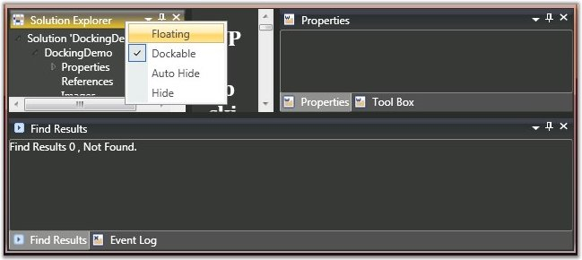
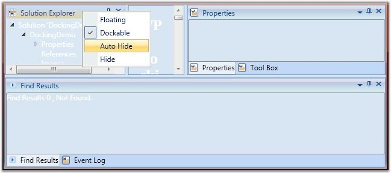

::: {style="DISPLAY: none"}
{#d2h_url_template}{#d2h_package_url style="WIDTH: 0px; DISPLAY: none; HEIGHT: 0px"}
:::

:::: {.d2h_secondary_topic style="PADDING-BOTTOM: 10pt; MARGIN: 0pt; PADDING-LEFT: 0pt; PADDING-RIGHT: 0pt; PADDING-TOP: 0pt"}
#### Setting Visual Styles for Document Container {#setting-visual-styles-for-document-container style="tab-stops: 0pt"}

Visual styles are available for the dockable windows, which give the windows a rich and professional look and feel. The visual style for the DockingManager is set using the VisualStyle property. The following are some of the visual styles that can be applied to the Docking Manager.

 

::: {align="center"}
+-----------------------------------+------------------------------------------------------------------------------------+
| Property                          | Description                                                                        |
+===================================+====================================================================================+
| VisualStyle                       | Sets the visual style for the DockingManager. The options provided are as follows. |
|                                   |                                                                                    |
|                                   | [·      ]{style="FONT-FAMILY: Symbol"}Blend                                        |
|                                   |                                                                                    |
|                                   | [·      ]{style="FONT-FAMILY: Symbol"}Office2003                                   |
|                                   |                                                                                    |
|                                   | [·      ]{style="FONT-FAMILY: Symbol"}Office2007Blue                               |
|                                   |                                                                                    |
|                                   | [·      ]{style="FONT-FAMILY: Symbol"}Office2007Black                              |
|                                   |                                                                                    |
|                                   | [·      ]{style="FONT-FAMILY: Symbol"}Office2007Silver                             |
|                                   |                                                                                    |
|                                   | [·      ]{style="FONT-FAMILY: Symbol"}ShinyBlue                                    |
|                                   |                                                                                    |
|                                   | [·      ]{style="FONT-FAMILY: Symbol"}ShinyRed                                     |
|                                   |                                                                                    |
|                                   | [·      ]{style="FONT-FAMILY: Symbol"}SyncOrange                                   |
|                                   |                                                                                    |
|                                   | [·      ]{style="FONT-FAMILY: Symbol"}VS2010                                       |
+-----------------------------------+------------------------------------------------------------------------------------+
:::

 

The following is the code snippet to apply visual styles to the DockingManager.

 

+------------------------------------------------------------------------------------------------------------------------------------------------------------------------+
| **[\[C#\]]{style="FONT-FAMILY: 'Courier New'"}**                                                                                                                       |
|                                                                                                                                                                        |
| [//To Set Blend skin for Docking Manager.]{style="FONT-FAMILY: 'Courier New'; COLOR: green; FONT-SIZE: 9.5pt"}[]{style="FONT-FAMILY: 'Courier New'; FONT-SIZE: 9.5pt"} |
|                                                                                                                                                                        |
| [SkinStorage.SetVisualStyle([this]{style="COLOR: blue"}.DockingManager, Blend);]{style="FONT-FAMILY: 'Courier New'; FONT-SIZE: 9.5pt"}                                 |
|                                                                                                                                                                        |
| []{style="FONT-FAMILY: 'Courier New'; FONT-SIZE: 9.5pt"}                                                                                                               |
|                                                                                                                                                                        |
| [//To Set the Office2007Blue skin.]{style="FONT-FAMILY: 'Courier New'; COLOR: green; FONT-SIZE: 9.5pt"}[]{style="FONT-FAMILY: 'Courier New'; FONT-SIZE: 9.5pt"}        |
|                                                                                                                                                                        |
| [SkinStorage.SetVisualStyle([this]{style="COLOR: blue"}.DockingManager, Office2007Blue);]{style="FONT-FAMILY: 'Courier New'; FONT-SIZE: 9.5pt"}                        |
|                                                                                                                                                                        |
| []{style="FONT-FAMILY: 'Courier New'; FONT-SIZE: 9.5pt"}                                                                                                               |
|                                                                                                                                                                        |
| [//To Set the Office2007 Silver Skin.]{style="FONT-FAMILY: 'Courier New'; COLOR: green; FONT-SIZE: 9.5pt"}[]{style="FONT-FAMILY: 'Courier New'; FONT-SIZE: 9.5pt"}     |
|                                                                                                                                                                        |
| [SkinStorage.SetVisualStyle([this]{style="COLOR: blue"}.DockingManager, Office2007Silver);]{style="FONT-FAMILY: 'Courier New'; FONT-SIZE: 9.5pt"}                      |
+------------------------------------------------------------------------------------------------------------------------------------------------------------------------+

[]{style="FONT-FAMILY: 'Times New Roman','serif'; FONT-SIZE: 12pt"} 

{border="0"}

Figure 358: DockingManager with \"Office2007Black\" Visual Style[]{style="FONT-FAMILY: 'Times New Roman','serif'; FONT-SIZE: 12pt"}

[]{style="FONT-FAMILY: 'Times New Roman','serif'; FONT-SIZE: 12pt"} 

[                   ]{style="FONT-FAMILY: 'Times New Roman','serif'; FONT-SIZE: 12pt"}

{border="0"}

Figure 359: DockingManager with \"Office2007Blue\" Visual Style[]{style="FONT-FAMILY: 'Times New Roman','serif'; FONT-SIZE: 12pt"}

[]{style="FONT-FAMILY: 'Times New Roman','serif'; FONT-SIZE: 12pt"} 

[]{style="FONT-FAMILY: 'Times New Roman','serif'; FONT-SIZE: 12pt"} 

 

[]{#related-topics}
::::
