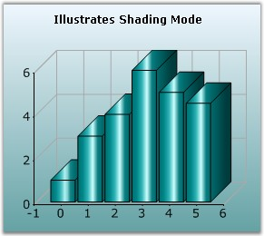
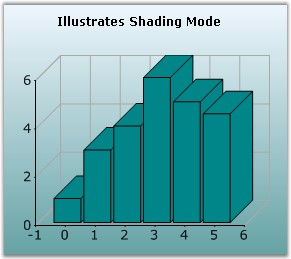

::: {style="DISPLAY: none"}
{#d2h_url_template}{#d2h_package_url style="WIDTH: 0px; DISPLAY: none; HEIGHT: 0px"}
:::

:::: {.d2h_secondary_topic style="PADDING-BOTTOM: 10pt; MARGIN: 0pt; PADDING-LEFT: 0pt; PADDING-RIGHT: 0pt; PADDING-TOP: 0pt"}
#### ShadingMode {#shadingmode style="tab-stops: 0pt"}

 

Specifies the appearance of the chart series.                 

 

::: {align="center"}
+-------------------------------------+-----------------------------------------------------------------------------------------------------------------------------------------------------------------+
|                                                                                                                                                                                                       |
|                                                                                                                                                                                                       |
| Details                                                                                                                                                                                               |
+-------------------------------------+-----------------------------------------------------------------------------------------------------------------------------------------------------------------+
| **Possible Values**                 | [·      ]{style="FONT-FAMILY: Symbol"}**FlatRectangle** - Displays in a flat rectangular format.                                                                |
|                                     |                                                                                                                                                                 |
|                                     | [·      ]{style="FONT-FAMILY: Symbol"}**PhongCylinder** - Displays in a cylindrical format.                                                                     |
+-------------------------------------+-----------------------------------------------------------------------------------------------------------------------------------------------------------------+
| **Default Value    **               | **PhongCylinder**                                                                                                                                               |
+-------------------------------------+-----------------------------------------------------------------------------------------------------------------------------------------------------------------+
| **2D / 3D Limitations**             | No                                                                                                                                                              |
+-------------------------------------+-----------------------------------------------------------------------------------------------------------------------------------------------------------------+
| **Applies to Chart Element**        | All Series                                                                                                                                                      |
+-------------------------------------+-----------------------------------------------------------------------------------------------------------------------------------------------------------------+
| **Applies to Chart Types**          | Column Chart, BarCharts, Candle Chart, HiLO Chart, HiLoOpenClose Chart, Tornado chart, BoxandWhisker chart, Gantt Chart, Histogram Chart, Polar and Radar Chart |
+-------------------------------------+-----------------------------------------------------------------------------------------------------------------------------------------------------------------+
:::

 

Here is sample code snippet using ShadingMode.

 

+-------------------------------------------------------------------------------------------------------------------------------------------------------------------------------------------------------------------------------------------------------------------------------------------------------------------------+
| **[\[C#\]]{style="FONT-FAMILY: 'Courier New'; COLOR: black"}**                                                                                                                                                                                                                                                          |
|                                                                                                                                                                                                                                                                                                                         |
| **[]{style="FONT-FAMILY: 'Courier New'; COLOR: black"}**                                                                                                                                                                                                                                                                |
|                                                                                                                                                                                                                                                                                                                         |
| [this]{style="FONT-FAMILY: 'Courier New'; COLOR: blue"}[.chartControl1.Series\[0\].ConfigItems.ColumnItem.ShadingMode = ]{style="FONT-FAMILY: 'Courier New'; COLOR: black"}[ChartColumnShadingMode]{style="FONT-FAMILY: 'Courier New'; COLOR: teal"}[.FlatRectangle;]{style="FONT-FAMILY: 'Courier New'; COLOR: black"} |
+-------------------------------------------------------------------------------------------------------------------------------------------------------------------------------------------------------------------------------------------------------------------------------------------------------------------------+

 

+----------------------------------------------------------------------------------------------------------------------------------------------------------------------------------------------------------------------------------------------------------------------------------------------------------------------------+
| **[\[VB.NET\]]{style="FONT-FAMILY: 'Courier New'; COLOR: black"}**                                                                                                                                                                                                                                                         |
|                                                                                                                                                                                                                                                                                                                            |
| **[]{style="FONT-FAMILY: 'Courier New'; COLOR: black"}**                                                                                                                                                                                                                                                                   |
|                                                                                                                                                                                                                                                                                                                            |
| [Private Me]{style="FONT-FAMILY: 'Courier New'; COLOR: blue"}[.chartControl1.Series(0).ConfigItems.ColumnItem.ShadingMode = ]{style="FONT-FAMILY: 'Courier New'; COLOR: black"}[ChartColumnShadingMode]{style="FONT-FAMILY: 'Courier New'; COLOR: teal"}[.FlatRectangle]{style="FONT-FAMILY: 'Courier New'; COLOR: black"} |
+----------------------------------------------------------------------------------------------------------------------------------------------------------------------------------------------------------------------------------------------------------------------------------------------------------------------------+

 

{border="0"}

 

Figure 193: Normal Column Chart (3D View)

 

{border="0"}

 

Figure 194: Column Chart with ShadingMode = \"FlatRectangle\"

 

**See Also**

 

[Column Charts]{.UGHyperlink}, [BarCharts]{.UGHyperlink}, [Candle Chart]{.UGHyperlink}, [HiLO Chart]{.UGHyperlink}, [HiLoOpenClose Chart]{.UGHyperlink}, [Tornado chart]{.UGHyperlink}, [BoxandWhisker chart]{.UGHyperlink}, [Gantt Chart]{.UGHyperlink}, [Histogram Chart]{.UGHyperlink}, [Polar and Radar Chart]{.UGHyperlink}[]{style="COLOR: black"}

 

[]{#p144} 

 

[]{#related-topics}
::::
