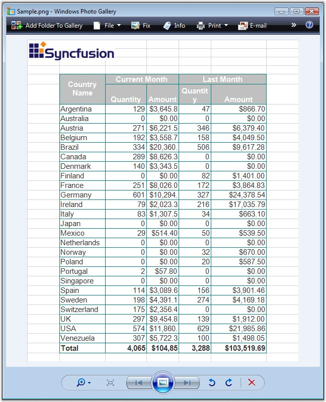
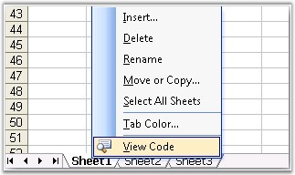

::: {style="DISPLAY: none"}
{#d2h_url_template}{#d2h_package_url style="WIDTH: 0px; DISPLAY: none; HEIGHT: 0px"}
:::

:::: {.d2h_secondary_topic style="PADDING-BOTTOM: 10pt; MARGIN: 0pt; PADDING-LEFT: 0pt; PADDING-RIGHT: 0pt; PADDING-TOP: 0pt"}
##### Sheet Organization {#sheet-organization style="tab-stops: 0pt"}

 

Excel has options to consolidate data from different worksheets, or move a sheet to another workbook, or insert a sheet in between the worksheets. Also, the sheet tab color can be formatted, and the sheets can be named as per the users needs. This section explains how sheets can be organized. Below sections explains the XlsIO\'s ability to organize sheets.

[]{style="FONT-FAMILY: 'Trebuchet MS','sans-serif'; COLOR: #15428b; FONT-SIZE: 9pt"} 

[·      ]{style="FONT-FAMILY: Symbol"}Copy/Move Worksheet-This section explains how a worksheet can be copied from another worksheet with or without certain formatting.

[·      ]{style="FONT-FAMILY: Symbol"}Sheet Format-This section explains various formats that can be applied to a sheet.

[]{style="COLOR: #15428b"} 

###### []{#p63}4.1.3.3.3.1 Copy/Move Worksheet {#copymove-worksheet style="tab-stops: 0pt"}

**[]{style="FONT-FAMILY: 'Segoe UI','sans-serif'; COLOR: black"}** 

When you copy/move rows and columns, Microsoft Excel copies or moves all the data that it contains, including formulas and their resulting values, comments, cell formats, and hidden cells.

[]{style="FONT-FAMILY: 'Trebuchet MS','sans-serif'; COLOR: #15428b; FONT-SIZE: 9pt"} 

Copying Worksheets

[]{style="FONT-FAMILY: 'Trebuchet MS','sans-serif'; COLOR: #15428b; FONT-SIZE: 9pt"} 

Copying worksheets can be internal or external. XlsIO provides support for copying a worksheet within a workbook, and also from one workbook to another. This feature can be used to merge together several workbooks. Following code example illustrates how to copy a sheet with its entire contents to another sheet.

[   ]{style="FONT-FAMILY: 'Trebuchet MS','sans-serif'; COLOR: #15428b; FONT-SIZE: 9pt"}

+---------------------------------------------------------------------------------------------------------------------------------------------------------------------------------------------------------------------------------------------------+
| **[\[C#\]]{style="FONT-FAMILY: 'Courier New'"}**                                                                                                                                                                                                  |
|                                                                                                                                                                                                                                                   |
| []{style="FONT-FAMILY: 'Courier New'"}                                                                                                                                                                                                            |
|                                                                                                                                                                                                                                                   |
| [// Open the Source WorkBook.        ]{style="FONT-FAMILY: 'Courier New'; COLOR: green"}                                                                                                                                                          |
|                                                                                                                                                                                                                                                   |
| [IWorkbook]{style="FONT-FAMILY: 'Courier New'; COLOR: #2b91af"}[ sourceWorkbook = application.Workbooks.Open([@\"..\\..\\..\\..\\..\\Data\\SourceWorkbookTemplate.xls\"]{style="COLOR: #a31515"});]{style="FONT-FAMILY: 'Courier New'"}           |
|                                                                                                                                                                                                                                                   |
| []{style="FONT-FAMILY: 'Courier New'"}                                                                                                                                                                                                            |
|                                                                                                                                                                                                                                                   |
| [// Open the Destination WorkBook.        ]{style="FONT-FAMILY: 'Courier New'; COLOR: green"}                                                                                                                                                     |
|                                                                                                                                                                                                                                                   |
| [IWorkbook]{style="FONT-FAMILY: 'Courier New'; COLOR: #2b91af"}[ destinationWorkbook = application.Workbooks.Open([@\"..\\..\\..\\..\\..\\Data\\DestinationWorkbookTemplate.xls\"]{style="COLOR: #a31515"});]{style="FONT-FAMILY: 'Courier New'"} |
|                                                                                                                                                                                                                                                   |
| []{style="FONT-FAMILY: 'Courier New'"}                                                                                                                                                                                                            |
|                                                                                                                                                                                                                                                   |
| [// Copy the first worksheet from the Source workbook to the destination workbook.]{style="FONT-FAMILY: 'Courier New'; COLOR: green"}                                                                                                             |
|                                                                                                                                                                                                                                                   |
| [destinationWorkbook.Worksheets.AddCopy(sourceWorkbook.Worksheets\[0\]);]{style="FONT-FAMILY: 'Courier New'"}                                                                                                                                     |
|                                                                                                                                                                                                                                                   |
| []{style="FONT-FAMILY: 'Courier New'"}                                                                                                                                                                                                            |
|                                                                                                                                                                                                                                                   |
| [// Activate the newly added worksheet in the destination workbook.]{style="FONT-FAMILY: 'Courier New'; COLOR: green"}                                                                                                                            |
|                                                                                                                                                                                                                                                   |
| [destinationWorkbook.ActiveSheetIndex = 1;]{style="FONT-FAMILY: 'Courier New'"}                                                                                                                                                                   |
|                                                                                                                                                                                                                                                   |
| []{style="FONT-FAMILY: 'Courier New'"}                                                                                                                                                                                                            |
|                                                                                                                                                                                                                                                   |
| [// Saving the workbook to disk.]{style="FONT-FAMILY: 'Courier New'; COLOR: green"}                                                                                                                                                               |
|                                                                                                                                                                                                                                                   |
| [destinationWorkbook.SaveAs([\"Sample.xls\"]{style="COLOR: #a31515"});]{style="FONT-FAMILY: 'Courier New'"}                                                                                                                                       |
|                                                                                                                                                                                                                                                   |
| []{style="FONT-FAMILY: 'Courier New'"}                                                                                                                                                                                                            |
|                                                                                                                                                                                                                                                   |
| [// Close the workbook.]{style="FONT-FAMILY: 'Courier New'; COLOR: green"}                                                                                                                                                                        |
|                                                                                                                                                                                                                                                   |
| [destinationWorkbook.Close();   ]{style="FONT-FAMILY: 'Courier New'"}                                                                                                                                                                             |
+---------------------------------------------------------------------------------------------------------------------------------------------------------------------------------------------------------------------------------------------------+

[]{style="FONT-FAMILY: 'Trebuchet MS','sans-serif'; COLOR: #15428b; FONT-SIZE: 9pt"} 

+---------------------------------------------------------------------------------------------------------------------------------------------------------------------------------------------------------------------------------------------------------------------------+
| **[\[VB.NET\]]{style="FONT-FAMILY: 'Courier New'"}**                                                                                                                                                                                                                      |
|                                                                                                                                                                                                                                                                           |
| []{style="FONT-FAMILY: 'Courier New'; COLOR: black"}                                                                                                                                                                                                                      |
|                                                                                                                                                                                                                                                                           |
| [\' Open the Source WorkBook.]{style="FONT-FAMILY: 'Courier New'; COLOR: green"}                                                                                                                                                                                          |
|                                                                                                                                                                                                                                                                           |
| [Dim]{style="FONT-FAMILY: 'Courier New'; COLOR: blue"}[ sourceWorkbook [As]{style="COLOR: blue"} IWorkbook = application.Workbooks.Open([\"..\\..\\..\\..\\..\\Data\\SourceWorkbookTemplate.xls\"]{style="COLOR: maroon"})]{style="FONT-FAMILY: 'Courier New'"}           |
|                                                                                                                                                                                                                                                                           |
| []{style="FONT-FAMILY: 'Courier New'"}                                                                                                                                                                                                                                    |
|                                                                                                                                                                                                                                                                           |
| [\' Open the Destination WorkBook.        ]{style="FONT-FAMILY: 'Courier New'; COLOR: green"}                                                                                                                                                                             |
|                                                                                                                                                                                                                                                                           |
| [Dim]{style="FONT-FAMILY: 'Courier New'; COLOR: blue"}[ destinationWorkbook [As]{style="COLOR: blue"} IWorkbook = application.Workbooks.Open([\"..\\..\\..\\..\\..\\Data\\DestinationWorkbookTemplate.xls\"]{style="COLOR: maroon"})]{style="FONT-FAMILY: 'Courier New'"} |
|                                                                                                                                                                                                                                                                           |
| []{style="FONT-FAMILY: 'Courier New'"}                                                                                                                                                                                                                                    |
|                                                                                                                                                                                                                                                                           |
| [\' Copy the first worksheet from the Source workbook to the destination workbook.]{style="FONT-FAMILY: 'Courier New'; COLOR: green"}                                                                                                                                     |
|                                                                                                                                                                                                                                                                           |
| [destinationWorkbook.Worksheets.AddCopy(sourceWorkbook.Worksheets(0))]{style="FONT-FAMILY: 'Courier New'"}                                                                                                                                                                |
|                                                                                                                                                                                                                                                                           |
| []{style="FONT-FAMILY: 'Courier New'"}                                                                                                                                                                                                                                    |
|                                                                                                                                                                                                                                                                           |
| [\' Activate the newly added worksheet in the destination workbook.]{style="FONT-FAMILY: 'Courier New'; COLOR: green"}                                                                                                                                                    |
|                                                                                                                                                                                                                                                                           |
| [destinationWorkbook.ActiveSheetIndex = 1]{style="FONT-FAMILY: 'Courier New'"}                                                                                                                                                                                            |
|                                                                                                                                                                                                                                                                           |
| []{style="FONT-FAMILY: 'Courier New'"}                                                                                                                                                                                                                                    |
|                                                                                                                                                                                                                                                                           |
| [\' Saving the workbook to disk.]{style="FONT-FAMILY: 'Courier New'; COLOR: green"}                                                                                                                                                                                       |
|                                                                                                                                                                                                                                                                           |
| [destinationWorkbook.SaveAs([\"Sample.xls\"]{style="COLOR: maroon"})]{style="FONT-FAMILY: 'Courier New'"}                                                                                                                                                                 |
|                                                                                                                                                                                                                                                                           |
| []{style="FONT-FAMILY: 'Courier New'"}                                                                                                                                                                                                                                    |
|                                                                                                                                                                                                                                                                           |
| [\' Close the workbook.]{style="FONT-FAMILY: 'Courier New'; COLOR: green"}                                                                                                                                                                                                |
|                                                                                                                                                                                                                                                                           |
| [destinationWorkbook.Close()]{style="FONT-FAMILY: 'Courier New'"}                                                                                                                                                                                                         |
+---------------------------------------------------------------------------------------------------------------------------------------------------------------------------------------------------------------------------------------------------------------------------+

[]{style="FONT-FAMILY: 'Trebuchet MS','sans-serif'; COLOR: #15428b; FONT-SIZE: 9pt"} 

You can also specify copy options while copying a worksheet, if you are interested in improving the performance, and if you are interested in ignoring certain formatting while copying through the **ExcelWorksheetCopyFlags** enumerator. Following are the values for this enumerator.

[]{style="FONT-FAMILY: 'Trebuchet MS','sans-serif'; COLOR: #15428b; FONT-SIZE: 9pt"} 

::: {align="center"}
  ----------------------- ----------------------------------------------------------------------------------------
  Member name             Description
  None                    No flags.
  ClearBefore             Represents the ClearBefore copy flags.
  CopyNames               Copies Names.
  CopyCells               Copies whole Cells.
  CopyRowHeight           Copies Row Height.
  CopyColumnHeight        Copies Column Height.
  CopyOptions             CopyOptions copy flags.
  CopyMerges              Copies Merges. 
  CopyShapes              Copies Shapes.
  CopyConditionlFormats   Represents the CopyConditionlFormats copy flags.
  CopyAutoFilters         Copies AutoFilters.
  CopyDataValidations     Copies Data Validations.
  CopyPageSetup           Copy page setup (page breaks, paper orientation, header, footer and other properties).
  CopyAll                 Represents the CopyAll copy flags.
  CopyWithoutNames        Represents the CopyWithoutNames copy flags.
  ----------------------- ----------------------------------------------------------------------------------------
:::

 

The following code example illustrates copying worksheets.

 

+---------------------------------------------------------------------------------------------------------------------------------------------------------------------------------------------------------------------------------------------------+
| **[\[C#\]]{style="FONT-FAMILY: 'Courier New'"}**                                                                                                                                                                                                  |
|                                                                                                                                                                                                                                                   |
| **[]{style="FONT-FAMILY: 'Courier New'"}**                                                                                                                                                                                                        |
|                                                                                                                                                                                                                                                   |
| [// Open the Source WorkBook.        ]{style="FONT-FAMILY: 'Courier New'; COLOR: green"}                                                                                                                                                          |
|                                                                                                                                                                                                                                                   |
| [IWorkbook]{style="FONT-FAMILY: 'Courier New'; COLOR: #2b91af"}[ sourceWorkbook = application.Workbooks.Open([@\"..\\..\\..\\..\\..\\Data\\SourceWorkbookTemplate.xls\"]{style="COLOR: #a31515"});]{style="FONT-FAMILY: 'Courier New'"}           |
|                                                                                                                                                                                                                                                   |
| []{style="FONT-FAMILY: 'Courier New'"}                                                                                                                                                                                                            |
|                                                                                                                                                                                                                                                   |
| [// Open the Destination WorkBook.        ]{style="FONT-FAMILY: 'Courier New'; COLOR: green"}                                                                                                                                                     |
|                                                                                                                                                                                                                                                   |
| [IWorkbook]{style="FONT-FAMILY: 'Courier New'; COLOR: #2b91af"}[ destinationWorkbook = application.Workbooks.Open([@\"..\\..\\..\\..\\..\\Data\\DestinationWorkbookTemplate.xls\"]{style="COLOR: #a31515"});]{style="FONT-FAMILY: 'Courier New'"} |
|                                                                                                                                                                                                                                                   |
| []{style="FONT-FAMILY: 'Courier New'"}                                                                                                                                                                                                            |
|                                                                                                                                                                                                                                                   |
| [// Copy the first worksheet from the Source workbook to the destination workbook with data validations.]{style="FONT-FAMILY: 'Courier New'; COLOR: green"}                                                                                       |
|                                                                                                                                                                                                                                                   |
| [destinationWorkbook.Worksheets.AddCopy(sourceWorkbook.Worksheets\[0\], [ExcelWorksheetCopyFlags]{style="COLOR: #2b91af"}.CopyDataValidations);]{style="FONT-FAMILY: 'Courier New'"}                                                              |
|                                                                                                                                                                                                                                                   |
| []{style="FONT-FAMILY: 'Courier New'"}                                                                                                                                                                                                            |
|                                                                                                                                                                                                                                                   |
| [// Activate the newly added worksheet in the destination workbook.]{style="FONT-FAMILY: 'Courier New'; COLOR: green"}                                                                                                                            |
|                                                                                                                                                                                                                                                   |
| [destinationWorkbook.ActiveSheetIndex = 1;]{style="FONT-FAMILY: 'Courier New'"}                                                                                                                                                                   |
|                                                                                                                                                                                                                                                   |
| []{style="FONT-FAMILY: 'Courier New'"}                                                                                                                                                                                                            |
|                                                                                                                                                                                                                                                   |
| [// Saving the workbook to disk.]{style="FONT-FAMILY: 'Courier New'; COLOR: green"}                                                                                                                                                               |
|                                                                                                                                                                                                                                                   |
| [destinationWorkbook.SaveAs([\"Sample.xls\"]{style="COLOR: #a31515"});]{style="FONT-FAMILY: 'Courier New'"}                                                                                                                                       |
|                                                                                                                                                                                                                                                   |
| []{style="FONT-FAMILY: 'Courier New'"}                                                                                                                                                                                                            |
|                                                                                                                                                                                                                                                   |
| [// Close the workbook.]{style="FONT-FAMILY: 'Courier New'; COLOR: green"}                                                                                                                                                                        |
|                                                                                                                                                                                                                                                   |
| [destinationWorkbook.Close();  ]{style="FONT-FAMILY: 'Courier New'"}                                                                                                                                                                              |
+---------------------------------------------------------------------------------------------------------------------------------------------------------------------------------------------------------------------------------------------------+

[]{style="FONT-FAMILY: 'Trebuchet MS','sans-serif'; COLOR: #15428b; FONT-SIZE: 9pt"} 

+---------------------------------------------------------------------------------------------------------------------------------------------------------------------------------------------------------------------------------------------------------------------------+
| **[\[VB.NET\]]{style="FONT-FAMILY: 'Courier New'"}**                                                                                                                                                                                                                      |
|                                                                                                                                                                                                                                                                           |
| **[]{style="FONT-FAMILY: 'Courier New'"}**                                                                                                                                                                                                                                |
|                                                                                                                                                                                                                                                                           |
| [\' Open the Source WorkBook.]{style="FONT-FAMILY: 'Courier New'; COLOR: green"}                                                                                                                                                                                          |
|                                                                                                                                                                                                                                                                           |
| [Dim]{style="FONT-FAMILY: 'Courier New'; COLOR: blue"}[ sourceWorkbook [As]{style="COLOR: blue"} IWorkbook = application.Workbooks.Open([\"..\\..\\..\\..\\..\\Data\\SourceWorkbookTemplate.xls\"]{style="COLOR: maroon"})]{style="FONT-FAMILY: 'Courier New'"}           |
|                                                                                                                                                                                                                                                                           |
| []{style="FONT-FAMILY: 'Courier New'"}                                                                                                                                                                                                                                    |
|                                                                                                                                                                                                                                                                           |
| [\' Open the Destination WorkBook.        ]{style="FONT-FAMILY: 'Courier New'; COLOR: green"}                                                                                                                                                                             |
|                                                                                                                                                                                                                                                                           |
| [Dim]{style="FONT-FAMILY: 'Courier New'; COLOR: blue"}[ destinationWorkbook [As]{style="COLOR: blue"} IWorkbook = application.Workbooks.Open([\"..\\..\\..\\..\\..\\Data\\DestinationWorkbookTemplate.xls\"]{style="COLOR: maroon"})]{style="FONT-FAMILY: 'Courier New'"} |
|                                                                                                                                                                                                                                                                           |
| []{style="FONT-FAMILY: 'Courier New'"}                                                                                                                                                                                                                                    |
|                                                                                                                                                                                                                                                                           |
| [\' Copy the first worksheet from the Source workbook to the destination workbook with data validations.]{style="FONT-FAMILY: 'Courier New'; COLOR: green"}                                                                                                               |
|                                                                                                                                                                                                                                                                           |
| [destinationWorkbook.Worksheets.AddCopy(sourceWorkbook.Worksheets(0), ExcelWorksheetCopyFlags.CopyDataValidations)]{style="FONT-FAMILY: 'Courier New'"}                                                                                                                   |
|                                                                                                                                                                                                                                                                           |
| []{style="FONT-FAMILY: 'Courier New'"}                                                                                                                                                                                                                                    |
|                                                                                                                                                                                                                                                                           |
| [\' Activate the newly added worksheet in the destination workbook.]{style="FONT-FAMILY: 'Courier New'; COLOR: green"}                                                                                                                                                    |
|                                                                                                                                                                                                                                                                           |
| [destinationWorkbook.ActiveSheetIndex = 1]{style="FONT-FAMILY: 'Courier New'"}                                                                                                                                                                                            |
|                                                                                                                                                                                                                                                                           |
| []{style="FONT-FAMILY: 'Courier New'"}                                                                                                                                                                                                                                    |
|                                                                                                                                                                                                                                                                           |
| [\' Saving the workbook to disk.]{style="FONT-FAMILY: 'Courier New'; COLOR: green"}                                                                                                                                                                                       |
|                                                                                                                                                                                                                                                                           |
| [destinationWorkbook.SaveAs([\"Sample.xls\"]{style="COLOR: maroon"})]{style="FONT-FAMILY: 'Courier New'"}                                                                                                                                                                 |
|                                                                                                                                                                                                                                                                           |
| []{style="FONT-FAMILY: 'Courier New'"}                                                                                                                                                                                                                                    |
|                                                                                                                                                                                                                                                                           |
| [\' Close the workbook.]{style="FONT-FAMILY: 'Courier New'; COLOR: green"}                                                                                                                                                                                                |
|                                                                                                                                                                                                                                                                           |
| [destinationWorkbook.Close()]{style="FONT-FAMILY: 'Courier New'"}                                                                                                                                                                                                         |
+---------------------------------------------------------------------------------------------------------------------------------------------------------------------------------------------------------------------------------------------------------------------------+

 

You can also copy a worksheet before and after a particular worksheet by using the **AddCopyBefore** and **AddCopyAfter** methods respectively.

 

Moving a Worksheet

**[]{style="FONT-FAMILY: 'Trebuchet MS','sans-serif'; COLOR: #15428b; FONT-SIZE: 9pt"}** 

XlsIO also allows moving worksheets from one position to another. This is similar to dragging a worksheet in MS Excel. This can be performed by using the **Move** method. Following code example illustrates how a worksheet is moved to the 2nd position.

[]{style="FONT-FAMILY: 'Trebuchet MS','sans-serif'; COLOR: #15428b; FONT-SIZE: 9pt"} 

+-----------------------------------------------------------------------+
| **[\[C#\]]{style="FONT-FAMILY: 'Courier New'"}**                      |
|                                                                       |
| []{style="FONT-FAMILY: 'Courier New'"}                                |
|                                                                       |
| [sheet.Move(2);]{style="FONT-FAMILY: 'Courier New'"}                  |
+-----------------------------------------------------------------------+

[]{style="FONT-FAMILY: 'Trebuchet MS','sans-serif'; COLOR: #15428b; FONT-SIZE: 9pt"} 

+-----------------------------------------------------------------------+
| **[\[VB.NET\]]{style="FONT-FAMILY: 'Courier New'"}**                  |
|                                                                       |
| []{style="FONT-FAMILY: 'Courier New'"}                                |
|                                                                       |
| [sheet.Move(2)]{style="FONT-FAMILY: 'Courier New'"}                   |
+-----------------------------------------------------------------------+

 

###### []{#p64}4.1.3.3.3.2 Convert To Image {#convert-to-image style="tab-stops: 0pt"}

**[]{style="FONT-FAMILY: 'Segoe UI','sans-serif'; COLOR: black"}** 

Essential XlsIO can convert a worksheet to an image of type bitmap or metafile based on the input range of rows and columns with all basic formats preserved. The sheet can be converted and saved to disk or stream. The converted image can be inserted in a pdf by using Essential PDF.

[]{style="FONT-FAMILY: 'Trebuchet MS','sans-serif'; COLOR: #15428b; FONT-SIZE: 9pt"} 

For more information on insertion of images in PDF, refer the following link:

[[http://help.syncfusion.com/ug_82sp/Reporting_XlsIO/defaultWPF.html]{.UGHyperlink}](http://help.syncfusion.com/ug_82sp/Reporting_XlsIO/defaultWPF.html)[]{.UGHyperlink}

[]{style="FONT-FAMILY: 'Trebuchet MS','sans-serif'; COLOR: #15428b; FONT-SIZE: 9pt"} 

+------------------------------------------------------------------------------------------------------------------------------------------------------------------------------------------------------------------+
| **[\[C#\]]{style="FONT-FAMILY: 'Courier New'"}**                                                                                                                                                                 |
|                                                                                                                                                                                                                  |
| []{style="FONT-FAMILY: 'Courier New'"}                                                                                                                                                                           |
|                                                                                                                                                                                                                  |
| [// Convert as bitmap.]{style="FONT-FAMILY: 'Courier New'; COLOR: green"}                                                                                                                                        |
|                                                                                                                                                                                                                  |
| [Image]{style="FONT-FAMILY: 'Courier New'; COLOR: teal"}[ img = sheet.ConvertToImage(1, 1, 10, 20);]{style="FONT-FAMILY: 'Courier New'"}                                                                         |
|                                                                                                                                                                                                                  |
| [img.Save([\"Sample.png\"]{style="COLOR: maroon"}, [ImageFormat]{style="COLOR: teal"}.Png);]{style="FONT-FAMILY: 'Courier New'"}                                                                                 |
|                                                                                                                                                                                                                  |
| []{style="FONT-FAMILY: 'Courier New'"}                                                                                                                                                                           |
|                                                                                                                                                                                                                  |
| [// Converts to MetaFile.]{style="FONT-FAMILY: 'Courier New'; COLOR: green"}                                                                                                                                     |
|                                                                                                                                                                                                                  |
| [Image]{style="FONT-FAMILY: 'Courier New'; COLOR: teal"}[ img = sheet.ConvertToImage(1, 1, 10, 20, [ImageType]{style="COLOR: teal"}.Metafile, [null]{style="COLOR: blue"});]{style="FONT-FAMILY: 'Courier New'"} |
|                                                                                                                                                                                                                  |
| [img.Save([\"Sample.emf\"]{style="COLOR: maroon"}, ImageFormat.Emf);]{style="FONT-FAMILY: 'Courier New'"}                                                                                                        |
|                                                                                                                                                                                                                  |
| []{style="FONT-FAMILY: 'Courier New'"}                                                                                                                                                                           |
|                                                                                                                                                                                                                  |
| [// Converts and save as stream.]{style="FONT-FAMILY: 'Courier New'; COLOR: green"}                                                                                                                              |
|                                                                                                                                                                                                                  |
| [MemoryStream stream = [new]{style="COLOR: blue"} MemoryStream();]{style="FONT-FAMILY: 'Courier New'"}                                                                                                           |
|                                                                                                                                                                                                                  |
| [sheet.ConvertToImage(1, 1, 10, 20, [ImageType]{style="COLOR: teal"}.Metafile, stream);]{style="FONT-FAMILY: 'Courier New'"}                                                                                     |
+------------------------------------------------------------------------------------------------------------------------------------------------------------------------------------------------------------------+

[]{style="FONT-FAMILY: 'Trebuchet MS','sans-serif'; COLOR: #15428b; FONT-SIZE: 9pt"} 

+----------------------------------------------------------------------------------------------------------------------------------------------------------------------------------------------------------------------------+
| **[\[VB\]]{style="FONT-FAMILY: 'Courier New'"}**                                                                                                                                                                           |
|                                                                                                                                                                                                                            |
| []{style="FONT-FAMILY: 'Courier New'"}                                                                                                                                                                                     |
|                                                                                                                                                                                                                            |
| [\' Convert as bitmap.]{style="FONT-FAMILY: 'Courier New'; COLOR: green"}                                                                                                                                                  |
|                                                                                                                                                                                                                            |
| [Dim]{style="FONT-FAMILY: 'Courier New'; COLOR: blue"}[ img [As]{style="COLOR: blue"} Image = sheet.ConvertToImage(1, 1, 10, 20)]{style="FONT-FAMILY: 'Courier New'"}                                                      |
|                                                                                                                                                                                                                            |
| [img.Save([\"Sample.png\"]{style="COLOR: maroon"}, ImageFormat.Png)]{style="FONT-FAMILY: 'Courier New'"}                                                                                                                   |
|                                                                                                                                                                                                                            |
| []{style="FONT-FAMILY: 'Courier New'"}                                                                                                                                                                                     |
|                                                                                                                                                                                                                            |
| [\' Converts to Metafile.]{style="FONT-FAMILY: 'Courier New'; COLOR: green"}                                                                                                                                               |
|                                                                                                                                                                                                                            |
| [Dim]{style="FONT-FAMILY: 'Courier New'; COLOR: blue"}[ img [As]{style="COLOR: blue"} Image = sheet.ConvertToImage(1, 1, 10, 20,[ ImageType]{style="COLOR: black"}.Metafile, Nothing)]{style="FONT-FAMILY: 'Courier New'"} |
|                                                                                                                                                                                                                            |
| [img.Save([\"Sample.emf\"]{style="COLOR: maroon"}, ImageFormat.Emf)]{style="FONT-FAMILY: 'Courier New'"}                                                                                                                   |
|                                                                                                                                                                                                                            |
| []{style="FONT-FAMILY: 'Courier New'; COLOR: green"}                                                                                                                                                                       |
|                                                                                                                                                                                                                            |
| [\' Converts and save as stream.]{style="FONT-FAMILY: 'Courier New'; COLOR: green"}                                                                                                                                        |
|                                                                                                                                                                                                                            |
| [Dim]{style="FONT-FAMILY: 'Courier New'; COLOR: blue"}[ stream [As]{style="COLOR: blue"} MemoryStream = [New]{style="COLOR: blue"} MemoryStream()]{style="FONT-FAMILY: 'Courier New'"}                                     |
|                                                                                                                                                                                                                            |
| [sheet.ConvertToImage(1, 1, 10, 20,[ ImageType]{style="COLOR: black"}.Metafile, stream)]{style="FONT-FAMILY: 'Courier New'"}                                                                                               |
+----------------------------------------------------------------------------------------------------------------------------------------------------------------------------------------------------------------------------+

[]{style="FONT-FAMILY: 'Trebuchet MS','sans-serif'; COLOR: #15428b; FONT-SIZE: 9pt"} 

{border="0"}

Figure 69: Worksheet converted to image by using XlsIO[]{style="FONT-FAMILY: 'Trebuchet MS','sans-serif'; COLOR: #15428b"}

 

Essential XlsIO can convert a worksheet based on the input range of the rows and columns which does not support the following elements:

 

[·      ]{style="FONT-FAMILY: Symbol"}Subscript/Superscript

[·      ]{style="FONT-FAMILY: Symbol"}RTF

[·      ]{style="FONT-FAMILY: Symbol"}Shrink to fit

[·      ]{style="FONT-FAMILY: Symbol"}Shapes (except TextBox shape and Image)

[·      ]{style="FONT-FAMILY: Symbol"}Charts and Chart Worksheet

[·      ]{style="FONT-FAMILY: Symbol"}Complex conditional formatting

[·      ]{style="FONT-FAMILY: Symbol"}Gradient fill is partially supported

 

###### []{#p65}4.1.3.3.3.3 Sheet Format {#sheet-format style="tab-stops: 0pt"}

**[]{style="FONT-FAMILY: 'Segoe UI','sans-serif'; COLOR: black"}** 

Excel provides various options to format a sheet. This includes setting the tab color, naming sheets, and clearing the data in the sheet. This section demonstrates how these formats can be applied to the worksheets in XlsIO.

[]{style="FONT-FAMILY: 'Trebuchet MS','sans-serif'; COLOR: #15428b; FONT-SIZE: 9pt"} 

{border="0"}

Figure 70: Menu for formatting a Sheet[]{style="FONT-FAMILY: 'Trebuchet MS','sans-serif'; COLOR: #15428b"}

[]{style="FONT-FAMILY: 'Trebuchet MS','sans-serif'; COLOR: #15428b; FONT-SIZE: 9pt"} 

Worksheet Formatting in XlsIO

[]{style="FONT-SIZE: 9pt"} 

[Sheet Naming]{style="FONT-SIZE: 9pt"}

[]{style="FONT-SIZE: 9pt"} 

Sheets can be named/renamed to find out the sheet or provide a hint on the data in the sheet, in a large workbook that has a number of worksheets. You can name a worksheet by using the **IWorksheet.Name** property.

[]{style="FONT-FAMILY: 'Trebuchet MS','sans-serif'; COLOR: #15428b; FONT-SIZE: 9pt"} 

+------------------------------------------------------------------------------------------+
| **[\[C#\]]{style="FONT-FAMILY: 'Courier New'"}**                                         |
|                                                                                          |
| **[]{style="FONT-FAMILY: 'Courier New'"}**                                               |
|                                                                                          |
| [sheet.Name = [\"Result\"]{style="COLOR: #a31515"};]{style="FONT-FAMILY: 'Courier New'"} |
+------------------------------------------------------------------------------------------+

[]{style="FONT-FAMILY: 'Trebuchet MS','sans-serif'; COLOR: #15428b; FONT-SIZE: 9pt"} 

+----------------------------------------------------------------------------------------+
| **[\[VB.NET\]]{style="FONT-FAMILY: 'Courier New'"}**                                   |
|                                                                                        |
| **[]{style="FONT-FAMILY: 'Courier New'"}**                                             |
|                                                                                        |
| [sheet.Name = [\"Result\"]{style="COLOR: maroon"}]{style="FONT-FAMILY: 'Courier New'"} |
+----------------------------------------------------------------------------------------+

[]{style="FONT-FAMILY: 'Trebuchet MS','sans-serif'; COLOR: #15428b; FONT-SIZE: 9pt"} 

Tab Color

**[]{style="FONT-FAMILY: 'Trebuchet MS','sans-serif'; COLOR: #15428b; FONT-SIZE: 9pt"}** 

Tab Colors are set to highlight a particular sheet that has some important data. This is done in Excel, by selecting the \"Tab Color\" option in the sheet context menu. You can set the tab color through the **TabColor** property, as given below.

[]{style="FONT-FAMILY: 'Trebuchet MS','sans-serif'; COLOR: #15428b; FONT-SIZE: 9pt"} 

+---------------------------------------------------------------------------------------------------------+
| **[\[C#\]]{style="FONT-FAMILY: 'Courier New'"}**                                                        |
|                                                                                                         |
| []{style="FONT-FAMILY: 'Courier New'; COLOR: black"}                                                    |
|                                                                                                         |
| [sheet.TabColor = [ExcelKnownColors]{style="COLOR: #2b91af"}.Blue;]{style="FONT-FAMILY: 'Courier New'"} |
+---------------------------------------------------------------------------------------------------------+

[]{style="FONT-FAMILY: 'Trebuchet MS','sans-serif'; COLOR: #15428b; FONT-SIZE: 9pt"} 

+--------------------------------------------------------------------------------------------+
| **[\[VB.NET\]]{style="FONT-FAMILY: 'Courier New'"}**                                       |
|                                                                                            |
| **[]{style="FONT-FAMILY: 'Courier New'"}**                                                 |
|                                                                                            |
| [sheet.TabColor = ExcelKnownColors.Blue]{style="FONT-FAMILY: 'Courier New'; COLOR: black"} |
+--------------------------------------------------------------------------------------------+

[]{style="FONT-FAMILY: 'Courier New'; COLOR: black; FONT-SIZE: 9pt"} 

Clear

**[]{style="FONT-FAMILY: 'Trebuchet MS','sans-serif'; COLOR: #15428b; FONT-SIZE: 9pt"}** 

You can clear all data/data with formatting in a sheet, by using the **Clear** and **ClearData** methods of the IWorksheet.

[]{style="FONT-FAMILY: 'Trebuchet MS','sans-serif'; COLOR: #15428b; FONT-SIZE: 9pt"} 

+-----------------------------------------------------------------------+
| **[\[C#\]]{style="FONT-FAMILY: 'Courier New'"}**                      |
|                                                                       |
| []{style="FONT-FAMILY: 'Courier New'; COLOR: black"}                  |
|                                                                       |
| [sheet.Clear();]{style="FONT-FAMILY: 'Courier New'; COLOR: black"}    |
+-----------------------------------------------------------------------+

[]{style="FONT-FAMILY: 'Courier New'; COLOR: black; FONT-SIZE: 9pt"} 

+-----------------------------------------------------------------------+
| **[\[VB.NET\]]{style="FONT-FAMILY: 'Courier New'"}**                  |
|                                                                       |
| **[]{style="FONT-FAMILY: 'Courier New'"}**                            |
|                                                                       |
| [sheet.Clear()]{style="FONT-FAMILY: 'Courier New'; COLOR: black"}     |
+-----------------------------------------------------------------------+

 

###### []{#p66}4.1.3.3.3.4 Sheet to HTML {#sheet-to-html style="tab-stops: 0pt"}

**[]{style="FONT-FAMILY: 'Segoe UI','sans-serif'; COLOR: black"}** 

XlsIO provides support to convert a worksheet or workbook to HTML with basic formatting preserved. The following code example illustrates how to do this.

[]{style="FONT-FAMILY: 'Trebuchet MS','sans-serif'; COLOR: #15428b; FONT-SIZE: 9pt"} 

+--------------------------------------------------------------------------------------------------------------------------------+
| **[\[C#\]]{style="FONT-FAMILY: 'Courier New'"}**                                                                               |
|                                                                                                                                |
| **[]{style="FONT-FAMILY: 'Courier New'"}**                                                                                     |
|                                                                                                                                |
| [// Save an Excel sheet as HTML file.]{style="FONT-FAMILY: 'Courier New'; COLOR: green"}                                       |
|                                                                                                                                |
| [sheet.SaveAsHtml([\"Sample.html\"]{style="COLOR: #a31515"});]{style="FONT-FAMILY: 'Courier New'"}                             |
|                                                                                                                                |
| []{style="FONT-FAMILY: 'Courier New'"}                                                                                         |
|                                                                                                                                |
| [// Save a workbook as HTML file.]{style="FONT-FAMILY: 'Courier New'; COLOR: green"}                                           |
|                                                                                                                                |
| [workbook.SaveAsHtml([\"Sample.html\"]{style="COLOR: #a31515"}, HtmlSaveOptions.Default);]{style="FONT-FAMILY: 'Courier New'"} |
+--------------------------------------------------------------------------------------------------------------------------------+

[]{style="FONT-FAMILY: 'Trebuchet MS','sans-serif'; COLOR: #15428b; FONT-SIZE: 9pt"} 

+-------------------------------------------------------------------------------------------------------------------------------+
| **[\[VB.NET\]]{style="FONT-FAMILY: 'Courier New'"}**                                                                          |
|                                                                                                                               |
| **[]{style="FONT-FAMILY: 'Courier New'"}**                                                                                    |
|                                                                                                                               |
| [\' Save an Excel sheet as HTML file.]{style="FONT-FAMILY: 'Courier New'; COLOR: green"}                                      |
|                                                                                                                               |
| [sheet.SaveAsHtml([\"Sample.html\"]{style="COLOR: #a31515"})]{style="FONT-FAMILY: 'Courier New'"}                             |
|                                                                                                                               |
| []{style="FONT-FAMILY: 'Courier New'"}                                                                                        |
|                                                                                                                               |
| [\' Save a workbook as HTML file.]{style="FONT-FAMILY: 'Courier New'; COLOR: green"}                                          |
|                                                                                                                               |
| [workbook.SaveAsHtml([\"Sample.html\"]{style="COLOR: #a31515"}, HtmlSaveOptions.Default)]{style="FONT-FAMILY: 'Courier New'"} |
+-------------------------------------------------------------------------------------------------------------------------------+

[]{style="FONT-FAMILY: 'Trebuchet MS','sans-serif'; COLOR: #15428b; FONT-SIZE: 9pt"} 

Save Options

[]{style="FONT-FAMILY: 'Trebuchet MS','sans-serif'; COLOR: #15428b; FONT-SIZE: 9pt"} 

XlsIO also provides various save options to control images and text in an Excel file. It enables you to save a worksheet with the displayed text or value in the cell to HTML file. The following code example illustrates this.

[]{style="FONT-FAMILY: 'Trebuchet MS','sans-serif'; COLOR: #15428b; FONT-SIZE: 9pt"} 

+-----------------------------------------------------------------------------------------------------------------------------------------------------------------------------------------------+
| **[\[C#\]]{style="FONT-FAMILY: 'Courier New'"}**                                                                                                                                              |
|                                                                                                                                                                                               |
| **[]{style="FONT-FAMILY: 'Courier New'"}**                                                                                                                                                    |
|                                                                                                                                                                                               |
| [HtmlSaveOptions]{style="FONT-FAMILY: 'Courier New'; COLOR: #2b91af"}[ options = [new]{style="COLOR: blue"} [HtmlSaveOptions]{style="COLOR: #2b91af"}();]{style="FONT-FAMILY: 'Courier New'"} |
|                                                                                                                                                                                               |
| [options.TextMode = [HtmlSaveOptions]{style="COLOR: #2b91af"}.[GetText]{style="COLOR: #2b91af"}.DisplayText;]{style="FONT-FAMILY: 'Courier New'"}                                             |
|                                                                                                                                                                                               |
| [options.ImagePath = [@\"..\\..\\Output\\\"]{style="COLOR: #a31515"};]{style="FONT-FAMILY: 'Courier New'"}                                                                                    |
|                                                                                                                                                                                               |
| [sheet.SaveAsHtml([\"Sample.html\"]{style="COLOR: #a31515"}, options);]{style="FONT-FAMILY: 'Courier New'"}                                                                                   |
+-----------------------------------------------------------------------------------------------------------------------------------------------------------------------------------------------+

[]{style="FONT-FAMILY: 'Trebuchet MS','sans-serif'; COLOR: #15428b; FONT-SIZE: 9pt"} 

+-----------------------------------------------------------------------------------------------------------------------------------------------------------------------------+
| **[\[VB.NET\]]{style="FONT-FAMILY: 'Courier New'"}**                                                                                                                        |
|                                                                                                                                                                             |
| []{style="FONT-FAMILY: 'Courier New'"}                                                                                                                                      |
|                                                                                                                                                                             |
| [Dim]{style="FONT-FAMILY: 'Courier New'; COLOR: blue"}[ options [As]{style="COLOR: blue"} [New]{style="COLOR: blue"} HtmlSaveOptions()]{style="FONT-FAMILY: 'Courier New'"} |
|                                                                                                                                                                             |
| [options.TextMode = HtmlSaveOptions.GetText.DisplayText]{style="FONT-FAMILY: 'Courier New'"}                                                                                |
|                                                                                                                                                                             |
| [options.ImagePath = [\"..\\..\\Output\\\"]{style="COLOR: #a31515"}]{style="FONT-FAMILY: 'Courier New'"}                                                                    |
|                                                                                                                                                                             |
| [sheet.SaveAsHtml([\"Sample.html\"]{style="COLOR: #a31515"}, options)]{style="FONT-FAMILY: 'Courier New'"}                                                                  |
+-----------------------------------------------------------------------------------------------------------------------------------------------------------------------------+

 

[]{#related-topics}
::::
