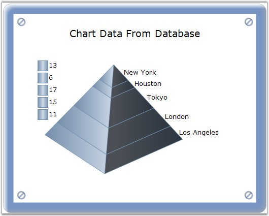

::: {style="DISPLAY: none"}
{#d2h_url_template}{#d2h_package_url style="WIDTH: 0px; DISPLAY: none; HEIGHT: 0px"}
:::

:::: {.d2h_secondary_topic style="PADDING-BOTTOM: 10pt; MARGIN: 0pt; PADDING-LEFT: 0pt; PADDING-RIGHT: 0pt; PADDING-TOP: 0pt"}
#### ShowDataBindLabels {#showdatabindlabels style="tab-stops: 0pt"}

 

Indicates whether data bound labels are displayed in the chart.

 

::: {align="center"}
+-------------------------------------+----------------------------------------------------------------------------+
| Details                                                                                                          |
+-------------------------------------+----------------------------------------------------------------------------+
| **Possible Values**                 | [·      ]{style="FONT-FAMILY: Symbol"}True - Displays the databind labels. |
|                                     |                                                                            |
|                                     | [·      ]{style="FONT-FAMILY: Symbol"}False - Hides the databind labels.   |
+-------------------------------------+----------------------------------------------------------------------------+
| **Default Value    **               | **False**                                                                  |
+-------------------------------------+----------------------------------------------------------------------------+
| **2D / 3D Limitations**             | No                                                                         |
+-------------------------------------+----------------------------------------------------------------------------+
| **Applies to Chart Element**        | All Series                                                                 |
+-------------------------------------+----------------------------------------------------------------------------+
| **Applies to Chart Types**          | Pie Chart, Doughnut Chart, Funnel Chart and Pyramid chart.                 |
+-------------------------------------+----------------------------------------------------------------------------+
:::

 

Here is sample code snippet using ShowDataPointLabels.

 

+--------------------------------------------------------------------------------------------------------------------------------------------------------------------------------------------------+
| **[\[C#\]]{style="FONT-FAMILY: 'Courier New'; COLOR: black"}**                                                                                                                                   |
|                                                                                                                                                                                                  |
| []{style="FONT-FAMILY: 'Courier New'"}                                                                                                                                                           |
|                                                                                                                                                                                                  |
| [//For Pie Chart]{style="FONT-FAMILY: 'Courier New'; COLOR: green"}                                                                                                                              |
|                                                                                                                                                                                                  |
| [this]{style="FONT-FAMILY: 'Courier New'; COLOR: blue"}[.chartControl.Series\[0\].ConfigItems.PieItem.ShowDataBindLabels = [true]{style="COLOR: blue"};]{style="FONT-FAMILY: 'Courier New'"}     |
|                                                                                                                                                                                                  |
| [//For Funnel Chart]{style="FONT-FAMILY: 'Courier New'; COLOR: green"}                                                                                                                           |
|                                                                                                                                                                                                  |
| [this]{style="FONT-FAMILY: 'Courier New'; COLOR: blue"}[.chartControl.Series\[0\].ConfigItems.FunnelItem.ShowDataBindLabels = [true]{style="COLOR: blue"};]{style="FONT-FAMILY: 'Courier New'"}  |
|                                                                                                                                                                                                  |
| [//For Pyramid Chart]{style="FONT-FAMILY: 'Courier New'; COLOR: green"}                                                                                                                          |
|                                                                                                                                                                                                  |
| [this]{style="FONT-FAMILY: 'Courier New'; COLOR: blue"}[.chartControl.Series\[0\].ConfigItems.PyramidItem.ShowDataBindLabels = [true]{style="COLOR: blue"};]{style="FONT-FAMILY: 'Courier New'"} |
+--------------------------------------------------------------------------------------------------------------------------------------------------------------------------------------------------+

 

+---------------------------------------------------------------------------------------------------------------------------------------------------------------------------------------------+
| **[\[VB.NET\]]{style="FONT-FAMILY: 'Courier New'; COLOR: black"}**                                                                                                                          |
|                                                                                                                                                                                             |
| **[]{style="FONT-FAMILY: 'Courier New'; COLOR: black"}**                                                                                                                                    |
|                                                                                                                                                                                             |
| [\'For Pie Chart]{style="FONT-FAMILY: 'Courier New'; COLOR: green"}                                                                                                                         |
|                                                                                                                                                                                             |
| [Me]{style="FONT-FAMILY: 'Courier New'; COLOR: blue"}[.chartControl.Series(0).ConfigItems.PieItem.ShowDataBindLabels = [True]{style="COLOR: blue"}]{style="FONT-FAMILY: 'Courier New'"}     |
|                                                                                                                                                                                             |
| [\'For Funnel Chart]{style="FONT-FAMILY: 'Courier New'; COLOR: green"}                                                                                                                      |
|                                                                                                                                                                                             |
| [Me]{style="FONT-FAMILY: 'Courier New'; COLOR: blue"}[.chartControl.Series(0).ConfigItems.FunnelItem.ShowDataBindLabels = [True]{style="COLOR: blue"}]{style="FONT-FAMILY: 'Courier New'"}  |
|                                                                                                                                                                                             |
| [\'For Pyramid Chart]{style="FONT-FAMILY: 'Courier New'; COLOR: green"}                                                                                                                     |
|                                                                                                                                                                                             |
| [Me]{style="FONT-FAMILY: 'Courier New'; COLOR: blue"}[.chartControl.Series(0).ConfigItems.PyramidItem.ShowDataBindLabels = [True]{style="COLOR: blue"}]{style="FONT-FAMILY: 'Courier New'"} |
+---------------------------------------------------------------------------------------------------------------------------------------------------------------------------------------------+

 

{border="0"}

 

Figure 197: Doughnut Chart with Data-Bound Labels

 

{border="0"}

 

Figure 198: Funnel Chart with Data-Bound Labels

 

 

{border="0"}

 

Figure 199: Pyramid Chart with Data-Bound Labels

 

See Also

 

Pie Chart, Doughnut Chart, Funnel Chart, Pyramid Chart

 

[]{#p147} 

[]{#related-topics}
::::
