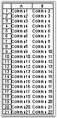

::: {style="DISPLAY: none"}
{#d2h_url_template}{#d2h_package_url style="WIDTH: 0px; DISPLAY: none; HEIGHT: 0px"}
:::

::::: {#nsbanner .d2h_main_nsbanner style="BORDER-BOTTOM: #999999 1px solid; POSITION: relative; PADDING-BOTTOM: 0px; BACKGROUND-COLOR: transparent; PADDING-LEFT: 0px; PADDING-RIGHT: 0px; DISPLAY: none; BORDER-TOP: #999999 1px solid; PADDING-TOP: 0px; LEFT: 0px"}
:::: {#TitleRow .d2h_main_titlerow style="PADDING-BOTTOM: 4px; BACKGROUND-COLOR: transparent; PADDING-LEFT: 22px; WIDTH: 100%; PADDING-RIGHT: 10px; DISPLAY: none; PADDING-TOP: 4px"}
::: {#ienav .d2h_main_ienav style="DISPLAY: none"}
{#D2HPrevious .D2HPreviousEnabled}  {#D2HNext .D2HNextEnabled}
:::
::::
:::::

:::: {#nstext .d2h_main_nstext style="PADDING-BOTTOM: 10px; BACKGROUND-COLOR: transparent; PADDING-LEFT: 22px; PADDING-RIGHT: 10px; HEIGHT: 100%; OVERFLOW: auto; PADDING-TOP: 5px" hasuserbackground="true" valign="bottom"}
::: {#d2h_breadcrumbs .d2h_breadcrumbs}
[Essential Studio User Guide Documentation](ms-xhelp:///?Id=12457748-09e3-4d74-a240-8e049cedf030){.d2h_breadcrumbsNormal}[ \> ]{.d2h_breadcrumbsLinkSeparator}[Reporting Edition](ms-xhelp:///?Id=027aa5b6-6676-4f93-ad23-c20e8c45792e){.d2h_breadcrumbsNormal}[ \> ]{.d2h_breadcrumbsLinkSeparator}[Essential XlsIO](ms-xhelp:///?Id=b01a1b50-1d7d-40c0-bc83-af67e57c9005){.d2h_breadcrumbsNormal}[ \> ]{.d2h_breadcrumbsLinkSeparator}[Concepts and Features](ms-xhelp:///?Id=21b26556-5905-4ad9-90b4-40320db25faf){.d2h_breadcrumbsNormal}[ \> ]{.d2h_breadcrumbsLinkSeparator}[View](ms-xhelp:///?Id=c847cbb0-917f-4a11-8b06-27f0adc8e824){.d2h_breadcrumbsNormal}
:::

### Show/Hide Worksheet Elements {#showhide-worksheet-elements style="tab-stops: 0pt"}

 

This topic describes how to show/hide the elements in a worksheet and workbook.

 

[·      ]{style="FONT-FAMILY: Symbol"}Grid Lines

[·      ]{style="FONT-FAMILY: Symbol"}Headings

[·      ]{style="FONT-FAMILY: Symbol"}Scroll Bar

[·      ]{style="FONT-FAMILY: Symbol"}Sheet Tabs

[]{style="FONT-FAMILY: 'Trebuchet MS','sans-serif'; COLOR: #15428b; FONT-SIZE: 9pt"} 

Grid Lines

[]{style="FONT-SIZE: 9pt"} 

Some users may find it easier to work with your worksheet applications, if they cannot see the grid lines. Excel provides options to show/hide grid lines in the worksheet. This is done by accessing the GridLines option by opening the **Tools** menu, pointing to **Option**, and then selecting **GridLines**.

[]{style="FONT-FAMILY: 'Trebuchet MS','sans-serif'; COLOR: #15428b; FONT-SIZE: 9pt"} 

XlsIO provides support for this feature through the **IsGridLine** property of **IWorksheet**. Color for the grid line can also be set through the **GridLineColor** property of IWorksheet.

[]{style="FONT-FAMILY: 'Trebuchet MS','sans-serif'; COLOR: #15428b; FONT-SIZE: 9pt"} 

+------------------------------------------------------------------------------------------------+
| **[\[C#\]]{style="FONT-FAMILY: 'Courier New'"}**                                               |
|                                                                                                |
| []{style="FONT-FAMILY: 'Courier New'"}                                                         |
|                                                                                                |
| [// Hides grid line.]{style="FONT-FAMILY: 'Courier New'; COLOR: green"}                        |
|                                                                                                |
| [sheet.IsGridLinesVisible = [false]{style="COLOR: blue"};]{style="FONT-FAMILY: 'Courier New'"} |
+------------------------------------------------------------------------------------------------+

[]{style="FONT-FAMILY: 'Trebuchet MS','sans-serif'; COLOR: #15428b; FONT-SIZE: 9pt"} 

+-----------------------------------------------------------------------------------------------+
| **[\[VB\]]{style="FONT-FAMILY: 'Courier New'"}**                                              |
|                                                                                               |
| []{style="FONT-FAMILY: 'Courier New'; COLOR: green"}                                          |
|                                                                                               |
| [\' Hides grid line.]{style="FONT-FAMILY: 'Courier New'; COLOR: green"}                       |
|                                                                                               |
| [sheet.IsGridLinesVisible = [False]{style="COLOR: blue"}]{style="FONT-FAMILY: 'Courier New'"} |
+-----------------------------------------------------------------------------------------------+

[]{style="FONT-FAMILY: 'Trebuchet MS','sans-serif'; COLOR: #15428b; FONT-SIZE: 9pt"} 

Headings

[]{style="FONT-FAMILY: 'Trebuchet MS','sans-serif'; COLOR: #15428b; FONT-SIZE: 9pt"} 

Headings are the display labels in worksheets that enable users to find out the cell number with ease. You can show/hide these headings by using the **IsRowColumnHeadersVisible** property of IWorksheet.

[]{style="FONT-FAMILY: 'Trebuchet MS','sans-serif'; COLOR: #15428b; FONT-SIZE: 9pt"} 

+-------------------------------------------------------------------------------------------------------+
| **[\[C#\]]{style="FONT-FAMILY: 'Courier New'"}**                                                      |
|                                                                                                       |
| []{style="FONT-FAMILY: 'Courier New'"}                                                                |
|                                                                                                       |
| [sheet.IsRowColumnHeadersVisible = [false;]{style="COLOR: blue"}]{style="FONT-FAMILY: 'Courier New'"} |
+-------------------------------------------------------------------------------------------------------+

[]{style="FONT-FAMILY: 'Trebuchet MS','sans-serif'; COLOR: #15428b; FONT-SIZE: 9pt"} 

+------------------------------------------------------------------------------------------------------+
| **[\[VB\]]{style="FONT-FAMILY: 'Courier New'"}**                                                     |
|                                                                                                      |
| []{style="FONT-FAMILY: 'Courier New'"}                                                               |
|                                                                                                      |
| [sheet.IsRowColumnHeadersVisible = [False]{style="COLOR: blue"}]{style="FONT-FAMILY: 'Courier New'"} |
+------------------------------------------------------------------------------------------------------+

[]{style="FONT-FAMILY: 'Trebuchet MS','sans-serif'; COLOR: #15428b; FONT-SIZE: 9pt"} 

{border="0"}

Figure 151: Row/Column Headers[]{style="FONT-FAMILY: 'Trebuchet MS','sans-serif'; COLOR: #15428b"}

[]{style="FONT-FAMILY: 'Trebuchet MS','sans-serif'; COLOR: #15428b; FONT-SIZE: 9pt"} 

Scroll Bar

 

[You may allow the users to view a particular worksheet, but hide the content in the last part of the worksheet from them. This can be done by hiding the scrollbars, by turning off either scrollbar checkbox, in the View tab of the Options dialog box.]{style="FONT-SIZE: 9pt"}

[]{style="FONT-SIZE: 9pt"} 

[XlsIO allows to control the visibility of these horizontal and vertical scrollbars in a workbook by using the IsHScrollBarVisible and IsVScrollBarVisible properties of IWorkbook as follows.]{style="FONT-SIZE: 9pt"}

[]{style="FONT-SIZE: 9pt"} 

+--------------------------------------------------------------------------------------------------------------------+
| **[\[C#\]]{style="FONT-FAMILY: 'Courier New'"}**                                                                   |
|                                                                                                                    |
| []{style="FONT-FAMILY: 'Courier New'; COLOR: green"}                                                               |
|                                                                                                                    |
| [//Hides Horizontal scroll bar and show the vertical scroll bar]{style="FONT-FAMILY: 'Courier New'; COLOR: green"} |
|                                                                                                                    |
| [workbook.IsHScrollBarVisible = [false;]{style="COLOR: blue"}]{style="FONT-FAMILY: 'Courier New'"}                 |
|                                                                                                                    |
| [workbook.IsVScrollBarVisible = [true;]{style="COLOR: blue"}]{style="FONT-FAMILY: 'Courier New'"}                  |
+--------------------------------------------------------------------------------------------------------------------+

[]{style="FONT-FAMILY: 'Trebuchet MS','sans-serif'; COLOR: #15428b; FONT-SIZE: 9pt"} 

+--------------------------------------------------------------------------------------------------------------------+
| **[\[VB\]]{style="FONT-FAMILY: 'Courier New'"}**                                                                   |
|                                                                                                                    |
| []{style="FONT-FAMILY: 'Courier New'"}                                                                             |
|                                                                                                                    |
| [\'Hides Horizontal scroll bar and show the vertical scroll bar]{style="FONT-FAMILY: 'Courier New'; COLOR: green"} |
|                                                                                                                    |
| [workbook.IsHScrollBarVisible = [False]{style="COLOR: blue"}]{style="FONT-FAMILY: 'Courier New'"}                  |
|                                                                                                                    |
| [workbook.IsVScrollBarVisible = True]{style="FONT-FAMILY: 'Courier New'"}                                          |
+--------------------------------------------------------------------------------------------------------------------+

[]{style="FONT-FAMILY: 'Trebuchet MS','sans-serif'; COLOR: #15428b; FONT-SIZE: 9pt"} 

Sheet Tabs

 

Excel allows to show/hide the workbook tabs, to prevent users from switching between sheets through sheet tabs, and focus their attention on a particular sheet.

 

XlsIO provides an option to hide the workbook tabs by using the **IWorkbook.DisplayWorkbookTabs** property. XlsIO also provides an option to get the current tab that is displayed by using the **DisplayedTab** property of IWorkbook.

 

+----------------------------------------------------------------------------------------------------+
| **[\[C#\]]{style="FONT-FAMILY: 'Courier New'"}**                                                   |
|                                                                                                    |
| []{style="FONT-FAMILY: 'Courier New'"}                                                             |
|                                                                                                    |
| [workbook.DisplayWorkbookTabs = [false;]{style="COLOR: blue"}]{style="FONT-FAMILY: 'Courier New'"} |
+----------------------------------------------------------------------------------------------------+

[]{style="FONT-FAMILY: 'Trebuchet MS','sans-serif'; COLOR: #15428b; FONT-SIZE: 9pt"} 

+---------------------------------------------------------------------------------------------------+
| **[\[VB\]]{style="FONT-FAMILY: 'Courier New'"}**                                                  |
|                                                                                                   |
| []{style="FONT-FAMILY: 'Courier New'"}                                                            |
|                                                                                                   |
| [workbook.DisplayWorkbookTabs = [False]{style="COLOR: blue"}]{style="FONT-FAMILY: 'Courier New'"} |
+---------------------------------------------------------------------------------------------------+

 

[]{#p124} 

[]{#related-topics}
::::
