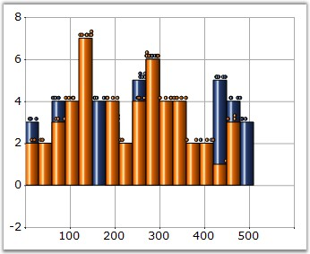
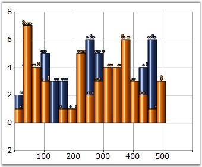

::: {style="DISPLAY: none"}
{#d2h_url_template}{#d2h_package_url style="WIDTH: 0px; DISPLAY: none; HEIGHT: 0px"}
:::

:::: {.d2h_secondary_topic style="PADDING-BOTTOM: 10pt; MARGIN: 0pt; PADDING-LEFT: 0pt; PADDING-RIGHT: 0pt; PADDING-TOP: 0pt"}
#### ShowHistogramDataPoints {#showhistogramdatapoints style="tab-stops: 0pt"}

 

Indicates if the histogram data points should be shown.

 

::: {align="center"}
+-------------------------------------+---------------------------------------------------------------------------+
| Details                                                                                                         |
+-------------------------------------+---------------------------------------------------------------------------+
| **Possible Values**                 | [·      ]{style="FONT-FAMILY: Symbol"}**True** - Displays the datapoints. |
|                                     |                                                                           |
|                                     | [·      ]{style="FONT-FAMILY: Symbol"}**False** - Hides the datapoints.   |
+-------------------------------------+---------------------------------------------------------------------------+
| **Default Value    **               | **True**                                                                  |
+-------------------------------------+---------------------------------------------------------------------------+
| **2D / 3D Limitations**             | No                                                                        |
+-------------------------------------+---------------------------------------------------------------------------+
| **Applies to Chart Element**        | Any Series                                                                |
+-------------------------------------+---------------------------------------------------------------------------+
| **Applies to Chart Types**          | Histogram Chart                                                           |
+-------------------------------------+---------------------------------------------------------------------------+
:::

 

Here is sample code snippet using ShowHistogramDataPoints.

 

+-----------------------------------------------------------------------------------------------------------------------------------------------------------------------------------------------------------------------------------------------------------------------------+
| **[\[C#\]]{style="FONT-FAMILY: 'Courier New'; COLOR: black"}**                                                                                                                                                                                                              |
|                                                                                                                                                                                                                                                                             |
| **[]{style="FONT-FAMILY: 'Courier New'; COLOR: black"}**                                                                                                                                                                                                                    |
|                                                                                                                                                                                                                                                                             |
| [this]{style="FONT-FAMILY: 'Courier New'; COLOR: blue"}[.chartControl1.Series\[0\].ShowHistogramDataPoints =]{style="FONT-FAMILY: 'Courier New'; COLOR: black"}[true]{style="FONT-FAMILY: 'Courier New'; COLOR: blue"}[;]{style="FONT-FAMILY: 'Courier New'; COLOR: black"} |
+-----------------------------------------------------------------------------------------------------------------------------------------------------------------------------------------------------------------------------------------------------------------------------+

 

+----------------------------------------------------------------------------------------------------------------------------------------------------------------------------------------------------------------------------+
| **[\[VB.NET\]]{style="FONT-FAMILY: 'Courier New'; COLOR: black"}**                                                                                                                                                         |
|                                                                                                                                                                                                                            |
| **[]{style="FONT-FAMILY: 'Courier New'; COLOR: black"}**                                                                                                                                                                   |
|                                                                                                                                                                                                                            |
| [Private Me]{style="FONT-FAMILY: 'Courier New'; COLOR: blue"}[.chartControl1.Series(0).ShowHistogramDataPoints =]{style="FONT-FAMILY: 'Courier New'; COLOR: black"}[True]{style="FONT-FAMILY: 'Courier New'; COLOR: blue"} |
+----------------------------------------------------------------------------------------------------------------------------------------------------------------------------------------------------------------------------+

 

{border="0"}

 

Figure 200: ShowHistogramDataPoints set to True

**[]{style="FONT-FAMILY: 'Courier New'; COLOR: black"}** 

**[]{style="FONT-FAMILY: 'Courier New'; COLOR: black"}** 

{border="0"}

 

Figure 201: ShowHistogramDataPoints set to False

 

See Also

 

[Histogram Chart]{.UGHyperlink}[]{.UGHyperlink}

 

[]{#p148} 

 

[]{#related-topics}
::::
