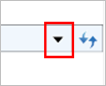
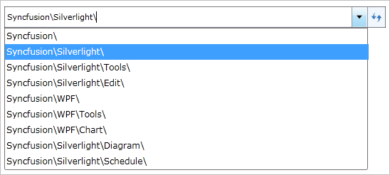

::: {style="DISPLAY: none"}
{#d2h_url_template}{#d2h_package_url style="WIDTH: 0px; DISPLAY: none; HEIGHT: 0px"}
:::

::: {.d2h_secondary_topic style="PADDING-BOTTOM: 10pt; MARGIN: 0pt; PADDING-LEFT: 0pt; PADDING-RIGHT: 0pt; PADDING-TOP: 0pt"}
#### Showing history {#showing-history style="tab-stops: 0pt"}

When a user navigates to a different path, the paths navigated previously will be saved. Those paths can be viewed by clicking the arrow button next to the Refresh button. This will display a drop-down box with a list of all the paths navigated previously.

{border="0"}

 

Figure 589: History button

 

{border="0"}

 

Figure 590: History popup

 

[]{#related-topics}
:::
