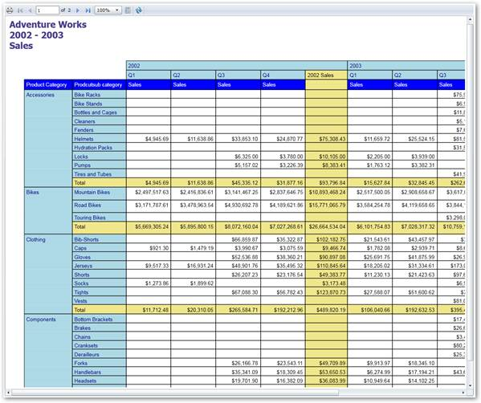

::: {style="DISPLAY: none"}
[](ms-xhelp:///?Id=d2h_url_template){#d2h_url_template}{#d2h_package_url style="WIDTH: 0px; DISPLAY: none; HEIGHT: 0px"}
:::

::::: {#nsbanner .d2h_main_nsbanner style="BORDER-BOTTOM: #999999 1px solid; POSITION: relative; PADDING-BOTTOM: 0px; BACKGROUND-COLOR: transparent; PADDING-LEFT: 0px; PADDING-RIGHT: 0px; DISPLAY: none; BORDER-TOP: #999999 1px solid; PADDING-TOP: 0px; LEFT: 0px"}
:::: {#TitleRow .d2h_main_titlerow style="PADDING-BOTTOM: 4px; BACKGROUND-COLOR: transparent; PADDING-LEFT: 22px; WIDTH: 100%; PADDING-RIGHT: 10px; DISPLAY: none; PADDING-TOP: 4px"}
::: {#ienav .d2h_main_ienav style="DISPLAY: none"}
[](ms-xhelp:///?Id=7335ae38-4224-484e-9b91-c2fc89764aca){#D2HPrevious .D2HPreviousEnabled}  [](ms-xhelp:///?Id=84179913-feb8-4300-abce-c2257a881391){#D2HNext .D2HNextEnabled}
:::
::::
:::::

:::::: {#nstext .d2h_main_nstext style="PADDING-BOTTOM: 10px; BACKGROUND-COLOR: transparent; PADDING-LEFT: 22px; PADDING-RIGHT: 10px; HEIGHT: 100%; OVERFLOW: auto; PADDING-TOP: 5px" hasuserbackground="true" valign="bottom"}
::: {#d2h_breadcrumbs .d2h_breadcrumbs}
[Essential Studio User Guide Documentation](ms-xhelp:///?Id=12457748-09e3-4d74-a240-8e049cedf030){.d2h_breadcrumbsNormal}[ \> ]{.d2h_breadcrumbsLinkSeparator}[Reporting Edition](ms-xhelp:///?Id=027aa5b6-6676-4f93-ad23-c20e8c45792e){.d2h_breadcrumbsNormal}[ \> ]{.d2h_breadcrumbsLinkSeparator}[Essential Report Viewer](ms-xhelp:///?Id=35081cc7-4b81-4ef5-97d2-894ad584b907){.d2h_breadcrumbsNormal}[ \> ]{.d2h_breadcrumbsLinkSeparator}[Report Viewer Silverlight]{.d2h_breadcrumbsContentsOnly}[ \> ]{.d2h_breadcrumbsLinkSeparator}[Concepts and Features](ms-xhelp:///?Id=e1f4aeae-2289-4b26-b9dd-38e72df239b2){.d2h_breadcrumbsNormal}
:::

## Showing RDLC Reports in Report Viewer {#showing-rdlc-reports-in-report-viewer style="TEXT-ALIGN: justify; tab-stops: 0pt"}

 

You can show RDLC reports in Report Viewer using the following steps.

 

1.   Create new Silverlight application and necessary assemblies with Silverlight project.

2.   To load RDLC reports from local machine, initialize Report Viewer control and set the **ReportPath**.

 

+--------------------------------------------------------------------------------------+
| ``` {style="BACKGROUND: #f0f0f0"}                                                    |
|                                                                                      |
| ```                                                                                  |
|                                                                                      |
| ``` {style="BACKGROUND: #f0f0f0"}                                                    |
| // ReportViewer control initialization.                                              |
| ```                                                                                  |
|                                                                                      |
| ``` {style="BACKGROUND: #f0f0f0"}                                                    |
| Syncfusion.Windows.Reports.Viewer.ReportViewer reportViewer1 = new Syncfusion.Window |
| ```                                                                                  |
|                                                                                      |
| ``` {style="BACKGROUND: #f0f0f0"}                                                    |
| s.Reports.Viewer.ReportViewer();                                                     |
| ```                                                                                  |
|                                                                                      |
| ``` {style="BACKGROUND: #f0f0f0"}                                                    |
|                                                                                      |
| ```                                                                                  |
|                                                                                      |
| ``` {style="BACKGROUND: #f0f0f0"}                                                    |
|                                                                                      |
| ```                                                                                  |
|                                                                                      |
| ``` {style="BACKGROUND: #f0f0f0"}                                                    |
| // Retrieve Report from application resource.                                        |
| ```                                                                                  |
|                                                                                      |
| ``` {style="BACKGROUND: #f0f0f0"}                                                    |
| Stream rdlStream = Application.GetResourceStream(new Uri("CompanySalesDemo;component |
| ```                                                                                  |
|                                                                                      |
| ``` {style="BACKGROUND: #f0f0f0"}                                                    |
| /ReportTemplate/Company Sales.rdl", UriKind.Relative)).Stream;                       |
| ```                                                                                  |
|                                                                                      |
| ``` {style="BACKGROUND: #f0f0f0"}                                                    |
|                                                                                      |
| ```                                                                                  |
|                                                                                      |
| ``` {style="BACKGROUND: #f0f0f0"}                                                    |
| // Load the Report from Stream.                                                      |
| ```                                                                                  |
|                                                                                      |
| ``` {style="BACKGROUND: #f0f0f0"}                                                    |
| reportViewer1.LoadReport(rdlStream);                                                 |
| ```                                                                                  |
|                                                                                      |
| ``` {style="BACKGROUND: #f0f0f0"}                                                    |
|                                                                                      |
| ```                                                                                  |
+--------------------------------------------------------------------------------------+

 

::: {style="BORDER-BOTTOM: windowtext 1pt solid; BORDER-LEFT: medium none; PADDING-BOTTOM: 1pt; MARGIN-TOP: 9pt; PADDING-LEFT: 0pt; PADDING-RIGHT: 0pt; MARGIN-BOTTOM: 9pt; BORDER-TOP: windowtext 1pt solid; BORDER-RIGHT: medium none; PADDING-TOP: 1pt"}
{border="0"}Note: To load company sales report, you can use following installed sample location.

 

\<Installed Location\>\\Syncfusion\\EssentialStudio\\\<Version Number\>\\Samples\\Silverlight\\ReportViewer.Silverlight\\Product Showcase\\CompanySalesDemo\\ReportTemplate

 
:::

3.   Set the **DataSources** to view the report in Report Viewer.

 

+--------------------------------------------------------------------------------------+
| ``` {style="BACKGROUND: #f0f0f0"}                                                    |
|                                                                                      |
| ```                                                                                  |
|                                                                                      |
| ``` {style="BACKGROUND: #f0f0f0"}                                                    |
| reportViewer1.DataSources.Clear();                                                   |
| ```                                                                                  |
|                                                                                      |
| ``` {style="BACKGROUND: #f0f0f0"}                                                    |
| reportViewer1.DataSources.Add(new Syncfusion.Windows.Reports.ReportDataSource { Name |
| ```                                                                                  |
|                                                                                      |
| ``` {style="BACKGROUND: #f0f0f0"}                                                    |
|  = "Sales", Value = new AdventureWorks().GetData() });                               |
| ```                                                                                  |
|                                                                                      |
| ``` {style="BACKGROUND: #f0f0f0"}                                                    |
|                                                                                      |
| ```                                                                                  |
+--------------------------------------------------------------------------------------+

::: {style="BORDER-BOTTOM: windowtext 1pt solid; BORDER-LEFT: medium none; PADDING-BOTTOM: 1pt; MARGIN-TOP: 9pt; PADDING-LEFT: 0pt; PADDING-RIGHT: 0pt; MARGIN-BOTTOM: 9pt; BORDER-TOP: windowtext 1pt solid; BORDER-RIGHT: medium none; PADDING-TOP: 1pt"}
 

{border="0"}Note: AdventureWorks().GetData() information can be obtained from the following installed sample location.

\<Installed Location\>\\Syncfusion\\EssentialStudio\\\<Version Number\>\\Samples\\Silverlight\\ReportViewer.Silverlight\\Product Showcase\\CompanySalesDemo\\DataSource.cs
:::

 

4.   Use the **RefreshReport** method to render the report in Report Viewer.

 

+-----------------------------------------------------------------------+
| ``` {style="BACKGROUND: #f0f0f0"}                                     |
|                                                                       |
| ```                                                                   |
|                                                                       |
| ``` {style="BACKGROUND: #f0f0f0"}                                     |
| this.Loaded += (sender, arg) =>                                       |
| ```                                                                   |
|                                                                       |
| ``` {style="BACKGROUND: #f0f0f0"}                                     |
| {                                                                     |
| ```                                                                   |
|                                                                       |
| ``` {style="BACKGROUND: #f0f0f0"}                                     |
|      // To Render the Report in ReportViewer.                         |
| ```                                                                   |
|                                                                       |
| ``` {style="BACKGROUND: #f0f0f0"}                                     |
|      reportViewer1.RefreshReport();                                   |
| ```                                                                   |
|                                                                       |
| ``` {style="BACKGROUND: #f0f0f0"}                                     |
| };                                                                    |
| ```                                                                   |
+-----------------------------------------------------------------------+

 

5.   Run the application. The following output displays.

 

{border="0"}

Figure 29: ReportViewer Sample

 

[]{#related-topics}
::::::
