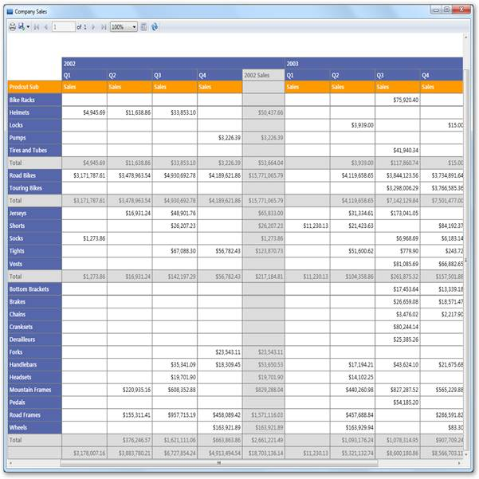

::: {style="DISPLAY: none"}
{#d2h_url_template}{#d2h_package_url style="WIDTH: 0px; DISPLAY: none; HEIGHT: 0px"}
:::

::::: {#nsbanner .d2h_main_nsbanner style="BORDER-BOTTOM: #999999 1px solid; POSITION: relative; PADDING-BOTTOM: 0px; BACKGROUND-COLOR: transparent; PADDING-LEFT: 0px; PADDING-RIGHT: 0px; DISPLAY: none; BORDER-TOP: #999999 1px solid; PADDING-TOP: 0px; LEFT: 0px"}
:::: {#TitleRow .d2h_main_titlerow style="PADDING-BOTTOM: 4px; BACKGROUND-COLOR: transparent; PADDING-LEFT: 22px; WIDTH: 100%; PADDING-RIGHT: 10px; DISPLAY: none; PADDING-TOP: 4px"}
::: {#ienav .d2h_main_ienav style="DISPLAY: none"}
{#D2HPrevious .D2HPreviousEnabled}  {#D2HNext .D2HNextEnabled}
:::
::::
:::::

:::::: {#nstext .d2h_main_nstext style="PADDING-BOTTOM: 10px; BACKGROUND-COLOR: transparent; PADDING-LEFT: 22px; PADDING-RIGHT: 10px; HEIGHT: 100%; OVERFLOW: auto; PADDING-TOP: 5px" hasuserbackground="true" valign="bottom"}
::: {#d2h_breadcrumbs .d2h_breadcrumbs}
[Essential Studio User Guide Documentation](ms-xhelp:///?Id=12457748-09e3-4d74-a240-8e049cedf030){.d2h_breadcrumbsNormal}[ \> ]{.d2h_breadcrumbsLinkSeparator}[Reporting Edition](ms-xhelp:///?Id=027aa5b6-6676-4f93-ad23-c20e8c45792e){.d2h_breadcrumbsNormal}[ \> ]{.d2h_breadcrumbsLinkSeparator}[Essential Report Viewer](ms-xhelp:///?Id=35081cc7-4b81-4ef5-97d2-894ad584b907){.d2h_breadcrumbsNormal}[ \> ]{.d2h_breadcrumbsLinkSeparator}[Report Viewer WPF]{.d2h_breadcrumbsContentsOnly}[ \> ]{.d2h_breadcrumbsLinkSeparator}[Concepts and Features](ms-xhelp:///?Id=b461284e-0215-4894-9001-224c2b5575b7){.d2h_breadcrumbsNormal}
:::

## Showing RDLC Reports in Report Viewer {#showing-rdlc-reports-in-report-viewer style="tab-stops: 0pt"}

 

You can show RDLC reports in Report Viewer by using following steps.

 

1.   Initialize Report Viewer control and set the **ReportPath** to load the RDLC reports from local machine.

 

+-------------------------------------------------------------------------------------------------------------------------------------------------------------------------+
| []{style="FONT-FAMILY: 'Courier New'; COLOR: blue"}                                                                                                                     |
|                                                                                                                                                                         |
| [// ReportViewer control initialization]{style="FONT-FAMILY: 'Courier New'; COLOR: blue"}                                                                               |
|                                                                                                                                                                         |
| [Syncfusion.Windows.Reports.Viewer.ReportViewer reportViewer1 = new Syncfusion.Windows.Reports.Viewer.ReportViewer();]{style="FONT-FAMILY: 'Courier New'; COLOR: blue"} |
|                                                                                                                                                                         |
| []{style="FONT-FAMILY: 'Courier New'; COLOR: blue"}                                                                                                                     |
|                                                                                                                                                                         |
| [// Set ReportPath to view the Report in ReportViewer.]{style="FONT-FAMILY: 'Courier New'; COLOR: blue"}                                                                |
|                                                                                                                                                                         |
| [      reportViewer1.ReportPath = @\"D:\\Company Sales.Rdlc\";]{style="FONT-FAMILY: 'Courier New'; COLOR: blue"}                                                        |
|                                                                                                                                                                         |
| []{style="FONT-FAMILY: 'Courier New'; COLOR: blue"}                                                                                                                     |
|                                                                                                                                                                         |
| [// Add ReportViewer in MainWindow grid]{style="FONT-FAMILY: 'Courier New'; COLOR: blue"}                                                                               |
|                                                                                                                                                                         |
| [this.grid1.Children.Add(reportViewer1);]{style="FONT-FAMILY: 'Courier New'; COLOR: blue"}                                                                              |
|                                                                                                                                                                         |
| []{style="FONT-FAMILY: 'Courier New'"}                                                                                                                                  |
+-------------------------------------------------------------------------------------------------------------------------------------------------------------------------+

 

::: {style="BORDER-BOTTOM: windowtext 1pt solid; BORDER-LEFT: medium none; PADDING-BOTTOM: 1pt; MARGIN-TOP: 9pt; PADDING-LEFT: 0pt; PADDING-RIGHT: 0pt; MARGIN-BOTTOM: 9pt; BORDER-TOP: windowtext 1pt solid; BORDER-RIGHT: medium none; PADDING-TOP: 1pt"}
{border="0"}Note: To load the company sales report, you can use following installed sample location.

\<InstalledLocation\>\\Syncfusion\\Essential Studio\\\<Version Number\>\\ Common\\Data\\ReportTemplate\\Company Sales.rdl
:::

 

2.   Set the **ProcessingMode** as Local to process a local report in Report Viewer.

 

+-------------------------------------------------------------------------------------------------------------------------------------------+
| []{style="FONT-FAMILY: 'Courier New'; COLOR: blue"}                                                                                       |
|                                                                                                                                           |
| [// To render the report based on local Data Source]{style="FONT-FAMILY: 'Courier New'; COLOR: blue"}                                     |
|                                                                                                                                           |
| [reportViewer1.ProcessingMode = Syncfusion.Windows.Reports.Viewer.ProcessingMode.Local;]{style="FONT-FAMILY: 'Courier New'; COLOR: blue"} |
|                                                                                                                                           |
| []{style="FONT-FAMILY: 'Courier New'"}                                                                                                    |
+-------------------------------------------------------------------------------------------------------------------------------------------+

 

3.   Set the **DataSources** to view the report in Report Viewer.

 

+-------------------------------------------------------------------------------------------------------------------------------------------------------------------------------------------------+
| []{style="FONT-FAMILY: 'Courier New'; COLOR: blue"}                                                                                                                                             |
|                                                                                                                                                                                                 |
| [reportViewer1.DataSources.Clear();]{style="FONT-FAMILY: 'Courier New'; COLOR: blue"}                                                                                                           |
|                                                                                                                                                                                                 |
| [reportViewer1.DataSources.Add(new Syncfusion.Windows.Reports.ReportDataSource { Name = \"Sales\", Value = new AdventureWorks().GetData() });]{style="FONT-FAMILY: 'Courier New'; COLOR: blue"} |
|                                                                                                                                                                                                 |
| []{style="FONT-FAMILY: 'Courier New'; COLOR: blue"}                                                                                                                                             |
+-------------------------------------------------------------------------------------------------------------------------------------------------------------------------------------------------+

 

::: {style="BORDER-BOTTOM: windowtext 1pt solid; BORDER-LEFT: medium none; PADDING-BOTTOM: 1pt; MARGIN-TOP: 9pt; PADDING-LEFT: 0pt; PADDING-RIGHT: 0pt; MARGIN-BOTTOM: 9pt; BORDER-TOP: windowtext 1pt solid; BORDER-RIGHT: medium none; PADDING-TOP: 1pt"}
{border="0"}Note: AdventureWorks().GetData() information can be obtained from following location.

\<Installed Location\>\\Syncfusion\\Essential Studio\\\<Version Number\>\\ Reports\\WPF\\ReportViewer.WPF\\Samples\\Product Showcase\\Company Sales\\CS\\DataSource.cs
:::

 

4.   Use **RefreshReport** method to render the RDLC report in Report Viewer.

 

+--------------------------------------------------------------------------------------------------+
| []{style="FONT-FAMILY: 'Courier New'; COLOR: blue"}                                              |
|                                                                                                  |
| [this.Loaded += (sender, arg) =\>]{style="FONT-FAMILY: 'Courier New'; COLOR: blue"}              |
|                                                                                                  |
| [{]{style="FONT-FAMILY: 'Courier New'; COLOR: blue"}                                             |
|                                                                                                  |
| [     // To Render the Report in ReportViewer.]{style="FONT-FAMILY: 'Courier New'; COLOR: blue"} |
|                                                                                                  |
| [     reportViewer1.RefreshReport();]{style="FONT-FAMILY: 'Courier New'; COLOR: blue"}           |
|                                                                                                  |
| [};]{style="FONT-FAMILY: 'Courier New'; COLOR: blue"}[]{style="FONT-FAMILY: 'Courier New'"}      |
+--------------------------------------------------------------------------------------------------+

 

5.   Run the application. The following output displays.

 

{border="0"}

Figure 16: ReportViewer RDLC Sample

 

[]{#related-topics}
::::::
